# AGENTS.md

> Open PVZ -- 基于 Godot 4.x (GDScript) 的可组合、可扩展 PVZ 类规则引擎。不是 Plants vs Zombies 的直接克隆；引擎优先考虑规则的开放组合和涌现式玩法，而非功能完整度。

## 变更记录 (Changelog)

- **2026-05-11** — init-deep 全仓扫描：补充 autoload 清单（16 个）、模块索引（视觉/UI/输入/demo/验证）、反模式章节、守卫脚本命令、扩展包 AGENTS.md
- **2026-05-10** — 原版植物 E 批补齐 Gloom-shroom、Cattail、Winter Melon、Spikerock、Gold Magnet 单体验证，验证 manifest 扩展到 145 场景
- **2026-05-09** — 规则基础设施第二轮完成：多维 liveness、`SpatialIndex` / `BattleManager.spatial_query(params)`、`height_range` 过滤、tick budget 监控与专项验证进入主干，验证基线扩展到 140 场景
- **2026-05-06** — 验证批处理支持受控并行：`tools/run_all_validations.ps1` 新增 `-MaxParallel`，默认自动取 `min(CPU核心数, 4)`，批量验证改为并发调度并保持汇总输出顺序稳定
- **2026-05-05** — 统一 Registry/Slot 生产线完成：`TriggerRegistry`、`DetectionRegistry`、`ControllerRegistry` 全部继承 `RegistryBase`，contributor 字段统一为 `id`/`param_defs`，`ExtensionPackCatalog.ALLOWED_REGISTER_KINDS` 扩展至 7 种，验证基线扩展到 121 场景
- **2026-04-24** — wiki 同步 Mechanic-first 决策：11 份文档更新，旧"模板与装配边界"重写为"编译链与 Mechanic 系统"；AGENTS.md 同步代码现状
- **2026-04-22** — Mechanic-first 重构第三阶段完成：multi-payload 编译、per-type compiler dispatch、Controller/State/Lifecycle 扩展、确定性随机协议、Archetype 独立实例化、迁移对照验证
- **2026-04-15** — init-architect 全仓扫描：新增模块结构图、模块索引表、模块级 AGENTS.md、覆盖率报告

## 项目愿景

Open PVZ 是一个开放式 PVZ-like 规则引擎，核心目标是让"组合规则"成为核心玩法驱动力。项目已完成旧实体作者模型归档，正式运行时唯一入口是 **Mechanic-first** 架构：`CombatArchetype + CombatMechanic[] -> RuntimeSpec -> EntityFactory`。

当前阶段：**Mechanic-first 主链已完成三阶段，通用扩展插槽 v1 与规则基础设施第二轮已落地**。详见 [wiki/01-overview/23-当前阶段与实现路线.md](wiki/01-overview/23-当前阶段与实现路线.md)、[wiki/04-roadmap-reference/42-通用扩展插槽机制.md](wiki/04-roadmap-reference/42-通用扩展插槽机制.md)、[wiki/02-runtime-protocol/17-实体活跃性与空间查询.md](wiki/02-runtime-protocol/17-实体活跃性与空间查询.md) 和 [wiki/decisions/](wiki/decisions/README.md)。

## 架构总览

### 四层模型

1. **语义事件层** -- "发生了什么"。事件如 `game.tick`、`entity.damaged`、`entity.died`、`projectile.hit` 通过 `EventBus`（autoload）流转。
2. **行为效果层** -- "该做什么"。`EffectDef` -> `EffectNode`，由 `EffectExecutor` 执行。效果是原子化、可组合、可嵌套的（最大深度 5）。注册于 `EffectRegistry`。
3. **编译装配层** -- "实体如何编译和组装"。`CombatArchetype` + `CombatMechanic[]` -> `MechanicCompiler` -> `RuntimeSpec` -> `EntityFactory` 实例化。10 个冻结 Mechanic family，49 个内置 type。注册于 `MechanicFamilyRegistry` / `MechanicTypeRegistry` / `MechanicCompilerRegistry`，扩展包可通过 `MechanicCompilerDef` 在现有 family 下新增 type。
4. **连续行为层** -- "持续对象如何更新"。抛射体使用 3D 逻辑 + 2D 投影；Projectile movement 通过 `ProjectileMovementRegistry` 分发，Controller（bite / sweep 等）通过 `ControllerComponent` 每帧执行。命中时重新进入事件链。

### 执行链

**离散事件链**：
```
EventBus -> TriggerComponent -> TriggerInstance -> RuleContext -> EffectExecutor -> Runtime Action -> EventBus
```

**编译链**（实例化时运行一次）：
```
Archetype + Mechanic[] -> NormalizedMechanicSet -> RuntimeSpec -> EntityFactory -> Runtime Nodes
```

**连续行为链**（每帧）：
```
_physics_process -> ControllerComponent -> ControllerRegistry -> Controller Strategy
```

### 全局单例 (Autoloads)

| 单例名 | 职责 |
|--------|------|
| `EventBus` | 事件分发，优先级订阅，历史追踪（最多 256 条） |
| `DebugService` | 集中式日志：事件/触发器/效果/运行时快照/协议问题 |
| `SceneRegistry` | 场景与资源注册表，自动扫描 `data/combat/`，支持 archetype 查询 |
| `MechanicFamilyRegistry` | Mechanic 一级 family 注册（10 个冻结 family） |
| `MechanicTypeRegistry` | Mechanic type 注册（family 下的具体 type_id，委托 MechanicCompiler 注册内置 type） |
| `MechanicCompilerRegistry` | Mechanic per-type 编译器 callable 注册与分发 |
| `DetectionRegistry` | 目标发现策略注册（6 内置 detection：always / lane_forward / lane_backward / proximity / radius_around / global_track，继承 RegistryBase） |
| `TriggerRegistry` | 触发器定义与策略注册（6 内置 trigger：periodically / when_damaged / on_death / on_spawned / on_place / proximity，继承 RegistryBase） |
| `EffectRegistry` | 效果定义与策略注册（damage / spawn_projectile / explode / apply_status / produce_sun / spawn_entity，继承 RegistryBase） |
| `ControllerRegistry` | Controller 策略注册（core.bite / core.sweep / core.ground_damage / core.projectile_transform，继承 RegistryBase） |
| `ProjectileMovementRegistry` | 抛射体 movement 定义注册与组件创建（core.linear / core.parabola / core.track，支持扩展包 movement，继承 RegistryBase） |
| `GameState` | 游戏状态管理（当前战斗、100Hz 仿真时间、实体 ID 分配、battle_seed） |
| `VisualCueRegistry` | 视觉提示注册与分发 |
| `VisualFxRegistry` | 视觉特效注册与分发 |
| `VisualProfileRegistry` | 视觉外观档案注册 |
| `AudioCueRegistry` | 音频提示注册与分发 |
| `AssetRegistry` | 素材索引解析：从已启用 asset_pack 的 `asset_index.json` 解析逻辑表现 ID（v1 支持 visual_profile） |

### 战斗运行时子系统

| 子系统 | 类名 | 职责 |
|--------|------|------|
| 经济状态 | `BattleEconomyState` | 阳光资源管理、天降阳光、消费验证 |
| 棋盘状态 | `BattleBoardState` | 格子系统、放置验证、槽位类型/标签、角色占位 |
| 卡片状态 | `BattleCardState` | 卡片手牌、费用消耗、冷却管理、放置请求流程 |
| 流程状态 | `BattleFlowState` | 战斗阶段管理（preparing / running / victory / defeat） |
| 波次运行器 | `WaveRunner` | 波次调度、敌人生成、胜败条件检测 |
| 场上物件状态 | `BattleFieldObjectState` | 场上物件生成、管理、事件发射（割草机等） |
| 模式宿主 | `BattleModeHost` | 模式运行时宿主：解析 mode_def、合并 override、驱动规则模块、评估目标 |
| 空间索引 | `SpatialIndex` | 统一目标查询基础设施：team/lane/tag/kind/x/radius/height_range 过滤与稳定排序 |

## 模块结构图

```mermaid
graph TD
    Root["Open PVZ (根)"] --> Autoload["autoload/ (16 个全局单例)"]
    Root --> Scripts["scripts"]
    Root --> Data["data/combat"]
    Root --> Scenes["scenes"]
    Root --> Tools["tools"]
    Root --> Wiki["wiki"]
    Root --> Plans["plans"]
    Root --> Extensions["extensions"]

    Scripts --> Core["scripts/core"]
    Scripts --> Battle["scripts/battle"]
    Scripts --> Entities["scripts/entities"]
    Scripts --> Components["scripts/components"]
    Scripts --> Projectile["scripts/projectile"]
    Scripts --> Visual["scripts/visual"]
    Scripts --> UI["scripts/ui"]
    Scripts --> Input["scripts/input"]
    Scripts --> Demo["scripts/demo"]
    Scripts --> Debug["scripts/debug"]

    Core --> CoreDefs["core/defs (Archetype, Mechanic, TriggerDef, EffectDef...)"]
    Core --> CoreRuntime["core/runtime (MechanicCompiler, RuntimeSpec, EffectExecutor, ShuffleBag...)"]

    Data --> Archetypes["data/combat/archetypes/"]
    Data --> Projectiles["data/combat/projectile_templates/"]

    click Autoload "./autoload/AGENTS.md" "查看 autoload 模块文档"
    click Core "./scripts/core/AGENTS.md" "查看 core 模块文档"
    click Battle "./scripts/battle/AGENTS.md" "查看 battle 模块文档"
    click Entities "./scripts/entities/AGENTS.md" "查看 entities 模块文档"
    click Components "./scripts/components/AGENTS.md" "查看 components 模块文档"
    click Projectile "./scripts/projectile/AGENTS.md" "查看 projectile 模块文档"
    click Visual "./scripts/visual/AGENTS.md" "查看 visual 模块文档"
    click Data "./data/combat/AGENTS.md" "查看 data/combat 模块文档"
    click Extensions "./extensions/AGENTS.md" "查看 extensions 模块文档"
```



## 模块索引

| 模块路径 | 语言 | 文件数 | 职责概述 |
|----------|------|--------|----------|
| `autoload/` | GDScript | 12 | 全局单例：事件总线、注册表、编译器分发、ProjectileMovement 分发、游戏状态 |
| `scripts/core/defs/` | GDScript | 15 | 资源定义：CombatArchetype, CombatMechanic, TriggerDef, EffectDef, DetectionDef, ControllerDef, ProjectileTemplate, ProjectileMovementDef, MechanicCompilerDef 等 |
| `scripts/core/runtime/` | GDScript | 16 | 运行时：MechanicCompiler, RuntimeSpec, RuntimeTriggerSpec, NormalizedMechanicSet, EffectExecutor, ShuffleBag 等 |
| `scripts/battle/` | GDScript | 41 | 战斗协调：BattleManager, EntityFactory（archetype-only）, 经济/棋盘/卡片/波次子系统, 模式层 |
| `scripts/entities/` | GDScript | 6 | 实体类型：BaseEntity, PlantRoot, ZombieRoot, ProjectileRoot 等 |
| `scripts/components/` | GDScript | 7 | 可复用组件：HealthComponent, TriggerComponent, ControllerComponent, StateComponent 等 |
| `scripts/projectile/` | GDScript | 6 | 抛射体运动系统：linear / parabola / track movement 组件与飞行配置 |
| `scripts/visual/` | GDScript | 8 | 视觉反馈层：VisualFeedbackHost, VisualActionRunner, 层级策略 |
| `scripts/ui/` | GDScript | 8 | UI 面板与屏幕组件 |
| `scripts/input/` | GDScript | 2 | 输入路由与处理 |
| `scripts/demo/` | GDScript | 4 | 可玩 Demo 关卡脚本 |
| `scripts/debug/` | GDScript | 1 | 调试覆盖层 |
| `data/combat/archetypes/` | .tres | 97 | Archetype 资源（85 植物 + 10 僵尸 + 2 场上物件） |
| `data/combat/` | .tres | 270 | 战斗数据资源：archetype、投射物模板、飞行配置、卡片、波次等 |
| `scenes/validation/` | .tres/.tscn | 140 | 自动化验证场景资源；验证入口以 `tools/validation_scenarios.json` 的 145 个场景为准 |
| `scenes/showcase/` | .tscn | 9 | 展示场景 |
| `tools/` | PS1/JSON | 3 | 验证运行工具 |
| `wiki/` | Markdown | ~40 | 中文设计文档（6 个分区 + decisions） |
| `extensions/` | JSON/.tres/GDScript | -- | 扩展包：最小内容包、chaos 样例、guardrail 样例、通用插槽示例 |
| `vendor/` | -- | 大量 | 参考实现（PVZ-Godot-Dream），不属于引擎核心 |

## 运行与开发

### 运行项目

- 在 Godot 4.x 编辑器中打开。主场景：`res://scenes/main/main.tscn`
- 视口：960x540，窗口：1920x1080
- 物理引擎：Jolt Physics
- 渲染方式：mobile

### 验证（测试）

验证场景是主要的测试机制 -- 没有单元测试框架。

```powershell
# 运行所有验证场景
pwsh tools/run_all_validations.ps1

# 控制并行度（默认自动取 min(CPU核心数, 8)）
pwsh tools/run_all_validations.ps1 -MaxParallel 8

# 运行单个场景
pwsh tools/run_validation.ps1 -Scenario "res://scenes/validation/<scenario>.tres"
```

批量验证说明：`run_all_validations.ps1` 在批处理层做受控并行调度，单场景执行仍复用 `run_validation.ps1`；每个场景输出目录独立，最终 `summary.json` / `summary.txt` 按 manifest 原始顺序汇总。

场景定义：`tools/validation_scenarios.json`（145 个场景，分层 smoke / core / extension / guardrail / showcase）
场景资源：`scenes/validation/`
结果输出：`artifacts/validation/`

在 Godot 编辑器中运行单个场景：打开 `scenes/validation/` 中的 `.tscn` 文件并按 F6。

### 守卫检查

```powershell
# 检查旧实体模型残留（禁止 EntityTemplate / TriggerBinding）
pwsh tools/check_no_legacy_entity_model.ps1

# 运行时指标/时间违规由代码评审与验证场景检查：
# 禁止 OS.get_ticks_* 和 Timer 用于游戏逻辑
```

## 编码规范

### 资源定义

- 所有游戏定义使用 Godot `Resource` (.tres) 文件，不使用 JSON 或外部格式
- 使用 `@export` 暴露编辑器属性
- 一个类一个文件；数据定义继承 `Resource`

### Archetype 编写顺序

Identity -> Chassis -> Combat Stats -> Mechanic[]

### 命名

- Archetype：`plant_role_variant`、`zombie_role_variant`
- 文件放在 `data/combat/archetypes/plants/` 或 `zombies/` 或 `field_objects/`
- Mechanic：`family.type_id` 格式，如 `Controller.core.bite`、`Trigger.periodically`

### 事件命名

点分隔语义名：`game.tick`、`entity.damaged`、`entity.died`、`projectile.hit`、`entity.spawned`、`placement.accepted`

### 目标解析模式 (effects)

`context_target`、`source`、`owner`、`event_source`、`event_target`、`enemies_in_radius`

### 代码风格

- PascalCase 用于类名，snake_case 用于变量/函数
- StringName 用于驻留标识符
- RefCounted 用于系统间传递的数据

## 反模式 (禁止事项)

### 架构级禁止
- **禁止为单个实体硬编码业务逻辑**：不得编写 `PeaShooterAttack`、`WallNutLogic`、`ConeHeadZombieAI` 这类命名；所有行为通过 `CombatArchetype + CombatMechanic[]` 驱动
- **禁止 BattleManager 特判**：不得为特定实体、特定模式在 BattleManager 中添加 if/switch 分支；模式差异通过 `BattleModeHost / BattleRuleModule` 吸收
- **禁止用 `print()` 替代 `DebugService`**：除 DebugService 自身和 validation reporter 外，所有运行时日志必须通过 DebugService 记录
- **旧实体模型已物理删除**：`EntityTemplate` / `TriggerBinding` 已在 2026-05 彻底移除，运行时唯一入口始终是 `CombatArchetype + CombatMechanic[]`

### 魔法数字禁止
- **禁止 `4000.0` / `99999.0` 模拟"全范围"**：用 `range_mode = "full_lane"` 或显式 lane 距离查询替代（wiki/02-runtime-protocol/15 明确禁止）
- **禁止 `-999999.0` 作为哨兵值**：用显式布尔标志或 optional 值替代

### 扩展系统禁止
- **扩展包不得注册或覆盖 `core.*` 命名空间**
- **扩展包不得新增 Mechanic family**（只能在冻结 family 下新增 type）
- **不得绕开 `RegistryBase` 自建注册逻辑**：新增扩展点必须走 `RegistryBase + RegistryConfig + ContributorDef`
- **默认不做跨包 override**，重复 id 拒绝并记录 `protocol.issue`

### 时间与输入禁止
- **不得在游戏逻辑中使用 `OS.get_ticks_msec/usec` 或 Godot `Timer` 节点**：仿真时间走 100Hz 固定 tick + GameState 派生链
- **不得在渲染/UI 中消费玩法随机数**
- **不得让视觉反馈改变战斗结果**（伤害/命中/冷却等不依赖 Tween 或粒子）

### 内容禁止
- **不得在 GDScript 中硬编码内容**：所有游戏数据必须走 `.tres` Resource
- **遗留字段仅为迁移桥接**：`_LEGACY_TO_SEMANTIC_OVERRIDE_KEYS` 和 `legacy_*` 字段为临时桥接，最终须移除
- **不得直接修改 `vendor/` 参考实现**

## 冻结协议

第一轮协议冻结已生效。未经设计审批，不得修改以下语义：

**Mechanic family（10 个冻结，新增需 ADR）：** Trigger / Targeting / Emission / Trajectory / HitPolicy / Payload / State / Lifecycle / Placement / Controller

**触发器：** `periodically` (game.tick)、`when_damaged` (entity.damaged)、`on_death` (entity.died)
**效果：** `damage`、`spawn_projectile`、`explode`

`ProtocolValidator` 在运行时强制执行参数类型、边界和资源脚本类型检查。

## 通用扩展插槽

通用扩展插槽 v1 已落地，正式文档见 [wiki/04-roadmap-reference/42-通用扩展插槽机制.md](wiki/04-roadmap-reference/42-通用扩展插槽机制.md)。

- 已开放 slot：`projectile_movement`、`mechanic_compilers`、`effects`、`triggers`、`detections`、`controllers`
- 所有 registry 统一继承 `RegistryBase`（`autoload/` 中 6 个 autoload：`ProjectileMovementRegistry`、`MechanicCompilerRegistry`、`EffectRegistry`、`TriggerRegistry`、`DetectionRegistry`、`ControllerRegistry`）
- 新增贡献项资源：`ProjectileMovementDef`、`MechanicCompilerDef`、`TriggerDef`、`DetectionDef`、`ControllerDef`，统一继承 `RegistryContributorDef`（统一字段 `id`、`tags`、`param_defs`）
- 运行时代码 slot 需要 `trust_level = "trusted_runtime"`
- 扩展包不得注册或覆盖 `core.*`
- 扩展包不得新增 Mechanic family，只能在冻结 family 下新增 type
- 默认不做跨包 override，重复 id 拒绝并记录 `protocol.issue`
- **新增扩展点规范**：必须走 `RegistryBase + RegistryConfig + ContributorDef`，不再允许独立实现注册逻辑。对齐步骤：定义 contributor Def → 创建 registry 单例继承 RegistryBase → 实现 `_register_builtin_defs()` 和策略 hook → 接入 `ExtensionPackCatalog.ALLOWED_REGISTER_KINDS` → 补 smoke + guardrail 验证场景

## 测试策略

- **无单元测试框架**，验证场景是唯一的自动化测试机制
- 每个验证场景包含：`.tres` 配置（BattleScenario）+ `.tscn` 场景文件
- 批量入口 `tools/run_all_validations.ps1` 支持 `-MaxParallel` 受控并行；建议按机器负载选择 2~4 起步，避免同时拉起过多 Godot headless 进程导致资源争用
- 验证规则通过事件匹配：事件名 + 标签 + 核心值 + 次数范围
- BattleManager 内置验证状态机：pending -> passed/failed
- 命令行支持：`--validation-auto-quit`、`--validation-print-report`、`--validation-output-dir=`
- 结果输出为 JSON：`validation_report.json` + `debug_logs.json`

## 文档

`wiki/` 目录包含中文设计文档（详见 [wiki/index.md](wiki/index.md)）：
- `01-overview/` -- 架构、设计哲学、当前阶段
- `02-runtime-protocol/` -- 编译链与 Mechanic 系统、触发器系统、效果系统、执行机制
- `03-content-validation/` -- 验证矩阵和覆盖率
- `04-roadmap-reference/` -- 参考实现、扩展系统规划、外部调研
- `05-governance/` -- 模板编写约定、术语表、方法论
- `decisions/` -- ADR 决策记录（ADR-001~006）

`plans/` 目录包含活跃阶段任务清单和设计草案；已完成计划归档到 `plans/archive/`。通用扩展插槽路线图与原草案已归档到 `plans/archive/extension-system/`。

### 默认必读（3 篇）

1. [wiki/01-overview/03-15分钟上手路径.md](wiki/01-overview/03-15分钟上手路径.md) -- 快速上手
2. [wiki/01-overview/23-当前阶段与实现路线.md](wiki/01-overview/23-当前阶段与实现路线.md) -- 唯一状态快照页
3. [wiki/02-runtime-protocol/11-编译链与Mechanic系统.md](wiki/02-runtime-protocol/11-编译链与Mechanic系统.md) -- 编译链详解

### 按任务类型读取

**runtime（运行时与协议）**
- [03-触发器系统](wiki/02-runtime-protocol/03-触发器系统.md) / [04-效果系统](wiki/02-runtime-protocol/04-效果系统.md) / [06-执行机制](wiki/02-runtime-protocol/06-执行机制.md) / [07-事件模型](wiki/02-runtime-protocol/07-事件模型.md) / [08-连续行为模型](wiki/02-runtime-protocol/08-连续行为模型.md) / [14-战斗模式组织层](wiki/02-runtime-protocol/14-战斗模式组织层.md) / [15-战斗距离与棋盘度量](wiki/02-runtime-protocol/15-战斗距离与棋盘度量.md) / [16-帧率与仿真时间](wiki/02-runtime-protocol/16-帧率与仿真时间.md) / [17-实体活跃性与空间查询](wiki/02-runtime-protocol/17-实体活跃性与空间查询.md)

**validation（验证）**
- [12-完整工作流](wiki/03-content-validation/12-完整工作流.md) / [15-验证清单](wiki/03-content-validation/15-验证清单.md) / [32-验证矩阵](wiki/03-content-validation/32-验证矩阵.md)

**extension（扩展系统）**
- [38-扩展系统总体规划](wiki/04-roadmap-reference/38-扩展系统总体规划.md) / [42-通用扩展插槽机制](wiki/04-roadmap-reference/42-通用扩展插槽机制.md) / [43-扩展包边界与依赖规则](wiki/04-roadmap-reference/43-扩展包边界与依赖规则.md) / [44-素材包系统与本地私有包](wiki/04-roadmap-reference/44-素材包系统与本地私有包.md) / [45-扩展包Manifest规范](wiki/04-roadmap-reference/45-扩展包Manifest规范.md)

**content（内容创作）**
- [35-模板编写约定](wiki/05-governance/35-模板编写约定.md) / [36-原版实体复刻工作流](wiki/05-governance/36-原版实体复刻工作流.md) / [33-术语表](wiki/05-governance/33-术语表.md)

**visual / audio / ui**
- [视觉表现层设计讨论](plans/视觉表现层设计讨论.md) / [音频系统设计](plans/音频系统设计.md) / [UI 框架层设计方案](plans/UI 框架层设计方案.md)

**governance（治理）**
- [27-项目开发方法论](wiki/05-governance/27-项目开发方法论.md) / [29-文档规范与维护约定](wiki/05-governance/29-文档规范与维护约定.md) / [31-重大决策记录模板](wiki/05-governance/31-重大决策记录模板.md) / [37-历史归档与退役文档索引](wiki/05-governance/37-历史归档与退役文档索引.md)

> 重大变更前按需查阅对应的协议 / 验证文档，而非默认全量阅读。

## AI 使用指引

- 修改冻结协议或新增 Mechanic family 前务必获得设计审批
- 新增实体时只使用 CombatArchetype + CombatMechanic[]；旧实体作者模型仅作为历史归档，不参与运行时
- 新增实体功能时，必须同时创建验证场景
- 优先通过 `.tres` Resource 扩展内容，而非修改 GDScript 代码
- 新增扩展能力时优先走通用插槽：定义 contributor Resource、接入 registry、补 smoke/guardrail validation，再更新 wiki
- 新增扩展点必须走 `RegistryBase + RegistryConfig + ContributorDef`，不再允许独立实现注册逻辑
- 调试时使用 `DebugService` 记录，不要用 `print`
- 抛射体基础飞行配置通过 `ProjectileFlightProfile` Resource 驱动；新增 movement 类型通过 `ProjectileMovementDef + ProjectileMovementRegistry` 接入
- 所有随机行为走确定性随机协议（battle_seed 派生链 + ShuffleBag）
- `vendor/` 目录为参考实现，不要直接修改或依赖
