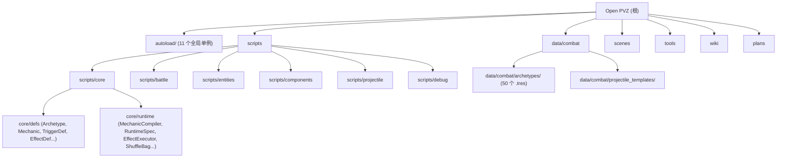

# CLAUDE.md

> Open PVZ -- 基于 Godot 4.x (GDScript) 的可组合、可扩展 PVZ 类规则引擎。不是 Plants vs Zombies 的直接克隆；引擎优先考虑规则的开放组合和涌现式玩法，而非功能完整度。

## 变更记录 (Changelog)

- **2026-04-24** — wiki 同步 Mechanic-first 决策：11 份文档更新，旧"模板与装配边界"重写为"编译链与 Mechanic 系统"；CLAUDE.md 同步代码现状
- **2026-04-22** — Mechanic-first 重构第三阶段完成：multi-payload 编译、per-type compiler dispatch、Controller/State/Lifecycle 扩展、确定性随机协议、Archetype 独立实例化、迁移对照验证
- **2026-04-15** — init-architect 全仓扫描：新增模块结构图、模块索引表、模块级 CLAUDE.md、覆盖率报告

## 项目愿景

Open PVZ 是一个开放式 PVZ-like 规则引擎，核心目标是让"组合规则"成为核心玩法驱动力。项目已完成旧实体作者模型归档，正式运行时唯一入口是 **Mechanic-first** 架构：`CombatArchetype + CombatMechanic[] -> RuntimeSpec -> EntityFactory`。

当前阶段：**Mechanic-first 重构阶段已完成三阶段**。详见 [wiki/01-overview/23-当前阶段与实现路线.md](wiki/01-overview/23-当前阶段与实现路线.md) 和 [wiki/decisions/](wiki/decisions/README.md)。

## 架构总览

### 四层模型

1. **语义事件层** -- "发生了什么"。事件如 `game.tick`、`entity.damaged`、`entity.died`、`projectile.hit` 通过 `EventBus`（autoload）流转。
2. **行为效果层** -- "该做什么"。`EffectDef` -> `EffectNode`，由 `EffectExecutor` 执行。效果是原子化、可组合、可嵌套的（最大深度 5）。注册于 `EffectRegistry`。
3. **编译装配层** -- "实体如何编译和组装"。`CombatArchetype` + `CombatMechanic[]` -> `MechanicCompiler` -> `RuntimeSpec` -> `EntityFactory` 实例化。10 个冻结 Mechanic family，37 个内置 type。注册于 `MechanicFamilyRegistry` / `MechanicTypeRegistry` / `MechanicCompilerRegistry`。
4. **连续行为层** -- "持续对象如何更新"。抛射体使用 3D 逻辑 + 2D 投影；Controller（bite / sweep 等）通过 `ControllerComponent` 每帧执行。命中时重新进入事件链。

### 执行链

**离散事件链**：
```
EventBus -> TriggerComponent -> TriggerInstance -> RuleContext -> EffectExecutor -> Runtime Action -> EventBus
```

**编译链**（实例化时运行一次）：
```
Archetype + Mechanic[] -> NormalizedMechanicSet -> RuntimeSpec -> EntityFactory -> Runtime Nodes
```

**连续行为链**（每帧）：
```
_physics_process -> ControllerComponent -> ControllerRegistry -> Controller Strategy
```

### 全局单例 (Autoloads)

| 单例名 | 职责 |
|--------|------|
| `EventBus` | 事件分发，优先级订阅，历史追踪（最多 256 条） |
| `DebugService` | 集中式日志：事件/触发器/效果/运行时快照/协议问题 |
| `SceneRegistry` | 场景与资源注册表，自动扫描 `data/combat/`，支持 archetype 查询 |
| `MechanicFamilyRegistry` | Mechanic 一级 family 注册（10 个冻结 family） |
| `MechanicTypeRegistry` | Mechanic type 注册（family 下的具体 type_id，委托 MechanicCompiler 注册内置 type） |
| `MechanicCompilerRegistry` | Mechanic per-type 编译器 callable 注册与分发 |
| `DetectionRegistry` | 目标发现策略注册（always / lane_forward / lane_backward） |
| `TriggerRegistry` | 触发器定义与策略注册（periodically / when_damaged / on_death） |
| `EffectRegistry` | 效果定义与策略注册（damage / spawn_projectile / explode / apply_status / produce_sun / spawn_entity） |
| `ControllerRegistry` | Controller 策略注册（core.bite / core.sweep） |
| `GameState` | 游戏状态管理（当前战斗、时间、实体 ID 分配、battle_seed） |

### 战斗运行时子系统

| 子系统 | 类名 | 职责 |
|--------|------|------|
| 经济状态 | `BattleEconomyState` | 阳光资源管理、天降阳光、消费验证 |
| 棋盘状态 | `BattleBoardState` | 格子系统、放置验证、槽位类型/标签、角色占位 |
| 卡片状态 | `BattleCardState` | 卡片手牌、费用消耗、冷却管理、放置请求流程 |
| 流程状态 | `BattleFlowState` | 战斗阶段管理（preparing / running / victory / defeat） |
| 波次运行器 | `WaveRunner` | 波次调度、敌人生成、胜败条件检测 |
| 场上物件状态 | `BattleFieldObjectState` | 场上物件生成、管理、事件发射（割草机等） |
| 模式宿主 | `BattleModeHost` | 模式运行时宿主：解析 mode_def、合并 override、驱动规则模块、评估目标 |

## 模块结构图



## 模块索引

| 模块路径 | 语言 | 文件数 | 职责概述 |
|----------|------|--------|----------|
| `autoload/` | GDScript | 11 | 全局单例：事件总线、注册表、编译器分发、游戏状态 |
| `scripts/core/defs/` | GDScript | 11 | 资源定义：CombatArchetype, CombatMechanic, TriggerDef, EffectDef, ProjectileTemplate 等 |
| `scripts/core/runtime/` | GDScript | 16 | 运行时：MechanicCompiler, RuntimeSpec, RuntimeTriggerSpec, NormalizedMechanicSet, EffectExecutor, ShuffleBag 等 |
| `scripts/battle/` | GDScript | 28 | 战斗协调：BattleManager, EntityFactory（archetype-only）, 经济/棋盘/卡片/波次子系统, 模式层 |
| `scripts/entities/` | GDScript | 4 | 实体类型：BaseEntity, PlantRoot, ZombieRoot, ProjectileRoot |
| `scripts/components/` | GDScript | 7 | 可复用组件：HealthComponent, TriggerComponent, ControllerComponent, StateComponent 等 |
| `scripts/projectile/` | GDScript | 5 | 抛射体运动系统：linear / parabola / track 运动模式 |
| `scripts/debug/` | GDScript | 1 | 调试覆盖层 |
| `data/combat/archetypes/` | .tres | 95 | Archetype 资源（83 植物 + 10 僵尸 + 2 场上物件） |
| `data/combat/` | .tres | 260 | 战斗数据资源：archetype、投射物模板、飞行配置、卡片、波次等 |
| `scenes/validation/` | .tres/.tscn | 102 | 自动化验证场景资源；验证入口以 `tools/validation_scenarios.json` 的 105 个场景为准 |
| `scenes/showcase/` | .tscn | 9 | 展示场景 |
| `tools/` | PS1/JSON | 3 | 验证运行工具 |
| `wiki/` | Markdown | ~40 | 中文设计文档（6 个分区 + decisions） |
| `vendor/` | -- | 大量 | 参考实现（PVZ-Godot-Dream），不属于引擎核心 |

## 运行与开发

### 运行项目

- 在 Godot 4.x 编辑器中打开。主场景：`res://scenes/main/main.tscn`
- 视口：960x540，窗口：1920x1080
- 物理引擎：Jolt Physics
- 渲染方式：mobile

### 验证（测试）

验证场景是主要的测试机制 -- 没有单元测试框架。

```powershell
# 运行所有验证场景
pwsh tools/run_all_validations.ps1

# 运行单个场景
pwsh tools/run_validation.ps1 -ScenarioId <id>
```

场景定义：`tools/validation_scenarios.json`（73 个场景，分层 smoke / core / extension / guardrail）
场景资源：`scenes/validation/`
结果输出：`artifacts/validation/`

在 Godot 编辑器中运行单个场景：打开 `scenes/validation/` 中的 `.tscn` 文件并按 F6。

## 编码规范

### 资源定义

- 所有游戏定义使用 Godot `Resource` (.tres) 文件，不使用 JSON 或外部格式
- 使用 `@export` 暴露编辑器属性
- 一个类一个文件；数据定义继承 `Resource`

### Archetype 编写顺序

Identity -> Chassis -> Combat Stats -> Mechanic[]

### 命名

- Archetype：`plant_role_variant`、`zombie_role_variant`
- 文件放在 `data/combat/archetypes/plants/` 或 `zombies/` 或 `field_objects/`
- Mechanic：`family.type_id` 格式，如 `Controller.core.bite`、`Trigger.periodically`

### 事件命名

点分隔语义名：`game.tick`、`entity.damaged`、`entity.died`、`projectile.hit`、`entity.spawned`、`placement.accepted`

### 目标解析模式 (effects)

`context_target`、`source`、`owner`、`event_source`、`event_target`、`enemies_in_radius`

### 代码风格

- PascalCase 用于类名，snake_case 用于变量/函数
- StringName 用于驻留标识符
- RefCounted 用于系统间传递的数据

## 冻结协议

第一轮协议冻结已生效。未经设计审批，不得修改以下语义：

**Mechanic family（10 个冻结，新增需 ADR）：** Trigger / Targeting / Emission / Trajectory / HitPolicy / Payload / State / Lifecycle / Placement / Controller

**触发器：** `periodically` (game.tick)、`when_damaged` (entity.damaged)、`on_death` (entity.died)
**效果：** `damage`、`spawn_projectile`、`explode`

`ProtocolValidator` 在运行时强制执行参数类型、边界和资源脚本类型检查。

## 测试策略

- **无单元测试框架**，验证场景是唯一的自动化测试机制
- 每个验证场景包含：`.tres` 配置（BattleScenario）+ `.tscn` 场景文件
- 验证规则通过事件匹配：事件名 + 标签 + 核心值 + 次数范围
- BattleManager 内置验证状态机：pending -> passed/failed
- 命令行支持：`--validation-auto-quit`、`--validation-print-report`、`--validation-output-dir=`
- 结果输出为 JSON：`validation_report.json` + `debug_logs.json`

## 文档

`wiki/` 目录包含中文设计文档（详见 [wiki/index.md](wiki/index.md)）：
- `01-overview/` -- 架构、设计哲学、当前阶段
- `02-runtime-protocol/` -- 编译链与 Mechanic 系统、触发器系统、效果系统、执行机制
- `03-content-validation/` -- 验证矩阵和覆盖率
- `04-roadmap-reference/` -- 参考实现、扩展系统规划、外部调研
- `05-governance/` -- Archetype 编写约定、术语表、方法论
- `decisions/` -- ADR 决策记录（ADR-001~005）

`plans/` 目录包含阶段任务清单和设计草案。

## AI 使用指引

- 修改冻结协议或新增 Mechanic family 前务必获得设计审批
- 新增实体时只使用 CombatArchetype + CombatMechanic[]；旧实体作者模型仅作为历史归档，不参与运行时
- 新增实体功能时，必须同时创建验证场景
- 优先通过 `.tres` Resource 扩展内容，而非修改 GDScript 代码
- 调试时使用 `DebugService` 记录，不要用 `print`
- 所有抛射体运动配置通过 `ProjectileFlightProfile` Resource 驱动
- 所有随机行为走确定性随机协议（battle_seed 派生链 + ShuffleBag）
- `vendor/` 目录为参考实现，不要直接修改或依赖
