# CLAUDE.md

This file provides guidance to Claude Code (claude.ai/code) when working with code in this repository.

> Open PVZ -- 基于 Godot 4.x (GDScript) 的可组合、可扩展 PVZ 类规则引擎。不是 Plants vs Zombies 的直接克隆；引擎优先考虑规则的开放组合和涌现式玩法，而非功能完整度。

## 变更记录 (Changelog)

- **2026-05-17** — CLAUDE.md 与 AGENTS.md 对齐：修正验证命令参数（`-Scenario` 而非 `-ScenarioId`）、补充反模式与通用扩展插槽章节、加入 `SpatialIndex` 与 `extensions/` 模块、补全守卫检查脚本与 `-MaxParallel` 参数；ADR 索引更新至 007
- **2026-05-09** — CLAUDE.md / README / agent.md / wiki：删除易过时的具体数量，改为定性描述
- **2026-04-24** — wiki 同步 Mechanic-first 决策：11 份文档更新，旧"模板与装配边界"重写为"编译链与 Mechanic 系统"；CLAUDE.md 同步代码现状
- **2026-04-22** — Mechanic-first 重构第三阶段完成：multi-payload 编译、per-type compiler dispatch、Controller/State/Lifecycle 扩展、确定性随机协议、Archetype 独立实例化、迁移对照验证
- **2026-04-15** — init-architect 全仓扫描：新增模块结构图、模块索引表、模块级 CLAUDE.md、覆盖率报告

## 项目愿景

Open PVZ 是一个开放式 PVZ-like 规则引擎，核心目标是让"组合规则"成为核心玩法驱动力。项目已完成旧实体作者模型归档，正式运行时唯一入口是 **Mechanic-first** 架构：`CombatArchetype + CombatMechanic[] -> RuntimeSpec -> EntityFactory`。

当前阶段：**Mechanic-first 重构阶段已完成三阶段**。详见 [wiki/01-overview/23-当前阶段与实现路线.md](wiki/01-overview/23-当前阶段与实现路线.md) 和 [wiki/decisions/](wiki/decisions/README.md)。

## 架构总览

### 四层模型

1. **语义事件层** -- "发生了什么"。事件如 `game.tick`、`entity.damaged`、`entity.died`、`projectile.hit` 通过 `EventBus`（autoload）流转。
2. **行为效果层** -- "该做什么"。`EffectDef` -> `EffectNode`，由 `EffectExecutor` 执行。效果是原子化、可组合、可嵌套的（最大深度 5）。注册于 `EffectRegistry`。
3. **编译装配层** -- "实体如何编译和组装"。`CombatArchetype` + `CombatMechanic[]` -> `MechanicCompiler` -> `RuntimeSpec` -> `EntityFactory` 实例化。10 个冻结 Mechanic family。注册于 `MechanicFamilyRegistry` / `MechanicTypeRegistry` / `MechanicCompilerRegistry`。
4. **连续行为层** -- "持续对象如何更新"。抛射体使用 3D 逻辑 + 2D 投影；Controller（bite / sweep 等）通过 `ControllerComponent` 每帧执行。命中时重新进入事件链。

### 执行链

**离散事件链**：
```
EventBus -> TriggerComponent -> TriggerInstance -> RuleContext -> EffectExecutor -> Runtime Action -> EventBus
```

**编译链**（实例化时运行一次）：
```
Archetype + Mechanic[] -> NormalizedMechanicSet -> RuntimeSpec -> EntityFactory -> Runtime Nodes
```

**连续行为链**（每帧）：
```
_physics_process -> ControllerComponent -> ControllerRegistry -> Controller Strategy
```

### 全局单例 (Autoloads)

**核心规则引擎**（标 ★ 的注册表统一继承 `RegistryBase`，是通用扩展插槽的入口）：

| 单例名 | 职责 |
|--------|------|
| `EventBus` | 事件分发，优先级订阅，历史追踪（最多 256 条） |
| `DebugService` | 集中式日志：事件/触发器/效果/运行时快照/协议问题 |
| `SceneRegistry` | 场景与资源注册表，自动扫描 `data/combat/`，支持 archetype 查询 |
| `MechanicFamilyRegistry` | Mechanic 一级 family 注册（10 个冻结 family） |
| `MechanicTypeRegistry` | Mechanic type 注册（family 下的具体 type_id，委托 MechanicCompiler 注册内置 type） |
| `MechanicCompilerRegistry` ★ | Mechanic per-type 编译器 callable 注册与分发 |
| `DetectionRegistry` ★ | 目标发现策略注册 |
| `TriggerRegistry` ★ | 触发器定义与策略注册 |
| `EffectRegistry` ★ | 效果定义与策略注册 |
| `ControllerRegistry` ★ | Controller 策略注册 |
| `ProjectileMovementRegistry` ★ | 抛射体运动策略注册（linear / parabola / track） |
| `GameState` | 游戏状态管理（当前战斗、100Hz 仿真时间、实体 ID 分配、battle_seed） |

**表现层**：

| 单例名 | 职责 |
|--------|------|
| `VisualCueRegistry` | 视觉提示注册与分发 |
| `VisualFxRegistry` | 视觉特效注册与分发 |
| `VisualProfileRegistry` | 视觉配置档注册 |
| `AudioCueRegistry` | 音频提示注册与分发 |

### 战斗运行时子系统

| 子系统 | 类名 | 职责 |
|--------|------|------|
| 经济状态 | `BattleEconomyState` | 阳光资源管理、天降阳光、消费验证 |
| 棋盘状态 | `BattleBoardState` | 格子系统、放置验证、槽位类型/标签、角色占位 |
| 卡片状态 | `BattleCardState` | 卡片手牌、费用消耗、冷却管理、放置请求流程 |
| 流程状态 | `BattleFlowState` | 战斗阶段管理（preparing / running / victory / defeat） |
| 波次运行器 | `WaveRunner` | 波次调度、敌人生成、胜败条件检测 |
| 场上物件状态 | `BattleFieldObjectState` | 场上物件生成、管理、事件发射（割草机等） |
| 模式宿主 | `BattleModeHost` | 模式运行时宿主：解析 mode_def、合并 override、驱动规则模块、评估目标 |
| 空间索引 | `SpatialIndex` | 统一目标查询基础设施：team/lane/tag/kind/x/radius/height_range 过滤与稳定排序，经 `BattleManager.spatial_query(params)` 调用 |

## 模块结构图

```mermaid
graph TD
    Root["Open PVZ (根)"] --> Autoload["autoload/ (全局单例)"]
    Root --> Scripts["scripts"]
    Root --> Data["data/combat"]
    Root --> Scenes["scenes"]
    Root --> Tools["tools"]
    Root --> Wiki["wiki"]
    Root --> Plans["plans"]
    Root --> Extensions["extensions"]

    Scripts --> Core["scripts/core"]
    Scripts --> Battle["scripts/battle"]
    Scripts --> Entities["scripts/entities"]
    Scripts --> Components["scripts/components"]
    Scripts --> Projectile["scripts/projectile"]
    Scripts --> Visual["scripts/visual"]
    Scripts --> UI["scripts/ui"]
    Scripts --> Debug["scripts/debug"]

    Core --> CoreDefs["core/defs (Archetype, Mechanic, TriggerDef, EffectDef...)"]
    Core --> CoreRuntime["core/runtime (MechanicCompiler, RuntimeSpec, EffectExecutor, ShuffleBag...)"]
    Core --> CoreRegistry["core/registry"]

    Battle --> BattleMode["battle/mode (BattleModeHost, 模式系统)"]

    Data --> Archetypes["data/combat/archetypes/"]
    Data --> Projectiles["data/combat/projectile_templates/"]

    click Autoload "./autoload/CLAUDE.md" "查看 autoload 模块文档"
    click Core "./scripts/core/CLAUDE.md" "查看 core 模块文档"
    click Battle "./scripts/battle/CLAUDE.md" "查看 battle 模块文档"
    click Entities "./scripts/entities/CLAUDE.md" "查看 entities 模块文档"
    click Components "./scripts/components/CLAUDE.md" "查看 components 模块文档"
    click Projectile "./scripts/projectile/CLAUDE.md" "查看 projectile 模块文档"
    click Visual "./scripts/visual/CLAUDE.md" "查看 visual 模块文档"
    click Data "./data/combat/CLAUDE.md" "查看 data/combat 模块文档"
    click Extensions "./extensions/CLAUDE.md" "查看 extensions 模块文档"
```



## 模块索引

| 模块路径 | 语言 | 职责概述 |
|----------|------|----------|
| `autoload/` | GDScript | 全局单例：事件总线、注册表、编译器分发、游戏状态、运动/视觉/音频注册表 |
| `scripts/core/defs/` | GDScript | 资源定义：CombatArchetype, CombatMechanic, TriggerDef, EffectDef, ProjectileTemplate 等 |
| `scripts/core/runtime/` | GDScript | 运行时：MechanicCompiler, RuntimeSpec, RuntimeTriggerSpec, NormalizedMechanicSet, EffectExecutor, ShuffleBag 等 |
| `scripts/core/registry/` | GDScript | 注册表内部实现 |
| `scripts/battle/` | GDScript | 战斗协调：BattleManager, EntityFactory（archetype-only）, 经济/棋盘/卡片/波次子系统 |
| `scripts/battle/mode/` | GDScript | 模式系统：BattleModeHost, 模式解析与驱动 |
| `scripts/entities/` | GDScript | 实体类型：BaseEntity, PlantRoot, ZombieRoot, ProjectileRoot |
| `scripts/components/` | GDScript | 可复用组件：HealthComponent, TriggerComponent, ControllerComponent, StateComponent 等 |
| `scripts/projectile/` | GDScript | 抛射体基础：ProjectileRoot |
| `scripts/projectile/movement/` | GDScript | 抛射体运动策略：linear / parabola / track |
| `scripts/visual/` | GDScript | 视觉反馈层：VisualFeedbackHost, VisualActionRunner, 层级策略 |
| `scripts/ui/` | GDScript | UI 系统：面板、屏幕 |
| `scripts/input/` | GDScript | 输入处理 |
| `scripts/main/` | GDScript | 主场景入口 |
| `scripts/demo/` | GDScript | Demo 场景脚本 |
| `scripts/validation/` | GDScript | 验证场景专用脚本 |
| `scripts/debug/` | GDScript | 调试覆盖层 |
| `data/combat/archetypes/` | .tres | Archetype 资源（plants / zombies / field_objects） |
| `scenes/validation/` | .tres/.tscn | 自动化验证场景资源 |
| `scenes/showcase/` | .tscn | 展示场景 |
| `tools/` | PS1/JSON | 验证运行工具与守卫检查脚本 |
| `wiki/` | Markdown | 中文设计文档（6 个分区 + decisions） |
| `extensions/` | JSON/.tres/GDScript | 扩展包：最小内容包、chaos / guardrail 样例、通用插槽示例 |
| `extensions_manifest_fixtures/` | JSON | 扩展 manifest 错误样例（用于 guardrail 验证） |
| `vendor/` | -- | 参考实现（PVZ-Godot-Dream），不属于引擎核心 |

## 运行与开发

### 运行项目

- 在 Godot 4.x 编辑器中打开。主场景：`res://scenes/main/main.tscn`
- 视口：960x540，窗口：1920x1080
- 物理引擎：Jolt Physics
- 渲染方式：mobile

### 验证（测试）

验证场景是主要的测试机制 -- 没有单元测试框架。

```powershell
# 运行所有验证场景（默认自动取 min(CPU 核心数, 8) 并行）
pwsh tools/run_all_validations.ps1

# 控制并行度
pwsh tools/run_all_validations.ps1 -MaxParallel 8

# 运行单个场景（参数是 -Scenario，不是 -ScenarioId；必须是 res:// 路径）
pwsh tools/run_validation.ps1 -Scenario "res://scenes/validation/<scenario>.tres"
```

场景定义：`tools/validation_scenarios.json`（分层 smoke / core / extension / guardrail / showcase）
场景资源：`scenes/validation/`
单次结果：`artifacts/validation/<timestamp>_<run_label>/`
批量汇总：`artifacts/validation/batch_<timestamp>/`

在 Godot 编辑器中运行单个场景：打开 `scenes/validation/` 中的 `.tscn` 文件并按 F6。

### 守卫检查

```powershell
# 检查旧实体模型残留（禁止 EntityTemplate / TriggerBinding）
pwsh tools/check_no_legacy_entity_model.ps1

# 检查运行时指标/时间违规（禁止 OS.get_ticks_* 和 Timer 用于游戏逻辑）
pwsh tools/check_runtime_metrics_time_guardrails.ps1
```

## 编码规范

### 资源定义

- 所有游戏定义使用 Godot `Resource` (.tres) 文件，不使用 JSON 或外部格式
- 使用 `@export` 暴露编辑器属性
- 一个类一个文件；数据定义继承 `Resource`

### Archetype 编写顺序

Identity -> Chassis -> Combat Stats -> Mechanic[]

### 命名

- Archetype：`plant_role_variant`、`zombie_role_variant`
- 文件放在 `data/combat/archetypes/plants/` 或 `zombies/` 或 `field_objects/`
- Mechanic：`family.type_id` 格式，如 `Controller.core.bite`、`Trigger.periodically`

### 事件命名

点分隔语义名：`game.tick`、`entity.damaged`、`entity.died`、`projectile.hit`、`entity.spawned`、`placement.accepted`

### 目标解析模式 (effects)

`context_target`、`source`、`owner`、`event_source`、`event_target`、`enemies_in_radius`

### 代码风格

- PascalCase 用于类名，snake_case 用于变量/函数
- StringName 用于驻留标识符
- RefCounted 用于系统间传递的数据

## 冻结协议

第一轮协议冻结已生效。未经设计审批，不得修改以下语义：

**Mechanic family（10 个冻结，新增需 ADR）：** Trigger / Targeting / Emission / Trajectory / HitPolicy / Payload / State / Lifecycle / Placement / Controller

**触发器：** `periodically` (game.tick)、`when_damaged` (entity.damaged)、`on_death` (entity.died)
**效果：** `damage`、`spawn_projectile`、`explode`

`ProtocolValidator` 在运行时强制执行参数类型、边界和资源脚本类型检查。

## 通用扩展插槽

详见 [wiki/04-roadmap-reference/42-通用扩展插槽机制.md](wiki/04-roadmap-reference/42-通用扩展插槽机制.md)。

- 已开放 slot：`projectile_movement`、`mechanic_compilers`、`effects`、`triggers`、`detections`、`controllers`
- 6 个对应的 autoload registry 统一继承 `RegistryBase`，共享注册、去重、信任检查、来源追踪、协议错误记录
- 贡献项资源统一继承 `RegistryContributorDef`（字段 `id`、`tags`、`param_defs`）：`ProjectileMovementDef`、`MechanicCompilerDef`、`TriggerDef`、`DetectionDef`、`ControllerDef`
- 运行时代码 slot 需要 `trust_level = "trusted_runtime"`
- **扩展包不得注册或覆盖 `core.*` 命名空间**
- **扩展包不得新增 Mechanic family**，只能在冻结 family 下新增 type
- 默认不做跨包 override，重复 id 拒绝并记录 `protocol.issue`
- 新增扩展点对齐步骤：定义 contributor Def → registry 单例继承 `RegistryBase` → 实现 `_register_builtin_defs()` 与策略 hook → 接入 `ExtensionPackCatalog.ALLOWED_REGISTER_KINDS` → 补 smoke + guardrail 验证场景

## 反模式 (禁止事项)

### 架构级禁止
- **禁止为单个实体硬编码业务逻辑**：不得编写 `PeaShooterAttack`、`WallNutLogic`、`ConeHeadZombieAI` 这类命名；所有行为通过 `CombatArchetype + CombatMechanic[]` 驱动
- **禁止 BattleManager 特判**：不得为特定实体或模式在 BattleManager 中添加 if/switch 分支；模式差异通过 `BattleModeHost / BattleRuleModule` 吸收
- **禁止用 `print()` 替代 `DebugService`**：除 DebugService 自身和 validation reporter 外，所有运行时日志必须走 DebugService
- **旧实体模型已物理删除**：`EntityTemplate` / `TriggerBinding` 已在 2026-05 彻底移除，运行时唯一入口始终是 `CombatArchetype + CombatMechanic[]`

### 魔法数字禁止
- **禁止 `4000.0` / `99999.0` 模拟"全范围"**：用 `range_mode = "full_lane"` 或显式 lane 距离查询替代
- **禁止 `-999999.0` 作为哨兵值**：用显式布尔标志或 optional 值替代

### 时间与输入禁止
- **不得在游戏逻辑中使用 `OS.get_ticks_msec/usec` 或 Godot `Timer` 节点**：仿真时间走 100Hz 固定 tick + `GameState` 派生链
- **不得在渲染/UI 中消费玩法随机数**
- **不得让视觉反馈改变战斗结果**（伤害/命中/冷却等不依赖 Tween 或粒子）

### 内容禁止
- **不得在 GDScript 中硬编码内容**：所有游戏数据必须走 `.tres` Resource
- **不得直接修改 `vendor/` 参考实现**

## 测试策略

- **无单元测试框架**，验证场景是唯一的自动化测试机制
- 每个验证场景包含：`.tres` 配置（BattleScenario）+ `.tscn` 场景文件
- 验证规则通过事件匹配：事件名 + 标签 + 核心值 + 次数范围
- BattleManager 内置验证状态机：pending -> passed/failed
- 命令行支持：`--validation-auto-quit`、`--validation-print-report`、`--validation-output-dir=`
- 结果输出为 JSON：`validation_report.json` + `debug_logs.json`

## 文档

`wiki/` 目录包含中文设计文档（详见 [wiki/index.md](wiki/index.md)）：
- `01-overview/` -- 架构、设计哲学、当前阶段
- `02-runtime-protocol/` -- 编译链与 Mechanic 系统、触发器系统、效果系统、执行机制
- `03-content-validation/` -- 验证矩阵和覆盖率
- `04-roadmap-reference/` -- 参考实现、扩展系统规划、外部调研
- `05-governance/` -- Archetype 编写约定、术语表、方法论
- `decisions/` -- ADR 决策记录（ADR-001~007）

`plans/` 目录包含阶段任务清单和设计草案。

## AI 使用指引

- 修改冻结协议或新增 Mechanic family 前务必获得设计审批
- 新增实体时只使用 CombatArchetype + CombatMechanic[]；旧实体作者模型仅作为历史归档，不参与运行时
- 新增实体功能时，必须同时创建验证场景
- 优先通过 `.tres` Resource 扩展内容，而非修改 GDScript 代码
- 新增扩展能力优先走通用插槽：定义 contributor Resource、接入 registry、补 smoke/guardrail validation，再更新 wiki
- 新增扩展点必须走 `RegistryBase + RegistryConfig + ContributorDef`，不再允许独立实现注册逻辑
- 调试时使用 `DebugService` 记录，不要用 `print`
- 抛射体基础飞行配置通过 `ProjectileFlightProfile` Resource 驱动；新增 movement 类型通过 `ProjectileMovementDef + ProjectileMovementRegistry` 接入
- 所有随机行为走确定性随机协议（battle_seed 派生链 + ShuffleBag）
- `vendor/` 目录为参考实现，不要直接修改或依赖
- 模块级细节优先看 `<module>/CLAUDE.md`（autoload / scripts/core / scripts/battle / 等已就位；其他模块以 `<module>/AGENTS.md` 为准）
