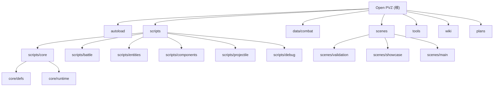

# CLAUDE.md

> Open PVZ -- 基于 Godot 4.x (GDScript) 的可组合、可扩展 PVZ 类规则引擎。不是 Plants vs Zombies 的直接克隆；引擎优先考虑规则的开放组合和涌现式玩法，而非功能完整度。

## 变更记录 (Changelog)

- **2026-04-15 21:39:03** — init-architect 全仓扫描：新增模块结构图、模块索引表、模块级 CLAUDE.md、覆盖率报告
- **2026-04-21** — wiki 瘦身：同步阶段口径至 Phase 7 输入准备；归档 wiki 自审文档；压缩扩展系统规划；合并 00/02 架构双写
- **2026-04-22** — Mechanic-first 重构第三阶段完成：multi-payload 编译、per-type compiler dispatch、Controller/State/Lifecycle 扩展、确定性随机协议、Archetype 独立实例化、迁移对照验证

## 项目愿景

Open PVZ 是一个开放式 PVZ-like 规则引擎，核心目标是让"组合规则"成为核心玩法驱动力。项目已从旧作者模型（`EntityTemplate / TriggerBinding`）切换到 **Mechanic-first** 架构：`Archetype + Mechanic[]` + 多阶段编译链。

当前阶段：**Mechanic-first 重构阶段**。已完成：编译链最小闭环、Controller/State/Lifecycle 扩展、multi-payload、per-type compiler dispatch、确定性随机协议、Archetype 独立实例化、迁移对照验证。详见 [wiki/01-overview/23-当前阶段与实现路线.md](wiki/01-overview/23-当前阶段与实现路线.md) 和 [wiki/decisions/](wiki/decisions/README.md)。

## 架构总览

### 四层模型

1. **语义事件层** -- "发生了什么"。事件如 `game.tick`、`entity.damaged`、`entity.died`、`projectile.hit` 通过 `EventBus`（autoload）流转。
2. **行为效果层** -- "该做什么"。`EffectDef` -> `EffectNode`，由 `EffectExecutor` 执行。效果是原子化、可组合、可嵌套的（最大深度 5）。注册于 `EffectRegistry`。
3. **组合装配层** -- "实体如何组装"。`EntityTemplate` -> `TriggerBinding` -> 工厂装配。`TriggerDef` -> `TriggerInstance` -> `TriggerComponent` 挂载到实体。注册于 `TriggerRegistry`。
4. **连续行为层** -- "持续对象如何更新"。抛射体使用 3D 逻辑 + 2D 投影，通过 `_physics_process` 持续模拟，命中时重新进入事件链（`projectile.hit`）。

### 执行链

```
EventBus -> TriggerComponent -> TriggerInstance -> RuleContext -> EffectExecutor -> Runtime Action -> EventBus
```

### 全局单例 (Autoloads)

| 单例名 | 职责 |
|--------|------|
| `EventBus` | 事件分发，优先级订阅，历史追踪（最多 256 条） |
| `DebugService` | 集中式日志：事件/触发器/效果 |
| `SceneRegistry` | 场景与资源注册表，自动扫描 `data/combat/` |
| `MechanicFamilyRegistry` | Mechanic 一级 family 注册（10 个冻结 family） |
| `MechanicTypeRegistry` | Mechanic type 注册（family 下的具体 type_id） |
| `MechanicCompilerRegistry` | Mechanic per-type 编译器注册与分发 |
| `DetectionRegistry` | 目标发现策略注册（always / lane_forward / lane_backward） |
| `TriggerRegistry` | 触发器定义与策略注册（periodically / when_damaged / on_death） |
| `EffectRegistry` | 效果定义与策略注册（damage / spawn_projectile / explode） |
| `ControllerRegistry` | Controller 策略注册（core.bite / core.sweep） |
| `GameState` | 游戏状态管理（当前战斗、时间、实体 ID 分配、battle_seed） |

### 战斗运行时子系统 (Phase 4)

| 子系统 | 类名 | 职责 |
|--------|------|------|
| 经济状态 | `BattleEconomyState` | 阳光资源管理、天降阳光、消费验证 |
| 棋盘状态 | `BattleBoardState` | 格子系统、放置验证、槽位类型/标签、角色占位 |
| 卡片状态 | `BattleCardState` | 卡片手牌、费用消耗、冷却管理、放置请求流程 |
| 流程状态 | `BattleFlowState` | 战斗阶段管理（preparing / running / victory / defeat） |
| 波次运行器 | `WaveRunner` | 波次调度、敌人生成、胜败条件检测 |
| 场上物件状态 | `BattleFieldObjectState` | 场上物件生成、管理、事件发射（割草机等） |

## 模块结构图



## 模块索引

| 模块路径 | 语言 | 文件数 | 职责概述 |
|----------|------|--------|----------|
| `autoload/` | GDScript | 6 | 全局单例：事件总线、注册表、游戏状态 |
| `scripts/core/defs/` | GDScript | 12 | 资源定义类：TriggerDef, EffectDef, EntityTemplate, CombatArchetype, CombatMechanic 等 |
| `scripts/core/runtime/` | GDScript | 9 | 运行时执行：EffectExecutor, MechanicCompiler, RuntimeSpec, ShuffleBag 等 |
| `scripts/battle/` | GDScript | 22 | 战斗协调：BattleManager, EntityFactory, 经济/棋盘/卡片/波次子系统 |
| `scripts/entities/` | GDScript | 4 | 实体类型：BaseEntity, PlantRoot, ZombieRoot, ProjectileRoot |
| `scripts/components/` | GDScript | 8 | 可复用组件：HealthComponent, TriggerComponent, ControllerComponent, StateComponent 等 |
| `scripts/projectile/` | GDScript | 5 | 抛射体运动系统：linear / parabola / track 运动模式 |
| `scripts/debug/` | GDScript | 1 | 调试覆盖层 |
| `data/combat/` | .tres | ~75 | 战斗数据资源：实体模板、archetype、mechanic、抛射体模板、飞行配置、触发绑定 |
| `scenes/validation/` | .tres/.tscn | 30 | 自动化验证场景（29 个场景 + 1 个通用 tscn） |
| `scenes/showcase/` | .tscn | 9 | 展示场景 |
| `tools/` | PS1/JSON | 3 | 验证运行工具 |
| `wiki/` | Markdown | ~30 | 中文设计文档（5 个子目录） |
| `plans/` | Markdown | ~10 | 阶段规划与设计草案 |
| `vendor/` | -- | 大量 | 参考实现（PVZ-Godot-Dream），不属于引擎核心 |

## 运行与开发

### 运行项目

- 在 Godot 4.x 编辑器中打开。主场景：`res://scenes/main/main.tscn`
- 视口：960x540，窗口：1920x1080
- 物理引擎：Jolt Physics
- 渲染方式：mobile

### 验证（测试）

验证场景是主要的测试机制 -- 没有单元测试框架。

```powershell
# 运行所有验证场景
pwsh tools/run_all_validations.ps1

# 运行单个场景
pwsh tools/run_validation.ps1 -ScenarioId <id>
```

场景定义：`tools/validation_scenarios.json`（30 个场景）
场景资源：`scenes/validation/`
结果输出：`artifacts/validation/`

在 Godot 编辑器中运行单个场景：打开 `scenes/validation/` 中的 `.tscn` 文件并按 F6。

### 验证场景清单

| 场景 ID | 覆盖领域 |
|---------|----------|
| `minimal_battle_validation` | 最小引擎骨架验证 |
| `parabola_long_range_validation` | 远距离抛物线命中 |
| `height_hit_validation` | 高度段命中过滤 |
| `lane_isolation_validation` | 车道隔离验证 |
| `swept_segment_validation` | 扫掠线段碰撞 |
| `terminal_explode_validation` | 终端爆炸伤害 |
| `template_instantiation_validation` | 模板实例化 |
| `template_factory_validation` | 模板工厂运行时触发器 |
| `spawn_override_priority_validation` | 生成覆盖优先级 |
| `air_interceptor_validation` | 空中拦截器 |
| `repeater_burst_validation` | 连发射手 |
| `lobber_catalog_validation` | 投掷物目录 |
| `zombie_roster_attack_validation` | 僵尸阵容攻击 |
| `template_guardrail_validation` | 模板护栏 |
| `protocol_guardrail_validation` | 协议护栏 |
| `sun_resource_validation` | 阳光资源经济 |
| `card_flow_validation` | 卡片运行时流程 |
| `board_placement_validation` | 棋盘放置 |
| `board_slot_tag_validation` | 槽位标签验证 |
| `roof_slot_validation` | 屋顶槽位 |
| `air_slot_validation` | 空中槽位 |
| `cover_blocker_validation` | 掩体/阻挡角色 |
| `status_system_validation` | 状态系统（减速/眩晕） |
| `wave_flow_validation` | 波次与胜负流程 |
| `wave_guardrail_validation` | 波次护栏 |
| `field_object_mower_validation` | 场上物件割草机 |
| `chain_explosion_cascade_validation` | 级联爆炸型错误技（多源反击+死亡爆炸链） |
| `splash_zone_cascade_validation` | 溅射打击型错误技（终端爆炸多目标溅射） |
| `fast_pursuit_cascade_validation` | 高速追踪型错误技（追踪高速移动目标） |
| `multi_lane_retaliation_cascade_validation` | 多车道反击型错误技（跨车道反击隔离） |
| `archetype_instantiation_validation` | Archetype 向日葵编译链验证 |
| `archetype_attack_validation` | Archetype 攻击链编译验证 |
| `archetype_projectile_validation` | Archetype 抛射体编译验证 |
| `archetype_lifecycle_validation` | Archetype lifecycle on_spawned 验证 |
| `archetype_on_place_validation` | Archetype lifecycle on_place 验证 |
| `archetype_state_validation` | Archetype state arming 验证 |
| `archetype_zombie_runtime_validation` | Archetype 僵尸 bite controller 验证 |
| `archetype_mower_runtime_validation` | Archetype 割草机 sweep controller 验证 |
| `archetype_multi_payload_validation` | Archetype 多 payload 编译验证 |
| `peashooter_migration_parity_validation` | 豌豆射手迁移对照验证 |
| `sunflower_migration_parity_validation` | 向日葵迁移对照验证 |
| `zombie_migration_parity_validation` | 基础僵尸迁移对照验证 |

## 冻结协议 (Phase 3)

第一轮协议冻结已生效。未经设计审批，不得修改以下语义：

**触发器：** `periodically` (game.tick)、`when_damaged` (entity.damaged)、`on_death` (entity.died)
**效果：** `damage`、`spawn_projectile`、`explode`
**行为键映射：** `attack` -> periodically、`when_damaged` -> when_damaged、`on_death` -> on_death

`ProtocolValidator` 在运行时强制执行参数类型、边界和资源脚本类型检查。所有新定义必须通过验证。

## 编码规范

### 资源定义

- 所有游戏定义使用 Godot `Resource` (.tres) 文件，不使用 JSON 或外部格式
- 使用 `@export` 暴露编辑器属性
- 一个类一个文件；数据定义继承 `Resource`

### 模板编写顺序

Identity -> Node/Component -> Combat -> Projectile -> Behavior

### 模板命名

- `plant_role_variant`、`zombie_role_variant`、`projectile_type`
- 文件放在 `data/combat/entity_templates/plants/` 或 `zombies/`

### 事件命名

点分隔语义名：`game.tick`、`entity.damaged`、`entity.died`、`projectile.hit`

### 目标解析模式 (effects)

`context_target`、`source`、`owner`、`event_source`、`event_target`、`enemies_in_radius`

### 代码风格

- PascalCase 用于类名，snake_case 用于变量/函数
- StringName 用于驻留标识符
- RefCounted 用于系统间传递的数据

## 测试策略

- **无单元测试框架**，验证场景是唯一的自动化测试机制
- 每个验证场景包含：`.tres` 配置（BattleScenario）+ `.tscn` 场景文件
- 验证规则通过事件匹配：事件名 + 标签 + 核心值 + 次数范围
- BattleManager 内置验证状态机：pending -> passed/failed
- 命令行支持：`--validation-auto-quit`、`--validation-print-report`、`--validation-output-dir=`
- 结果输出为 JSON：`validation_report.json` + `debug_logs.json`

## 文档

`wiki/` 目录包含中文设计文档（详见 [wiki/index.md](wiki/index.md)）：
- `01-overview/` -- 架构、设计哲学、当前阶段
- `02-runtime-protocol/` -- 触发器系统、效果系统、执行机制
- `03-content-validation/` -- 验证矩阵和覆盖率
- `04-roadmap-reference/` -- 参考实现、外部调研
- `05-governance/` -- 模板编写约定、方法论

`plans/` 目录包含阶段任务清单和设计文档。

## AI 使用指引

- 修改冻结协议前务必获得设计审批
- 新增实体功能时，必须同时创建验证场景
- 优先通过 `.tres` Resource 扩展内容，而非修改 GDScript 代码
- 调试时使用 `DebugService` 记录，不要用 `print`
- 所有抛射体运动配置通过 `ProjectileFlightProfile` Resource 驱动
- `vendor/` 目录为参考实现，不要直接修改或依赖

<!-- 由 init-architect 自动生成，时间：2026-04-15 21:39:03 -->
