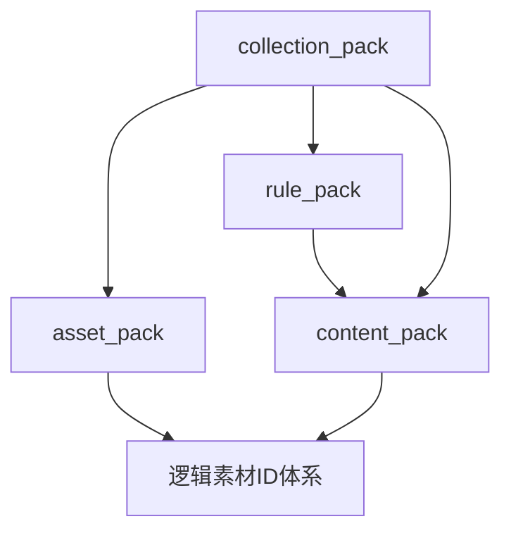

# 扩展包边界与依赖规则-v1

> 这份文档用于把 [扩展系统总体规划](../../../wiki/04-roadmap-reference/38-扩展系统总体规划.md) 中对 `content_pack / asset_pack / rule_pack / collection_pack` 的总体判断，进一步收敛成正式的边界与依赖规则。它回答的不是“某个文件应该放在哪个目录”，而是“这四类包各自回答什么问题、彼此如何依赖、允许如何覆盖，以及后续如何避免边界持续漂移”。

---

## 文档定位

这篇文档主要回答：

- `content_pack / asset_pack / rule_pack / collection_pack` 各自负责什么
- 它们各自不负责什么
- 这四类包之间应如何依赖
- 覆盖策略应如何分层
- 命名空间应如何划分
- 后续如何判断一个新能力或新资源应归入哪种包

这篇文档不负责：

- 直接定义最终版 manifest 全字段格式
- 直接实现安装器或包管理 UI
- 代替素材包、manifest 规范或集合包工作流文档

配套阅读建议：

- [扩展系统总体规划](../../../wiki/04-roadmap-reference/38-扩展系统总体规划.md)
- [素材包系统设计草案](39-素材包系统设计草案.md)
- [扩展包 manifest 规范-v1](41-扩展包-manifest-规范-v1.md)
- [扩展与数据包](11-扩展性与社区生态.md)
- [扩展包新增效果与效果外置策略](37-扩展包新增效果与效果外置策略.md)

---

## 一句话结论

当前建议正式把扩展系统的核心四类包划分为：

> `rule_pack` 负责扩平台能力，`content_pack` 负责扩玩法内容，`asset_pack` 负责扩表现资源，`collection_pack` 负责组织这些包如何组合成一个完整体验。

这四类包的边界应尽快固定，不应在后续实现中继续混用。

---

## 当前为什么必须先定边界

如果现在不把这四类包的边界先固定，后续会出现 4 类典型问题：

### 1. 内容和规则混在一起

表现为：

- 一个扩展包既带新单位，又带新 effect 定义，还带新 strategy
- 后面无法判断它到底是“内容包”还是“平台能力包”

### 2. 内容和素材绑死

表现为：

- 内容资源直接引用真实素材路径
- 后续无法切主题
- 素材包沦为普通资源目录

### 3. 集合包变成第二个内容包

表现为：

- `collection_pack` 内部也开始放具体模板和具体关卡正文
- 最终形成一套重复内容树

### 4. 主仓越来越难治理覆盖关系

表现为：

- 不知道哪些包可以新增
- 不知道哪些包允许覆盖
- 不知道哪些包可以动核心协议

所以这份边界文档的价值，不是“好看”，而是：

> 它为后续 manifest 规范、registry 设计、信任模型和内容作者工作流提供稳定的分类前提。

---

## 四类包的核心边界

---

## A. `rule_pack`

### 核心职责

`rule_pack` 回答的问题是：

> 平台新增了什么规则能力。

它负责：

- 新 `EffectDef`
- 新 `TriggerDef`
- 新 `Detection`
- 新 battle goal / defeat condition 定义
- 新 capability / tag
- 必要时的新 effect / trigger `strategy`

### 不负责什么

它不负责：

- 大量具体单位内容
- 大量具体关卡内容
- 真实素材资源
- UI 主题本体

### 设计原则

它扩展的是：

- 平台能力

而不是：

- 具体玩法内容池

### 当前典型例子

如果未来新增下面这些内容，它们应优先归入 `rule_pack`：

- `apply_status`
- `spawn_entity`
- `lane_backward`
- `protect_template`
- 新的 `Detection`
- 新的 effect capability

---

## B. `content_pack`

### 核心职责

`content_pack` 回答的问题是：

> 用当前平台能力做出了哪些玩法内容。

它负责：

- `EntityTemplate`
- `ProjectileTemplate`
- `TriggerBinding`
- `CardDef`
- `WaveDef`
- `BattleScenario`
- `BattlefieldPreset`
- 图鉴元数据

### 不负责什么

它不负责：

- 新运行时代码
- 新 strategy
- 真实素材文件
- 主题切换逻辑

### 设计原则

它定义的是：

- 玩法内容
- 数值结构
- 关卡与战场组织

但不定义：

- 新平台语义
- 新表现主题

### 当前典型例子

如果未来新增下面这些内容，它们应优先归入 `content_pack`：

- 新植物
- 新僵尸
- 新卡片
- 新波次模板
- 新正式关卡
- 新战场模板

---

## C. `asset_pack`

### 核心职责

`asset_pack` 回答的问题是：

> 这些内容在视觉、音频和主题层面看起来是什么。

它负责：

- 逻辑素材 ID -> 真实资源映射
- sprite / texture
- animation
- audio
- UI icon
- 可选材质和 shader 资源

### 不负责什么

它不负责：

- 玩法内容定义
- 规则执行逻辑
- 具体关卡规则

### 设计原则

它定义的是：

- 表现资源

而不是：

- 玩法内容

### 当前典型例子

如果未来新增下面这些内容，它们应优先归入 `asset_pack`：

- 原版风格素材包
- 极简占位素材包
- 像素风主题包
- 科幻主题包

---

## D. `collection_pack`

### 核心职责

`collection_pack` 回答的问题是：

> 哪些包应该被组合起来，形成一套完整体验。

它负责：

- 聚合多个 pack
- 定义启用顺序
- 定义推荐素材主题
- 定义章节入口 / 关卡组入口 / 主题入口

### 不负责什么

它不负责：

- 大量模板正文
- 大量素材正文
- 新规则实现

### 设计原则

它组织的是：

- 内容组合
- 产品入口
- 主题体验

而不是：

- 具体内容本身

### 当前典型例子

如果未来新增下面这些内容，它们应优先归入 `collection_pack`：

- 战役合集
- 主题关卡合集
- 某一套玩法模组组合
- 内容作者发布的“完整集合包”

---

## 四类包的依赖规则

当前建议把依赖方向明确固定为：

### 1. `rule_pack` 不依赖 `content_pack`

原因：

- 平台能力不应建立在某个具体单位或具体关卡之上

### 2. `content_pack` 可以依赖 `rule_pack`

原因：

- 内容包需要消费平台能力
- 例如新单位要使用新 effect / detection / goal

### 3. `asset_pack` 不依赖具体 `content_pack` 文件

原因：

- 素材包不应绑死某个内容文件路径
- 它应只依赖逻辑素材 ID 体系

### 4. `collection_pack` 可以依赖前三类包

原因：

- 它本来就是组织层

---

## 推荐依赖图

其中关键约束是：

- `rule_pack` 不反向依赖 `content_pack`
- `asset_pack` 不直接依赖具体模板路径

---

## 覆盖规则

四类包不应共享同一种覆盖语义。

---

### 1. `rule_pack`

默认建议：

- `add-only`

也就是：

- 默认只新增平台能力
- 不允许随意覆盖主仓核心规则

例外情况：

- 后续如果允许 patch，也必须非常受控

---

### 2. `content_pack`

默认建议：

- 自有命名空间下 `add-only`

也就是：

- 默认新增自己的单位、关卡和波次
- 不默认 patch 主仓内容

---

### 3. `asset_pack`

默认建议：

- `theme_override`

也就是：

- 可以为相同逻辑素材 ID 提供替代资源
- 但不能改变玩法定义

这是四类包里最应该允许覆盖的一类。

---

### 4. `collection_pack`

默认建议：

- 只做装配和排序

也就是：

- 声明哪个 pack 先启用
- 声明推荐组合
- 不直接改包正文

---

## 命名空间规则

这部分建议现在就固定。

### 主仓命名空间

建议保留为：

- `core/*`
- 或等价主仓保留区

这部分默认：

- 不允许外部包直接覆盖

### 扩展包命名空间

每个扩展包应：

- 在 manifest 中声明自己的 `namespace`

例如：

- `frost_mod/*`
- `classic_assets/*`
- `roof_campaign/*`

### 命名空间的作用

它至少应服务下面 4 件事：

- 避免 ID 冲突
- 帮助 registry 追溯来源
- 帮助日志与调试定位
- 帮助后续包管理 UI 展示来源

---

## 如何判断一个新东西属于哪种包

后续新增能力时，建议先问下面 4 个问题。

### 问题 1：它改变的是规则能力吗？

如果是：

- 优先归 `rule_pack`

例如：

- 新 `EffectDef`
- 新 `TriggerDef`
- 新 `Detection`

### 问题 2：它改变的是玩法内容吗？

如果是：

- 优先归 `content_pack`

例如：

- 新单位
- 新卡片
- 新关卡

### 问题 3：它改变的是表现资源吗？

如果是：

- 优先归 `asset_pack`

例如：

- 新 sprite
- 新音效
- 新图标

### 问题 4：它改变的是包与包如何组成一个完整体验吗？

如果是：

- 优先归 `collection_pack`

例如：

- 一套章节入口
- 推荐主题组合
- 模组合集入口

---

## 当前建议冻结的边界结论

如果把当前讨论收成一组正式约束，建议现在就固定下面这些规则：

1. `rule_pack` 只扩平台能力，不承载大规模内容正文。
2. `content_pack` 只扩玩法内容，不承载新 strategy。
3. `asset_pack` 只扩表现资源，不承载玩法内容定义。
4. `collection_pack` 只做包组合与入口，不承载内容正文。
5. `rule_pack` 不依赖 `content_pack`。
6. `asset_pack` 不依赖具体模板路径。
7. `collection_pack` 是组织层，不是第二个内容层。
8. `rule_pack / content_pack` 默认走 `add-only`。
9. `asset_pack` 允许 `theme_override`。
10. 主仓核心命名空间默认不可覆盖。

---

## 当前文档层面的正式结论

如果把这份文档收成一句话，当前最适合作为正式规范的结论是：

> `rule_pack / content_pack / asset_pack / collection_pack` 应按“能力层、玩法层、表现层、组织层”来划界；其中规则和内容默认只新增，素材允许主题覆盖，集合包只负责装配和入口，而不应再承担具体内容本体。

---

## 后续建议

如果以这份边界文档为正式规范，下一步最适合继续产出：

1. `扩展包 manifest 规范-v1.md`
2. `集合包与内容作者工作流草案.md`

前者负责把 `pack_type / trust_level / dependencies / entry_points` 具体化。  
后者负责把你后续真正想采用的“内容作者模式”工作流写清楚。

---

## 相关文档

- [扩展系统总体规划](../../../wiki/04-roadmap-reference/38-扩展系统总体规划.md)
- [素材包系统设计草案](39-素材包系统设计草案.md)
- [扩展与数据包](11-扩展性与社区生态.md)
- [扩展包新增效果与效果外置策略](37-扩展包新增效果与效果外置策略.md)
