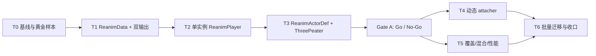

# Reanim 原生运行时实施计划

> 状态：Spike（T0-T3 + Gate A）、T5（瘦身版：overlay/blink + Chomper 角度专项）与 T6（18 株植物分批迁移）已完成；T4 已裁剪
>
> 制定日期：2026-07-29
>
> 设计来源：[`draft/reanim原生运行时ReanimData方案设计草案.md`](draft/reanim原生运行时ReanimData方案设计草案.md)
>
> 适用范围：Reanim 导入工具、视觉运行时、私有经典素材包与 `local_private` 验证
>
> 当前首要里程碑：完成 Peashooter + WallNut + ThreePeater 三类样本 Spike，并作 Go / No-Go 决策

## 1. 目标

建立 `ReanimData -> ReanimPlayer -> ReanimActorDef/ReanimActor` 原生视觉运行链，在不改变玩法协议、`VisualProfileDef.actor_scene` 边界和私有素材发布边界的前提下，用紧凑数据替代当前逐帧展开的 `.tscn + AnimationPlayer` 产物。

首轮交付不追求全量替换。先用单实例样本 Peashooter、角度兼容样本 WallNut 和组合样本 ThreePeater 验证数据体积、播放语义、100Hz 仿真时钟对齐、组合能力及旧链回退，再决定是否进入批量迁移。

## 2. 已冻结的实施决策

| 决策 | 本计划采用的方案 |
|------|------------------|
| 运行时分层 | `ReanimData` 保存单个 reanimation 的不可变数据；`ReanimPlayer` 保存单实例播放状态；`ReanimActorDef/ReanimActor` 负责多实例组合与 Actor Scene Contract 适配 |
| 现有边界 | 保留 `VisualProfileDef.actor_scene + VisualActorComponent`；不新增 Mechanic family，不把 Reanim 注册为玩法扩展点 |
| 时钟 | 播放状态使用 `GameState.current_time` 的本地 epoch 计算；暂停时相位不前进，仿真加速时按仿真时间同步推进 |
| 渲染 | Spike 阶段使用每轨道动态 `CanvasItem`；只有测量证明节点/提交开销不合格时才评估批渲染器 |
| 组合 | ThreePeater 走显式 Part Slot / track binding 组合；不把它误建模为自动 `attacher__` |
| Part Slot 作者格式 | 私有 manifest 作为作者输入，导入阶段生成 `ReanimActorDef` Resource；正式运行时不读取 JSON |
| 兼容范围 | P0/P1 保留 text/font 字段并 fail-closed，但不承诺渲染；blend 只实现 de-pvz 已证明的兼容语义 |
| 迁移策略 | 导入器双输出，旧 actor_scene 始终可回退；按 profile 逐项切换，不做一次性替换 |
| 验证归属 | 新场景进入 `local_private` 层；不修改 gameplay formal content map 的实体归属 |

## 3. 非目标

- 不修改 Trigger / Effect / Controller / Movement 等冻结玩法协议。
- 不让视觉播放结果反向影响伤害、命中、冷却、随机数或实体生命周期。
- 不在本计划内公开或迁入经典原版素材；素材和生成物继续位于本地私有包。
- 不在 Spike 前设计通用 ECS 动画系统、编辑器时间轴或网络同步协议。
- 不为尚未出现的 blend、font、text 或复杂 attacher 语义预先实现完整功能。
- 不直接修改 `vendor/` 参考项目。

## 4. 事实来源与语义锚点

| 来源 | 锚点 | 用途 |
|------|------|------|
| de-pvz | `vendor/de-pvz/Sexy.TodLib/Reanimator.h` 的 `ReanimatorTransform`、track instance 状态 | Reanim 字段、轨道覆盖和实例状态的原版语义 |
| de-pvz | `vendor/de-pvz/Sexy.TodLib/Reanimator.cpp` 的 `BlendTransform`、`GetTransformAtTime`、`MatrixFromTransform`、`DrawRenderGroup` | 插值、矩阵、绘制顺序和 blend 行为的判定基准 |
| de-pvz | 同文件的 `ParseAttacherTrack`、`AttacherSynchWalkSpeed` | 动态 attacher 的后续实现基准 |
| de-pvz | `vendor/de-pvz/Lawn/Plant.cpp` 的 ThreePeater reanimation 初始化与发射路径 | 多 Reanim 实例、head track 绑定与动作协同的原版语义 |
| 当前实现 | `tools/reanim_importer/reanim_import_one.gd` | 现有 XML 解析、clip 推断、角度转换和逐帧展开链 |
| 当前实现 | `scripts/components/visual_actor_component.gd`、`scripts/core/defs/visual_profile_def.gd` | Actor Scene Contract 与外部接入边界 |
| 当前实现 | `autoload/GameState.gd`、`scripts/battle/battle_manager.gd` | 100Hz 仿真时间与暂停/加速语义 |
| 项目设计 | `plans/视觉表现层设计讨论.md` | Action Recipe、Part Slot、组合 actor 的既有设计边界 |
| 私有素材规则 | `wiki/04-roadmap-reference/44-素材包系统与本地私有包.md` | 私有 manifest、生成物与发布边界 |
| Godot 参考 | `vendor/PVZ-Godot-Dream/` 的 R2Ga / AnimationPlayer 链 | 仅用于 Godot 目录组织和工具链对照，不作为原版语义证据 |

## 5. 预期模块边界

建议在 `scripts/visual/reanim/` 建立独立子系统，具体小文件拆分在 T1 实施时按单一职责确定，至少包含以下概念：

- `ReanimData`：schema、资源引用、clip 与压缩轨道数据；实例间共享且运行时只读。
- `ReanimPlayer`：单实例相位、循环、速度、混合、轨道覆盖、采样与渲染节点更新。
- `ReanimActorDef`：Part Slot、父子绑定、默认动作和多播放器组合定义。
- `ReanimActor`：实现现有 actor scene API，将 `play_state`、`play_action`、`set_visual_speed`、`get_anchor` 转发到播放器/组合层。

导入器仍位于 `tools/reanim_importer/`。自动验证脚本和场景分别进入 `scripts/validation/`、`scenes/validation/`，并登记到 `tools/validation_scenarios.json`。私有数据输出继续进入 `local_extensions/classic_original_assets/`，不纳入主仓库提交。

## 6. 任务切片

### T0：建立基线与黄金样本

**类型：** 研究 / 验证

**依赖：** 无

工作内容：

- 固定 Peashooter、WallNut、ThreePeater 当前源文件、语义报告、旧 actor 产物体积和关键帧快照。
- 记录 ThreePeater 当前 wrapper 的节点结构、动作入口、轨道绑定和锚点行为。
- 明确黄金样本的采样时刻、轨道顺序、矩阵容差与截图比较口径；静态语义比较不得依赖墙钟时间。
- 先运行既有私有素材 smoke，确认基线可复现。

可能涉及：

- `scripts/validation/` 下的 Reanim 黄金样本辅助脚本
- `scenes/validation/` 下的基线验证场景
- `local_extensions/classic_original_assets/generated/reports/` 下的本地报告

验收标准：

- 三个样本均有可重复生成的 source hash、体积与关键帧基线。
- 旧链两个既有 `local_private` smoke 通过。
- 记录当前已知的 WallNut 角度告警，不把告警静默成成功。

验证命令：

```powershell
pwsh tools/run_validation.ps1 -Scenario "res://scenes/validation/visual_private_classic_asset_pack_smoke.tres" -ExtraUserArgs "--include-classic-original-assets"
pwsh tools/run_validation.ps1 -Scenario "res://scenes/validation/visual_private_classic_archetype_binding_smoke.tres" -ExtraUserArgs "--include-classic-original-assets"
```

回退/评审风险：只新增基线资产和验证，不切换正式 profile；如基线不可重复，应先修正采样口径，不进入 T1。

**执行记录（2026-07-29）：已完成。**

- 新增 `tools/reanim_golden_baseline.gd`，三样本基线报告输出至 `local_extensions/classic_original_assets/generated/reports/reanim_golden/{peashooter,wallnut,threepeater}.golden.json`；重复运行内容稳定（source SHA-256 一致）。
- ThreePeater 旧 wrapper（`scripts/validation/visual_reanim_threepeater_composite_actor.gd`）的节点结构、head 绑定公式（`head.transform = body.transform * anchor_now * base⁻¹`，base 取 frame 124）、锚点（muzzle1/2/3 = mouth track + (18,8) 全局偏移）均已写入 golden 报告 `composite_wrapper` 段。
- WallNut 既有 2 条 angle warning 记录在案（import report），未静默。
- 关键发现：旧链 AnimationPlayer 关键帧为去重后的稀疏 key，基线采样必须用 held-key（取采样点之前最后一个 key）语义还原 de-pvz `ReanimationFillInMissingData` 的逐帧填充；若按 Godot 默认插值取值会产生原引擎从未计算过的中间值（如 peashooter `idle_mouth` 在 full_idle 第 6 帧的 rotation）。该决策已固化在 `tools/reanim_golden_baseline.gd` 的 `_sample_track_value`。
- 验证结果：两个既有 private smoke（asset_pack / archetype_binding）PASSED。

### T1：ReanimData v1 与导入器双输出

**类型：** 协议 / 工具 / 验证

**依赖：** T0

工作内容：

- 定义带 `schema_version` 的 `ReanimData` Resource，覆盖 source identity/hash、fps、frame count、资源表、clip、轨道及压缩 transform 数组。
- 将 `f` 保存为 `image_frame` 语义，不退化为 visibility；保留 image/font/text 槽位和 feature flags。
- 扩展 `reanim_import_one.gd`，同一次导入可生成旧 actor 与新 ReanimData；默认不改现有 profile 绑定。
- 对未知字段、无法解析的资源和未实现能力输出结构化报告并 fail-closed。
- 为 Peashooter 与 WallNut 添加数据导入 smoke，验证 hash、轨道数、clip、关键帧采样输入和重复导入稳定性。

可能涉及：

- `scripts/visual/reanim/` 下的 Resource 定义
- `tools/reanim_importer/reanim_import_one.gd`
- `tools/reanim_importer/reanim_generate_composites.gd`（仅在需要透传新产物时）
- `scenes/validation/visual_reanim_data_import_smoke.*`
- `tools/validation_scenarios.json`

验收标准：

- 相同输入重复导入得到稳定的逻辑内容和 source hash。
- 旧产物输出不回归，现有 profile 无需迁移即可继续工作。
- Peashooter/WallNut 的轨道、clip 和关键 transform 与黄金样本一致。
- 不支持的 text/font/blend 特性在报告中可见，运行时不会静默误播。

验证命令（完成该场景后）：

```powershell
pwsh tools/run_validation.ps1 -Scenario "res://scenes/validation/visual_reanim_data_import_smoke.tres" -ExtraUserArgs "--include-classic-original-assets"
```

回退/评审风险：双输出开关可关闭新格式；重点评审 schema 是否混入实例状态、数组是否可稳定序列化、字段缺失是否 fail-closed。

**执行记录（2026-07-29）：已完成。**

- 新增 `scripts/visual/reanim/reanim_data.gd`（Resource，schema_version=1）：轨道数据以共享 `PackedFloat32Array`/`PackedInt32Array` 打包，导入期按 `ReanimationFillInMissingData` 语义展开缺省字段；`f` 保存为 `image_frame`（`< 0` 隐藏），未降格为 visible；text/font/blend 槽位与 feature_flags 保留且 fail-closed。
- `tools/reanim_importer/reanim_import_one.gd` 新增 `--emit-reanim-data`，双输出：旧 actor.tscn 不变 + `generated/reanim_data/<id>/reanim_data.tres`；未改任何 profile 绑定。
- 产物：peashooter/wallnut/threepeater 三份 `reanim_data.tres`（threepeater：fps=12、149 帧、36 轨道、16 image_refs）。
- 验证结果：`visual_reanim_data_import_smoke` PASSED（schema/hash 稳定、fps/frame_count/track/clip 与 T0 黄金样本一致、feature_flags 可见）；已登记 `tools/validation_scenarios.json`（local_private）。

### T2：ReanimPlayer 单实例播放闭环

**类型：** 运行时 / 验证

**依赖：** T1

工作内容：

- 实现 clip 选择、loop、速度、local phase、track sampling、矩阵合成、alpha/image frame 和稳定绘制顺序。
- 使用本地 epoch：`phase_at_epoch + (GameState.current_time - epoch_sim_time) * visual_speed`；播放、切换、调速时重设 epoch。
- 通过动态 `CanvasItem` 复现单实例 Reanim；先保持渲染器简单可测。
- 提供供 `ReanimActor` 使用的最小 API，但本阶段只在验证场景接入 Peashooter/WallNut，不切换生产 profile。
- 覆盖暂停、加速、动作重播、角度连续性、非法 clip、资源缺失和轨道顺序。

可能涉及：

- `scripts/visual/reanim/reanim_player.gd`
- `scripts/visual/reanim/reanim_actor.gd`
- `scripts/components/visual_actor_component.gd`（仅当契约兼容需要最小修正）
- `scenes/validation/visual_reanim_native_runtime_smoke.*`
- `scenes/validation/visual_reanim_sim_clock.*`
- `scenes/validation/visual_reanim_angle_compatibility.*`
- `scenes/validation/visual_reanim_renderer_order.*`

验收标准：

- Peashooter 关键帧、轨道顺序和动作循环与 T0 黄金样本一致。
- WallNut 的连续角度样本通过容差比较，无跳变回归。
- 暂停期间相位不前进；仿真加速只按 `GameState.current_time` 前进。
- 视觉播放状态不写入玩法组件，不消费玩法随机数。

验证命令（完成对应场景后）：

```powershell
pwsh tools/run_validation.ps1 -Scenario "res://scenes/validation/visual_reanim_native_runtime_smoke.tres" -ExtraUserArgs "--include-classic-original-assets"
pwsh tools/run_validation.ps1 -Scenario "res://scenes/validation/visual_reanim_sim_clock.tres" -ExtraUserArgs "--include-classic-original-assets"
pwsh tools/run_validation.ps1 -Scenario "res://scenes/validation/visual_reanim_angle_compatibility.tres" -ExtraUserArgs "--include-classic-original-assets"
pwsh tools/run_validation.ps1 -Scenario "res://scenes/validation/visual_reanim_renderer_order.tres" -ExtraUserArgs "--include-classic-original-assets"
```

回退/评审风险：不改生产 profile 即可完全回退；重点评审 render delta 泄漏、角度插值、矩阵顺序、节点分配和每帧资源查找。

**执行记录（2026-07-29）：已完成。**

- 新增 `scripts/visual/reanim/reanim_player.gd`（局部相位 epoch 模型：`phase_at_epoch + (GameState.current_time - epoch_sim_time) * visual_speed`；play/切 clip/调速时重设 epoch，调速先按旧速结算相位）与 `scripts/visual/reanim/reanim_actor.gd`（Actor Scene Contract 适配，未识别 action 返回 false）。
- 渲染：运行时动态 per-track Sprite2D，按 track 顺序稳定绘制；帧间线性插值（x/y/sx/sy/kx/ky/alpha 按 de-pvz `GetTransformAtTime` 语义），image/image_frame 离散取值。
- 诊断走 DebugService `record_protocol_issue`（scope=`reanim_runtime`），非法 clip / 资源缺失 fail-closed；`VisualActorComponent` 未修改。
- 兼容性注意：运行时脚本不得直接引用 autoload 标识符（DebugService/GameState），否则被 headless `--script` 工具 preload 时编译失败；统一经 `_find_singleton`（`Engine.get_main_loop()`）查找，tool 模式下诊断安全降级。
- 验证结果：`visual_reanim_native_runtime_smoke`、`visual_reanim_sim_clock`、`visual_reanim_angle_compatibility`、`visual_reanim_renderer_order` 全部 PASSED（含负例）；均登记 local_private。

### T3：ReanimActorDef 组合与 ThreePeater Spike

**类型：** 协议 / 运行时 / 私有内容 / 验证

**依赖：** T2

工作内容：

- 定义 `ReanimActorDef` 与 Part Slot：子播放器、父轨道、局部 transform、动作映射、锚点和可见性规则。
- 让私有 manifest 生成 `ReanimActorDef` Resource；正式运行时只加载 Resource。
- 实现 `ReanimActor` 对 Actor Scene Contract 的兼容适配。
- 用 ThreePeater 重建 body + 三个 head 实例及 head track 绑定，不保留 ThreePeater 专用 wrapper 逻辑。
- 可选用 SplitPea 作第二个组合样本，但它不是本阶段放行条件。

可能涉及：

- `scripts/visual/reanim/reanim_actor_def.gd`
- `scripts/visual/reanim/reanim_actor.gd`
- `tools/reanim_importer/reanim_generate_composites.gd`
- 私有素材 manifest 与生成的 ReanimActorDef
- `scenes/validation/visual_reanim_composite_threepeater.*`

验收标准：

- ThreePeater 可通过标准 `play_state`、`play_action`、`set_visual_speed`、`get_anchor` 工作。
- body/head 动作、父轨道绑定、绘制顺序及锚点与黄金样本一致。
- 新数据总量不高于当前 ThreePeater raw actor 产物的 25%。
- 新链无 ThreePeater 专用运行时代码；删除新产物或恢复 profile 即可回到旧链。

验证命令（完成该场景后）：

```powershell
pwsh tools/run_validation.ps1 -Scenario "res://scenes/validation/visual_reanim_composite_threepeater.tres" -ExtraUserArgs "--include-classic-original-assets"
pwsh tools/run_all_validations.ps1 -Layers "local_private" -MaxParallel 1
```

回退/评审风险：profile 仍保留旧 actor_scene；重点评审是否出现实体专用分支、组合状态是否错误写回共享 `ReanimData`、子实例动作是否被隐式同步。

**执行记录（2026-07-29）：已完成。**

- 新增 `scripts/visual/reanim/reanim_actor_def.gd`（Resource：parts[]/states{}/actions{}/anchors{}，`validate()` 全量校验 fail-closed）；`reanim_actor.gd` 支持 def 驱动多 part：通用 host 绑定 `hosted.transform = base_local * host_track_now * host_base⁻¹`、glob 模式 track_visibility mask、数据化锚点（part+track+offset，支持 alias_of）。**无 ThreePeater 专用运行时分支。**
- `tools/reanim_importer/reanim_generate_composites.gd` 新增 `--only` / `--native-only`：从私有 manifest `native` 块生成 `actor_def.tres` + 轻量 `actor.tscn`（ReanimActor 根 + def 引用）+ `native_report.json`；正式运行时只读 Resource。
- ThreePeater 组合：body + 3 head（host_track=anim_head1/2/3），states/actions 全 4 part 映射，muzzle1/2/3 锚点对照 golden ±0.05 通过。
- 体积：actor.tscn 396 B + actor_def.tres 2,798 B + reanim_data.tres 186,689 B ≈ 189,883 B，为旧 raw actor 2,313,518 B 的 **8.2%**（≤25% 达标）。
- 验证结果：`visual_reanim_composite_threepeater` PASSED（API 全链、锚点/host base 对照 golden、绘制顺序、体积断言、def 负例 fail-closed）；`run_all_validations -Layers local_private` 8/8 PASSED。

### Gate A：Spike Go / No-Go

T3 完成后必须先出一份实测对照记录，满足以下条件才进入 T4-T6：

- Peashooter、WallNut、ThreePeater 的语义验证全部通过。
- 暂停/加速与 `GameState.current_time` 对齐，无 render delta 驱动玩法视觉状态。
- ThreePeater 新数据体积不高于旧 raw actor 的 25%，且未引入专用 wrapper。
- 动态节点数量、帧采样和提交成本在 showcase 样本中没有明显劣化；如存在劣化，先量化再决定是否设计批渲染器。
- 旧链与 profile 级回退路径经过实际验证。

任一硬条件失败则暂停批量迁移：修正 T1-T3，或作 No-Go 并继续使用当前 R2Ga/AnimationPlayer 链。不得用降低验证标准的方式放行。

**Gate A 实测记录（2026-07-29）：结论 Go。**

1. 三样本语义验证：`run_all_validations -Layers local_private -MaxParallel 1` → **8/8 PASSED**（证据：`artifacts/validation/batch_20260729_185255/`），覆盖两个既有 private smoke + import smoke + T2 四场景 + threepeater 组合场景。
2. 时钟对齐证据：`visual_reanim_sim_clock` PASSED，断言覆盖暂停冻结相位、simulation_speed 对齐 `GameState.current_time`、运行中调速无相位跳变、manual step；相位仅由仿真时间驱动，无 render delta 进入播放状态。
3. ThreePeater 体积比：189,883 B / 2,313,518 B ≈ **8.2%**（硬条件 ≤25%）；无专用 wrapper（运行时仅 `reanim_actor.gd` 通用路径）。
4. 节点数/开销观察：threepeater 组合为 4 个 ReanimPlayer + 36 个动态 Sprite2D + 10 锚点节点，量级与旧链 wrapper（主场景 + 3 head 实例各自全轨道 AnimationPlayer）相当；验证场景帧采样无可见劣化（validation_time_limit 3s 内完成），未触发批渲染器设计需求。
5. profile 级回退实测（双向）：
   - 正向：临时将 `peashooter.tres` 的 `actor_scene` 切到新链 `generated/native/peashooter/actor.tscn`（单 part def，产物 393 B + 1,090 B def），两个 private smoke **PASSED**（`artifacts/validation/20260729_185833_*`、`20260729_185918_*`）。
   - 反向：恢复 `actors/peashooter/actor.tscn` 旧链，两个 private smoke 再次 **PASSED**（`20260729_185957_*`、`20260729_190046_*`）。profile 单行切换即可双向回退，验证 `VisualProfileDef.actor_scene` 边界有效。
   - 后续修正：回退实测时的 peashooter native def 为单 part 临时配置，后经窗口 demo（`visual_reanim_native_actual_demo.tscn`）发现单 part 只能显示当前 clip 帧段可见的轨道（idle 只剩身体、shooting 只剩头部），已升级为 body + hosted head 两 part 组合（host_track=`anim_stem`，与旧 wrapper 语义对齐）；def 生成器与运行时通用路径不变，新产物 part_count=2（def 1,311 B）。
6. 发布边界：`check_public_extension_release_guardrails.ps1` → **OK**，主仓无私有素材泄漏；所有含原版素材产物均在 `local_extensions/classic_original_assets/`。
7. 已知风险记录：旧链稀疏 key 插值伪影问题（见 T0 执行记录）已由 held-key 采样决策规避；WallNut 2 条 angle warning 保持可见；blend/text/font 仅保留字段 + fail-closed，不渲染（冻结决策）。

**Go / No-Go：Go。** 五项硬条件全部满足。T4-T6 未启动，未删除任何旧产物；所有生产 profile 仍指向旧链。

### T4：动态 attacher 与跨文件引用

**类型：** 运行时 / 私有内容 / 验证

**依赖：** Gate A 通过

工作内容：

- 按 de-pvz `ParseAttacherTrack` 语义解析显式 attacher 元数据并实例化子播放器。
- 支持 pack-local 跨文件解析、缺失引用报告、循环检测和最大深度保护。
- 仅在样本证明需要时实现 walk-speed 同步；不把 ThreePeater Part Slot 合并进 attacher 机制。
- text/font 仍保持字段与诊断完整；是否渲染由独立任务决定。

验收标准：

- 至少一个真实 attacher 样本完成跨文件播放和父轨道跟随。
- 循环、超深、缺失目标都 fail-closed，并写入协议诊断。
- 无全局文件搜索或跨包隐式引用。

验证命令（完成该场景后）：

```powershell
pwsh tools/run_validation.ps1 -Scenario "res://scenes/validation/visual_reanim_attacher_cross_file.tres" -ExtraUserArgs "--include-classic-original-assets"
```

回退/评审风险：attacher feature flag 可禁用；重点评审递归资源放大、引用边界和生命周期清理。

**范围裁定（2026-07-30）：本次植物迁移范围内裁剪，不启动。**

- 依据：`tools/scan_reanim_feature_flags.ps1` 汇总 18 株 manifest 待迁移植物的语义报告（`generated/reports/semantic/`）与源文件 token 扫描。
- 结果：**跨文件 attacher 命中 0 株**。扫出的 7 株 `suspected_attachment`（peashooter/chomper/threepeater/repeater/snowpea/gatlingpea/splitpea）逐一核实均为**文件内无贴图 host 轨道**（`anim_head1/2/3`、`anim_stem`、`anim_idle/chew/swallow` 等，texture_keys 全空）——正是 T3 `ReanimActorDef` parts + host 绑定已覆盖的模式，无需 `ParseAttacherTrack` 跨文件能力。
- text/font 命中 0 株，维持 fail-closed 字段保留不渲染。
- 本节工作内容、验收标准与 `visual_reanim_attacher_cross_file` 场景保留不删，待未来启动僵尸/credits 等真实 attacher 内容时再激活；激活前需先对目标样本重跑 feature flags 扫描确认。

### T5：轨道覆盖、混合与性能门槛

**类型：** 运行时 / 验证

**依赖：** Gate A 通过；可在 T4 后执行

工作内容：

- 仅按已观测样本增加 image override、color、render group、base pose/additive 等 track instance 能力。
- 对照 de-pvz `BlendTransform` 建立兼容测试，不自行发明未证明的 blend 模式。
- 建立实例数、轨道数、节点数、内存和帧耗时指标；只有指标超限才提出 renderer 抽象或批提交 ADR/方案。

验收标准：

- 每项新增能力都有真实样本、原版锚点和专项验证。
- 不需要的能力保持未实现且有清晰诊断。
- 性能结论来自固定场景测量，不以代码结构推测替代。

回退/评审风险：各高级能力应独立开关或保持数据级可选；重点评审 YAGNI、共享资源被实例状态污染及缓存失效。

**范围裁定（2026-07-30）：收窄为两项，其余能力本迁移范围不实现。**

- 依据同 T4（`tools/scan_reanim_feature_flags.ps1`，18 株待迁移植物）：**blend mode 命中 0 株**（`blend_modes_seen` 全空），`BlendTransform` 兼容测试与 image override/color/render group 等 track instance 能力均无真实样本支撑，按 YAGNI 不实现，保持未实现 + 诊断可见。
- 保留范围 ① **overlay/blink 表达**：16 株植物含 overlay binding（眨眼类轨道，旧链用 `suppressed_tracks` + `manual_overlay_sprite`）。首选用现有 def parts 直接表达（blink clip 已被导入器识别为 marker），先拿 overlay 最简的 sunflower 验证；仅当需要周期/随机触发时才评估新增运行时能力（视觉侧自治，不消耗玩法随机数）。
- 保留范围 ② **Chomper 角度专项**：Chomper 语义报告含 **455 条 angle warning**（WallNut 仅 2 条），迁移前需按 `visual_reanim_angle_compatibility` 模式对 Chomper 做连续性专项验证。
- 性能门槛条目保留：Gate A 观察未触发批渲染需求，T6 分批迁移中若 showcase 指标劣化再量化。

**执行记录（2026-07-30）：保留范围 ① overlay/blink 已完成。**

- 结论：**纯现有 def 能力表达，未新增任何运行时代码。** sunflower 配 body + blink 两 part：blink part 平时也播 `idle` clip（该帧段 `anim_blink` 的 `image_frame=-1` 数据天然隐藏），`blink` action 一次性切 blink clip（帧 1-3，BLINK1/2 贴图），播完由既有 pending action 机制自动回 idle 重新隐身；host 绑定 `anim_idle` 跟随头部（对应 semantic report 推荐的 `inherit_parent_current_transform`）。
- 周期触发属调用方职责（demo 每 2.4s 调 `play_action("blink")`，沿旧 demo 节奏），运行时保持无状态；生产接入时由 VisualActorComponent/profile 侧决定，视觉自治不消耗玩法随机数。
- 产物：`generated/reanim_data/sunflower/reanim_data.tres`（29 轨、idle/blink 两 clip）、`generated/native/sunflower/`（part_count=2，def 1,115 B）；`run_reanim_data_import.ps1` 样本表已加 sunflower。
- 验证：新增 `visual_reanim_blink_overlay` 场景 + 探针（idle 数据隐藏/mask、一次性 blink 可见性、回 idle 再隐藏、负例 fail-closed、体积 ≤25%）PASSED；`local_private` 全层回归 9/9 PASSED（`artifacts/validation/batch_20260730_101045/`）；窗口 demo 人眼确认眨眼位置与节奏正常。
- 推广结论：其余 15 株含 overlay 的植物迁移时沿用同一模式（overlay 轨道独立 part + include mask + 一次性 action），无需逐株新增能力。

**执行记录（2026-07-30）：保留范围 ② Chomper 角度专项已完成。T5 瘦身版两项全部完成。**

- 新增 `visual_reanim_chomper_angle` 场景 + 探针：全部 visual 轨道逐帧 + 插值中点双重连续性检查（中点旋转不得超出相邻帧差，抓 wrap 翻转伪影），并断言 455 条源 angle warning 在 semantic report 中保持可见不静默。
- 重要发现：首跑 45° 阈值报 8/4400 失败，逐处诊断后确认**全部是真实源动画而非插值伪影**：`Chomper_spike1-4`（咀嚼甲刺）帧 39→41 源 kx/ky 每帧递进 ~50-56°，且中点差恰为帧差一半（插值沿正确短弧推进）。阈值上调至 90°（仍能抓真实翻转），中点检查作为真正的伪影判据保持不变；该结论已注释在探针代码中。
- 产物：`generated/reanim_data/chomper/reanim_data.tres`；`run_reanim_data_import.ps1` 样本表已加 chomper。
- 验证：`visual_reanim_chomper_angle` PASSED（checked_delta_count=4400）；`local_private` 全层回归 **10/10 PASSED**。
- Chomper 迁移前置风险解除：角度连续性已有专项护栏，后续 T6 可正常排入批次。

### T6：按 profile 批量迁移与文档收口

**类型：** 迁移 / 验证 / 文档

**依赖：** T4/T5 中目标内容需要的能力已完成，且 Gate A 通过（按 2026-07-30 范围裁定：T4 已裁剪，实际前置仅为收窄后的 T5 两项）

工作内容：

- 按 archetype/profile 小批量切换到新 actor_scene，每批保留旧产物直到专项和全量验证通过。
- 更新 `original-plant-visual-bulk-migration-plan.md`、迁移底账、视觉/私有素材 wiki 和相应目录级 `AGENTS.md`。
- 确认所有目标内容已不依赖专用 wrapper 后，才删除对应旧生成产物；删除动作须单独确认范围。
- 完成后使用 completion/archive 流程归档本计划和源草案，并更新 `plans/README.md`。

验收标准：

- 目标 profile 已逐项登记新/旧链状态、验证证据和回退点。
- public smoke 与全部 `local_private` 验证通过。
- 主仓库不包含私有素材或本地生成物泄漏。
- 正式 wiki 与当前实现一致，草案不再被当作当前规范。

验证命令：

```powershell
pwsh tools/run_all_validations.ps1 -Layers "local_private" -MaxParallel 1
pwsh tools/run_all_validations.ps1 -Layers "smoke" -MaxParallel 4
pwsh tools/check_public_extension_release_guardrails.ps1
```

回退/评审风险：每批迁移独立恢复 profile；旧产物删除前必须核对引用和生成链，禁止批量删除未验证文件。

**执行记录（2026-07-30）：已完成。** 18 株原版植物全部从旧链 wrapper actor 迁移到新链 `ReanimActor + ReanimActorDef + ReanimData`，profile 的 `actor_scene` 逐项切到 `generated/native/<id>/actor.tscn`，旧 `actors/<id>/` 产物保留可回退。

迁移前先在主仓落地 T6 三个通用能力（commit `1cbbabe`，无 per-plant 分支）：`clip_rates`（逐 clip 倍速，还原旧 wrapper 的 idle 17/12、shooting 35/12 等 fps 加速）、`action_next_states`（一次性动作完成后转指定状态，还原 `one_shot_next_state`）、固定锚点 `{position: Vector2}`（还原旧 wrapper 直接挂的固定 muzzle/mouth 节点）。三者贯穿 `ReanimActorDef`（schema+校验）、`ReanimActor`（应用逻辑）、`reanim_generate_composites.gd`（透传）。

分批结果（私有包 commit）：

- **批次 1（6 简单株）** `squash / wallnut / tallnut / pumpkin / lilypad / flowerpot`：body-only 单 part，各命名状态忠实还原源 clip。主仓 `1cbbabe` + 私有包 `089aa43`。
- **批次 2（菇类 4 株 + sunflower）** `puffshroom / fumeshroom / seashroom` body-only；`scaredyshroom` 追加 `clip_rates`（shooting 2.9167 / scared 0.8333 / grow 0.75）与 `action_next_states`（cower→cowering、grow→idle）；sunflower 切 profile。私有包 `087c359`。blink flourish 延后（body-only 已逐状态忠实还原，可后续按 sunflower 双 part 模式补 idle 期眨眼叠层）。
- **批次 3（豌豆系 5 株 + threepeater）** `repeater / snowpea`（host `anim_stem`）、`gatlingpea / splitpea`（无 anim_stem，host `anim_idle` 回退）两 part body+head，还原旧 `pea_family` wrapper：`clip_rates` idle/head_idle 1.4167（17/12）+ shooting 2.9167（35/12）、固定 muzzle `{position 46,-38}` 别名 projectile/pea_spawn；`peashooter` def 补相同 `clip_rates` 做全家族 fps 对齐（保留 spike 期 anim_stem 跟踪 muzzle）；`threepeater` 沿用 spike 期已验证的 3-head 嘴部跟踪 native 块，仅切 profile。`splitpea` 前脸单 head 与旧链一致（后置分裂豌豆头延后）。私有包 `2e5a82f`。
- **批次 4（chomper）** body-only 单 part：`track_visibility` exclude 4 条辅助轨道（Chomper_stomach、Zombie_outerarm_hand/lower、Chomper_tongue_lick），states idle + digesting/chewing→chew，一次性动作 bite/attack/devour→digesting、swallow→idle（`action_next_states`），`clip_rates` bite 2.0 / chew 1.25 / idle+swallow 1.0，固定锚点 mouth `{58,-42}`（chomp/devour 别名）+ bite_target `{88,-32}`（target/devour_target 别名）。私有包 `466543f`。

每批完成即跑 `local_private` 回归 10/10 PASSED。收口全量回归：`local_private` 10/10、`smoke` 24/24、`guardrail` 20/20，`check_public_extension_release_guardrails.ps1` OK。主仓不含私有素材泄漏（视觉产物均在私有包 git 仓）。

**Demo 目测修复（2026-07-30，私有包 `e09b583`）：** 全阵容 demo 暴露并修掉三类问题——① 8 株 native 块漏写 `root_offset` 导致原点落在轨道左上角、整体偏下（puffshroom/fumeshroom/seashroom/wallnut/tallnut/pumpkin/lilypad/flowerpot），按逐帧可见 AABB 推导 bottom-center 偏移并对 peashooter/scaredyshroom/squash 校准后写回；② splitpea 补第三 part `backhead`（`splitpea_idle`/`splitpea_shooting` host `anim_idle`、render_order 2、clip_rates 对齐），后置分裂头恢复显示；③ wallnut/tallnut/lilypad 眨眼改为 sunflower 式双 part overlay（body 排除眨眼轨道持续 idle，blink part 仅含眨眼轨道播 one-shot），眨眼时身体不再消失。9 株产物再生成，`local_private` 回归 10/10 PASSED，用户目测确认表现正常。

遗留与延后项（不阻塞收口）：① ~~菇类 idle 期 blink/eye flourish~~（puffshroom/fumeshroom 已于 `5359eef` 补 sunflower 式双 part 眨眼；seashroom/scaredyshroom 有意保持 body-only——其 blink/eye 轨道与 sleep/shooting/idle 状态 clip 共享，拆分会丢层或重复绘制）；② ~~splitpea 后置分裂豌豆头~~（已于 `e09b583` 补齐）；③ ~~peashooter native 跟踪 muzzle~~（已于 `5359eef` 改为家族统一固定 `{position 46,-38}`）；④ ~~旧 `actors/<id>/` 产物~~（18 株旧链 composite 场景已于 `5359eef` 删除，零活跃引用，可从 manifest 再生成）；专用 wrapper 脚本保留（threepeater 供 golden baseline、`reanim_manifest_composite_actor` 为通用生成器、其余为非 native 再生成源），完整移除需连带删 manifest 旧链字段，属独立重构；⑤ 本计划的 completion/archive 归档与源草案收口按后续独立流程执行。

## 7. 依赖顺序



T0-T3 是最小可行 Spike，不应被 T4/T5 的高级能力阻塞。T4 与 T5 是否需要、先后顺序如何，应由真实待迁移样本的 feature flags 决定。

> 2026-07-30 实扫裁定：18 株待迁移植物中 T4 命中 0 株（裁剪），T5 收窄为 overlay/blink + Chomper 角度专项；实际路径为 Gate A → T5（瘦身版）→ T6。详见 T4/T5 节范围裁定记录。

## 8. 验证矩阵

| 能力 | 样本 | 验证场景 | 关键断言 |
|------|------|----------|----------|
| 数据导入 | Peashooter、WallNut | `visual_reanim_data_import_smoke` | schema/hash 稳定、轨道/clip/关键值一致、未知特性可见 |
| 单实例播放 | Peashooter | `visual_reanim_native_runtime_smoke` | clip、loop、frame、alpha、绘制顺序 |
| 仿真时钟 | Peashooter | `visual_reanim_sim_clock` | 暂停冻结、加速对齐、调速 epoch 连续 |
| 角度兼容 | WallNut | `visual_reanim_angle_compatibility` | 跨角度关键帧连续、矩阵容差 |
| 渲染顺序 | Peashooter/WallNut | `visual_reanim_renderer_order` | track/render group 顺序稳定 |
| 多实例组合 | ThreePeater | `visual_reanim_composite_threepeater` | body/head 绑定、动作协同、锚点、无专用 wrapper |
| 动态 attacher | credits 中真实样本 | `visual_reanim_attacher_cross_file` | 跨文件解析、父轨道跟随、循环/缺失 fail-closed（2026-07-30 裁剪，待未来 attacher 内容激活） |
| overlay/blink 表达 | Sunflower（首选样本） | `visual_reanim_blink_overlay` | blink 用 def parts 表达、无新增专用分支（2026-07-30 PASSED） |
| Chomper 角度专项 | Chomper（455 条 angle warning） | `visual_reanim_chomper_angle` | 连续角度容差、无跳变（2026-07-30 PASSED，含插值中点检查） |
| 既有私有包 | 当前经典包 | 既有两个 private smoke | 旧链回退与 archetype/profile 绑定不回归 |
| 发布边界 | 主仓库/私有包 | release guardrail | 无私有资产泄漏 |

所有新增 Reanim 验证场景在 `tools/validation_scenarios.json` 中标记 `local_private`，需要原版私有素材的场景统一使用 `--include-classic-original-assets`。它们不登记到 `tools/formal_content_validation_map.json`，除非未来验证开始承担 gameplay roster 的正式归属。

## 9. 完成定义

### Spike DoD（T0-T3）

- [x] 三个黄金样本与 source hash 已固定且可重复生成。
- [x] ReanimData v1、双输出导入和不支持特性报告完成。
- [x] ReanimPlayer 通过单实例、角度、渲染顺序与仿真时钟验证。
- [x] ThreePeater 通过 ReanimActorDef 组合完成，无实体专用 wrapper。
- [x] 新旧链 profile 级回退已经实测。
- [x] Gate A 的体积和运行指标已有记录，并形成明确 Go / No-Go 结论。

### 最终 DoD（T4-T6）

- [ ] 目标迁移样本所需的 attacher/track override/blend 能力均有原版锚点和专项验证。
- [ ] 目标 profiles 已分批迁移，所有 `local_private` 与 public smoke 通过。
- [ ] 私有素材边界守卫通过，主仓库无素材或生成物泄漏。
- [ ] wiki、迁移底账、目录级 AGENTS 与代码现状一致。
- [ ] 不再需要的旧 wrapper/生成产物已在明确确认后安全清理。
- [ ] 本计划与源草案按归档流程处理，`plans/README.md` 不再把它们标为活跃执行项。

## 10. 计划维护规则

- 每完成一个任务，直接在本文件更新状态、验证命令结果和证据路径；不要另建平行计划。
- 协议语义变化先回写源草案并在本计划记录决策；若触及冻结玩法协议，另走 ADR 和设计审批。
- 本计划是当前执行依据；源草案保留设计推导和开放问题，不作为完成状态来源。
- Gate A 未通过前，不启动全量迁移，也不删除旧产物。
- 实现完成后再调用完成归档检查：同步 wiki、验证证据、提交状态与 `plans/README.md`，然后将草案和计划归档。
