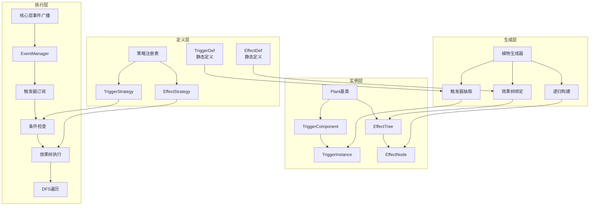
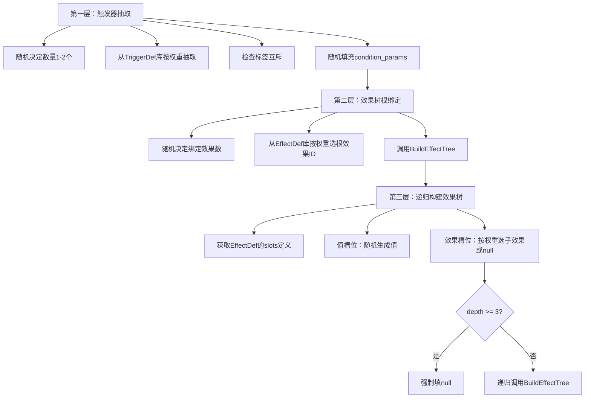
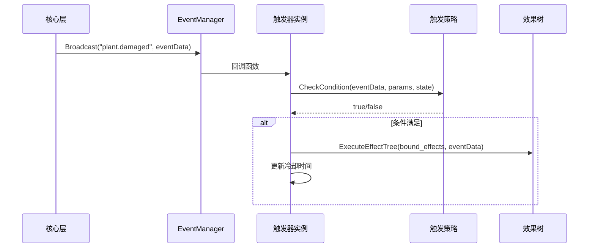
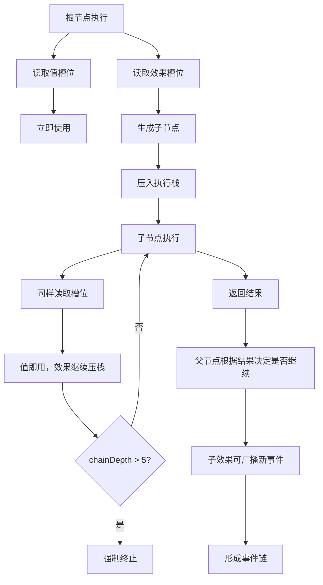
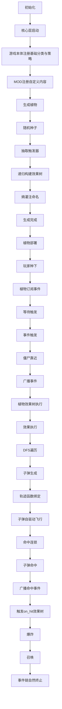

# 错误技系统完整设计思路（整合版）

## 文档概述

本文档整合了根目录下所有设计文档的核心内容，提供一个完整、系统的错误技系统设计方案。

---

## 一、核心设计哲学

### 1.1 三大核心原则

**效果是一等公民**
- 效果不是带参数的函数，而是可递归配置的节点
- 通过"槽位"机制实现无限嵌套组合
- 效果树深度≤3，叶子节点为null

**触发器是事件插座**
- 只回答"何时触发"，不回答"触发后做什么"
- 硬编码事件名绑定生命周期
- 插件化架构实现无限扩展

**数据驱动 + 插件化**
- 所有机制通过JSON配置定义
- 新增机制 = 添加JSON + 注册策略
- 支持热更新与社区MOD

### 1.2 引擎目标

本项目不是原版《植物大战僵尸》的逐像素复刻，而是一个开放式、可组合、可移植的规则引擎：

- 允许用户加载不同的数据包（mod / pack）
- 允许 mod 提供"效果原子"和"实体模板"
- 允许用户通过编辑器手动组合实体
- 允许同一语义阶段内的效果顺序显式定义
- 允许出现强组合、强叠加、强涌现的行为，甚至允许"错误技"式结果
- 不以商业级稳定性为前提，而以实验性、表达力和可扩展性为核心

---

## 二、系统架构总览



### 2.1 四层架构

**1. 定义层（静态配置）**
- `TriggerDef`：触发器蓝图（JSON配置）
- `EffectDef`：效果蓝图（JSON配置）
- 策略注册表：动态注册执行逻辑

**2. 生成层（三层递进）**
- 第一层：触发器抽取
- 第二层：效果树根绑定
- 第三层：递归构建效果树

**3. 实例层（运行时实体）**
- `Plant`基类：位置、生命值等通用属性
- `TriggerComponent`：持有1-2个触发器实例
- `EffectTree`：由`EffectNode`构成的深度≤3的递归树

**4. 执行层（事件驱动）**
- 核心层广播硬编码事件
- 触发器订阅 → 条件检查 → 执行效果树
- DFS遍历执行，连锁深度≤5

---

## 三、核心机制详解

### 3.1 触发器系统

#### 三层结构

**1. 静态定义（TriggerDef）—— 触发器"蓝图"**

```json
{
  "trigger_id": "when_damaged",
  "event_name": "plant.damaged",
  "max_bound_effects": 1,
  "condition_params": [
    {"name": "damage_threshold", "type": "int", "min": 0, "max": 999},
    {"name": "probability", "type": "float", "min": 0.0, "max": 1.0}
  ],
  "tags": []
}
```

**2. 动态实例（TriggerInstance）—— 触发器"实体"**

- 生成时机：植物生成时从定义克隆
- 核心字段：
  - `def_id`：引用哪个定义
  - `bound_effects`：绑定的效果树根节点列表
  - `condition_values`：填充的参数值
  - `last_triggered_time`：上次触发时间（防刷屏）
  - `is_enabled`：是否启用

**3. 触发策略（TriggerStrategy）—— 触发器"大脑"**

- 本质：纯函数 `bool CheckCondition(eventData, params, plantState)`
- 注册：`TriggerStrategyRegistry.Register(trigger_id, strategy)`
- 职责：严格检查条件，无副作用，不依赖全局状态

#### 触发器库构建流程


**第1步：硬编码事件广播（核心层）**

```plaintext
// 植物被攻击时
Broadcast("plant.damaged", {plantId: 123, damage: 25, attackerId: 456, position: (x,y)});

// 植物死亡时
Broadcast("plant.died", {plantId: 123, position: (x,y), killerId: 456});

// 时钟更新时
Broadcast("game.tick", {gameTime: 123.45});
```

**第2步：配置触发器定义库（外部JSON）**

```json
[
  {
    "trigger_id": "periodically",
    "event_name": "game.tick",
    "max_bound_effects": 2,
    "condition_params": [
      {"name": "interval", "type": "float", "min": 0.5, "max": 10.0}
    ]
  },
  {
    "trigger_id": "when_damaged",
    "event_name": "plant.damaged",
    "max_bound_effects": 1,
    "condition_params": [
      {"name": "damage_threshold", "type": "int", "min": 0, "max": 999},
      {"name": "probability", "type": "float", "min": 0.0, "max": 1.0}
    ]
  }
]
```

**第3步：注册触发策略（外部实现）**

```plaintext
TriggerStrategyRegistry.Register("periodically", (eventData, params, state) => {
  return eventData.gameTime % params.interval < 0.1f;
});

TriggerStrategyRegistry.Register("when_damaged", (eventData, params, state) => {
  if(eventData.damage < params.damage_threshold) return false;
  if(Random.value > params.probability) return false;
  return true;
});
```

**第4步：植物生成时实例化**

```plaintext
1. 从触发器库按权重随机选1-2个定义
2. 为每个定义创建实例：
   a. 拷贝def_id和event_name
   b. 按condition_params范围随机填充参数
   c. 绑定1-max_bound_effects个效果树根节点
3. 将实例存入植物的TriggerComponent
4. 实例自动订阅同名事件
```

### 3.2 效果系统

#### 效果的本质：配置 + 策略 + 实例

**1. 静态定义（EffectDef）—— 效果的"蓝图"**

```json
{
  "effect_id": "shoot",
  "slots": [
    {
      "name": "speed",
      "type": "value",
      "value_type": "float",
      "min": 5.0,
      "max": 20.0
    },
    {
      "name": "on_hit",
      "type": "effect",
      "allowed_types": ["damage", "explode", "summon", "null"]
    }
  ]
}
```

**2. 动态实例（EffectNode）—— 效果的"血肉"**

```json
{
  "effect_id": "shoot",
  "params": {"speed": 13.7},
  "children": {
    "on_hit": {
      "effect_id": "explode",
      "params": {"radius": 3},
      "children": {"on_explosion": {"effect_id": "null"}}
    }
  }
}
```

**3. 执行策略（EffectStrategy）—— 效果的"灵魂"**

- 本质：纯函数，输入上下文 → 输出执行结果
- 注册：外部模块将策略绑定到效果ID
- 特点：无状态、无副作用、可热插拔

#### 类型系统：从原子到无限

**原子类型（3个基石）**

- `value`：存储标量或枚举
- `effect`：存储子效果树节点
- `null`：空占位

**一级分类（Category）—— "插座功能标签"**

- 动态注册：`RegisterCategory("trajectory", "value")`
- 常见分类：`trajectory`、`target_selector`、`damage_formula`、`visual_vfx`、`death_vfx`、`sound_fx`

**二级标签（Tag）—— "电器型号"**

- 权重池：每个分类下多个实现
- 随机抽取：生成时按权重选标签
- 动态注册：MOD可注册新标签

### 3.3 三层生成器



**权重调控**

- **Level 1（触发器）**：`periodically:100` > `when_damaged:60` > `on_death:30` > `on_click:15`
- **Level 2（效果）**：`shoot:100` > `damage:80` > `explode:25` > `summon:20`
- **Level 3（槽位填充）**：如`shoot.on_hit`中`null:50` > `damage:30` > `explode:15` > `summon:5`

---

## 四、执行机制

### 4.1 事件驱动订阅-广播模式



### 4.2 效果树执行：DFS遍历



### 4.3 状态与上下文分离

**上下文（Context）—— 只读快照**

```csharp
class Context {
  public Vector3 position;      // 事件位置
  public Entity target;         // 目标实体
  public int chainDepth;        // 连锁深度（只读）
  // ... 其他只读数据
}
```

**状态（State）—— 可写字典**

```csharp
class PlantState {
  public Dictionary<string, object> values;  // 充能、冷却等可写状态
}
```

---

## 五、事件模型

### 5.1 三阶段模型

每一个高层行为都可分为三段：

- **BeforeX**：准备/修改阶段，可修改输入参数
- **OnX**：执行阶段，只读执行
- **AfterX**：结果/连锁阶段，只读结果

例如攻击：

- **BeforeAttack**：修改目标、伤害、是否取消
- **OnAttack**：确认攻击发生
- **AfterAttack**：触发连锁、附加效果

### 5.2 硬编码事件列表

```plaintext
plant.planted / plant.died / plant.damaged
plant.sun_produced / plant.clicked
projectile.hit / zombie.died / game.tick
```

### 5.3 事件上下文结构

```json
{
  "core": {
    "damage": 10,
    "source": "entity_id",
    "target": "entity_id",
    "canceled": false,
    "tags": ["projectile"]
  },
  "runtime": {
    "event_id": "uuid",
    "depth": 1,
    "timestamp": 123456
  },
  "mods": {
    "modA": {
      "stack": 3
    }
  }
}
```

---

## 六、连续行为模型

### 6.1 叠加式动力学

推荐使用"贡献项叠加"的方式，而不是单一轨迹模式切换。

每帧：

1. 收集所有组件输出的速度增量或力
2. 合成
3. 更新velocity
4. 更新position

形式上可写为：

```
v(t+1) = v(t) + ΣΔv_i
position += velocity * dt
```

### 6.2 连续行为的原则

- 组件只能输出贡献项，不能直接破坏全局状态
- 所有贡献项应共享同一时间基准
- 叠加顺序尽量可交换，减少顺序耦合

### 6.3 轨迹实现方式

推荐把"直线、正弦、磁力、追踪"等都视为力或速度贡献，而不是独立轨迹类型。

这使得：

- 轨迹可叠加
- 轨迹可组合
- 轨迹可导出为数据

---

## 七、命名与可视化

### 7.1 熵灌注命名法

```plaintext
输入：效果树遍历串 + 时间戳
输出：§kQ3.9xFα  （11字符乱码）
  - Prefix §/¶/†：稀有效果数量决定
  - Body 7字符：随机62进制
  - Suffix α/Ω/β：触发器类型
```

**特性**：
- 相同输入→相同输出，可复现
- 玩家通过`§`和`α`判断稀有度与触发方式

### 7.2 纯文本图标（Demo）

- **底色**：触发器类型（Periodic=绿, Death=红, Damaged=橙）
- **中心字母**：根效果ID首字母（S=Shoot, E=Explode, U=Summon）
- **四角徽章**：Suffix符号

### 7.3 Tooltip动态解码

```
§kQ3.9xFα
━━━━━━━━━
稀有度: §（含稀有效果）
触发: α（周期性，每3秒）
结构: 发射 → 爆炸 → 召唤
深度: 3层
```

---

## 八、性能与安全防护

### 8.1 硬性边界

**1. 深度上限 = 3**

任何效果树递归深度超过3，自动在效果槽位填`null`。

**2. 事件连锁深度 = 5**

运行时连锁反应超过5层，事件静默丢弃。

**3. ManualTrigger互斥**

若生成时绑定两个手动触发器，第二个被静默丢弃。

### 8.2 性能优化

- **函数缓存**：轨迹、公式函数生成一次，后续纯数学计算
- **零反射**：策略实例启动时注册，运行时字典查找
- **惰性加载**：子效果命中时才生成，不预构建整棵树
- **事件合并**：同帧同类事件合并，减少调用次数

### 8.3 安全防护

- **深度上限**：效果树深度>3自动终止，事件链深度>5静默丢弃
- **参数白名单**：槽位定义限制参数范围，防止恶意值
- **事件白名单**：事件名由核心层广播，外部只能订阅
- **沙盒执行**：策略接口无文件/网络权限，纯计算

---

## 九、扩展性与社区生态

### 9.1 配置文件驱动

- 所有机制（触发器/效果/策略）通过JSON/XML定义
- 支持热更新：运行时重载配置，无需重启游戏

### 9.2 社区分享机制

- 植物存档 = 效果树JSON + 遍历串 + 名称
- 分享码 = Base64(遍历串)
- 导入时反序列化，重新生成名称和图标（确保版本兼容）

### 9.3 MOD开发流程

**新增触发器**：

1. 在核心层PR添加事件广播
2. 配置TriggerDef
3. 注册TriggerStrategy

**新增效果**：

1. 配置EffectDef
2. 注册EffectStrategy
3. 可在其他效果的allowed_types中引用

**新增分类**：

调用`TypeRegistry.RegisterCategory("death_vfx", "value")`动态注册

---

## 十、完整工作流



---

## 十一、下一步游戏设计方向

### 11.1 玩法模式演进

**Roguelike冒险模式**

- 每局游戏植物完全随机生成，玩家从3选1
- 引入"道具池污染"机制
- 局外成长：解锁新机制到库中

**沙盒创造模式**

- 开放完全自定义界面，玩家可手动搭建效果树
- 社区挑战：每周限定机制池
- 图鉴收集：生成过的植物自动存入图鉴

**异步PvP模式**

- 玩家A设计植物 → 分享码 → 玩家B用该植物挑战关卡
- 排行榜：根据通关时间/难度对植物评分

### 11.2 机制深度扩展

**二级触发器体系**

- 引入"触发器前置条件"
- 触发器组合逻辑：`and`/`or`/`xor`

**环境交互机制**

- 地形效果：特定格子触发
- 天气系统：`game.weather_changed`事件

**经济循环闭环**

- 阳光作为可消耗资源触发手动技能
- 负面效果：某些植物产阳光时触发负面效果

### 11.3 视觉与叙事包装

**赛博故障美学**

- UI裂纹、像素抖动、颜色偏移
- 植物生成时显示"数据流"动画

**叙事碎片化**

- 每株乱码名称的植物附带一句"错误日志"
- 收集特定稀有度植物解锁隐藏剧情

### 11.4 平衡性与玩家引导

**动态难度调整**

- 系统根据玩家当前植物组合强度，自动调整僵尸波次
- 若生成植物过弱，后续关卡阳光掉落率提升

**渐进式解锁**

- 初始仅开放基础机制
- 通过完成成就解锁稀有机制

**"保底"机制**

- 完全随机模式下，每10次生成必出至少一个稀有（§）植物

---

## 十二、技术优化方向

### 12.1 代码生成器

根据JSON配置自动生成C#策略骨架，减少手写样板代码。

### 12.2 可视化编辑器

节点式UI拖拽构建效果树，实时预览遍历串与名称。

### 12.3 性能分析器

统计每个机制组合的触发频率与耗时，识别性能热点。

---

## 十三、最终验证清单

### Demo阶段核心循环验证

- [ ] 生成1000次，统计深度分布（目标：90%≤3层）
- [ ] 检查ManualTrigger冲突率（目标：0%）
- [ ] 性能测试：10秒内生成10000株不卡顿
- [ ] 玩家测试：问"§mB9.x2Pα这名字你能接受吗？"

### 生产级稳定性验证

- [ ] 所有触发器策略通过单元测试（覆盖率>80%）
- [ ] 事件链深度超限无崩溃、无日志泄漏
- [ ] MOD热加载/卸载不破坏存档
- [ ] 社区分享码跨版本兼容（向前兼容至少3个版本）

---

## 十四、设计哲学总结

1. **效果是一等公民**：效果可递归嵌套，策略可热插拔，扩展无需继承
2. **触发器是事件插座**：硬编码事件名，插件化业务逻辑
3. **核心与业务解耦**：核心层只广播客观事件，业务逻辑全由外部订阅
4. **类型系统动态化**：分类、标签、策略全部动态注册，核心层保持无知
5. **事件链自然收敛**：深度限制防性能爆炸，玩家感知为"能量耗尽"
6. **快照式上下文**：每帧新快照，策略无状态，状态由实体持有
7. **扩展是声明式**：新增触发器 = JSON + 策略实现，零侵入核心
8. **安全是内置的**：冷却、深度、循环、参数白名单，多重防护

---

**文档完成。此整合版可直接作为技术规范书与原型开发指南使用。**
