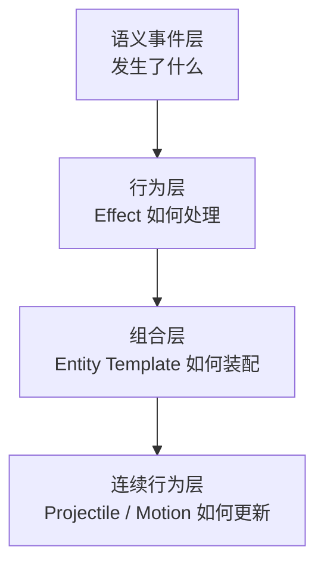
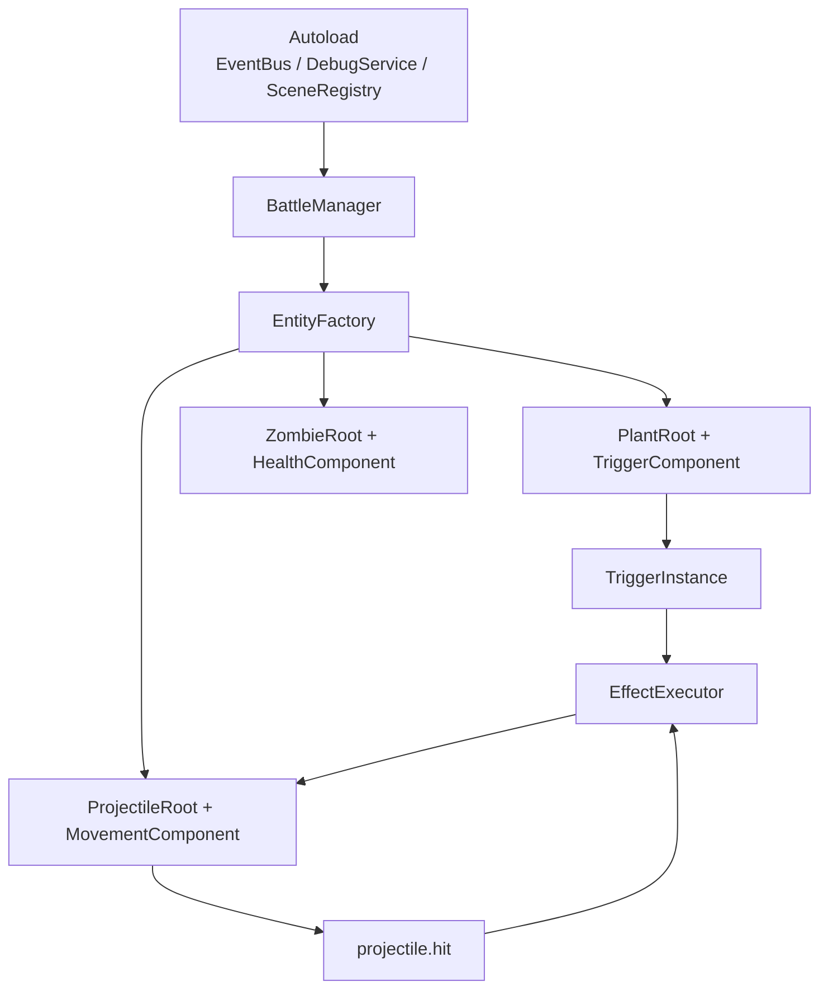

# 项目定位与总体架构

> `Open PVZ` 的主目标是开放式 PVZ-like 规则引擎；“错误技”是建立在其上的核心验证场景。

---

## 先明确三层关系

当前文档最容易失焦的地方，在于把三个不同层次的东西写混了。

应该明确区分：

### 1. 引擎层

这是项目的主目标。

要解决的是：

- 如何定义清晰的语义事件
- 如何把行为拆成可组合的基础能力
- 如何把植物、僵尸、投射物表示为模板与运行时实例
- 如何支持连续行为与命中连锁
- 如何加载外部扩展内容

### 2. 内容层

这是引擎之上的表达层。

包括：

- 植物
- 僵尸
- 投射物
- 关卡模板
- 数据包 / 扩展包

### 3. 验证场景层

“错误技系统”属于这一层。

它不是项目的全部定义，而是当前优先实现的一种高表达度场景，用来验证：

- 引擎是否真的支持强组合
- 规则组合是否能产生非常规行为
- 扩展机制是否足够灵活

---

## 一句话定位

`Open PVZ` 是一个面向 PVZ-like 玩法的开放式规则引擎项目，目标是通过可组合语义、效果管线、实体模板和连续行为系统，支持自定义玩法重组与扩展加载；“错误技”是其当前优先实现的旗舰能力。

---

## 总体架构

从高到低看，当前最合理的总体架构可以拆成四层：

### 1. 语义事件层

负责定义“发生了什么”。

例子：

- `game.tick`
- `entity.spawned`
- `entity.damaged`
- `entity.died`
- `projectile.hit`

要求：

- 事件名有清晰语义
- 事件字段稳定
- 事件链可追踪

### 2. 行为层

负责定义“对这个事件做什么”。

行为层的核心抽象是 `Effect`：

- 可以修改上下文
- 可以造成伤害
- 可以生成投射物
- 可以追加新事件
- 可以触发后续行为

在当前项目里，错误技系统中的“效果树”是行为层的一种重要组织方式。

### 3. 组合层

负责定义某个实体由哪些基础能力组合而成。

核心思想：

- 植物和僵尸不是硬编码行为集合
- 它们是模板 + 组件 + 规则组合的结果

这一层要支撑：

- 原版单位重建
- 自定义单位设计
- 错误技随机拼装
- 后续扩展包加载

### 4. 连续行为层

负责每帧更新持续变化的对象，尤其是：

- 投射物运动
- 速度变化
- 轨迹叠加
- 生命周期更新

这部分不应被塞进离散事件补丁逻辑里，而应作为引擎原生能力存在。

---

## 当前保留的核心抽象

结合原始设计稿和当前实现方向，建议继续保留下面这些核心抽象：

### Event / Context

- 事件定义语义
- `Context` 提供一次事件链内的共享信息
- `runtime.depth`、`event_id`、`timestamp` 用于调试和安全边界

### Effect

- `Effect` 是最小行为单元
- 允许组合、排序、嵌套
- 错误技系统当前通过效果树来表达复杂组合

### Entity Template

- 实体不是写死逻辑
- 实体是模板与能力组合的结果
- 植物、僵尸、投射物都应向这套抽象靠拢

### State

- `Context` 是事件链瞬时信息
- `entity.state` 是实体持久状态
- 扩展私有状态必须隔离

### Continuous Simulation

- 直线、正弦、追踪、偏转等都属于连续行为能力
- 不应被简化成仅靠离散钩子硬补的逻辑

---

## 当前推荐的 Godot 落地方式

当前阶段不应把“最终可能的高阶架构”直接等同于“现在就该这样写代码”。

结合参考实现后，更合理的第一阶段落地方式是：

- 用 Godot 节点和场景承载实体
- 用组件节点承载可拆分行为
- 用 `Autoload` 承载全局服务
- 用 `Resource` 承载第一阶段定义层

这套结构的意义在于：

- 它依然服务“开放规则引擎”的主目标
- 但不会在第一阶段就被 ECS、渲染分层、复杂工具链拖慢

---

## 当前不应主导实现顺序的内容

以下内容并不是永远不做，而是当前不该主导整体文档和实现顺序：

- 完整 ECS 化
- 高级渲染管线
- 社区工坊机制
- 大型编辑器工具链
- 过早的多层子系统抽象

如果这些内容先成为主叙事，就会遮蔽真正的当前主线：

> 先把这套引擎的最小规则闭环做出来，再让错误技成为它的高表达度验证场景。

---

## 当前最重要的结论

当前项目应按下面这组关系理解：

1. 开放式规则引擎是主目标
2. 植物、僵尸、投射物是引擎上的内容表达
3. 错误技是当前优先实现的核心功能场景
4. Godot 原型落地是当前阶段手段，不是目标降级

这四点不明确，文档就会继续失焦。

---

## 相关文档

- [核心设计哲学](01-核心设计哲学.md)
- [系统架构](02-系统架构.md)
- [触发器系统](03-触发器系统.md)
- [效果系统](04-效果系统.md)
- [当前阶段与实现路线](23-当前阶段与实现路线.md)
- [外部项目调研：PVZ-Godot-Dream](24-外部项目调研-PVZ-Godot-Dream.md)
