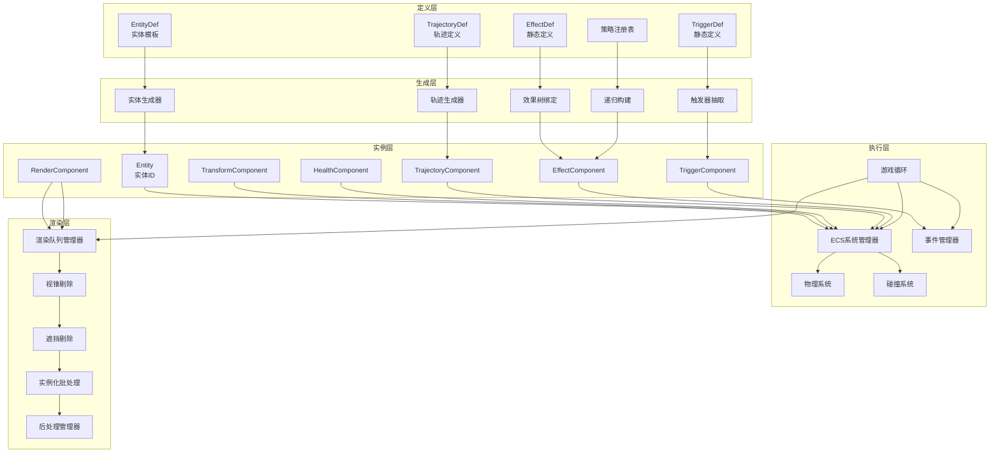
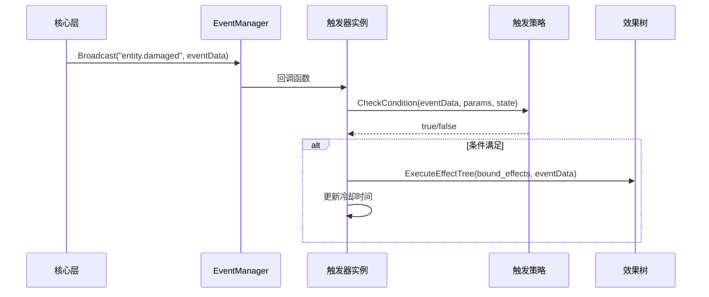
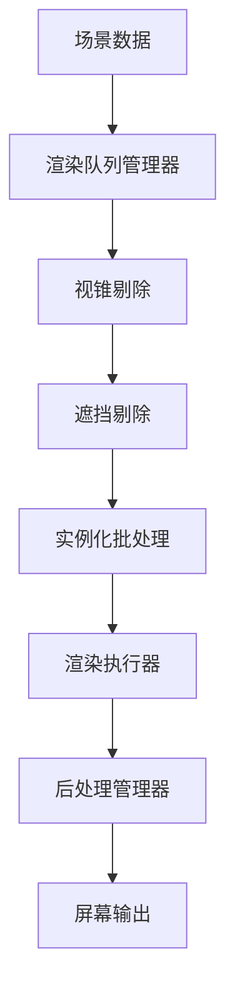
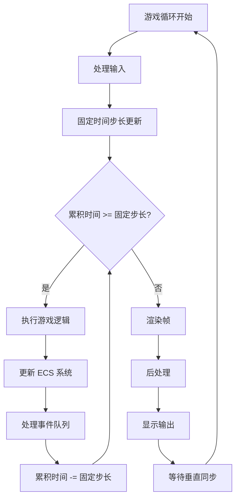
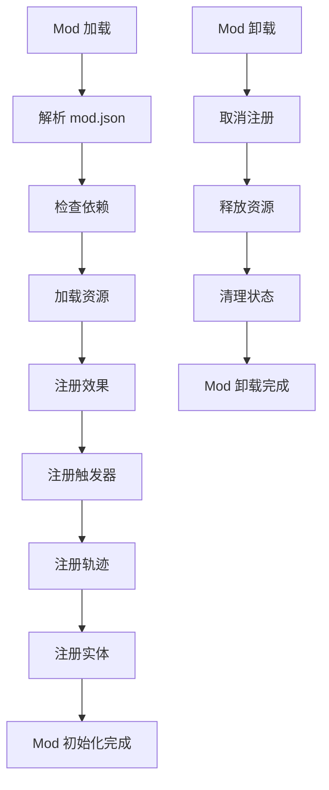
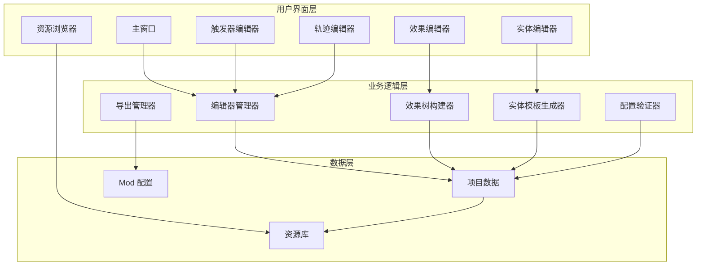

# 核心架构总览

> 开放式 PVZ-like 引擎完整架构总览

---

## 概述

本引擎是一个开放式、可组合、可移植的规则引擎，核心目标是允许用户加载不同的数据包（mod/pack），提供"效果原子"和"实体模板"，支持强组合、强叠加、强涌现的行为。

---

## 设计目标

| 目标 | 说明 |
|------|------|
| 可组合性 | 允许用户通过编辑器手动组合实体 |
| 可移植性 | 允许同一语义阶段内的效果顺序显式定义 |
| 可扩展性 | 支持强组合、强叠加、强涌现的行为 |
| 实验性 | 以实验性、表达力和可扩展性为核心 |

---

## 核心设计原则

### 1. 语义固定，组合开放

系统的宏观语义阶段固定：
- BeforeX：准备/修改阶段
- OnX：执行阶段
- AfterX：结果/连锁阶段

但同一阶段内的 effect 顺序是显式数据，可配置、可迁移、可导出。

### 2. Effect 是原子能力，实体是组合结果

- effect：最小行为单元
- entity：多个 effect 组合后的结果
- mod：提供 effect 和 entity 模板

### 3. 状态分层

- context：一次事件链中使用的瞬时状态
- entity.state：实体持久状态
- mod 私有数据：通过命名空间隔离管理

### 4. 连续行为与离散事件分离

- 离散事件：攻击、命中、死亡、生成
- 连续行为：运动、转向、加速度、寿命衰减

### 5. 自由组合优先于强约束

系统允许依赖、允许顺序、允许混乱，前提是这些都被显式建模为数据。

---

## 整体架构



---

## 四层架构详解

### 1. 定义层（静态配置）

定义层是整个系统的静态蓝图，所有机制的定义都存储在这里。

| 组件 | 说明 | 文件类型 |
|------|------|----------|
| `TriggerDef` | 触发器蓝图，定义触发器的基本属性和参数 | JSON |
| `EffectDef` | 效果蓝图，定义效果的槽位结构 | JSON |
| `EntityDef` | 实体模板，定义实体的组件和效果 | JSON |
| `TrajectoryDef` | 轨迹定义，定义连续行为的参数 | JSON |
| 策略注册表 | 动态注册执行逻辑的容器 | 运行时数据 |

**相关文档**
- [触发器系统](03-触发器系统.md) - TriggerDef 详细说明
- [效果系统](04-效果系统.md) - EffectDef 详细说明
- [Mod 开发指南](21-Mod开发指南.md) - Mod 结构详解

---

### 2. 生成层（三层递进）

生成层负责从静态定义创建运行时实例，分为三个递进步骤。

#### 第一层：触发器抽取

- 随机决定触发器数量
- 从 TriggerDef 库按权重抽取
- 检查标签互斥
- 随机填充 condition_params

#### 第二层：效果树根绑定

- 随机决定绑定效果数
- 从 EffectDef 库按权重选根效果ID
- 调用 BuildEffectTree

#### 第三层：递归构建效果树

- 获取 EffectDef 的 slots 定义
- 值槽位：随机生成值
- 效果槽位：按权重选子效果或 null
- 深度 >= 3 时强制填 null

**相关文档**
- [三层生成器](05-三层生成器.md) - 生成流程详解

---

### 3. 实例层（运行时实体）

实例层是运行时的实际对象，每个实体都持有这些组件。

| 组件 | 说明 | 关键字段 |
|------|------|----------|
| `Entity` | 实体标识符 | `id`, `generation`, `version` |
| `TransformComponent` | 位置、旋转、缩放 | `position`, `rotation`, `scale` |
| `HealthComponent` | 生命值 | `currentHealth`, `maxHealth` |
| `TeamComponent` | 队伍归属 | `teamId` |
| `RenderComponent` | 渲染数据 | `mesh`, `material`, `layer` |
| `TrajectoryComponent` | 轨迹数据 | `velocity`, `components` |
| `EffectComponent` | 效果数据 | `effectTree` |
| `TriggerComponent` | 触发器数据 | `triggers` |

**相关文档**
- [ECS 架构设计](18-ECS架构设计.md) - ECS 详细说明

---

### 4. 执行层（事件驱动）

执行层负责运行时的事件处理和效果执行。

**执行流程**



**关键特性**

- 核心层广播硬编码事件
- 触发器订阅 → 条件检查 → 执行效果树
- DFS 遍历执行
- 事件链自然收敛

**相关文档**
- [执行机制](06-执行机制.md) - 执行流程详解
- [事件模型](07-事件模型.md) - 事件系统设计

---

### 5. 渲染层（视觉呈现）

渲染层负责将游戏世界的视觉表现呈现给用户，采用分层渲染架构。

**渲染流程**



**核心模块**

| 模块 | 说明 |
|------|------|
| 渲染队列管理器 | 管理所有渲染对象的队列 |
| 图层管理器 | 定义渲染图层和可见性 |
| 视锥剔除器 | 剔除视锥外的物体 |
| 遮挡剔除器 | 剔除被遮挡的物体 |
| 实例化批处理器 | 合并相同材质的物体 |
| 后处理管理器 | 管理后处理效果 |

**相关文档**
- [渲染管线](17-渲染管线.md) - 渲染系统详解

---

## ECS 架构集成

### ECS 与现有架构的关系

ECS（Entity-Component-System）架构与现有的四层架构深度集成，提供高性能的数据处理能力。

| 传统架构 | ECS 架构 | 对应关系 |
|---------|----------|----------|
| Plant 基类 | Entity | 实体标识 |
| 属性字段 | Component | 数据存储 |
| 方法逻辑 | System | 行为处理 |

### 核心系统类型

| 系统 | 说明 | 更新频率 |
|------|------|----------|
| `MovementSystem` | 运动更新 | 固定帧率 |
| `HealthSystem` | 生命值管理 | 每帧 |
| `RenderSystem` | 渲染处理 | 每帧 |
| `CollisionSystem` | 碰撞检测 | 固定帧率 |
| `EffectSystem` | 效果执行 | 事件驱动 |

**相关文档**
- [ECS 架构设计](18-ECS架构设计.md) - ECS 详细说明

---

## 游戏循环机制

### 游戏循环架构



### 更新阶段划分

| 阶段 | 说明 | 系统 |
|------|------|------|
| 输入阶段 | 处理用户输入 | InputSystem |
| 固定更新阶段 | 物理和连续行为 | PhysicsSystem, ContinuousBehaviorSystem |
| 可变更新阶段 | 动画和效果 | AnimationSystem, EffectSystem |
| 延迟更新阶段 | 摄像机和清理 | CameraSystem, CleanupSystem |
| 渲染阶段 | 渲染场景 | RenderSystem |

**相关文档**
- [游戏循环机制](19-游戏循环机制.md) - 游戏循环详解

---

## 子系统通信

### 通信模式

| 模式 | 说明 | 使用场景 |
|------|------|----------|
| 事件驱动 | 发布订阅模式 | 异步解耦 |
| 消息传递 | 请求响应模式 | 跨线程通信 |
| 直接调用 | 系统依赖注入 | 同步执行 |

### 通信协议规范

| 类型 | 规范 | 示例 |
|------|------|------|
| 事件名 | `领域.动作` | `entity.damaged` |
| 消息类型 | `大驼峰` | `SpawnEntity` |
| 命令名 | `小写_下划线` | `deal_damage` |

**相关文档**
- [子系统通信协议](20-子系统通信协议.md) - 通信机制详解

---

## 事件模型

### 三阶段事件系统

每个高层行为都可分为三段：

| 阶段 | 前缀 | 说明 | 可修改性 |
|------|------|------|----------|
| BeforeX | Before | 准备/修改阶段，可修改输入参数 | 可写 |
| OnX | On | 执行阶段，只读执行 | 只读 |
| AfterX | After | 结果/连锁阶段，只读结果 | 只读 |

### 标准事件列表

#### 实体事件

| 事件名 | 阶段 | 说明 |
|--------|------|------|
| `entity.spawned` | On | 实体生成 |
| `entity.died` | On | 实体死亡 |
| `entity.damaged` | On | 实体受伤 |
| `entity.healed` | On | 实体治疗 |

#### 投射物事件

| 事件名 | 阶段 | 说明 |
|--------|------|------|
| `projectile.spawned` | On | 投射物生成 |
| `projectile.hit` | On | 投射物命中 |
| `projectile.missed` | On | 投射物未命中 |

**相关文档**
- [事件模型](07-事件模型.md) - 事件系统详解

---

## 连续行为模型

### 叠加式动力学

推荐使用"贡献项叠加"的方式，而不是单一轨迹模式切换。

每帧流程：
1. 收集所有组件输出的速度增量或力
2. 合成
3. 更新 velocity
4. 更新 position

数学表达：
```
v(t+1) = v(t) + ΣΔv_i
position += velocity * dt
```

### 轨迹组件类型

| 类型 | 说明 | 参数 |
|------|------|------|
| 直线轨迹 | 线性运动 | speed |
| 正弦轨迹 | 正弦波动 | amplitude, frequency |
| 磁力轨迹 | 磁力偏转 | strength, range |
| 追踪轨迹 | 目标追踪 | turnRate, target |

**相关文档**
- [连续行为模型](08-连续行为模型.md) - 连续行为详解

---

## Mod 系统

### Mod 目录结构

```
mod_name/
├── mod.json              # Mod 配置文件
├── effects/              # 效果定义
├── entities/            # 实体模板
├── triggers/             # 触发器定义
├── trajectories/         # 轨迹组件
├── resources/           # 资源文件
└── scripts/              # 脚本文件（可选）
```

### Mod 生命周期



**相关文档**
- [Mod 开发指南](21-Mod开发指南.md) - Mod 开发完整指南

---

## 编辑器设计

### 编辑器架构



### 编辑器模式

| 模式 | 特点 | 适用场景 |
|------|------|----------|
| 普通模式 | 提供默认组合，简化界面 | 新手用户、快速原型 |
| 高级模式 | 允许显式顺序，显示所有参数 | 高级用户、精确控制 |

**相关文档**
- [编辑器设计](22-编辑器设计.md) - 编辑器工具设计

---

## 性能优化策略

### 渲染优化

| 策略 | 说明 | 预期提升 |
|------|------|----------|
| 视锥剔除 | 剔除视锥外物体 | 30-50% |
| 遮挡剔除 | 剔除被遮挡物体 | 20-40% |
| 实例化渲染 | 合并相同材质物体 | 50-70% |
| LOD 系统 | 距离自适应细节 | 30-50% |

### ECS 优化

| 策略 | 说明 | 预期提升 |
|------|------|----------|
| 内存布局优化 | 连续内存存储 | 20-30% |
| Archetype 查询 | 按组件类型分组 | 30-50% |
| 并行系统执行 | 多线程处理 | 40-60% |

### 事件优化

| 策略 | 说明 | 预期提升 |
|------|------|----------|
| 事件合并 | 同类事件合并处理 | 20-30% |
| 优先级队列 | 高优先级事件优先处理 | 10-20% |
| 事件缓存 | 减少重复事件 | 15-25% |

**相关文档**
- [性能与安全防护](10-性能与安全防护.md) - 性能优化详解

---

## 调试与可观测性

### 调试工具

| 工具 | 说明 |
|------|------|
| 事件追踪器 | 追踪事件流转 |
| Context 查看器 | 查看 Context 数据 |
| 实体检查器 | 检查实体组件 |
| 性能分析器 | 分析系统性能 |

### 调试目标

- 能看到某个结果是由哪些 effect 组合出来的
- 能看到顺序如何影响结果
- 能回放事件链

**相关文档**
- [性能与安全防护](10-性能与安全防护.md) - 调试工具详解

---

## 风险点与防护

### 主要风险

| 风险 | 说明 | 防护措施 |
|------|------|----------|
| Context 污染 | core、mods、runtime 混在一起 | 命名空间隔离 |
| 顺序耦合过深 | 顺序作为数据产生不同语义组合 | 显式顺序定义 |
| 连锁爆炸 | 事件递归导致性能问题 | 深度限制 |
| Effect 粒度失衡 | 太粗无法组合，太细难以使用 | 粒度平衡 |

**相关文档**
- [性能与安全防护](10-性能与安全防护.md) - 安全防护详解

---

## 相关文档导航

### 核心架构
- [核心设计哲学](01-核心设计哲学.md) - 设计原则
- [系统架构](02-系统架构.md) - 五层架构总览

### 核心机制
- [触发器系统](03-触发器系统.md) - 触发器详细设计
- [效果系统](04-效果系统.md) - 效果详细设计
- [三层生成器](05-三层生成器.md) - 生成流程
- [执行机制](06-执行机制.md) - 执行流程
- [事件模型](07-事件模型.md) - 事件系统设计

### 扩展系统
- [ECS 架构设计](18-ECS架构设计.md) - ECS 详细说明
- [渲染管线](17-渲染管线.md) - 渲染系统详解
- [游戏循环机制](19-游戏循环机制.md) - 游戏循环详解
- [子系统通信协议](20-子系统通信协议.md) - 通信机制详解

### 开发工具
- [Mod 开发指南](21-Mod开发指南.md) - Mod 开发完整指南
- [编辑器设计](22-编辑器设计.md) - 编辑器工具设计
