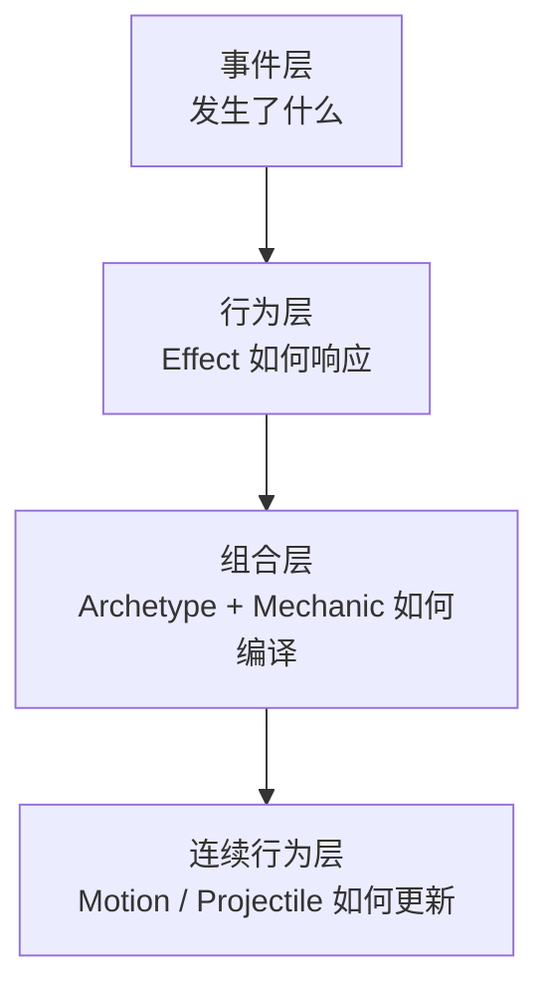
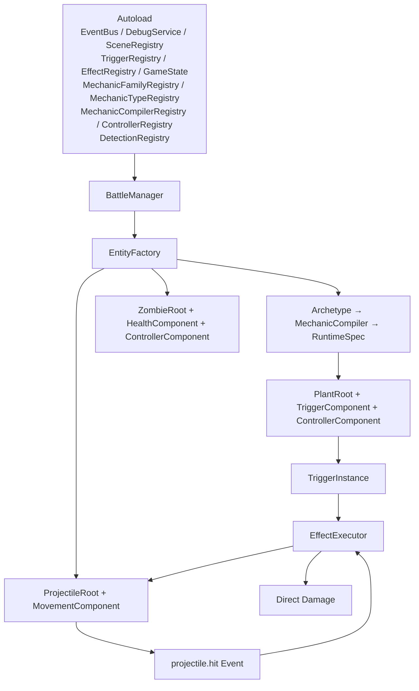

# 架构总览

> 本文是 `Open PVZ` 架构的**单页入口**，回答三件事：项目定位是什么、目标架构有哪几层、当前在 Godot 里怎么落地。关于"当前进展状态"见 [系统版图与规划分层](34-Open%20PVZ%20系统版图与规划分层.md)，关于"下一步主线"见 [当前阶段与实现路线](23-当前阶段与实现路线.md)。

---

## 一、项目定位

`Open PVZ` 是**开放式 PVZ-like 规则引擎**，不是 Plants vs Zombies 的直接克隆。理解项目时必须区分三层：

### 1. 引擎层（主目标）

负责：

- 清晰的语义事件
- 可组合的基础行为能力
- Archetype + Mechanic 编译链
- 连续行为与命中连锁
- 外部扩展内容加载

### 2. 内容层

引擎之上的表达：

- 植物、僵尸、投射物（由 Archetype 定义）
- 卡片、波次、战场、关卡
- 数据包 / 扩展包

### 3. 验证场景层

"错误技系统"在这里。它不是项目定义，而是高表达度的组合验证场景，用来回答：**引擎是否真的支持强组合、扩展机制是否足够灵活**。

---

## 二、目标架构

从规则引擎角度，项目的目标架构是四层：

| 层 | 负责 | 当前关键对象 |
|---|---|---|
| 事件层 | 定义"发生了什么" | `EventBus`、事件名如 `game.tick` / `entity.damaged` / `entity.died` / `projectile.hit` |
| 行为层 | 定义"该做什么" | `Effect` / `EffectExecutor` / `RuleContext` |
| 组合层 | 定义"如何编译和组装" | `CombatArchetype` / `CombatMechanic` / `MechanicCompiler` / `RuntimeSpec` |
| 连续行为层 | 定义"如何持续更新" | 3D 逻辑 + 2D 投影的投射体运动系统，`ControllerComponent`（bite / sweep），命中后重新进入事件链 |

扩展加载是**正交于这四层**的平台能力，见 [扩展系统总体规划](../04-roadmap-reference/38-扩展系统总体规划.md)。

---

## 三、Godot 落地架构

当前阶段在 Godot 里的实际组织方式：

落地约定：

- **全局服务放 `Autoload`**，禁止散落在场景脚本里
- **实体 = 根节点 + 行为组件**，根节点承载强耦合状态，组件承载可拆分行为
- **定义层一律 `Resource` (.tres)**，不引入 JSON 或外部格式
- **编译链是内容到运行时的唯一正式通道**，`Archetype + Mechanic[]` 通过 `MechanicCompiler` 编译为 `RuntimeSpec`，由 `EntityFactory` 消费
- **投射体是连续行为的入口之一**，Controller 是另一个入口（bite / sweep 等），通过 `_physics_process` 持续模拟
- **所有随机行为走确定性随机协议**，`battle_seed → entity_seed → mechanic_seed` 派生

---

## 四、关键对象清单

### 定义层 (`scripts/core/defs/`)

- `CombatArchetype`、`PlantArchetype`、`ZombieArchetype`、`ProjectileArchetype`
- `CombatMechanic`（10 个冻结 family）
- `TriggerDef`、`EffectDef`、`EffectSlotDef`
- `EntityTemplate`、`ProjectileTemplate`（后端兼容层）
- `TriggerBinding`（后端兼容层）
- `HeightBand`、`MovementContributionDef`

### 编译与运行时 (`scripts/core/runtime/`)

- `MechanicCompiler`（37 个内置 type 的编译引擎）
- `RuntimeSpec`、`NormalizedMechanicSet`
- `CombatContentResolver`
- `RuleContext`、`EffectExecutor`、`EffectNode`、`EffectResult`
- `TriggerInstance`、`EntityState`、`EventData`
- `ShuffleBag`（确定性随机工具）
- `ProtocolValidator`、`ExtensionPackCatalog`

### 组件 (`scripts/components/`)

- `TriggerComponent`、`ControllerComponent`、`StateComponent`
- `HealthComponent`、`HitboxComponent`、`MovementComponent`
- `DebugViewComponent`

### 实体层 (`scripts/entities/`)

- `BaseEntity` 基类
- `PlantRoot`、`ZombieRoot`、`ProjectileRoot`

### 全局服务 (`autoload/`)

- `EventBus`、`DebugService`、`SceneRegistry`、`GameState`
- `MechanicFamilyRegistry`、`MechanicTypeRegistry`、`MechanicCompilerRegistry`
- `TriggerRegistry`、`EffectRegistry`、`DetectionRegistry`、`ControllerRegistry`

---

## 五、引擎与内容的边界

### 引擎层不绑定具体单位

禁止出现 `PeaShooterAttack` / `WallNutLogic` / `ConeHeadZombieAI` 这类命名。任何具体植物/僵尸都应该是：**Archetype + Mechanic[] 的编译结果**。

### 内容层不反向绑架引擎抽象

具体 archetype 可以依赖引擎已发布的协议，但**不允许让引擎为单个内容增加隐式特判**。新内容如果需要新行为维度，先回 Mechanic family 层补定义（需 ADR 审批）。

### 错误技系统的位置

错误技是**验证场景层**的旗舰能力，用来逼出引擎组合能力的边界。它不是内容层、不是引擎层，也不应被当成项目本体。

---

## 六、当前不该主导架构的议题

以下内容可以保留在远期规划里，但**当前不应该作为独立主架构存在**：

- 完整 ECS 化
- 高级渲染管线 / 大规模表现层包装
- 完整编辑器产品化
- 社区工坊与工坊平台
- 过早的多层子系统抽象

理由很直接：它们会稀释当前最重要的运行时问题。

---

## 七、核心结论

当前架构应按这组关系理解：

1. **开放式规则引擎**是主目标
2. **Archetype + Mechanic[] 编译链**是内容到运行时的正式通道
3. **植物 / 僵尸 / 投射物**是引擎上的内容表达
4. **错误技**是当前优先实现的高表达度验证场景
5. **Godot 原型落地**是当前阶段手段，不是目标降级

---

## 八、相关文档

- [核心设计哲学](01-核心设计哲学.md)
- [编译链与 Mechanic 系统](../02-runtime-protocol/11-编译链与Mechanic系统.md)
- [系统版图与规划分层](34-Open%20PVZ%20系统版图与规划分层.md)
- [当前阶段与实现路线](23-当前阶段与实现路线.md)
- [触发器系统](../02-runtime-protocol/03-触发器系统.md)
- [效果系统](../02-runtime-protocol/04-效果系统.md)
- [执行机制](../02-runtime-protocol/06-执行机制.md)
- [决策记录](../decisions/README.md)
