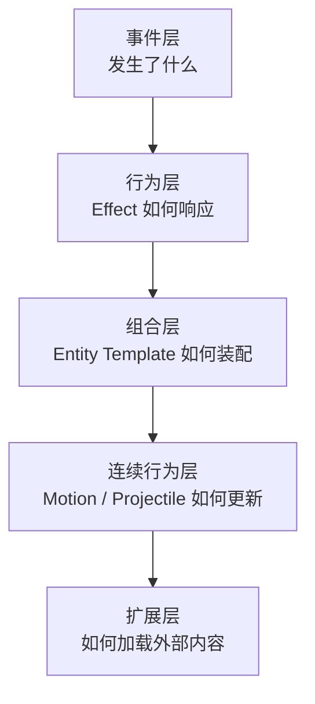
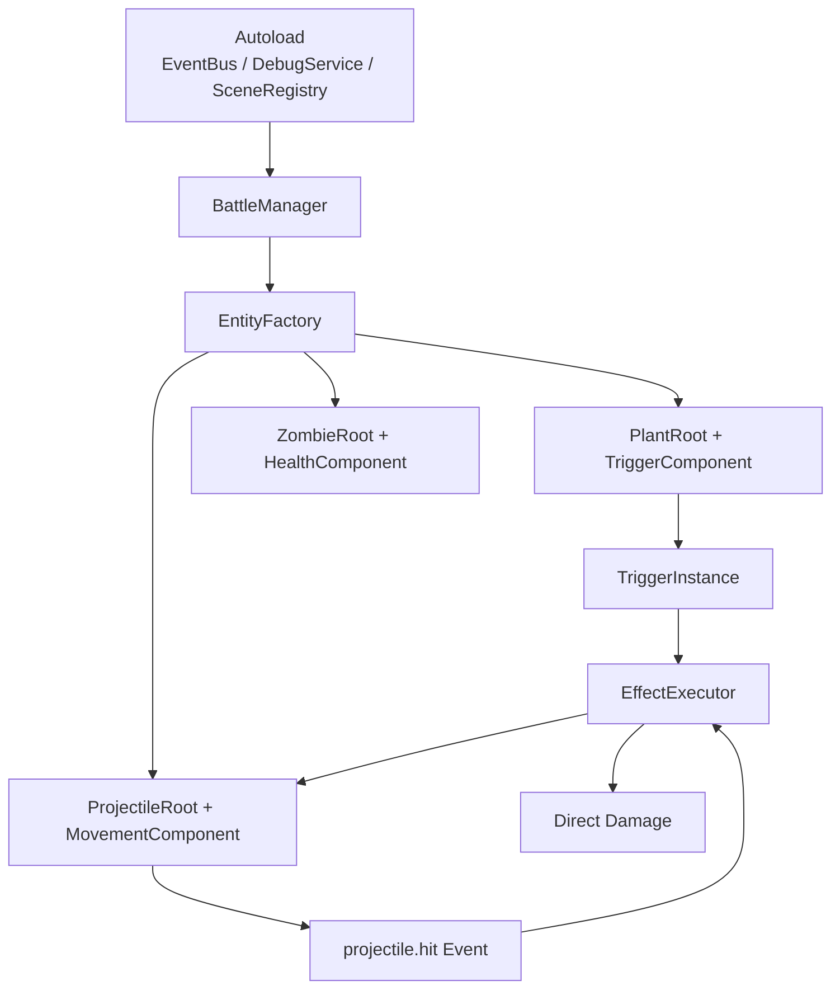

# 系统架构

> 当前架构需要同时回答两件事：最终要支撑怎样的开放规则引擎，以及第一阶段在 Godot 里具体怎么落地。

---

## 先区分两种架构

当前项目里存在两种“架构”视角：

### 1. 目标架构

这是项目最终要支撑的引擎能力结构。

它强调：

- 语义事件
- 行为组合
- 实体模板
- 连续行为
- 扩展加载

### 2. 落地架构

这是当前阶段在 Godot 里实际写代码的组织方式。

它强调：

- `Autoload`
- 实体根节点
- 行为组件
- `Resource`
- 最小运行时闭环

如果不把这两者分开，文档就会出现一种常见误差：

- 用未来理想架构指导第一阶段具体写法，结果把实现复杂度提前拉满

---

## 目标架构

从规则引擎角度，当前项目的目标架构可以收束为五层：

### 1. 事件层

负责定义清晰语义。

例子：

- `game.tick`
- `entity.spawned`
- `entity.damaged`
- `entity.died`
- `projectile.hit`

### 2. 行为层

负责定义基础行为能力。

当前核心抽象仍然是：

- `Effect`
- `EffectExecutor`
- `Context`

### 3. 组合层

负责把基础能力组合成实际单位。

这层最终要支撑：

- 植物模板
- 僵尸模板
- 投射物模板
- 错误技随机拼装

### 4. 连续行为层

负责每帧更新持续变化对象。

重点包括：

- 投射物轨迹
- 速度叠加
- 偏转 / 追踪
- 生命周期

### 5. 扩展层

负责加载外部定义和资源。

这层最终要支撑：

- 效果扩展
- 实体模板扩展
- 轨迹 / 连续行为扩展
- 数据包 / 扩展包

---

## 当前推荐落地架构（Phase 1）

第一阶段不直接按“完整引擎”形态写代码，而是采用更适合 Godot 的原型落地方式：

这套落地架构有几个明确含义：

- 全局服务放进 `Autoload`
- 实体优先使用“根节点 + 行为组件”
- 运行时核心保持在 `Trigger / Effect / Context`
- 投射物系统单独作为连续行为入口
- 调试能力和事件追踪从一开始就进入骨架

---

## 当前保留的关键对象

### 定义层对象

第一阶段优先使用 Godot `Resource`，而不是先强制外部 JSON。

建议保留：

- `TriggerDef`
- `EffectDef`
- `EntityTemplate`
- `MovementContributionDef`

### 运行时对象

建议保留：

- `EventBus`
- `Context`
- `EntityState`
- `TriggerInstance`
- `EffectNode`
- `EffectExecutor`

### 实体层对象

建议保留：

- `PlantRoot`
- `ZombieRoot`
- `ProjectileRoot`

这些对象的职责应该明确：

- 根节点承载强耦合状态
- 组件节点承载可拆分行为
- `Autoload` 承载全局服务

---

## 引擎层与内容层的边界

当前必须明确一个边界：

### 引擎层不该绑定具体单位

不应该把引擎核心抽象写成：

- `PeaShooterAttack`
- `WallNutLogic`
- `ConeHeadZombieAI`

这些属于内容实现，不属于引擎定义。

### 内容层负责具体单位表达

具体植物、僵尸、投射物可以建立在引擎层之上，但不应反过来绑架引擎抽象。

错误技系统也是一样：

- 它是内容层和验证场景层的核心功能
- 但不应替代引擎层本身

---

## 当前不该主导架构的内容

这些内容可以保留在远期规划里，但不应再作为当前独立主架构存在：

- 完整 ECS 化
- 渲染管线分层
- 大规模子系统通信规范
- 完整编辑器架构
- 社区生态平台

原因很直接：

- 它们会稀释当前最重要的运行时问题
- 也会让文档继续偏离“开放规则引擎 + 错误技验证”的主线

---

## 当前最重要的架构结论

当前系统架构应按下面这句话理解：

> 先用 Godot 原生方式实现一个围绕 `Event / Effect / Entity Template / Continuous Simulation` 的最小可用规则运行时，再让错误技系统在其上验证组合、扩展和涌现能力。

这就是当前架构的正确重心。

---

## 相关文档

- [项目定位与总体架构](00-核心架构总览.md)
- [核心设计哲学](01-核心设计哲学.md)
- [触发器系统](../02-runtime-protocol/03-触发器系统.md)
- [效果系统](../02-runtime-protocol/04-效果系统.md)
- [执行机制](../02-runtime-protocol/06-执行机制.md)
- [当前阶段与实现路线](23-当前阶段与实现路线.md)

