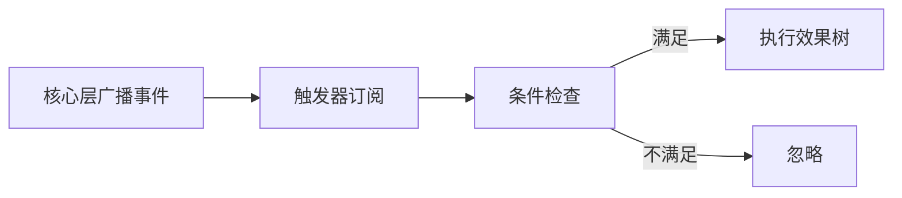

# 核心设计哲学

> 错误技系统的三大核心原则与引擎目标

---

## 三大核心原则

### 1. 效果是一等公民

**核心理念**

效果不是带参数的函数，而是可递归配置的节点。通过"槽位"机制实现无限嵌套组合，叶子节点为`null`。

**设计要点**

- 效果可以像数据一样被传递、存储、组合
- 效果树支持任意深度的嵌套（实际限制为3层）
- 每个效果节点通过槽位连接子效果
- `null`作为终止节点，确保树结构完整

**代码示例**

```json
{
  "effect_id": "shoot",
  "params": {"speed": 13.7},
  "children": {
    "on_hit": {
      "effect_id": "explode",
      "params": {"radius": 3},
      "children": {"on_explosion": {"effect_id": "null"}}
    }
  }
}
```

**相关文档**
- [效果系统](04-效果系统.md) - 效果的详细定义与实现
- [三层生成器](05-三层生成器.md) - 效果树的构建流程

---

### 2. 触发器是事件插座

**核心理念**

触发器只回答"何时触发"，不回答"触发后做什么"。硬编码事件名绑定生命周期，插件化架构实现无限扩展。

**设计要点**

- 触发器与效果解耦：触发器只负责判断条件
- 事件名由核心层硬编码，确保稳定性
- 业务逻辑通过插件注册，可热插拔
- 一个触发器可绑定多个效果树

**工作流程**



**相关文档**
- [触发器系统](03-触发器系统.md) - 触发器的完整实现
- [事件模型](07-事件模型.md) - 事件系统的详细设计

---

### 3. 数据驱动 + 插件化

**核心理念**

所有机制通过JSON配置定义。新增机制 = 添加JSON + 注册策略。支持热更新与社区MOD。

**设计要点**

- 触发器、效果、分类全部通过JSON定义
- 策略通过注册表动态绑定
- 支持运行时热更新配置
- MOD开发者无需修改核心代码

**配置示例**

```json
// 触发器定义
{
  "trigger_id": "when_damaged",
  "event_name": "plant.damaged",
  "max_bound_effects": 1,
  "condition_params": [
    {"name": "damage_threshold", "type": "int", "min": 0, "max": 999},
    {"name": "probability", "type": "float", "min": 0.0, "max": 1.0}
  ]
}
```

**相关文档**
- [扩展性与社区生态](11-扩展性与社区生态.md) - MOD开发流程

---

## 引擎目标

本项目不是原版《植物大战僵尸》的逐像素复刻，而是一个开放式、可组合、可移植的规则引擎。

### 核心特性

| 特性 | 说明 |
|------|------|
| **数据包加载** | 允许用户加载不同的数据包（mod / pack） |
| **效果原子** | 允许 mod 提供"效果原子"和"实体模板" |
| **手动组合** | 允许用户通过编辑器手动组合实体 |
| **顺序定义** | 允许同一语义阶段内的效果顺序显式定义 |
| **强组合** | 允许出现强组合、强叠加、强涌现的行为 |
| **错误技** | 允许"错误技"式结果，鼓励实验性玩法 |

### 设计理念

- **不以商业级稳定性为前提**：优先考虑实验性、表达力和可扩展性
- **鼓励涌现玩法**：通过组合产生意想不到的效果
- **社区共创**：开放MOD接口，允许社区贡献内容

---

## 设计原则总结

1. **效果是一等公民**：效果可递归嵌套，策略可热插拔，扩展无需继承
2. **触发器是事件插座**：硬编码事件名，插件化业务逻辑
3. **核心与业务解耦**：核心层只广播客观事件，业务逻辑全由外部订阅
4. **类型系统动态化**：分类、标签、策略全部动态注册，核心层保持无知
5. **事件链自然收敛**：深度限制防性能爆炸，玩家感知为"能量耗尽"
6. **快照式上下文**：每帧新快照，策略无状态，状态由实体持有
7. **扩展是声明式**：新增触发器 = JSON + 策略实现，零侵入核心
8. **安全是内置的**：冷却、深度、循环、参数白名单，多重防护

---

## 相关链接

- [系统架构](02-系统架构.md) - 四层架构设计
- [完整工作流](12-完整工作流.md) - 从初始化到执行的全流程
- [设计哲学总结](16-设计哲学总结.md) - 完整设计原则汇总
