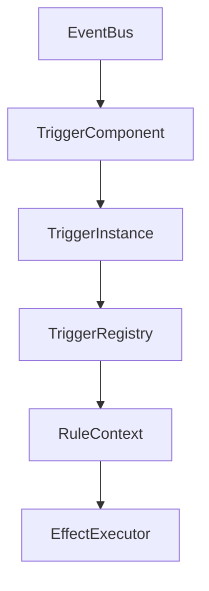

# 触发器系统

> 这篇文档说明当前 Godot 主干里的触发器系统如何工作。它关注的是运行时协议和执行边界，不再把历史 JSON 草稿或随机生成流程当成当前事实。

---

## 文档定位

这篇文档主要回答 4 个问题：

- 触发器在当前项目里到底承担什么职责
- 触发器的静态定义和运行时实例分别是什么
- 触发器如何接到 `EventBus -> RuleContext -> EffectExecutor` 这条主链上
- 当前已经稳定的触发器有哪些，哪些还只是未来方向

这篇文档不负责：

- 错误技随机抽取流程
- 外部数据包格式
- 某个具体植物或僵尸的内容设计

---

## 当前状态

### 已决定

- 触发器系统采用 `Def / Instance / Component / Registry` 四层结构。
- 静态定义优先使用 Godot `Resource`，而不是当前主干直接依赖外部 JSON。
- 当前语义事件以 `game.tick`、`entity.damaged`、`entity.died` 为主，不再以 `plant.*` 事件为主叙事。
- 触发器只负责“是否触发”，真正的行为执行交给 `EffectExecutor`。

### 当前建议

- 后续可继续补更多 `TriggerDef` 字段校验和编辑器展示。
- 内容层可以随机或半随机装配触发器，但那属于内容装配层，不属于触发器主干本身。

### 未来方向

- 扩展当前触发器白名单，而不是回退到隐式触发器
- 更强的参数校验
- 模板层和外部扩展层的触发器注册流程

---

## 系统角色

在当前项目里，触发器系统的职责是：

1. 监听语义事件
2. 根据事件数据和实体状态判断是否命中条件
3. 如果命中，则把执行权交给效果树

它的边界很明确：

- 触发器不负责直接造成伤害
- 触发器不负责直接生成实体
- 触发器不负责管理整场战斗

换句话说，触发器是“规则入口”，不是“业务终点”。

---

## 当前结构

### 1. TriggerDef

`TriggerDef` 是静态定义，当前落在：

- [`scripts/core/defs/trigger_def.gd`](../../scripts/core/defs/trigger_def.gd)
- [`autoload/TriggerRegistry.gd`](../../autoload/TriggerRegistry.gd)

当前字段：

| 字段 | 说明 |
|------|------|
| `trigger_id` | 触发器唯一标识 |
| `event_name` | 监听的语义事件 |
| `weight` | 内容层抽取时可用的权重 |
| `max_bound_effects` | 该触发器允许绑定的效果树数量上限 |
| `condition_params` | 条件参数定义 |
| `tags` | 标签或互斥信息的承载位 |

当前要点：

- `TriggerDef` 已经是当前主干里的正式 `Resource` 类型。
- 当前内置 3 个触发器已经启用条件参数白名单，且 `allow_extra_conditions = false`。
- `weight` 目前更多是为内容装配层保留，不是运行时必需字段。

### 2. TriggerInstance

`TriggerInstance` 是运行时实例，当前落在：

- [`scripts/core/runtime/trigger_instance.gd`](../../scripts/core/runtime/trigger_instance.gd)

当前字段：

| 字段 | 说明 |
|------|------|
| `def_id` | 引用哪个 `TriggerDef` |
| `event_name` | 运行时订阅的事件名 |
| `condition_values` | 当前实例的条件参数 |
| `effect_roots` | 绑定的效果树根节点数组 |
| `last_triggered_time` | 上次触发时间 |
| `owner_entity` | 触发器所属实体 |

当前语义：

- `TriggerInstance.should_trigger()` 只负责条件判断。
- `TriggerInstance.execute()` 负责记录日志、创建 `RuleContext`、执行效果树。

### 3. TriggerComponent

`TriggerComponent` 是实体节点上的运行时桥接层，当前落在：

- [`scripts/components/trigger_component.gd`](../../scripts/components/trigger_component.gd)

职责：

- 把一组 `TriggerInstance` 绑定到实体
- 根据 `event_name` 向 `EventBus` 订阅
- 在节点退出或重绑时取消订阅

当前实现特点：

- 同一组件对同一事件只建立一个订阅入口
- 组件本身不做条件判断，具体判断交给实例

### 4. TriggerRegistry

`TriggerRegistry` 是触发器定义和判断逻辑注册表，当前落在：

- [`autoload/TriggerRegistry.gd`](../../autoload/TriggerRegistry.gd)

当前内置职责：

- 注册内置 `TriggerDef`
- 注册触发判断策略
- 在运行时通过 `evaluate_trigger()` 统一执行判断

---

## 当前内置触发器

当前真正落地的内置触发器只有 3 个。

它们也是当前第一版正式触发器白名单。

| `trigger_id` | `event_name` | 条件 |
|------|------|------|
| `periodically` | `game.tick` | `game_time - last_triggered_time >= interval` |
| `when_damaged` | `entity.damaged` | 事件目标必须是当前实体，且 `value >= min_damage` |
| `on_death` | `entity.died` | 事件目标必须是当前实体 |

这 3 个触发器已经足够支撑当前最小战斗闭环：

- 周期发射
- 受伤反击
- 死亡爆炸

当前不要再把 `on_click`、`manual`、`plant.*` 这类旧草图写成“已经落地”的触发器。

---

## 第三阶段第一版冻结结论

当前第三阶段第一轮，对触发器侧真正冻结的不是“所有可能触发器”，而是下面这组正式子集。

### 1. 冻结范围

当前只正式冻结：

- `periodically`
- `when_damaged`
- `on_death`

并固定它们对应的语义事件：

- `periodically -> game.tick`
- `when_damaged -> entity.damaged`
- `on_death -> entity.died`

这意味着：

- 当前不应再把内容层写成“同一个 `trigger_id` 可以随意换不同 `event_name`”
- 如果 `event_name` 留空，运行时会回落到 `TriggerDef.event_name`
- 如果显式提供 `event_name`，它必须与对应 `TriggerDef.event_name` 一致

### 2. 第一轮正式条件字段

当前第一轮正式条件字段只有：

| `trigger_id` | 正式条件字段 |
|------|------|
| `periodically` | `interval` |
| `when_damaged` | `min_damage` |
| `on_death` | 无额外条件 |

当前触发器白名单的工程语义是：

- 白名单内字段会做类型和上下界校验
- 白名单外条件默认报错
- 条件类型错误不会再被默默兼容

### 3. `TriggerBinding` 的第一轮作者入口

当前第三阶段第一轮，`TriggerBinding.behavior_key` 只正式支持：

- `attack`
- `when_damaged`
- `on_death`

并固定它们与触发器的对应关系：

| `behavior_key` | `trigger_id` | `event_name` |
|------|------|------|
| `attack` | `periodically` | `game.tick` |
| `when_damaged` | `when_damaged` | `entity.damaged` |
| `on_death` | `on_death` | `entity.died` |

这里的重点不是把 `behavior_key` 做成复杂系统，而是先把当前高频入口收紧成稳定约定。

### 4. 当前触发器错误语义

当前第一轮，下面这些情况都应被理解为正式协议错误，而不是内容层“自由发挥”：

- 未知 `trigger_id`
- 不支持的 `behavior_key`
- 显式 `event_name` 与 `TriggerDef.event_name` 不一致
- 白名单外条件字段
- 条件值类型错误
- 条件值越界

这些错误当前应尽量在：

- `ProtocolValidator`
- 模板守卫专项
- `TriggerComponent` 绑定前归一化

这 3 个位置上给出一致结果，而不是等到运行时深处才暴露。

---

## 当前执行链

### 1. 事件进入

事件由 [`autoload/EventBus.gd`](../../autoload/EventBus.gd) 广播。

例如：

- `game.tick`
- `entity.damaged`
- `entity.died`

### 2. 组件分发

`TriggerComponent` 根据 `event_name` 把事件分发给对应的 `TriggerInstance`。

### 3. 条件判断

`TriggerInstance.should_trigger()` 会调用：

- `TriggerRegistry.evaluate_trigger()`

并传入：

- `event_data`
- `condition_values`
- 当前实体快照
- 当前实例本身

### 4. 进入效果链

如果命中：

- 记录触发日志
- 更新 `last_triggered_time`
- 基于事件创建 `RuleContext`
- 逐个执行 `effect_roots`

---

## 与事件和效果的边界

### 与事件模型的边界

触发器依赖的是语义事件，而不是具体单位私有事件。

当前应坚持：

- 使用 `entity.damaged`，不是默认写成 `plant.damaged`
- 使用 `entity.died`，不是默认写成 `plant.died`

如果将来要区分植物、僵尸、投射物，优先放到：

- `event_data.core`
- 实体 `team / entity_kind / tags`

而不是先裂变出大量专用事件名。

### 与效果系统的边界

触发器只决定“是否进入效果执行”。

它不负责：

- 伤害数值结算
- 投射物生成
- 死亡连锁传播

这些都属于效果系统和执行机制的职责。

---

## 当前工程落点

### 代码

- [`autoload/TriggerRegistry.gd`](../../autoload/TriggerRegistry.gd)
- [`scripts/core/defs/trigger_def.gd`](../../scripts/core/defs/trigger_def.gd)
- [`scripts/core/runtime/trigger_instance.gd`](../../scripts/core/runtime/trigger_instance.gd)
- [`scripts/components/trigger_component.gd`](../../scripts/components/trigger_component.gd)

### 当前使用入口

- [`scripts/battle/battle_manager.gd`](../../scripts/battle/battle_manager.gd)
- [`scenes/validation/minimal_battle_validation.tres`](../../scenes/validation/minimal_battle_validation.tres)

### 当前观测方式

- `DebugService.trigger_log`
- 调试面板 `DebugOverlay`
- `projectile.hit / entity.damaged / entity.died` 事件链

---

## 当前非目标

下面这些内容不是当前触发器系统文档要承诺的：

- 完整随机触发器抽取协议
- 外部 JSON 触发器库格式
- 完整的 mod 热加载触发器注册
- 所有可能的触发器类型

这些可以是未来方向，但不是当前事实。

---

## 相关文档

- [效果系统](04-效果系统.md)
- [执行机制](06-执行机制.md)
- [事件模型](07-事件模型.md)
- [完整工作流](../03-content-validation/12-完整工作流.md)
- [验证清单](../03-content-validation/15-验证清单.md)

