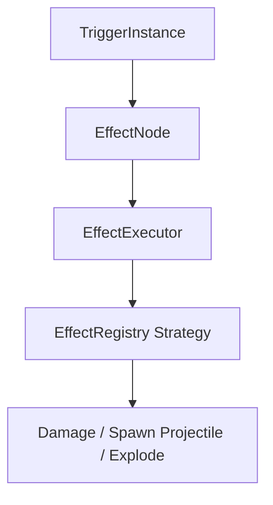
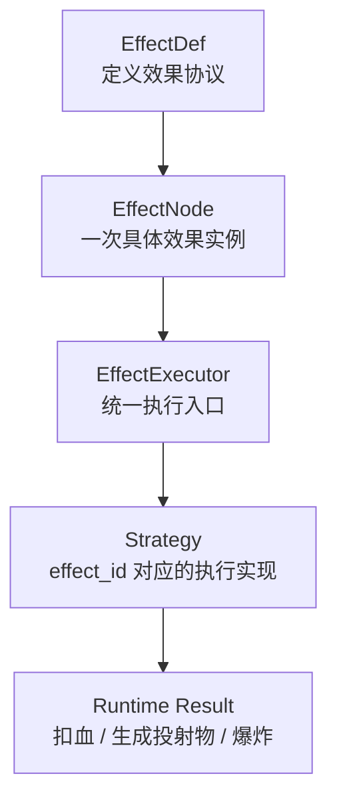

# 效果系统

> 这篇文档说明当前主干里的效果系统如何表达行为、如何进入执行链，以及哪些部分已经落地、哪些仍是未来扩展方向。

---

## 文档定位

这篇文档主要回答：

- `Effect` 在当前项目里是什么
- 静态定义和运行时节点如何区分
- 当前已经实现了哪些内置效果
- 当前效果系统与 `Trigger`、`RuleContext`、`ProjectileRoot` 的边界是什么

这篇文档不负责：

- 错误技生成器如何随机拼树
- 最终版外部数据包格式
- 所有未来效果的设计清单

---

## 当前状态

### 已决定

- `Effect` 是当前引擎主干里的原子行为单元。
- 静态定义优先使用 Godot `Resource`。
- 运行时执行单位是 `EffectNode` 树。
- 当前主干已经稳定接入 `damage`、`spawn_projectile`、`explode` 三个内置效果。

### 当前建议

- 新增效果前，先把 `EffectDef.param_defs`、`slots` 和子效果白名单补进注册表。
- 当前文档中的“未来效果类型”不应被当成已落地能力。

### 未来方向

- 更完整的 `EffectDef` 参数校验
- 更强的目标解析协议
- 更丰富的基础效果白名单

---

## 系统角色

在当前项目里，效果系统负责回答：

- 事件命中后，到底要做什么
- 这种行为是直接改状态、生成投射物，还是再次推事件

当前应这样理解：

- `Trigger` 决定是否进入效果链
- `Effect` 决定具体行为
- `EffectExecutor` 决定执行顺序和深度边界

---

## 当前结构

### 1. EffectDef

`EffectDef` 是静态定义，当前落在：

- [`scripts/core/defs/effect_def.gd`](../../scripts/core/defs/effect_def.gd)
- [`autoload/EffectRegistry.gd`](../../autoload/EffectRegistry.gd)

当前字段：

| 字段 | 说明 |
|------|------|
| `effect_id` | 效果唯一标识 |
| `param_defs` | 参数白名单、默认值和上下界定义 |
| `slots` | 子槽位及子效果白名单定义 |
| `tags` | 分类或后续约束信息的承载位 |

当前要点：

- `EffectDef` 已经是正式 `Resource` 类型。
- 当前 3 个内置效果已经启用参数白名单和 slot 白名单。
- `spawn_projectile.on_hit` 当前只允许挂 `damage` 或 `explode`。
- `spawn_projectile.flight_profile` 当前必须是 `ProjectileFlightProfile` 资源。

### 2. EffectNode

`EffectNode` 是运行时节点，当前落在：

- [`scripts/core/runtime/effect_node.gd`](../../scripts/core/runtime/effect_node.gd)

当前字段：

| 字段 | 说明 |
|------|------|
| `effect_id` | 当前节点执行哪个效果 |
| `params` | 本节点参数 |
| `children` | 子效果槽位 |

当前语义：

- `EffectNode` 是当前效果树真正执行的单位。
- 子节点通过 `children[slot_name]` 组织。
- `effect_id == "null"` 表示空节点或终止节点。

### 3. EffectResult

执行结果对象当前落在：

- [`scripts/core/runtime/effect_result.gd`](../../scripts/core/runtime/effect_result.gd)

当前字段：

| 字段 | 说明 |
|------|------|
| `success` | 本节点是否成功 |
| `terminated` | 是否终止后续链路 |
| `notes` | 调试说明 |
| `payload` | 附加结果数据 |

### 4. EffectRegistry

`EffectRegistry` 当前落在：

- [`autoload/EffectRegistry.gd`](../../autoload/EffectRegistry.gd)

职责：

- 注册内置 `EffectDef`
- 注册效果执行策略
- 提供统一查询入口

## `strategy` 在当前系统里的角色

在当前项目里，`strategy` 就是：

> 某个 `effect_id` 在运行时到底怎么执行的那段实现。

也就是说：

- `EffectDef` 负责定义“这个效果允许怎么写”
- `EffectNode` 负责承载“这次具体怎么配”
- `EffectExecutor` 负责统一调度
- `strategy` 负责“这个效果实际上怎么干活”

可以用下面这张最小关系图理解：

这条区分很重要，因为未来如果要支持扩展包新增原本不存在的效果，需要分别讨论：

- 效果定义能否外置
- 效果执行 `strategy` 能否扩展

---

## 当前内置效果

当前仓库真正已经落地的内置效果只有 3 个。

| `effect_id` | 作用 | 当前落点 |
|------|------|------|
| `damage` | 对目标造成伤害 | `HealthComponent.take_damage()` |
| `spawn_projectile` | 生成投射物并交给 `BattleManager` 发射 | `BattleManager.spawn_projectile_from_effect()` |
| `explode` | 对目标或半径内目标造成范围伤害 | `EffectRegistry._resolve_targets()` |

### `damage`

当前特点：

- 默认通过 `target_mode` 解析目标
- 会把事件标签透传进伤害事件
- 最终调用目标的 `take_damage()`

### `spawn_projectile`

当前特点：

- 实际发射工作交给 `BattleManager`
- 支持把 `ProjectileFlightProfile` 转成运行时 movement params
- 投射物命中后可继续回到效果链
- `on_hit` slot 当前白名单只开放给 `damage / explode`

### `explode`

当前特点：

- 支持单目标和 `enemies_in_radius`
- 本质仍然通过 `take_damage()` 写回 `entity.damaged`

## 第三阶段第一版冻结结论

当前第三阶段第一轮，对效果侧真正冻结的不是“所有未来效果”，而是下面这组正式子集。

### 1. 冻结范围

当前只正式冻结：

- `damage`
- `spawn_projectile`
- `explode`

这意味着：

- `heal`
- `apply_modifier`
- `spawn_entity`

当前仍应被视为后续候选，而不是第一轮正式白名单。

### 2. 第一轮正式参数子集

当前第一轮更强调下面这组正式核心参数。

#### `damage`

- `amount`
- `target_mode`

#### `explode`

- `amount`
- `target_mode`
- `radius`
- `lane_id`

#### `spawn_projectile`

- `speed`
- `direction`
- `damage`
- `movement_mode`
- `flight_profile`
- `projectile_template`
- `turn_rate`
- `travel_duration`
- `impact_radius`
- `collision_padding`

这里要注意：

- 当前 `EffectDef` 里仍保留了一些更细的飞行调节参数
- 但第三阶段第一轮正式收口的重点，是先把上面这组高频主链子集写稳
- 其他参数更适合继续被理解为兼容或次级调节入口，而不是第一轮作者主入口
- `flight_profile` 和 `projectile_template` 属于资源型入口
- 速度、伤害、半径、持续时间等数值型参数，当前允许来自绑定默认值或场景局部覆盖

### 3. 第一轮正式目标语义和槽位语义

当前第一轮正式承认的高频目标语义包括：

- `context_target`
- `source`
- `owner`
- `event_source`
- `event_target`
- `enemies_in_radius`

当前第一轮正式槽位约束包括：

- `spawn_projectile.on_hit` 只允许 `damage / explode`

这意味着两件事：

- 目标模式不是自由字符串，必须落在白名单里
- `on_hit` 不是任意嵌套子效果入口，而是当前明确受控的单槽位
- 链深保护继续沿用当前执行器的 `MAX_DEPTH = 5`，不在第一轮额外发明新的链路层

### 4. 当前效果错误语义

当前第一轮，下面这些情况都应被理解为正式协议错误：

- 未知 `effect_id`
- 白名单外参数
- 参数类型错误
- 参数值越界
- 不支持的 `target_mode`
- 错误资源脚本类型
- 不支持的子效果槽位
- 槽位中出现不被允许的子效果

这些错误当前应尽量在：

- `EffectDef` 白名单
- `ProtocolValidator.normalize_effect_node()`
- 规则协议守卫专项

这 3 个位置上得到一致结果，而不是等到效果真正执行时再暴露。

## 面向扩展包的未来方向

如果按当前架构继续演进，未来“效果外置”更合理的路径应是分层推进，而不是一步到位让所有行为都完全脚本化。

### 1. 先外置效果定义

也就是把下面这些内容逐步允许由扩展包提供：

- `effect_id`
- 参数 schema
- 默认值
- `slot` 约束
- capability/tag

### 2. 再扩展执行 `strategy`

如果扩展包要新增原本不存在的效果原子，仅有外置 `EffectDef` 还不够，还需要某种形式的执行扩展。

更准确地说：

- “组合现有效果”可以是纯数据扩展
- “新增原本不存在的效果”通常至少需要新的 `strategy`

### 3. 白名单未来应演进成注册集合

当前第三阶段白名单对主干收口是必要的，但长期不应继续理解成：

- 一张无限增长的 effect id 列表

更合理的未来形态是：

- 核心固定不变量
- 扩展包注册新的 `EffectDef`
- validator 按 schema 自动校验
- slot 约束逐步从 `allowed_effect_ids` 演进到 capability/tag 约束

如果需要进一步看这一层的扩展策略，建议配合阅读：

- [扩展包新增效果与效果外置策略](../04-roadmap-reference/37-扩展包新增效果与效果外置策略.md)

---

## 当前目标解析方式

`EffectRegistry` 当前已经实现的目标模式包括：

| `target_mode` | 含义 |
|------|------|
| `context_target` | 当前上下文目标 |
| `source` | 当前上下文来源 |
| `owner` | 当前效果所属实体 |
| `event_source` | 事件源节点 |
| `event_target` | 事件目标节点 |
| `enemies_in_radius` | 基于当前位置和半径查找敌方目标 |

这里要注意：

- 目标解析已经进入主干
- 第三阶段第一轮已经把当前高频目标模式收进正式子集
- 但这仍然不是“未来所有目标语义都已冻结完毕”

---

## 当前执行边界

### 效果系统负责什么

- 解析当前节点参数
- 调用对应策略
- 递归执行子效果
- 记录效果执行日志

### 效果系统不负责什么

- 不负责直接订阅事件
- 不负责决定哪个实体监听什么
- 不负责管理整场战斗
- 不负责定义投射体如何运动

例如：

- `spawn_projectile` 只负责提出“生成投射物”这个行为
- 真正的发射和弹道由 `BattleManager` 与 `ProjectileRoot` 处理

---

## 与执行机制的关系

效果系统和执行机制的分工是：

- 效果系统：表达行为和策略注册
- 执行机制：决定执行顺序、上下文复制、深度边界和错误传播

当前 `EffectExecutor.execute_node()` 会：

1. 检查空节点和深度上限
2. 查询 `EffectRegistry` 中的策略
3. 执行当前节点
4. 复制子上下文并递归执行子节点
5. 写入 `DebugService.effect_log`

详细执行链见：

- [执行机制](06-执行机制.md)

---

## 当前工程落点

### 代码

- [`autoload/EffectRegistry.gd`](../../autoload/EffectRegistry.gd)
- [`scripts/core/defs/effect_def.gd`](../../scripts/core/defs/effect_def.gd)
- [`scripts/core/runtime/effect_node.gd`](../../scripts/core/runtime/effect_node.gd)
- [`scripts/core/runtime/effect_result.gd`](../../scripts/core/runtime/effect_result.gd)
- [`scripts/core/runtime/effect_executor.gd`](../../scripts/core/runtime/effect_executor.gd)

### 关联运行时

- [`scripts/battle/battle_manager.gd`](../../scripts/battle/battle_manager.gd)
- [`scripts/entities/projectile_root.gd`](../../scripts/entities/projectile_root.gd)
- [`scripts/components/health_component.gd`](../../scripts/components/health_component.gd)

### 当前验证入口

- [`scenes/validation/minimal_battle_validation.tres`](../../scenes/validation/minimal_battle_validation.tres)
- [`scenes/validation/parabola_long_range_validation.tres`](../../scenes/validation/parabola_long_range_validation.tres)

---

## 当前非目标

下面这些内容目前不应被写成“效果系统已经具备”的事实：

- 完整 `Category / Tag / TypeRegistry` 体系
- 全量效果白名单
- 最终版外部效果包格式

如果需要讨论这些内容，应明确标注为“未来方向”。

---

## 相关文档

- [触发器系统](03-触发器系统.md)
- [执行机制](06-执行机制.md)
- [连续行为模型](08-连续行为模型.md)
- [完整工作流](../03-content-validation/12-完整工作流.md)
- [验证清单](../03-content-validation/15-验证清单.md)

