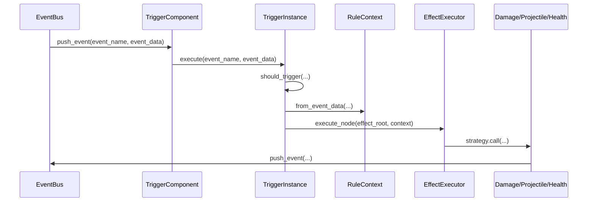
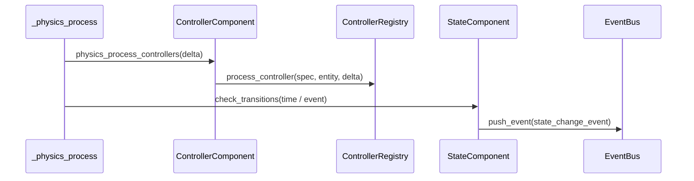

# 执行机制

- 状态：当前事实


> 这篇文档说明当前主干里一条规则链是如何真正跑起来的：事件如何广播、触发器如何命中、上下文如何生成、效果树如何执行、连续行为又如何重新回写事件系统。

---

## 文档定位

这篇文档主要回答：

- 当前运行时的核心执行链是什么
- `EventBus / EventData / RuleContext / EffectExecutor` 如何分工
- 连续行为系统如何重新进入事件链
- 当前实现里哪些边界已经固定，哪些仍需后续整理

这篇文档不负责：

- 单独定义触发器协议
- 单独定义效果协议
- 单独定义投射体空间模型

这些内容分别见：

- [触发器系统](03-触发器系统.md)
- [效果系统](04-效果系统.md)
- [连续行为模型](08-连续行为模型.md)

---

## 当前状态

### 已决定

- 当前运行时采用 `EventBus -> TriggerInstance -> RuleContext -> EffectExecutor -> Runtime Action -> EventBus` 的闭环。
- `EventData` 是结构化事件体，不再把事件 payload 当成无结构数组。
- `RuleContext` 是一次规则执行的上下文快照。
- `EffectExecutor` 统一承担深度限制、递归执行和日志记录。
- 内容到运行时通过 `Archetype + Mechanic[] → MechanicCompiler → RuntimeSpec` 编译链，由 `EntityFactory` 消费 `RuntimeSpec` 实例化实体。
- Controller（bite / sweep 等）通过 `ControllerComponent` 在 `_physics_process` 中持续执行，是连续行为的第二个入口。
- State（arming / growth / rage）通过 `StateComponent` 管理阶段转换。
- 所有随机行为通过确定性随机协议（`battle_seed → entity_seed → mechanic_seed → ShuffleBag`）保证可复现。

### 未来方向

- 更系统的执行链可视化
- 更明确的协议变更和兼容策略

---

## 当前核心执行链

运行时有两条并行的执行入口：

### 离散事件执行链



### 连续行为执行链



两条链的关系：

- 离散事件链处理"发生了什么 → 该做什么"
- 连续行为链处理"每帧持续更新的行为"
- 连续行为（如 Controller bite 命中）可以推事件回离散链

### 编译链（内容 → 运行时）

```mermaid
graph LR
    A[Archetype + Mechanic[]] --> B[MechanicCompiler]
    B --> C[RuntimeSpec]
    C --> D[EntityFactory]
    D --> E[TriggerComponent + ControllerComponent + StateComponent]
```

编译链不是运行时执行链的一部分——它在实例化时运行一次，生成运行时所需的全部规格。详见 [编译链与 Mechanic 系统](11-编译链与Mechanic系统.md)。

这条链的关键含义是：

- 事件驱动规则进入
- 效果驱动行为执行
- 行为执行后可再次推事件
- 连续行为也必须回到同一事件主干

---

## EventBus

当前实现落在：

- [`autoload/EventBus.gd`](../../autoload/EventBus.gd)

当前能力包括：

| 能力 | 说明 |
|------|------|
| `subscribe()` | 基础订阅 |
| `subscribe_ex()` | 带 `priority / oneshot / filter` 的扩展订阅 |
| `unsubscribe()` | 退订 |
| `push_event()` | 统一广播入口 |
| `get_history()` | 获取最近历史 |
| `clear()` | 清空订阅和历史 |

当前执行要点：

- 未传入结构化事件时，会自动归一化成 `EventData`
- 事件进入后会自动补全 `event_id / chain_id / depth / timestamp`
- 历史最多保留 256 条

这意味着 `EventBus` 现在已经不仅是“广播器”，而是：

- 结构化事件入口
- 调试历史入口
- 订阅规则入口

---

## EventData

当前实现落在：

- [`scripts/core/runtime/event_data.gd`](../../scripts/core/runtime/event_data.gd)

当前结构：

| 区块 | 作用 |
|------|------|
| `core` | 引擎和策略可直接理解的语义字段 |
| `runtime` | 事件链追踪字段 |
| `ext` | 未来扩展字段 |

当前固定的运行时字段包括：

- `event_name`
- `event_id`
- `chain_id`
- `depth`
- `timestamp`

当前创建入口是：

- `EventData.create(source_node, target_node, value, tags, runtime_overrides)`

这也是当前所有伤害、命中、死亡等事件的基础结构。

---

## RuleContext

当前实现落在：

- [`scripts/core/runtime/rule_context.gd`](../../scripts/core/runtime/rule_context.gd)

`RuleContext` 的作用不是替代事件，而是把一次规则执行需要的上下文整理成可读快照。

当前字段重点包括：

- `event_name`
- `owner_entity`
- `source_node`
- `target_node`
- `position`
- `chain_id`
- `depth`
- `core`
- `runtime`
- `state`
- `entity_state`

当前生成方式：

- `RuleContext.from_event_data(event_name, event_data, owner_entity)`

当前语义：

- `event_data` 是原事件体
- `RuleContext` 是执行期上下文快照

两者不能混为一谈。

---

## Trigger 执行入口

当前触发执行入口在：

- [`scripts/core/runtime/trigger_instance.gd`](../../scripts/core/runtime/trigger_instance.gd)
- [`scripts/components/trigger_component.gd`](../../scripts/components/trigger_component.gd)

执行步骤：

1. `TriggerComponent` 根据 `event_name` 分发事件
2. `TriggerInstance.should_trigger()` 调用 `TriggerRegistry`
3. 记录触发日志
4. 更新 `last_triggered_time`
5. 生成 `RuleContext`
6. 逐个执行 `effect_roots`

这里的重要边界是：

- `TriggerComponent` 不负责业务判断
- `TriggerInstance` 不负责具体效果实现

---

## EffectExecutor

当前实现落在：

- [`scripts/core/runtime/effect_executor.gd`](../../scripts/core/runtime/effect_executor.gd)

当前执行步骤：

1. 空节点或 `null` 节点直接返回
2. 检查链深和递归深度
3. 从 `EffectRegistry` 取策略
4. 执行当前节点
5. 记录效果执行日志
6. 复制子上下文并递归执行子节点

当前已实现的关键边界：

- `MAX_DEPTH = 5`
- 当前节点失败会写入 `EffectResult.notes`
- 子节点执行时会复制上下文并递增 `depth`

这里的 `depth` 是运行时真正的执行边界之一，不能再把它当成“仅供调试”的装饰字段。

---

## 连续行为如何重新进入执行链

当前运行时不是纯离散规则系统，投射体是连续行为入口。

当前闭环是：

1. `spawn_projectile` 效果调用 `BattleManager.spawn_projectile_from_effect()`
2. `ProjectileRoot` 按 movement strategy 每帧更新
3. 投射物命中时推送 `projectile.hit`
4. 若 `on_hit_effect` 存在，则再次进入 `EffectExecutor`
5. 若没有额外效果，也会通过 `HealthComponent` 写回 `entity.damaged`

同样，`HealthComponent` 会在生命归零时继续推送：

- `entity.died`

这说明当前执行链已经同时覆盖：

- 离散事件
- 连续行为
- 连锁伤害
- 死亡回写

---

## 当前可观测性

当前执行链已经接入了专门的调试设施：

### EventBus 历史

- `EventBus.get_history()`

### DebugService

当前实现落在：

- [`autoload/DebugService.gd`](../../autoload/DebugService.gd)

当前日志包括：

- `event_log`
- `trigger_log`
- `effect_log`
- `runtime_snapshot_log`

### DebugOverlay

当前实现落在：

- [`scripts/debug/debug_overlay.gd`](../../scripts/debug/debug_overlay.gd)

它当前可以直接显示：

- 最近事件
- 最近触发器
- 最近效果
- 当前实体状态
- 验证状态摘要

---

## 当前工程落点

### 核心代码

- [`autoload/EventBus.gd`](../../autoload/EventBus.gd)
- [`scripts/core/runtime/event_data.gd`](../../scripts/core/runtime/event_data.gd)
- [`scripts/core/runtime/rule_context.gd`](../../scripts/core/runtime/rule_context.gd)
- [`scripts/core/runtime/trigger_instance.gd`](../../scripts/core/runtime/trigger_instance.gd)
- [`scripts/core/runtime/effect_executor.gd`](../../scripts/core/runtime/effect_executor.gd)

### 运行时回写入口

- [`scripts/entities/projectile_root.gd`](../../scripts/entities/projectile_root.gd)
- [`scripts/components/health_component.gd`](../../scripts/components/health_component.gd)
- [`scripts/battle/battle_manager.gd`](../../scripts/battle/battle_manager.gd)

### 当前验证入口

- [`scenes/validation/minimal_battle_validation.tres`](../../scenes/validation/minimal_battle_validation.tres)
- [`scenes/validation/parabola_long_range_validation.tres`](../../scenes/validation/parabola_long_range_validation.tres)
- [`tools/run_validation.ps1`](../../tools/run_validation.ps1)

---

## 当前非目标

下面这些内容目前不应被误写成当前执行机制已经具备：

- 同帧事件合并
- 全局对象池和零分配执行
- 完整的脚本沙盒
- 大而全的 ECS 调度矩阵

这些可以在将来讨论，但不属于当前事实。

---

## 相关文档

- [触发器系统](03-触发器系统.md)
- [效果系统](04-效果系统.md)
- [事件模型](07-事件模型.md)
- [连续行为模型](08-连续行为模型.md)
- [编译链与 Mechanic 系统](11-编译链与Mechanic系统.md)
- [验证清单](../03-content-validation/15-验证清单.md)


