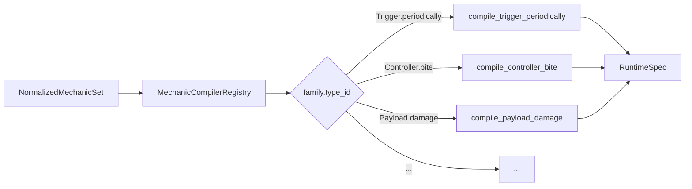

# 编译链与 Mechanic 系统

> 本文描述 Open PVZ 的内容到运行时编译链：`Archetype + Mechanic[]` 如何通过多阶段编译变成 `RuntimeSpec`，再由 `EntityFactory` 实例化为运行时节点。决策依据见 [ADR-002 顶层作者模型与编译链](../decisions/ADR-002-顶层作者模型与编译链.md)、[ADR-003 Mechanic 一级家族冻结](../decisions/ADR-003-Mechanic-一级家族冻结.md)、[ADR-004 连续行为、状态与生命周期正式化](../decisions/ADR-004-连续行为-状态与生命周期正式化.md)。

---

## 文档定位

本文主要回答：

- `CombatArchetype` 和 `CombatMechanic` 是什么
- Mechanic 的三层边界（family / type / param）如何划分
- 编译链各阶段做什么
- `EntityFactory` 如何消费 `RuntimeSpec`
- 10 个冻结 Mechanic family 各自的职责
- Controller / State / Lifecycle 如何工作
- 确定性随机协议如何运作

本文不负责：

- 触发器或效果的具体执行协议
- 投射体空间模型
- 内容作者的具体编写流程

---

## 一、顶层作者模型

当前唯一正式的顶层内容入口是 **`CombatArchetype + CombatMechanic[]`**。

### Archetype 类型

| 类型 | 脚本 | entity_kind |
|------|------|-------------|
| `PlantArchetype` | `scripts/core/defs/plant_archetype.gd` | `&"plant"` |
| `ZombieArchetype` | `scripts/core/defs/zombie_archetype.gd` | `&"zombie"` |
| `ProjectileArchetype` | `scripts/core/defs/projectile_archetype.gd` | `&"projectile"` |

三者均继承自 `CombatArchetype`（`scripts/core/defs/combat_archetype.gd`）。

### Archetype 承载的信息

| 层 | 字段 | 说明 |
|----|------|------|
| 身份 | `archetype_id`, `entity_kind`, `display_name`, `tags` | 这个 archetype 是谁 |
| 节点 | `root_scene`, `visual_scene`, `required_components`, `optional_components` | 实例化时使用哪个根场景和组件 |
| 放置 | `placement_role`, `allowed_slot_types`, `required_placement_tags`, `granted_placement_tags` | 棋盘放置语义 |
| 战斗 | `max_health`, `hitbox_size`, `hit_height_band` | 基础战斗属性 |
| 投射 | `projectile_flight_profile`, `projectile_template` | 默认投射体配置 |
| 行为 | **`mechanics: Array[Resource]`** | 所有行为由 Mechanic 数组定义 |
| 兼容 | `backend_entity_template`, `backend_entity_template_id` | 迁移期兜底，指向旧 EntityTemplate |
| 编译提示 | `compiler_hints`, `default_params` | 传递给编译器的额外信息 |

### 一句话原则

> Archetype 定义"这个单位是什么"，Mechanic 定义"这个单位能做什么"，编译链把两者变成运行时可消费的 `RuntimeSpec`。

---

## 二、Mechanic 三层边界

`CombatMechanic`（`scripts/core/defs/combat_mechanic.gd`）沿三个层次组织：

| 层 | 含义 | 可变性 | 举例 |
|----|------|--------|------|
| **family** | 行为维度 | 冻结（10 个，新增需 ADR） | `Trigger`, `Controller` |
| **type** | family 下的实现族 | 可扩展（扩展包可新增 type） | `core.bite`, `core.sweep` |
| **param** | type 的配置参数 | 完全开放 | `{ damage: 10, interval: 1.0 }` |

### 10 个冻结 family

| family | 职责 | 典型 type |
|--------|------|-----------|
| `Trigger` | 离散事件触发条件 | `periodically`, `when_damaged`, `on_death` |
| `Targeting` | 目标发现策略 | `lane_forward`, `lane_backward`, `always_target` |
| `Emission` | 投射物生成方式 | `single`, `burst`, `shuffle_cycle`, `spread` |
| `Trajectory` | 投射物运动轨迹 | `linear`, `parabola`, `track` |
| `HitPolicy` | 命中判定策略 | `swept_segment`, `terminal_hitbox`, `terminal_radius`, `overlap` |
| `Payload` | 命中/触发后的效果 | `damage`, `explode`, `produce_sun`, `apply_status`, `spawn_projectile` |
| `State` | 阶段状态（arming / growth / rage 等） | `core.armed`, `core.growth`, `core.rage` |
| `Lifecycle` | 生命周期钩子 | `core.on_spawned`, `core.on_place`, `core.on_armed`, `core.on_state_enter` |
| `Placement` | 放置条件与语义 | `ground`, `water`, `roof`, `air` |
| `Controller` | 连续行为状态机 | `core.bite`, `core.sweep` |

> 扩展包默认只能新增 **type**，不能新增 **family**。新增 family 需要主仓 ADR 审批（ADR-003）。

### Mechanic 字段

```
mechanic_id: StringName      # 唯一标识
display_name: String
family: StringName           # 所属 family
type_id: StringName          # family 下的实现族
enabled: bool = true
priority: int = 100          # 编译优先级
tags: PackedStringArray
params: Dictionary           # type 的配置参数
```

---

## 三、编译链

### 全链路

```
Archetype + Mechanic[]
        │
        ▼
NormalizedMechanicSet      ← MechanicCompiler.normalize_archetype()
        │                    (过滤 disabled、按 priority 排序、合并 params)
        ▼
RuntimeSpec                ← MechanicCompiler.compile_spawn_entry()
        │                    (per-type compiler 分发、生成 trigger/controller/state spec)
        ▼
EntityFactory              → instantiate_runtime_spec()
        │
        ▼
运行时节点 + 组件
```

### 各阶段详解

#### 3.1 归一化（Normalize）

`MechanicCompiler.normalize_archetype()` 将 Archetype 的 `mechanics[]` 转化为 `NormalizedMechanicSet`：

- 过滤掉 `enabled = false` 的 Mechanic
- 按 `priority` 排序
- 合并 `params` 和 `compiler_hints`
- 收集编译警告

产物：`NormalizedMechanicSet`（`scripts/core/runtime/normalized_mechanic_set.gd`）

#### 3.2 编译（Compile）

`MechanicCompiler.compile_spawn_entry()` 对归一化后的每个 Mechanic，通过 `MechanicCompilerRegistry` 分发到对应的 per-type compiler callable：



编译器版本：`&"mechanic_first_v0"`

#### 3.3 产物：RuntimeSpec

`RuntimeSpec`（`scripts/core/runtime/runtime_spec.gd`）是编译链的最终产物，由 `EntityFactory` 消费：

| 字段 | 用途 |
|------|------|
| `source_archetype_id` | 来源 archetype 标识 |
| `entity_kind`, `display_name`, `tags` | 实体身份 |
| `root_scene` | 实例化使用的根场景 |
| `max_health`, `hitbox_size`, `hit_height_band` | 战斗属性 |
| `projectile_template`, `projectile_flight_profile` | 投射体配置 |
| `compiled_trigger_bindings` | 编译生成的触发器绑定 |
| `controller_specs` | Controller 规格数组 |
| `state_specs` | State 规格数组 |
| `mechanic_ids` | 所有参与的 mechanic id 列表 |
| `mechanic_runtime_states` | Mechanic 私有运行时状态（ShuffleBag 等） |
| `placement_spec` | 放置规格 |
| `params` | 合并后的参数 |
| `notes` | 编译器附加信息 |

---

## 四、EntityFactory 双路径

`EntityFactory`（`scripts/battle/entity_factory.gd`）的 `instantiate_spawn_entry()` 按以下顺序尝试：

```
1. Archetype 路径（优先）:
   CombatContentResolver.resolve_spawn_entry_runtime_spec(spawn_entry)
   → 如果返回 RuntimeSpec → _instantiate_runtime_spec()

2. 旧 Template 路径（兜底）:
   _resolve_template(spawn_entry)
   → 使用旧 EntityTemplate + TriggerBinding 实例化
```

### Archetype 路径实例化步骤

1. 从 `RuntimeSpec` 获取身份、场景、组件列表
2. 实例化根节点（`root_scene` 或内置实体类型）
3. 绑定 `controller_specs` → `ControllerComponent`
4. 绑定 `state_specs` → `StateComponent`
5. 从 `compiled_trigger_bindings` 构建 `TriggerInstance[]`（若无则回退到旧 `build_runtime_triggers()`）
6. 设置 `mechanic_runtime_states`（ShuffleBag 等确定性随机状态）
7. 设置战斗属性（HP、hitbox、placement）

---

## 五、Controller / State / Lifecycle

### Controller（连续行为状态机）

Controller 将原来硬编码在实体根脚本中的连续行为（僵尸啃食、割草机扫掠等）抽取为可组合的 Mechanic。

- **注册中心**：`ControllerRegistry`（autoload）
- **运行时组件**：`ControllerComponent`（`scripts/components/controller_component.gd`）
- **每个 Controller spec 包含**：策略 id、参数、blackboard 私有状态
- **已注册策略**：`core.bite`（僵尸啃食）、`core.sweep`（割草机扫掠）

`ControllerComponent` 在 `_physics_process` 中每帧调用 `ControllerRegistry.process_controller()`，将连续行为的更新纳入主循环。

### State（阶段状态）

State 管理实体的阶段性状态转换（如土豆地雷的 arming、阳光菇的 growth）。

- **运行时组件**：`StateComponent`（`scripts/components/state_component.gd`）
- **转换触发方式**：
  - 时间触发：`bind_time` 后自动转换
  - 事件触发：订阅 EventBus 指定事件后转换
- **已注册 type**：`core.armed`、`core.growth`、`core.rage`

### Lifecycle（生命周期钩子）

Lifecycle 不是独立组件——编译器将 Lifecycle type 映射为 Trigger family 的特殊触发：

| Lifecycle type | 编译后的事件名 | 触发时机 |
|----------------|--------------|---------|
| `core.on_spawned` | `entity.spawned` | 实体生成后 |
| `core.on_place` | `placement.accepted` | 放置被棋盘接受后 |
| `core.on_armed` | `state.armed` | State 进入 armed 后 |
| `core.on_state_enter` | `state.<state_name>` | State 转换时 |
| `core.on_expire` | `state.expire` | State 到期时 |
| `core.on_removed` | `entity.removed` | 实体移除时 |

---

## 六、确定性随机协议

所有需要随机行为的 Mechanic（如 Emission.shuffle_cycle、连射 burst、随机投射物选择）使用确定性随机：

```
GameState.battle_seed
    → entity_seed = hash(battle_seed + entity_id)
    → mechanic_seed = hash(entity_seed + mechanic_id)
    → ShuffleBag / RandomNumberGenerator 局部实例
```

### ShuffleBag

`ShuffleBag`（`scripts/core/runtime/shuffle_bag.gd`）提供确定性随机抽取：

- 构造时传入候选池和种子
- 袋内使用 Fisher-Yates 洗牌
- 耗尽后自动重新洗牌
- `next()` 每次返回一个元素

ShuffleBag 实例作为 `mechanic_runtime_states` 的一部分绑定到实体上，确保同一种子下行为可复现。

---

## 七、注册中心一览

| 注册中心 | autoload 名 | 职责 |
|----------|------------|------|
| `MechanicFamilyRegistry` | MechanicFamilyRegistry | 10 个冻结 family 注册与查询 |
| `MechanicTypeRegistry` | MechanicTypeRegistry | family → type_id 注册，委托 MechanicCompiler 注册内置 type |
| `MechanicCompilerRegistry` | MechanicCompilerRegistry | per-type compiler callable 注册与分发 |
| `ControllerRegistry` | ControllerRegistry | Controller 策略注册（bite / sweep） |
| `DetectionRegistry` | DetectionRegistry | 目标发现策略注册（lane_forward / lane_backward） |
| `TriggerRegistry` | TriggerRegistry | 触发器定义与策略注册 |
| `EffectRegistry` | EffectRegistry | 效果定义与策略注册 |
| `SceneRegistry` | SceneRegistry | 场景与资源注册，支持 archetype 查询 |

---

## 八、当前编译覆盖

`MechanicCompiler` 已注册 37 个内置 mechanic type，覆盖 7 个 family：

| family | 已编译 type |
|--------|-----------|
| Trigger | `periodically`, `when_damaged`, `on_death`, `on_spawned`*, `on_place`* |
| Targeting | `lane_forward`, `lane_backward`, `always_target` |
| Emission | `single`, `burst`, `shuffle_cycle`, `spread` |
| Trajectory | `linear`, `parabola`, `track` |
| HitPolicy | `swept_segment`, `terminal_hitbox`, `terminal_radius`, `overlap` |
| Controller | `core.bite`, `core.sweep` |
| State | `core.armed`, `core.growth`, `core.rage` |
| Payload | (编译为 effect) `damage`, `spawn_projectile`, `explode`, `produce_sun`, `apply_status` |

*`on_spawned` 和 `on_place` 在编译时映射为 Lifecycle → Trigger。

**尚未建立编译路径的 family**：`Placement`（放置条件目前由 Archetype 字段直接承载）。

---

## 九、资源目录结构

```
data/combat/
├── archetypes/
│   ├── plants/          # 38 个植物 archetype .tres
│   ├── zombies/         # 10 个僵尸 archetype .tres
│   └── field_objects/   # 2 个场上物件 archetype .tres
├── entity_templates/    # 旧 EntityTemplate（兼容层）
├── projectile_templates/
├── projectile_profiles/
├── trigger_bindings/    # 旧 TriggerBinding（兼容层）
├── height_bands/
├── cards/
├── battlefields/
├── waves/
└── levels/
```

---

## 相关文档

- [架构总览](../01-overview/00-架构总览.md)
- [执行机制](06-执行机制.md)
- [触发器系统](03-触发器系统.md)
- [效果系统](04-效果系统.md)
- [当前阶段与实现路线](../01-overview/23-当前阶段与实现路线.md)
- [ADR-002 顶层作者模型与编译链](../decisions/ADR-002-顶层作者模型与编译链.md)
- [ADR-003 Mechanic 一级家族冻结](../decisions/ADR-003-Mechanic-一级家族冻结.md)
- [ADR-004 连续行为、状态与生命周期正式化](../decisions/ADR-004-连续行为-状态与生命周期正式化.md)
- [ADR-005 扩展包接入与迁移策略](../decisions/ADR-005-扩展包接入与迁移策略.md)
