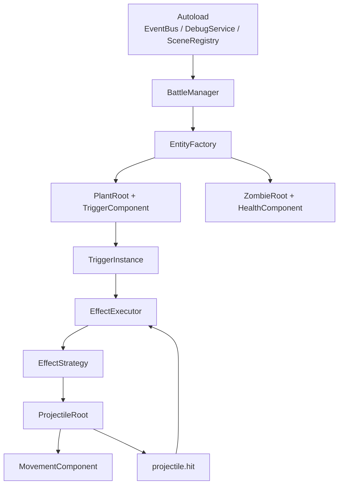
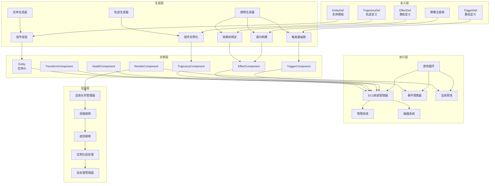
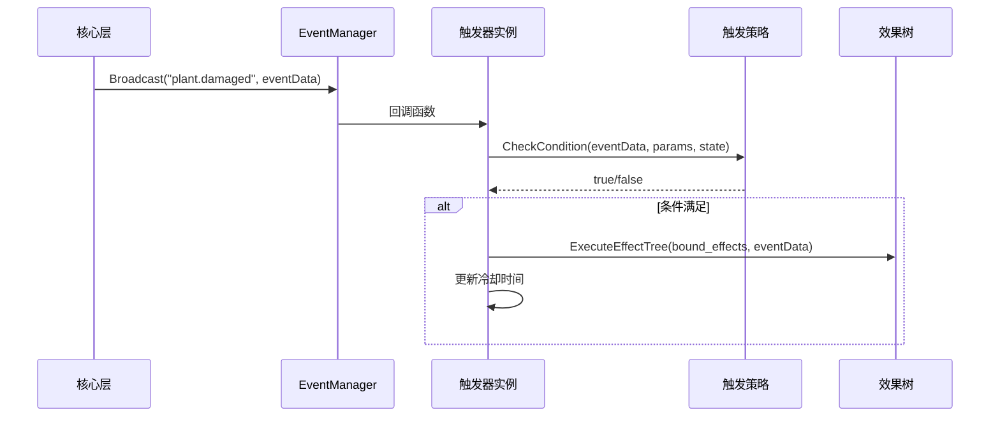

# 系统架构

> 错误技系统的四层架构设计总览

---

## 当前落地版本（Phase 1 推荐）

在参考 [PVZ-Godot-Dream](24-外部项目调研-PVZ-Godot-Dream.md) 之后，当前项目的推荐落地架构应先采用 Godot 原生方式，而不是直接按完整 ECS 架构实现。

第一阶段优先采用：

- `Autoload`：事件总线、调试服务、场景注册
- 战斗场景：`BattleManager`
- 实体：根节点 + 行为组件
- 规则运行时：`TriggerInstance` + `EffectExecutor`
- 投射物：根节点 + `MovementComponent`



这套骨架已经足够支撑当前阶段：

- 事件触发
- 效果树执行
- 投射物移动
- 命中连锁
- 调试追踪

`ECS`、复杂渲染分层、完整系统管理器仍然保留为未来扩展方向，但不应主导当前实现顺序。

---

## 架构总览



---

## 四层架构详解

### 1. 定义层（静态配置）

定义层是整个系统的静态蓝图，所有机制的定义都存储在这里。

| 组件 | 说明 | 文件类型 |
|------|------|----------|
| `TriggerDef` | 触发器蓝图，定义触发器的基本属性和参数 | JSON |
| `EffectDef` | 效果蓝图，定义效果的槽位结构 | JSON |
| 策略注册表 | 动态注册执行逻辑的容器 | 运行时数据 |

**TriggerDef 示例**

```json
{
  "trigger_id": "when_damaged",
  "event_name": "plant.damaged",
  "max_bound_effects": 1,
  "condition_params": [
    {"name": "damage_threshold", "type": "int", "min": 0, "max": 999},
    {"name": "probability", "type": "float", "min": 0.0, "max": 1.0}
  ],
  "tags": []
}
```

**EffectDef 示例**

```json
{
  "effect_id": "shoot",
  "slots": [
    {
      "name": "speed",
      "type": "value",
      "value_type": "float",
      "min": 5.0,
      "max": 20.0
    },
    {
      "name": "on_hit",
      "type": "effect",
      "allowed_types": ["damage", "explode", "summon", "null"]
    }
  ]
}
```

**相关文档**
- [触发器系统](03-触发器系统.md) - TriggerDef 详细说明
- [效果系统](04-效果系统.md) - EffectDef 详细说明

---

### 2. 生成层（三层递进）

生成层负责从静态定义创建运行时实例，分为三个递进步骤。

#### 第一层：触发器抽取

- 随机决定触发器数量
- 从 TriggerDef 库按权重抽取
- 检查标签互斥
- 随机填充 condition_params

#### 第二层：效果树根绑定

- 随机决定绑定效果数
- 从 EffectDef 库按权重选根效果ID
- 调用 BuildEffectTree

#### 第三层：递归构建效果树

- 获取 EffectDef 的 slots 定义
- 值槽位：随机生成值
- 效果槽位：按权重选子效果或 null
- 深度 >= 3 时强制填 null

**相关文档**
- [三层生成器](05-三层生成器.md) - 生成流程详解

---

### 3. 实例层（运行时实体）

实例层是运行时的实际对象，每个植物实体都持有这些组件。

| 组件 | 说明 | 关键字段 |
|------|------|----------|
| `Plant` 基类 | 位置、生命值等通用属性 | `position`, `health`, `maxHealth` |
| `TriggerComponent` | 持有1-2个触发器实例 | `triggers[]` |
| `EffectTree` | 由 EffectNode 构成的深度≤3的递归树 | `rootNode` |
| `TriggerInstance` | 触发器实例 | `def_id`, `bound_effects`, `condition_values` |
| `EffectNode` | 效果树节点 | `effect_id`, `params`, `children` |

**TriggerInstance 结构**

```csharp
class TriggerInstance {
    string def_id;              // 引用哪个定义
    List<EffectNode> bound_effects;  // 绑定的效果树根节点列表
    Dictionary<string, object> condition_values;  // 填充的参数值
    float last_triggered_time;  // 上次触发时间（防刷屏）
    bool is_enabled;            // 是否启用
}
```

**EffectNode 结构**

```csharp
class EffectNode {
    string effect_id;                        // 效果ID
    Dictionary<string, object> params;       // 值槽位
    Dictionary<string, EffectNode> children; // 效果槽位
}
```

---

### 4. 执行层（事件驱动）

执行层负责运行时的事件处理和效果执行。

**执行流程**



**关键特性**

- 核心层广播硬编码事件
- 触发器订阅 → 条件检查 → 执行效果树
- DFS 遍历执行
- 事件链自然收敛

**相关文档**
- [执行机制](06-执行机制.md) - 执行流程详解
- [事件模型](07-事件模型.md) - 事件系统设计

---

## 层间交互

### 定义层 → 生成层

- TriggerDef 提供触发器抽取的模板
- EffectDef 提供效果树构建的蓝图
- 策略注册表提供执行逻辑

### 生成层 → 实例层

- 触发器抽取创建 TriggerInstance
- 效果树绑定创建 EffectTree
- 递归构建创建 EffectNode

### 实例层 → 执行层

- TriggerInstance 订阅事件
- EffectTree 提供执行入口
- EffectNode 被 DFS 遍历

### 定义层 → 执行层

- 策略注册表提供 TriggerStrategy
- 策略注册表提供 EffectStrategy

---

## 数据流向


---

## 关键设计决策

### 为什么采用五层架构？

1. **关注点分离**：定义、生成、实例、执行、渲染各司其职
2. **可测试性**：每层可独立测试
3. **可扩展性**：新增机制只需修改对应层
4. **性能优化**：静态定义可预加载，减少运行时开销
5. **渲染解耦**：渲染层独立于游戏逻辑，支持多线程

---

## ECS 架构集成

> 本节属于中后期扩展设计。当前第一阶段不应以 ECS 为前提组织代码。

### ECS 与现有架构的关系

ECS（Entity-Component-System）架构与现有的四层架构深度集成，提供高性能的数据处理能力。

| 传统架构 | ECS 架构 | 对应关系 |
|---------|----------|----------|
| Plant 基类 | Entity | 实体标识 |
| 属性字段 | Component | 数据存储 |
| 方法逻辑 | System | 行为处理 |

### 核心组件类型

| 组件 | 说明 | 用途 |
|------|------|------|
| `TransformComponent` | 位置、旋转、缩放 | 空间变换 |
| `HealthComponent` | 生命值 | 生命管理 |
| `TeamComponent` | 队伍归属 | 敌我识别 |
| `RenderComponent` | 渲染数据 | 视觉表现 |
| `TrajectoryComponent` | 轨迹数据 | 连续行为 |
| `EffectComponent` | 效果数据 | 效果执行 |
| `TriggerComponent` | 触发器数据 | 事件响应 |

### 核心系统类型

| 系统 | 说明 | 更新频率 |
|------|------|----------|
| `MovementSystem` | 运动更新 | 固定帧率 |
| `HealthSystem` | 生命值管理 | 每帧 |
| `RenderSystem` | 渲染处理 | 每帧 |
| `CollisionSystem` | 碰撞检测 | 固定帧率 |
| `EffectSystem` | 效果执行 | 事件驱动 |

**相关文档**
- [ECS 架构设计](18-ECS架构设计.md) - ECS 详细说明

---

## 渲染管线集成

### 渲染管线与 ECS 的交互

渲染管线通过 ECS 的 `RenderComponent` 收集渲染数据，实现数据驱动的渲染。


### 渲染优化策略

| 策略 | 说明 | 性能提升 |
|------|------|----------|
| 视锥剔除 | 剔除视锥外物体 | 30-50% |
| 遮挡剔除 | 剔除被遮挡物体 | 20-40% |
| 实例化渲染 | 合并相同材质物体 | 50-70% |
| LOD 系统 | 距离自适应细节 | 30-50% |

**相关文档**
- [渲染管线](17-渲染管线.md) - 渲染系统详解

---

## 游戏循环集成

### 游戏循环与各层的交互

```mermaid
sequenceDiagram
    participant Loop as 游戏循环
    participant Input as 输入系统
    participant ECS as ECS系统
    participant Event as 事件系统
    participant Render as 渲染系统

    Loop->>Input: 处理输入
    Input-->>Loop: 输入事件

    Loop->>ECS: 固定更新
    ECS->>ECS: 更新物理
    ECS->>ECS: 更新连续行为
    ECS-->>Loop: 更新完成

    Loop->>Event: 刷新事件队列
    Event->>ECS: 处理事件
    Event-->>Loop: 事件处理完成

    Loop->>ECS: 可变更新
    ECS->>ECS: 更新动画
    ECS->>ECS: 更新效果
    ECS-->>Loop: 更新完成

    Loop->>Render: 渲染帧
    Render->>Render: 收集渲染对象
    Render->>Render: 剔除与批处理
    Render->>Render: 执行绘制
    Render-->>Loop: 渲染完成
```

**相关文档**
- [游戏循环机制](19-游戏循环机制.md) - 游戏循环详解

---

## 子系统通信

### 通信模式

| 模式 | 说明 | 使用场景 |
|------|------|----------|
| 事件驱动 | 发布订阅模式 | 异步解耦 |
| 消息传递 | 请求响应模式 | 跨线程通信 |
| 直接调用 | 系统依赖注入 | 同步执行 |

### 通信协议规范

| 类型 | 规范 | 示例 |
|------|------|------|
| 事件名 | `领域.动作` | `entity.damaged` |
| 消息类型 | `大驼峰` | `SpawnEntity` |
| 命令名 | `小写_下划线` | `deal_damage` |

**相关文档**
- [子系统通信协议](20-子系统通信协议.md) - 通信机制详解

---

## 相关链接

### 核心架构
- [核心设计哲学](01-核心设计哲学.md) - 设计原则
- [核心架构总览](00-核心架构总览.md) - 完整架构总览

### 核心机制
- [触发器系统](03-触发器系统.md) - 触发器详细设计
- [效果系统](04-效果系统.md) - 效果详细设计
- [三层生成器](05-三层生成器.md) - 生成流程
- [执行机制](06-执行机制.md) - 执行流程
- [事件模型](07-事件模型.md) - 事件系统设计

### 扩展系统
- [ECS 架构设计](18-ECS架构设计.md) - ECS 详细说明
- [渲染管线](17-渲染管线.md) - 渲染系统详解
- [游戏循环机制](19-游戏循环机制.md) - 游戏循环详解
- [子系统通信协议](20-子系统通信协议.md) - 通信机制详解

### 开发工具
- [Mod 开发指南](21-Mod开发指南.md) - Mod 开发完整指南
- [编辑器设计](22-编辑器设计.md) - 编辑器工具设计
