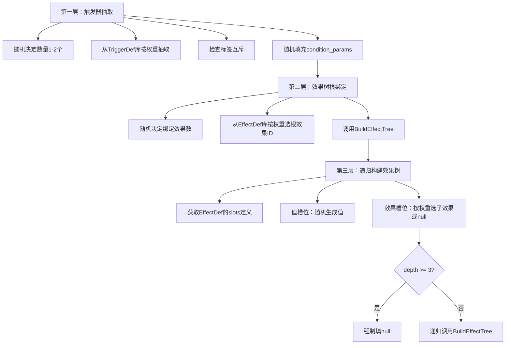

# 三层生成器

> 触发器抽取与效果树构建流程

---

## 当前定位

三层生成器属于**内容装配层**，不是整个项目的引擎本体。

它的职责是：

- 在引擎已经提供 `TriggerDef`、`EffectDef`、执行器和事件系统之后
- 用随机或半随机的方式组装出一组非常规能力结构

也就是说：

- 引擎先成立
- 生成器再接入

如果把生成器当成项目主干，就会把“开放规则引擎”误写成“随机植物系统”。

---

## 概述

三层生成器负责从静态定义创建运行时实例，分为三个递进步骤：触发器抽取、效果树根绑定、递归构建效果树。

---

## 生成流程总览



---

## 第一层：触发器抽取

### 流程步骤

```plaintext
1. 随机决定触发器数量（1-2个）
2. 从TriggerDef库按权重抽取
3. 检查标签互斥
4. 随机填充condition_params
5. 创建TriggerInstance
```

### 权重配置

| 触发器 | 权重 | 说明 |
|--------|------|------|
| periodically | 100 | 周期性触发 |
| when_damaged | 60 | 受伤触发 |
| on_death | 30 | 死亡触发 |
| on_click | 15 | 点击触发 |

### 代码示例

```csharp
List<TriggerInstance> ExtractTriggers(PlantConfig config) {
    var triggers = new List<TriggerInstance>();
    var triggerDefs = TriggerDefLibrary.GetAll();

    // 随机决定数量
    int count = Random.Range(1, 3);

    for (int i = 0; i < count; i++) {
        // 按权重抽取
        var def = triggerDefs.SelectByWeight(t => t.weight);

        // 检查互斥
        if (!CheckMutualExclusion(triggers, def)) {
            continue;
        }

        // 填充参数
        var params = FillConditionParams(def);

        // 创建实例
        var instance = new TriggerInstance {
            def_id = def.trigger_id,
            event_name = def.event_name,
            condition_values = params,
            is_enabled = true
        };

        triggers.Add(instance);
    }

    return triggers;
}
```

### 参数填充

```csharp
Dictionary<string, object> FillConditionParams(TriggerDef def) {
    var params = new Dictionary<string, object>();

    foreach (var paramDef in def.condition_params) {
        switch (paramDef.type) {
            case "int":
                params[paramDef.name] = Random.Range(paramDef.min, paramDef.max + 1);
                break;
            case "float":
                params[paramDef.name] = Random.Range((float)paramDef.min, (float)paramDef.max);
                break;
            case "bool":
                params[paramDef.name] = Random.value > 0.5f;
                break;
            case "string":
                params[paramDef.name] = SelectRandomString(paramDef.name);
                break;
        }
    }

    return params;
}
```

---

## 第二层：效果树根绑定

### 流程步骤

```plaintext
1. 为每个触发器随机决定绑定效果数
2. 从EffectDef库按权重选根效果ID
3. 调用BuildEffectTree构建效果树
4. 将效果树绑定到触发器
```

### 权重配置

| 效果 | 权重 | 说明 |
|------|------|------|
| shoot | 100 | 发射 |
| damage | 80 | 伤害 |
| explode | 25 | 爆炸 |
| summon | 20 | 召唤 |

### 代码示例

```csharp
void BindEffectTrees(List<TriggerInstance> triggers) {
    var effectDefs = EffectDefLibrary.GetAll();

    foreach (var trigger in triggers) {
        // 随机决定绑定效果数
        int count = Random.Range(1, trigger.max_bound_effects + 1);

        for (int i = 0; i < count; i++) {
            // 按权重选根效果
            var def = effectDefs.SelectByWeight(e => e.weight);

            // 构建效果树
            var effectTree = BuildEffectTree(def, 0);

            // 绑定到触发器
            trigger.bound_effects.Add(effectTree);
        }
    }
}
```

---

## 第三层：递归构建效果树

### 流程步骤

```plaintext
1. 获取EffectDef的slots定义
2. 值槽位：随机生成值
3. 效果槽位：按权重选子效果或null
4. 深度 >= 3 时强制填null
5. 递归调用BuildEffectTree
```

### 槽位填充权重

| 槽位类型 | 选项 | 权重 |
|----------|------|------|
| 效果槽位 | null | 50 |
| 效果槽位 | damage | 30 |
| 效果槽位 | explode | 15 |
| 效果槽位 | summon | 5 |

### 代码示例

```csharp
EffectNode BuildEffectTree(EffectDef def, int depth) {
    var node = new EffectNode {
        effect_id = def.effect_id,
        params = new Dictionary<string, object>(),
        children = new Dictionary<string, EffectNode>()
    };

    // 深度限制
    if (depth >= 3) {
        return node;
    }

    // 填充槽位
    foreach (var slot in def.slots) {
        if (slot.type == "value") {
            // 值槽位：随机生成值
            node.params[slot.name] = GenerateValue(slot);
        } else if (slot.type == "effect") {
            // 效果槽位：按权重选子效果或null
            var childEffectId = SelectChildEffect(slot.allowed_types);
            if (childEffectId == "null") {
                node.children[slot.name] = new EffectNode { effect_id = "null" };
            } else {
                var childDef = EffectDefLibrary.Get(childEffectId);
                node.children[slot.name] = BuildEffectTree(childDef, depth + 1);
            }
        }
    }

    return node;
}
```

### 值生成

```csharp
object GenerateValue(SlotDef slot) {
    switch (slot.value_type) {
        case "int":
            return Random.Range(slot.min, slot.max + 1);
        case "float":
            return Random.Range((float)slot.min, (float)slot.max);
        case "bool":
            return Random.value > 0.5f;
        case "string":
            return SelectRandomString(slot.name);
        default:
            return null;
    }
}
```

### 子效果选择

```csharp
string SelectChildEffect(string[] allowedTypes) {
    var options = new List<(string id, int weight)> {
        ("null", 50)
    };

    foreach (var type in allowedTypes) {
        if (type == "null") continue;

        var def = EffectDefLibrary.Get(type);
        if (def != null) {
            options.Add((type, def.weight));
        }
    }

    return options.SelectByWeight(o => o.weight).id;
}
```

---

## 完整生成流程

```csharp
Plant GeneratePlant(PlantConfig config) {
    // 第一层：触发器抽取
    var triggers = ExtractTriggers(config);

    // 第二层：效果树根绑定
    BindEffectTrees(triggers);

    // 创建植物实例
    var plant = new Plant {
        position = config.position,
        health = config.health,
        triggerComponent = new TriggerComponent {
            triggers = triggers
        }
    };

    // 订阅事件
    foreach (var trigger in triggers) {
        EventManager.Subscribe(trigger.event_name, (eventData) => {
            if (!trigger.is_enabled) return;

            var strategy = TriggerStrategyRegistry.Get(trigger.def_id);
            if (strategy.CheckCondition(eventData, trigger.condition_values, plant.state)) {
                // 执行效果树
                foreach (var effectTree in trigger.bound_effects) {
                    ExecuteEffectTree(effectTree, eventData);
                }

                // 更新冷却
                trigger.last_triggered_time = Time.time;
            }
        });
    }

    return plant;
}
```

---

## 生成示例

### 示例1：周期性射击植物

```
触发器：periodically (interval: 2.0)
└── 效果树：shoot (speed: 15.0)
    └── on_hit: damage (damage: 20)
        └── on_damage: null
```

**效果**：每2秒发射一颗子弹，命中造成20点伤害

---

### 示例2：受伤爆炸植物

```
触发器：when_damaged (threshold: 10, probability: 0.5)
└── 效果树：explode (radius: 3)
    └── on_explosion: summon (entity: bomb, count: 1)
        └── on_summon: null
```

**效果**：受到10点以上伤害时，有50%概率爆炸，并召唤一个炸弹

---

### 示例3：死亡连锁植物

```
触发器1：periodically (interval: 3.0)
└── 效果树：shoot (speed: 10.0)
    └── on_hit: explode (radius: 2)
        └── on_explosion: null

触发器2：on_death
└── 效果树：summon (entity: ghost, count: 3)
    └── on_summon: explode (radius: 1)
        └── on_explosion: null
```

**效果**：每3秒发射子弹，命中爆炸；死亡时召唤3个幽灵，幽灵爆炸

---

## 权重调控策略

### 动态权重

权重可以根据游戏状态动态调整：

```csharp
int GetDynamicWeight(string id, GameState state) {
    var baseWeight = WeightConfig.GetBaseWeight(id);

    // 根据难度调整
    if (state.difficulty == "hard") {
        baseWeight *= 0.8f;
    }

    // 根据玩家等级调整
    if (state.playerLevel < 5) {
        baseWeight *= 1.2f;
    }

    return (int)baseWeight;
}
```

### 稀有度控制

通过权重控制稀有效果的生成概率：

```csharp
// 稀有效果权重降低
if (def.tags.Contains("rare")) {
    weight *= 0.3f;
}

// 传说效果权重更低
if (def.tags.Contains("legendary")) {
    weight *= 0.1f;
}
```

---

## 相关链接

- [触发器系统](../02-runtime-protocol/03-触发器系统.md) - 触发器详细设计
- [效果系统](../02-runtime-protocol/04-效果系统.md) - 效果详细设计
- [执行机制](../02-runtime-protocol/06-执行机制.md) - 效果树执行流程
- [命名与可视化](09-命名与可视化.md) - 植物命名与展示


