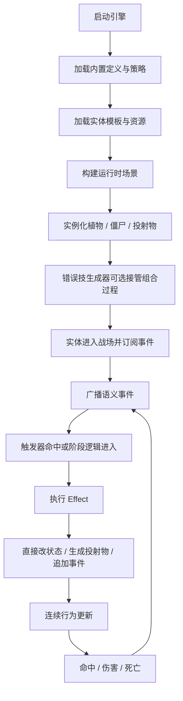

# 完整工作流

> 这篇文档描述的不是某一株随机植物的专属流程，而是从引擎定义到错误技实例运行的完整链路。

---

## 总览

当前项目的完整工作流应按下面三段理解：

1. **引擎准备阶段**
2. **内容实例化阶段**
3. **运行时事件链阶段**

“错误技”只是在第二段和第三段里的重点验证内容，不是完整工作流的全部。

---

## 完整工作流图



---

## 阶段 1：引擎准备

这个阶段的目标是把规则运行时准备好。

### 核心工作

1. 初始化 `Autoload`
2. 注册内置事件语义
3. 注册基础 `EffectStrategy`
4. 注册基础 `TriggerStrategy`
5. 加载内置 `Resource` 定义

### 结果

完成后，系统应已经具备：

- 可广播事件
- 可执行效果
- 可实例化模板
- 可进行最小调试追踪

---

## 阶段 2：内容实例化

这个阶段负责把“定义”变成“可运行实体”。

### 普通模板路径

普通情况下，流程是：

1. 读取 `EntityTemplate`
2. 组装根节点与组件
3. 写入初始 `state`
4. 挂接触发器和效果引用

### 错误技路径

错误技系统会在这里介入。

它并不替代引擎，而是利用引擎提供的能力做高表达度组合：

1. 抽取触发器
2. 绑定效果树
3. 递归构建组合
4. 生成一个非常规但仍合法的实体能力结构

因此错误技生成器应该被理解为：

- 一个建立在引擎之上的内容装配器

而不是：

- 一个独立于引擎存在的系统

---

## 阶段 3：运行时事件链

实体进入战场后，真正决定行为的是运行时事件链。

### 核心链路

```text
EventBus
-> TriggerInstance / 阶段逻辑
-> EffectExecutor
-> Damage / SpawnProjectile / StateChange / PushEvent
-> EventBus
```

### 这条链为什么重要

因为它同时支撑：

- 原版式常规行为
- 自定义组合行为
- 错误技式非常规连锁

如果这条链不稳定，后面的所有玩法表达都会失去根基。

---

## 当前阶段最小闭环

第一阶段真正需要跑通的，不是整个宏大工作流，而是下面这个缩小版：

1. 实例化一个植物模板
2. 植物拥有一个触发器
3. 触发器关联一个效果组合
4. 事件被广播
5. 效果执行
6. 生成投射物或直接伤害
7. 命中后继续触发后续事件

只要这条最小闭环稳定，后续才谈得上：

- 错误技生成
- 数据包加载
- 编辑器和更复杂内容

---

## 当前最需要的调试观测点

在完整工作流中，第一阶段至少需要能看到：

- 当前广播了什么事件
- 哪个触发器命中了条件
- 哪个效果被执行
- 当前事件链深度是多少
- 哪个投射物命中了谁
- 哪个实体状态发生了变化

这不是附属功能，而是这套工作流是否可持续开发的前提。

---

## 工作流中的边界提醒

当前最需要反复提醒自己的边界有三条：

### 1. 不要把错误技生成器写成引擎本体

它是重要功能，但不是引擎定义本身。

### 2. 不要把具体植物逻辑写成核心抽象

核心层应该服务组合，而不是绑定具体单位。

### 3. 不要把连续行为塞进离散事件补丁

投射物、轨迹、偏转等应该有自己的运行时位置。

---

## 相关文档

- [项目定位与总体架构](../01-overview/00-核心架构总览.md)
- [系统架构](../01-overview/02-系统架构.md)
- [三层生成器](05-三层生成器.md)
- [执行机制](../02-runtime-protocol/06-执行机制.md)
- [当前阶段与实现路线](../01-overview/23-当前阶段与实现路线.md)


