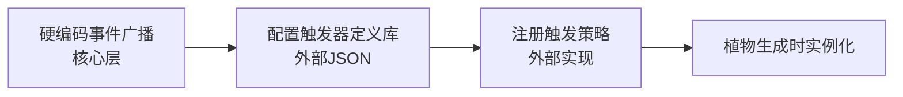
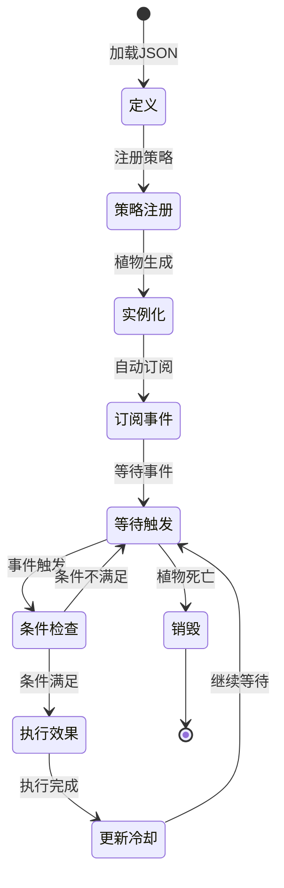

# 触发器系统

> 事件插座机制详解

---

## 当前实现约束

第一阶段结合参考实现后的推荐做法：

- `TriggerDef` 先使用 Godot `Resource` 或脚本内静态定义
- `TriggerInstance` 挂在植物根节点的 `TriggerComponent` 上
- 触发订阅通过 `Autoload` 事件总线完成
- `TriggerStrategy` 仍然保持纯逻辑，不直接操纵场景树

也就是说，触发器系统继续保留 `Def / Instance / Strategy` 三层抽象，但其落地形式应优先适配 Godot 工作流，而不是先围绕外部 JSON 和完整 Mod 热加载展开。

这里的示例目前仍然大量使用“植物”，只是因为错误技系统当前主要以植物为验证载体；抽象本身应继续朝向更通用的实体模板体系演进。

---

## 三层结构

### 1. 静态定义（TriggerDef）—— 触发器"蓝图"

TriggerDef 是触发器的静态配置，定义了触发器的基本属性和参数。

**JSON 结构**

```json
{
  "trigger_id": "when_damaged",
  "event_name": "plant.damaged",
  "max_bound_effects": 1,
  "condition_params": [
    {"name": "damage_threshold", "type": "int", "min": 0, "max": 999},
    {"name": "probability", "type": "float", "min": 0.0, "max": 1.0}
  ],
  "tags": []
}
```

**字段说明**

| 字段 | 类型 | 说明 |
|------|------|------|
| `trigger_id` | string | 触发器唯一标识符 |
| `event_name` | string | 绑定的事件名（核心层硬编码） |
| `max_bound_effects` | int | 最多绑定的效果树数量 |
| `condition_params` | array | 条件参数定义列表 |
| `tags` | array | 标签，用于互斥检查和分类 |

**condition_params 结构**

```json
{
  "name": "damage_threshold",
  "type": "int",
  "min": 0,
  "max": 999
}
```

| 字段 | 类型 | 说明 |
|------|------|------|
| `name` | string | 参数名 |
| `type` | string | 参数类型（int, float, bool, string） |
| `min` | number | 最小值（数值类型） |
| `max` | number | 最大值（数值类型） |

---

### 2. 动态实例（TriggerInstance）—— 触发器"实体"

TriggerInstance 是运行时的触发器实例，从 TriggerDef 克隆而来。

**生成时机**

植物生成时从定义克隆，每个植物持有1-2个触发器实例。

**核心字段**

```csharp
class TriggerInstance {
    string def_id;                          // 引用哪个定义
    string event_name;                      // 绑定的事件名
    List<EffectNode> bound_effects;         // 绑定的效果树根节点列表
    Dictionary<string, object> condition_values;  // 填充的参数值
    float last_triggered_time;               // 上次触发时间（防刷屏）
    bool is_enabled;                        // 是否启用
}
```

**字段说明**

| 字段 | 类型 | 说明 |
|------|------|------|
| `def_id` | string | 引用的 TriggerDef ID |
| `event_name` | string | 订阅的事件名 |
| `bound_effects` | List<EffectNode> | 绑定的效果树根节点 |
| `condition_values` | Dictionary | 填充的条件参数值 |
| `last_triggered_time` | float | 上次触发时间，用于冷却控制 |
| `is_enabled` | bool | 是否启用 |

---

### 3. 触发策略（TriggerStrategy）—— 触发器"大脑"

TriggerStrategy 是触发器的执行逻辑，本质是纯函数。

**本质**

```csharp
bool CheckCondition(EventData eventData, Dictionary<string, object> params, PlantState state)
```

**注册**

```csharp
TriggerStrategyRegistry.Register("trigger_id", strategy);
```

**职责**

- 严格检查条件
- 无副作用
- 不依赖全局状态
- 返回布尔值表示是否触发

**示例**

```csharp
// 周期性触发策略
TriggerStrategyRegistry.Register("periodically", (eventData, params, state) => {
    float interval = (float)params["interval"];
    float gameTime = (float)eventData["gameTime"];
    return gameTime % interval < 0.1f;
});

// 受伤触发策略
TriggerStrategyRegistry.Register("when_damaged", (eventData, params, state) => {
    int damage = (int)eventData["damage"];
    int threshold = (int)params["damage_threshold"];
    float probability = (float)params["probability"];

    if (damage < threshold) return false;
    if (Random.value > probability) return false;
    return true;
});
```

---

## 触发器库构建流程



---

### 第1步：硬编码事件广播（核心层）

核心层在特定时机广播事件，触发器订阅这些事件。

**常见事件**

```plaintext
// 植物被攻击时
Broadcast("plant.damaged", {plantId: 123, damage: 25, attackerId: 456, position: (x,y)});

// 植物死亡时
Broadcast("plant.died", {plantId: 123, position: (x,y), killerId: 456});

// 时钟更新时
Broadcast("game.tick", {gameTime: 123.45});

// 植物被点击时
Broadcast("plant.clicked", {plantId: 123, position: (x,y)});
```

**相关文档**
- [事件模型](07-事件模型.md) - 事件系统详解

---

### 第2步：配置触发器定义库（第一阶段推荐使用 Resource）

长期看可以用 JSON 或外部包格式定义触发器库，但第一阶段更推荐先用 Godot `Resource` 或静态表定义。

原因：

- 更容易在编辑器中修改和调试
- 少一层解析错误来源
- 更适合快速搭建最小闭环

下方 JSON 结构仍然保留，作为逻辑示意。

**示例**

```json
[
  {
    "trigger_id": "periodically",
    "event_name": "game.tick",
    "max_bound_effects": 2,
    "condition_params": [
      {"name": "interval", "type": "float", "min": 0.5, "max": 10.0}
    ]
  },
  {
    "trigger_id": "when_damaged",
    "event_name": "plant.damaged",
    "max_bound_effects": 1,
    "condition_params": [
      {"name": "damage_threshold", "type": "int", "min": 0, "max": 999},
      {"name": "probability", "type": "float", "min": 0.0, "max": 1.0}
    ]
  },
  {
    "trigger_id": "on_death",
    "event_name": "plant.died",
    "max_bound_effects": 3,
    "condition_params": []
  }
]
```

---

### 第3步：注册触发策略（外部实现）

在外部模块中注册触发策略。

```csharp
// 初始化时注册
void InitTriggerStrategies() {
    TriggerStrategyRegistry.Register("periodically", PeriodicallyStrategy);
    TriggerStrategyRegistry.Register("when_damaged", WhenDamagedStrategy);
    TriggerStrategyRegistry.Register("on_death", OnDeathStrategy);
}
```

---

### 第4步：植物生成时实例化

植物生成时从触发器库随机选择并实例化。

**流程**

```plaintext
1. 从触发器库按权重随机选1-2个定义
2. 为每个定义创建实例：
   a. 拷贝def_id和event_name
   b. 按condition_params范围随机填充参数
   c. 绑定1-max_bound_effects个效果树根节点
3. 将实例存入植物的TriggerComponent
4. 实例通过 `Autoload EventBus` 订阅同名事件
```

**权重配置**

| 触发器 | 权重 | 说明 |
|--------|------|------|
| periodically | 100 | 周期性触发 |
| when_damaged | 60 | 受伤触发 |
| on_death | 30 | 死亡触发 |
| on_click | 15 | 点击触发 |

**相关文档**
- [三层生成器](05-三层生成器.md) - 生成流程详解

---

## 触发器互斥机制

某些触发器之间存在互斥关系，不能同时绑定到同一个植物。

**互斥规则**

- `ManualTrigger` 互斥：一个植物只能有一个手动触发器
- 标签互斥：相同标签的触发器不能同时存在

**实现**

```csharp
bool CheckTriggerMutualExclusion(List<TriggerInstance> existing, TriggerDef newDef) {
    // 检查手动触发器互斥
    if (newDef.tags.Contains("manual")) {
        if (existing.Any(t => t.def.tags.Contains("manual"))) {
            return false;
        }
    }

    // 检查标签互斥
    foreach (var tag in newDef.tags) {
        if (existing.Any(t => t.def.tags.Contains(tag))) {
            return false;
        }
    }

    return true;
}
```

---

## 触发器生命周期



---

## 冷却与防刷屏

> **详细实现请参考** [执行机制](06-执行机制.md) - 冷却机制

### 冷却机制概览

- 每个触发器实例维护 `last_triggered_time`
- 策略中检查冷却时间
- 防止同一事件连续触发

---

## 相关链接

- [效果系统](04-效果系统.md) - 效果树绑定
- [三层生成器](05-三层生成器.md) - 触发器抽取流程
- [执行机制](06-执行机制.md) - 触发器执行流程
- [事件模型](07-事件模型.md) - 事件系统详解
- [扩展与数据包](11-扩展性与社区生态.md) - 新增触发器流程
