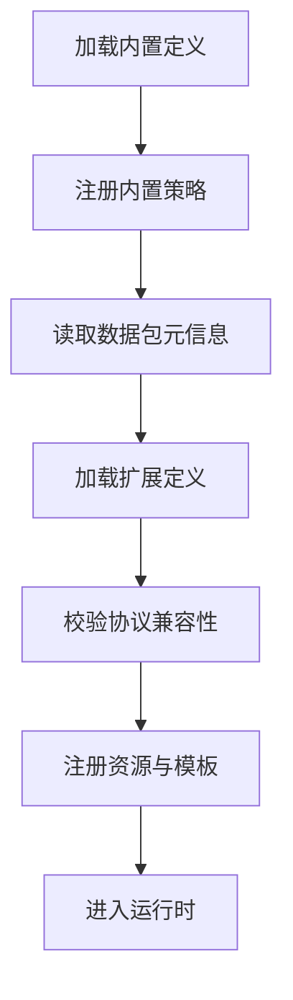

# 扩展与数据包

> 对当前项目来说，扩展性的重点不是社区平台，而是如何把引擎层能力稳定暴露给外部内容。

---

## 这篇文档真正关注什么

本页不再讨论工坊、排行榜或社区功能，而是只关注当前主线真正需要的扩展问题：

- 如何让外部内容接入引擎
- 哪些东西允许扩展
- 扩展和核心运行时的边界在哪里
- 后续数据包应该怎样组织

社区生态如果未来要做，也只能建立在这些基础能力稳定之后。

---

## 扩展目标

最终希望支持的不是“往现有固定游戏里塞一点新单位”，而是：

- 新增效果原子
- 新增实体模板
- 新增连续行为贡献项
- 新增资源与展示内容
- 重组已有单位逻辑

换句话说，扩展系统要服务的是**开放规则引擎**，而不只是服务内容追加。

---

## 建议的扩展边界

### 可以扩展的部分

- `EffectDef`
- `TriggerDef`
- `EntityTemplate`
- `MovementContributionDef`
- 贴图、音效、动画等资源

### 核心层应尽量稳定的部分

- 事件语义
- `Context` 基本结构
- `EntityState` 基本边界
- 效果执行协议
- 投射物命中回调协议

这条边界非常重要：

- 核心层频繁变化，扩展就失去意义
- 核心层完全僵死，扩展也会很快碰到天花板

当前项目应优先稳定“协议层”，再开放“内容层”。

---

## 数据包应包含什么

一个面向当前项目的数据包，建议至少包含以下几类内容：

```text
pack/
├── pack.json
├── effects/
├── triggers/
├── entities/
├── movement/
└── resources/
```

### `effects/`

定义效果原子和效果槽位。

### `triggers/`

定义触发条件与触发器参数。

### `entities/`

定义植物、僵尸、投射物或其他实体模板。

### `movement/`

定义连续行为贡献项或轨迹参数。

### `resources/`

存放贴图、音效、动画和其他表现资源。

---

## 第一阶段的现实做法

虽然长期目标是支持数据包和扩展加载，但第一阶段不必直接把这套外部格式做完。

当前更实际的推进顺序是：

1. 先用 Godot `Resource` 实现内置定义
2. 先把规则运行时和错误技闭环跑通
3. 再把内置定义抽象成可加载的数据包格式

这样做的好处：

- 少一层文件格式和解析负担
- 更容易在 Godot 编辑器里调试
- 更容易先稳定协议而不是格式

所以当前“扩展性”最重要的不是外部 JSON，而是：

> 先把内部抽象设计对。

---

## 扩展加载生命周期

后续扩展加载可以按这个顺序组织：



这里要注意：

- 先有内置能力，再允许扩展覆盖或追加
- 协议兼容检查要先于运行时接入
- 扩展失败不能把核心运行时拖死

---

## 对错误技系统意味着什么

错误技系统本质上非常依赖扩展性，因为它需要：

- 足够多的效果原子
- 足够灵活的组合方式
- 可继续追加的新能力

如果扩展边界设计不好，错误技就会很快退化成：

- 只是几组内置随机模板

而不是：

- 建立在开放规则引擎之上的持续扩展型表达系统

---

## 当前文档层面的结论

在当前项目里，“扩展性”应优先理解为：

- 引擎协议稳定
- 定义结构清晰
- 内容可组合
- 后续可被打包与加载

而不是：

- 社区工坊
- 排行榜
- 分享平台

后者如果未来要做，也只是更后面的应用层。

---

## 相关文档

- [项目定位与总体架构](../01-overview/00-核心架构总览.md)
- [效果系统](../02-runtime-protocol/04-效果系统.md)
- [触发器系统](../02-runtime-protocol/03-触发器系统.md)
- [当前阶段与实现路线](../01-overview/23-当前阶段与实现路线.md)


