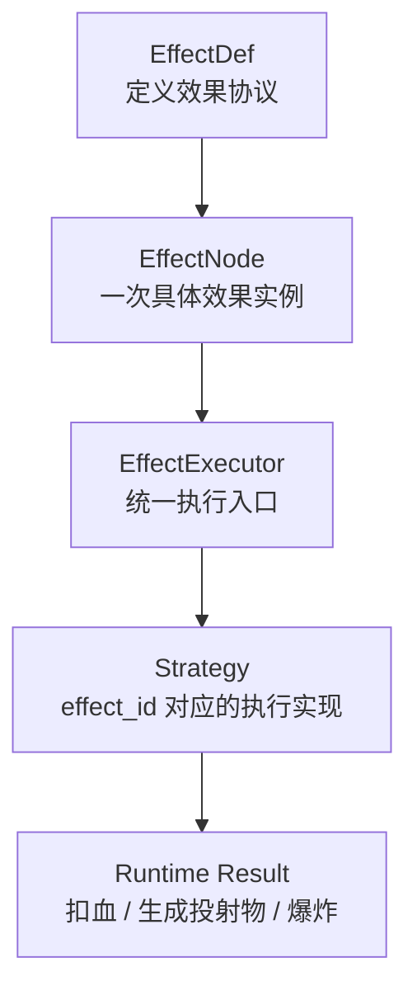

# 扩展包新增效果与效果外置策略

> 这篇文档不讨论“扩展包 UI 怎么做”或“社区平台怎么做”，只讨论一个更核心的问题：在当前 `Open PVZ` 的规则引擎架构里，未来如果希望通过扩展包新增原本不存在的效果，应该如何理解“效果外置”、`strategy` 和白名单/注册边界。

---

## 文档定位

这篇文档主要回答：

- 当前“新增效果”在架构上到底意味着什么
- 为什么“效果定义外置”和“效果执行外置”不是一回事
- 如果未来支持扩展包新增效果，白名单应如何演进
- 当前更适合采用什么样的扩展模型

这篇文档不负责：

- 直接定义最终版扩展包格式
- 直接落地加载器实现
- 代替效果系统文档
- 承诺所有未来扩展都能安全、平衡或高性能

配套阅读建议：

- [扩展与数据包](11-扩展性与社区生态.md)
- [扩展系统总体规划-v1](38-扩展系统总体规划-v1.md)
- [效果系统](../02-runtime-protocol/04-效果系统.md)
- [系统架构](../01-overview/02-系统架构.md)
- [核心设计哲学](../01-overview/01-核心设计哲学.md)

---

## 一句话结论

未来完全可以支持“扩展包新增原本不存在的效果”，但这件事不应被理解成：

- 只是多写一个新的 `effect_id`

而应被理解成：

> 把效果的“定义层”和“执行层”分开，然后让扩展包在受控注册体系里接入新的效果定义、乃至新的执行策略。

---

## 1. 当前事实与未来目标

### 当前事实

当前仓库里：

- `EffectDef` 已经是正式 `Resource`
- `EffectRegistry` 负责注册内置 `EffectDef`
- `EffectRegistry` 同时注册内置执行 `strategy`
- `EffectExecutor` 统一调度效果执行

也就是说，当前真正落地的是：

- 内置效果定义
- 内置效果执行策略
- 统一校验与执行链

当前还**没有**真正落地的是：

- 扩展包加载新的 `EffectDef`
- 扩展包注册新的 `strategy`
- 最终版外部扩展包兼容检查流程

### 未来目标

如果要把扩展性做成项目长期能力，最终希望支持的应该不是：

- 只能组合内置效果

而是：

- 新增效果原子
- 新增触发器原子
- 新增投射物/轨迹模式
- 把这些新增能力通过扩展包接入同一运行时

---

## 2. 先区分两件事：效果定义外置 vs 效果执行外置

这是讨论里最容易混淆的一点。

### 1. 效果定义外置

指把下面这些内容放到扩展包或外部资源里：

- `effect_id`
- 参数 schema
- 默认值
- 参数上下界
- `slot` 定义
- 标签或 capability 信息

这件事本质上是：

- 协议定义外置

### 2. 效果执行外置

指把下面这些也交给扩展包：

- 这个效果真正做什么
- 它如何选目标
- 如何修改状态
- 如何发事件
- 如何生成后续链路

这件事本质上是：

- 行为代码外置

两者的复杂度完全不同。

更准确地说：

- 效果定义外置比较像“数据扩展”
- 效果执行外置比较像“代码扩展”

---

## 3. `strategy` 在这里到底是什么

在当前项目里，`strategy` 就是：

> 某个 `effect_id` 在运行时到底怎么执行的那段实现。

关系可以简化成下面这样：

在当前仓库里：

- `EffectDef` 负责“允许怎么写”
- `EffectNode` 负责“这次具体怎么配”
- `EffectExecutor` 负责“按统一规则调度”
- `strategy` 负责“这个效果实际上怎么干活”

因此如果以后要允许扩展包新增“真正不存在的效果原子”，核心问题其实不是：

- 能不能新增一个 `effect_id`

而是：

- 扩展包能不能带来新的 `strategy`

---

## 4. 为什么新增一个原本不存在的效果，不只是纯数据问题

如果一个效果只是复用现有能力，比如：

- `damage`
- `explode`
- `spawn_projectile`

那么扩展包完全可以只通过组合已有 `EffectDef` 来表达。

但如果一个效果是原本不存在的新语义，比如：

- `knockback`
- `radial_burst`
- `chain_bounce`
- `phase_shift`

那它至少需要回答：

- 目标怎么选
- 状态怎么改
- 是否发事件
- 是否需要访问战斗运行时
- 是否会生成新投射物或新实体

这些都不是纯参数文件能独立解决的。

所以：

- “组合现有效果”可以是纯数据
- “新增全新效果原子”通常至少需要新的执行逻辑

---

## 5. 未来最合理的扩展模型

如果按当前项目目标继续演进，最合理的不是“所有扩展都一样”，而是分级。

### A. 数据扩展包

允许：

- 组合现有 `EffectDef`
- 组合现有 `TriggerDef`
- 新增 `EntityTemplate`
- 新增 `ProjectileTemplate`
- 新增 `TriggerBinding`
- 新增 `ProjectileFlightProfile`

特点：

- 只有数据，没有新的运行时代码
- 风险最低
- 最容易自动校验

### B. 协议扩展包

允许：

- 新增 `EffectDef`
- 新增 `TriggerDef`
- 新增参数 schema
- 新增 slot/capability 声明

特点：

- 仍然偏声明式
- 但开始影响协议集合
- 需要兼容检查

### C. 代码扩展包

允许：

- 新增 effect `strategy`
- 新增 trigger `strategy`
- 必要时新增某些运行时扩展入口

特点：

- 最强
- 也最接近真正的“扩展原子能力”

这三层不是必须一次性全部做完，但这是当前最合理的长期形态。

---

## 6. 白名单不应无限叠加，而应演进成注册系统

当前白名单在第三阶段是必要的，因为它负责收口主干。

但如果未来要支持扩展包新增效果，就不应继续把白名单理解成：

- 核心仓库里一张越来越长的 effect id 列表

更合理的未来形态是：

> 白名单从“固定枚举表”演进成“当前已注册且通过兼容检查的协议定义集合”。

也就是说：

- 核心层固定最小不变量
- 扩展包注册新的 `EffectDef`
- registry 在加载时做自动校验
- validator 按 schema 自动检查参数和 slot

这样真正稳定的不是“名字表”，而是：

- 核心协议
- 注册流程
- 兼容检查

---

## 7. 更抽象的实现方式：capability / tag，而不是纯 effect id 白名单

如果未来希望避免 slot 白名单无限膨胀，一个更抽象的做法是：

- 不只用 `allowed_effect_ids`
- 还允许用 `allowed_effect_tags` 或 capability 标签

例如当前：

- `spawn_projectile.on_hit` 只允许 `damage / explode`

未来更抽象的做法可以是：

- `spawn_projectile.on_hit` 允许 capability = `hit_response`

然后一个扩展包里的新效果只要声明：

- `tags = ["hit_response"]`

它就能自动进入这个 slot。

这样带来的好处是：

- 不需要每新增一个效果都去改核心列表
- slot 约束从“名字耦合”变成“能力耦合”

这更符合当前项目“语义固定、组合开放”的哲学。

---

## 8. 自动化能做什么，不能做什么

如果采用更开放的扩展模型，自动化最适合负责的是“接口层”。

### 自动化适合负责的部分

- `EffectDef` schema 校验
- 参数类型校验
- 资源类型校验
- slot 结构校验
- capability/tag 匹配校验
- 扩展包元信息与版本兼容检查
- 加载失败时的错误报告

### 自动化不必负责的部分

按当前项目定位，这些不一定需要核心替作者兜底：

- 数值平衡
- 玩法是否优雅
- 视觉是否混乱
- 组合是否“应该这么设计”

如果项目未来走“作者自负型扩展系统”，那么核心层只需要保证：

- 接口能接上
- 注册不会把主干直接炸死
- 链深等最低限度自保边界仍然存在

而不需要承担商业产品那种“对所有扩展语义正确性负责”的责任。

---

## 9. 当前更适合的推荐方向

如果结合当前仓库状态，我建议把未来路线理解成下面这三步。

### 第一步：先支持“数据包组合现有效果”

目标：

- 不改执行器架构
- 先让扩展包组合已有 `EffectDef`

### 第二步：再支持“扩展包声明新的 `EffectDef`”

目标：

- 把效果定义从内置资源推广到外部注册资源
- 让 validator 和 registry 自动接住这些定义

### 第三步：最后支持“扩展包注册新的 `strategy`”

目标：

- 允许真正新增原本不存在的效果原子
- 但仍通过 registry 和版本边界接入，而不是直接改核心源码

这个顺序的意义在于：

- 先把“外置定义”做稳
- 再开放“外置执行”

---

## 10. 当前文档层面的结论

如果把这轮讨论收成一句话，当前最合理的结论是：

> 未来可以把效果逐步外置，并允许扩展包新增原本不存在的效果；但更合理的路径是“定义先外置、执行后扩展”，并让白名单逐步演进成受控注册体系，而不是无限手工叠加。

---

## 相关文档

- [扩展与数据包](11-扩展性与社区生态.md)
- [效果系统](../02-runtime-protocol/04-效果系统.md)
- [系统架构](../01-overview/02-系统架构.md)
- [核心设计哲学](../01-overview/01-核心设计哲学.md)
