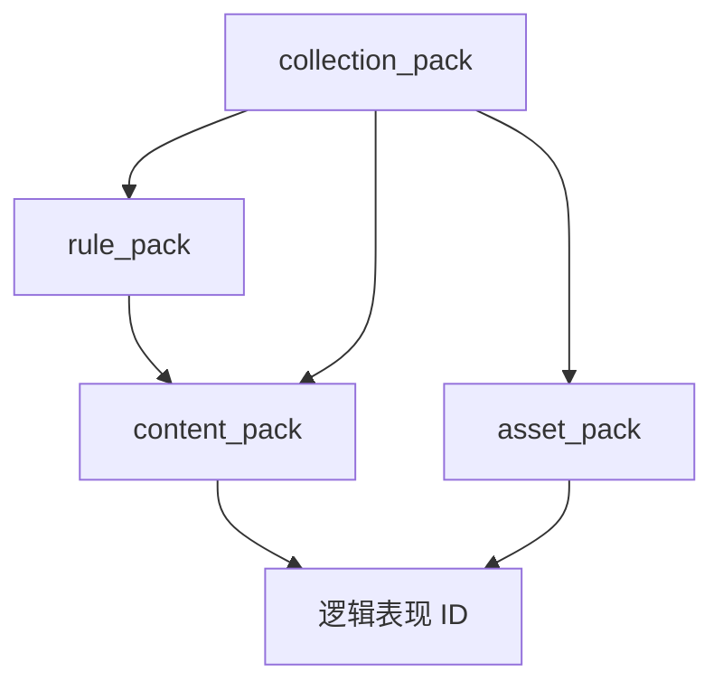

# 扩展包边界与依赖规则

- 状态：正式设计
- 提升日期：2026-05-17
- 来源草案：`plans/draft/extension-system/40-扩展包边界与依赖规则-v1.md`
- 配套阅读：[扩展系统总体规划](38-扩展系统总体规划.md)、[通用扩展插槽机制](42-通用扩展插槽机制.md)、[素材包系统与本地私有包](44-素材包系统与本地私有包.md)、[扩展包 manifest 规范](45-扩展包Manifest规范.md)

---

## 一句话结论

Open PVZ 扩展包正式按四类边界治理：

| 包类型 | 回答的问题 | 典型内容 |
|--------|------------|----------|
| `rule_pack` | 平台新增了什么规则能力 | Effect / Trigger / Detection / Controller / Movement / Mechanic compiler |
| `content_pack` | 用已有平台能力做了哪些玩法内容 | Archetype、ProjectileTemplate、Card、Wave、Scenario |
| `asset_pack` | 这些内容在视觉、音频和主题层面如何表现 | VisualProfile、actor scene、Action Recipe、VisualFx、AudioCue、贴图、音效、UI |
| `collection_pack` | 哪些包应组合成一套完整体验 | 包组合、启用顺序、推荐主题、战役/入口 |

这四类包不能混用：规则包不承载内容正文，内容包不承载真实素材，素材包不改变玩法逻辑，集合包不复制前三类包的正文。

---

## 当前代码事实

当前仓库已经落地的是“slot 扫描 + RegistryBase 注册”机制，而不是完整包平台。

代码事实以 [extension_pack_catalog.gd](../../scripts/core/runtime/extension_pack_catalog.gd) 和 [registry_base.gd](../../scripts/core/registry/registry_base.gd) 为准：

- 扫描根当前为 `res://extensions` 与 `res://local_extensions`，以及 manifest guardrail 专用的 `res://extensions_manifest_fixtures`。
- manifest 兼容字段当前为 `pack_id`、`enabled_by_default`、`register`、`trust_level`、`capabilities`、`activation_cli_flags`、`activation_scenario_ids`。
- 当前有效信任级别是 `data_only`、`rule_extended`、`trusted_runtime`。
- 当前有效 register kind 包括 `resources`、`effects`、`projectile_movement`、`mechanic_compilers`、`triggers`、`detections`、`controllers`、`visual_cues`、`visual_fx`、`audio_cues`、`visual_profiles`。
- `pack_type`、`dependencies`、`entry_points`、`asset_index`、`collection` 仍是正式设计目标，尚未全部由加载器执行。

因此本文是正式边界设计，但实现应按“兼容当前 loader，逐步补齐完整 manifest”的路线落地。

---

## 四类包的职责边界

### rule_pack

`rule_pack` 扩展平台能力。

它可以提供：

- `EffectDef`
- `TriggerDef`
- `DetectionDef`
- `ControllerDef`
- `ProjectileMovementDef`
- `MechanicCompilerDef`
- 必要的受控 strategy/runtime script

它不应提供：

- 大量植物、僵尸、关卡、卡片正文
- 真实贴图、音频、actor scene
- UI 主题资源

信任级别：

- 纯数据规则贡献可为 `data_only` 或 `rule_extended`。
- 需要运行时代码的 slot 必须为 `trusted_runtime`，以当前 `RegistryConfig.required_trust` 为准。

### content_pack

`content_pack` 扩展玩法内容。

它可以提供：

- `CombatArchetype`
- `ProjectileTemplate`
- 卡片、波次、关卡、验证场景
- 图鉴和内容元数据

它不应提供：

- 新运行时代码
- 新 strategy
- 真实素材文件
- 主题切换逻辑

内容包只引用逻辑表现 ID，例如：

```text
entity.plant.peashooter.visual
projectile.pea.visual
card.plant.peashooter.icon
```

不应直接引用某个原始贴图或本地导出路径。

### asset_pack

`asset_pack` 扩展表现资源。

结合当前 `.reanim` 迁移现实，asset_pack 不只是“图片包”，还应覆盖 Godot 可运行视觉资源：

- `VisualProfileDef`
- actor scene / composite actor scene
- Action Recipe / Part Slot 配置
- `VisualFxDef`
- `AudioCueDef`
- 贴图、音效、UI 资源
- 导入报告、生成元数据和资源索引

它不应提供：

- 玩法数值
- 战斗规则
- 关卡正文
- 目标查询、伤害、冷却等规则行为

asset_pack 可以通过 `theme_override` 为相同逻辑素材 ID 提供不同实现。

### collection_pack

`collection_pack` 组织多个包成为一套体验。

它可以提供：

- 默认启用包列表
- 推荐素材包
- 战役或章节入口
- 包加载顺序和组合元数据

它不应提供：

- 大量内容正文
- 大量素材正文
- 新规则实现

如果 collection_pack 依赖本地私有素材包，它本身也应视为 `local_private`，默认不发布。

---

## 依赖规则

正式依赖方向如下：



约束：

- `rule_pack` 不依赖 `content_pack`。
- `content_pack` 可以依赖 `rule_pack`。
- `asset_pack` 不依赖具体内容文件路径，只依赖逻辑表现 ID 体系。
- `collection_pack` 可以依赖前三类包，但不复制前三类包正文。
- 包与包之间默认不做 override；素材包的主题覆盖是明确例外。

---

## 公开包与本地私有包

原版图像迁移暴露出一个必须正式化的边界：包不只有类型，还有发布策略。

| 发布策略 | 说明 | 典型包 |
|----------|------|--------|
| `public` | 可提交、可发布、可被 CI/验证消费 | 规则包、内容包、占位素材包、公开语义包 |
| `local_private` | 本机可用，默认 ignored，不进入发布物 | 原版素材包、原版导出 actor、依赖私有素材的整合包 |

原版迁移建议拆分为：

```text
public:
  openpvz_classic_semantics     # 语义、Action Recipe 模板、导入 manifest 模板
  openpvz_classic_content       # 玩法内容，只引用逻辑表现 ID
  openpvz_placeholder_assets    # 合法占位素材

local_private:
  classic_original_assets       # 原版 png/ogg/reanim 派生产物、actor scene、visual profiles
  classic_original_collection   # 组合 classic content + local original assets
```

公开包不得引用 `vendor/out_files`，不得包含原版 `.reanim/.png/.ogg`，也不得包含由原版素材生成的派生产物。

---

## 覆盖规则

| 包类型 | 默认覆盖策略 | 说明 |
|--------|--------------|------|
| `rule_pack` | add-only | 默认只新增平台能力，不覆盖 `core.*` |
| `content_pack` | namespace add-only | 默认只新增自己命名空间下内容 |
| `asset_pack` | theme_override | 可为同一逻辑表现 ID 提供不同资源 |
| `collection_pack` | composition-only | 只做装配和启用顺序 |

`core.*` 命名空间由主仓保留。当前 `RegistryBase` 已在注册阶段拒绝外部包覆盖 `core.*` contributor。

---

## 判断一个新文件属于哪种包

1. 它新增规则能力吗？是则归 `rule_pack`。
2. 它新增玩法内容吗？是则归 `content_pack`。
3. 它新增视觉、音频、主题或 actor scene 吗？是则归 `asset_pack`。
4. 它只组织包组合或入口吗？是则归 `collection_pack`。
5. 它包含原版素材或原版素材派生产物吗？无论类型如何，发布策略必须是 `local_private`。
