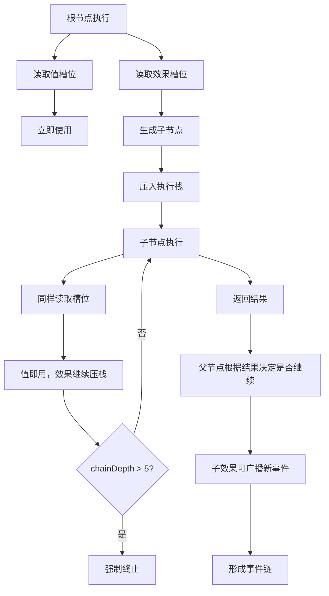

# 效果系统

> 可递归配置的效果节点详解

---

## 当前定位

在当前项目里，`Effect` 首先是**引擎层的原子行为单元**，而不是错误技系统私有的一种技能描述格式。

错误技系统会大量使用效果树，但效果系统本身应服务更大的目标：

- 常规单位行为组合
- 自定义单位行为组合
- 错误技组合与连锁
- 后续扩展包加载

第一阶段的实际做法建议是：

- `EffectDef` 优先使用 Godot `Resource` 或内置静态定义
- `EffectStrategy` 用脚本注册
- `EffectNode` 作为运行时组合结构

下方 JSON 结构保留为逻辑示意，而不是第一阶段唯一文件格式。

---

## 效果的本质：配置 + 策略 + 实例

### 1. 静态定义（EffectDef）—— 效果的"蓝图"

EffectDef 是效果的静态配置，定义了效果的槽位结构。

**JSON 结构**

```json
{
  "effect_id": "shoot",
  "slots": [
    {
      "name": "speed",
      "type": "value",
      "value_type": "float",
      "min": 5.0,
      "max": 20.0
    },
    {
      "name": "on_hit",
      "type": "effect",
      "allowed_types": ["damage", "explode", "summon", "null"]
    }
  ]
}
```

**字段说明**

| 字段 | 类型 | 说明 |
|------|------|------|
| `effect_id` | string | 效果唯一标识符 |
| `slots` | array | 槽位定义列表 |

**Slot 结构**

```json
{
  "name": "speed",
  "type": "value",
  "value_type": "float",
  "min": 5.0,
  "max": 20.0
}
```

| 字段 | 类型 | 说明 |
|------|------|------|
| `name` | string | 槽位名称 |
| `type` | string | 槽位类型（value/effect） |
| `value_type` | string | 值类型（int/float/bool/string），仅 value 类型 |
| `min` | number | 最小值，仅 value 类型 |
| `max` | number | 最大值，仅 value 类型 |
| `allowed_types` | array | 允许的子效果类型列表，仅 effect 类型 |

---

### 2. 动态实例（EffectNode）—— 效果的"血肉"

EffectNode 是运行时的效果节点，构成效果树。

**JSON 结构**

```json
{
  "effect_id": "shoot",
  "params": {"speed": 13.7},
  "children": {
    "on_hit": {
      "effect_id": "explode",
      "params": {"radius": 3},
      "children": {"on_explosion": {"effect_id": "null"}}
    }
  }
}
```

**字段说明**

| 字段 | 类型 | 说明 |
|------|------|------|
| `effect_id` | string | 效果ID |
| `params` | object | 值槽位的填充值 |
| `children` | object | 效果槽位的子节点 |

**代码结构**

```csharp
class EffectNode {
    string effect_id;                        // 效果ID
    Dictionary<string, object> params;       // 值槽位
    Dictionary<string, EffectNode> children; // 效果槽位
}
```

---

### 3. 执行策略（EffectStrategy）—— 效果的"灵魂"

EffectStrategy 是效果的执行逻辑，本质是纯函数。

**本质**

```csharp
EffectResult Execute(Context context, Dictionary<string, object> params, EffectNode[] children)
```

**注册**

```csharp
EffectStrategyRegistry.Register("effect_id", strategy);
```

**特点**

- 无状态
- 无副作用
- 可热插拔
- 纯计算

**示例**

```csharp
// 发射效果策略
EffectStrategyRegistry.Register("shoot", (context, params, children) => {
    float speed = (float)params["speed"];
    EffectNode onHit = children.FirstOrDefault(c => c.effect_id != "null");

    // 创建子弹
    var projectile = new Projectile(context.position, speed, onHit);
    projectile.Spawn();

    return new EffectResult { success = true };
});

// 爆炸效果策略
EffectStrategyRegistry.Register("explode", (context, params, children) => {
    float radius = (float)params["radius"];

    // 对范围内敌人造成伤害
    var enemies = GetEnemiesInRadius(context.position, radius);
    foreach (var enemy in enemies) {
        enemy.TakeDamage(20);
    }

    return new EffectResult { success = true };
});
```

---

## 类型系统：从原子到无限

### 原子类型（3个基石）

| 类型 | 说明 | 用途 |
|------|------|------|
| `value` | 存储标量或枚举 | 存储数值、布尔值、字符串等 |
| `effect` | 存储子效果树节点 | 构建递归效果树 |
| `null` | 空占位 | 终止效果树分支 |

---

### 一级分类（Category）—— "插座功能标签"

分类用于标识槽位的功能类型，动态注册。

**注册方式**

```csharp
TypeRegistry.RegisterCategory("trajectory", "value");
TypeRegistry.RegisterCategory("target_selector", "effect");
```

**常见分类**

| 分类 | 类型 | 说明 |
|------|------|------|
| `trajectory` | value | 子弹轨迹类型 |
| `target_selector` | effect | 目标选择逻辑 |
| `damage_formula` | value | 伤害计算公式 |
| `visual_vfx` | value | 视觉特效 |
| `death_vfx` | effect | 死亡特效 |
| `sound_fx` | value | 音效 |

---

### 二级标签（Tag）—— "电器型号"

标签用于标识具体的实现，每个分类下有多个实现，按权重随机抽取。

**权重池**

```json
{
  "trajectory": {
    "linear": 100,
    "sine": 60,
    "magnetic": 30,
    "homing": 15
  }
}
```

**动态注册**

```csharp
TagRegistry.RegisterTag("trajectory", "linear", 100);
TagRegistry.RegisterTag("trajectory", "sine", 60);
```

**随机抽取**

```csharp
string SelectTag(string category) {
    var tags = TagRegistry.GetTags(category);
    return tags.SelectByWeight();
}
```

---

## 效果树结构

### 树形结构示例

```
shoot (发射)
├── speed: 13.7 (值槽位)
└── on_hit (效果槽位)
    └── explode (爆炸)
        ├── radius: 3 (值槽位)
        └── on_explosion (效果槽位)
            └── null (终止)
```

---

## 效果树执行

### 执行流程



> **详细执行实现请参考** [执行机制](06-执行机制.md) - DFS遍历详解

---

## 效果库示例

### 基础效果

| 效果ID | 说明 | 槽位 |
|--------|------|------|
| `shoot` | 发射子弹 | speed, on_hit |
| `damage` | 造成伤害 | damage, target |
| `explode` | 爆炸 | radius, on_explosion |
| `summon` | 召唤实体 | entity_type, count, position |

### 复合效果

| 效果ID | 说明 | 槽位 |
|--------|------|------|
| `chain_lightning` | 连锁闪电 | damage, range, jump_count |
| `poison_cloud` | 毒雾 | duration, damage_per_tick, radius |
| `heal_aura` | 治疗光环 | radius, heal_amount, duration |

---

## 效果组合示例

### 示例1：爆炸射击

```json
{
  "effect_id": "shoot",
  "params": {"speed": 15.0},
  "children": {
    "on_hit": {
      "effect_id": "explode",
      "params": {"radius": 3},
      "children": {"on_explosion": {"effect_id": "null"}}
    }
  }
}
```

**效果**：发射子弹，命中后爆炸

---

### 示例2：召唤爆炸

```json
{
  "effect_id": "summon",
  "params": {
    "entity_type": "bomb",
    "count": 1,
    "position": "target"
  },
  "children": {
    "on_summon": {
      "effect_id": "explode",
      "params": {"radius": 5},
      "children": {"on_explosion": {"effect_id": "null"}}
    }
  }
}
```

**效果**：召唤炸弹，炸弹爆炸

---

### 示例3：连锁爆炸

```json
{
  "effect_id": "explode",
  "params": {"radius": 2},
  "children": {
    "on_explosion": {
      "effect_id": "summon",
      "params": {
        "entity_type": "mini_bomb",
        "count": 3,
        "position": "random_in_radius"
      },
      "children": {
        "on_summon": {
          "effect_id": "explode",
          "params": {"radius": 1},
          "children": {"on_explosion": {"effect_id": "null"}}
        }
      }
    }
  }
}
```

**效果**：爆炸后召唤3个小炸弹，小炸弹再爆炸

---

## 相关链接

- [触发器系统](03-触发器系统.md) - 触发器绑定效果树
- [三层生成器](05-三层生成器.md) - 效果树构建流程
- [执行机制](06-执行机制.md) - 效果树执行流程
- [扩展与数据包](11-扩展性与社区生态.md) - 新增效果流程
