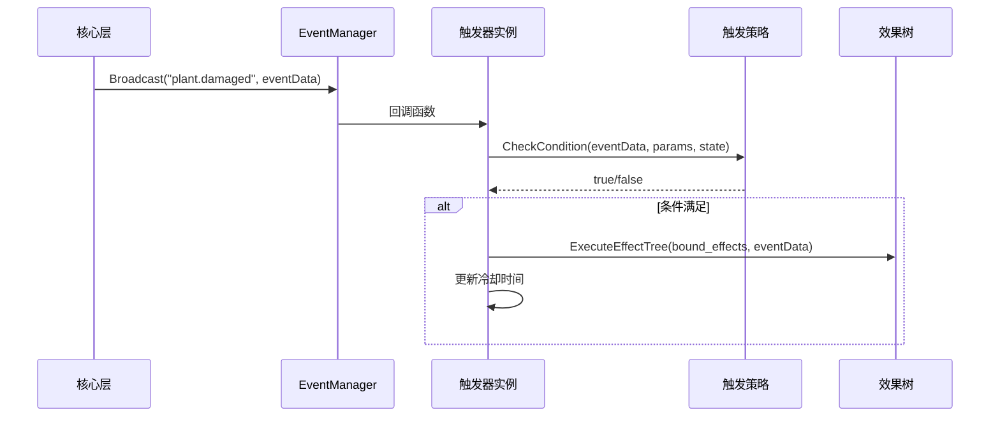
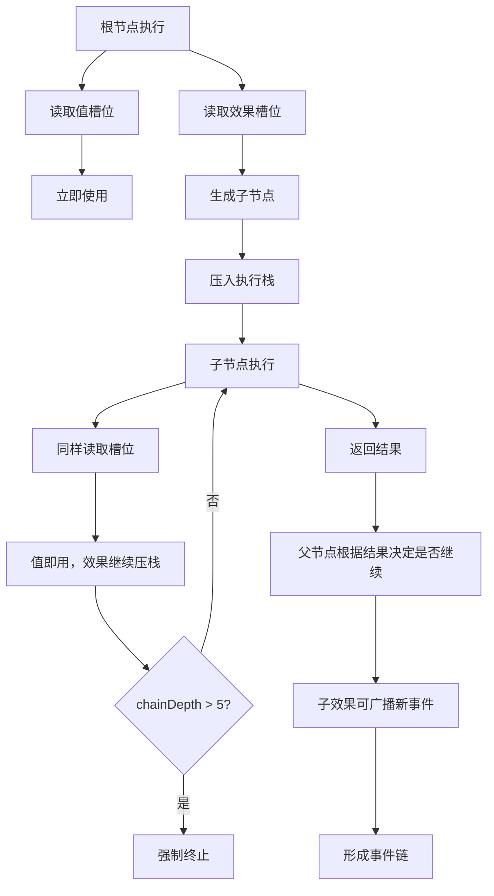

# 执行机制

> 事件驱动与DFS遍历详解

---

## 当前落地约束

结合参考实现后的当前建议：

- 事件系统优先使用 `Autoload EventBus`
- 触发器实例挂在实体节点上，但不直接彼此连接
- 效果执行器负责规则执行，不负责管理整场战斗
- 投射物命中后的后续效果，继续通过事件回到执行器

这意味着当前执行链应更接近：

`EventBus -> TriggerInstance -> EffectExecutor -> Projectile/Damage -> EventBus`

而不是一开始就拆成大而全的 ECS 系统矩阵。

---

## 事件驱动订阅-广播模式

### 执行流程



### 核心组件

#### EventManager（事件管理器）

在当前 Godot 原型阶段，这个 `EventManager` 更推荐实现为 `Autoload EventBus`，并附带：

- 事件历史
- 调试开关
- 基本优先级
- 可选的一次性订阅

参考实现已经证明，这种形式在 Godot 中比让节点之间大量直连信号更稳。

```csharp
class EventManager {
    private Dictionary<string, List<EventHandler>> _subscribers = new();

    public void Subscribe(string eventName, EventHandler handler) {
        if (!_subscribers.ContainsKey(eventName)) {
            _subscribers[eventName] = new List<EventHandler>();
        }
        _subscribers[eventName].Add(handler);
    }

    public void Broadcast(string eventName, EventData eventData) {
        if (_subscribers.ContainsKey(eventName)) {
            foreach (var handler in _subscribers[eventName]) {
                handler(eventData);
            }
        }
    }
}
```

#### TriggerInstance（触发器实例）

```csharp
class TriggerInstance {
    public string def_id;
    public string event_name;
    public List<EffectNode> bound_effects;
    public Dictionary<string, object> condition_values;
    public float last_triggered_time;
    public bool is_enabled;

    public void OnEvent(EventData eventData) {
        if (!is_enabled) return;

        var strategy = TriggerStrategyRegistry.Get(def_id);
        if (strategy.CheckCondition(eventData, condition_values, plantState)) {
            // 执行效果树
            foreach (var effectTree in bound_effects) {
                EffectExecutor.Execute(effectTree, eventData);
            }

            // 更新冷却
            last_triggered_time = Time.time;
        }
    }
}
```

---

## 效果树执行：DFS遍历

### 执行流程



### DFS遍历实现

```csharp
class EffectExecutor {
    private const int MAX_CHAIN_DEPTH = 5;

    public static EffectResult Execute(EffectNode node, Context context, int depth = 0) {
        // 深度检查
        if (depth > MAX_CHAIN_DEPTH) {
            return new EffectResult {
                success = false,
                terminated = true,
                reason = "Chain depth exceeded"
            };
        }

        // 获取策略
        var strategy = EffectStrategyRegistry.Get(node.effect_id);
        if (strategy == null) {
            return new EffectResult {
                success = false,
                reason = "Strategy not found"
            };
        }

        // 创建子上下文
        var childContext = CreateChildContext(context, node);

        // 执行策略
        var result = strategy.Execute(childContext, node.params);

        if (!result.success) {
            return result;
        }

        // 递归执行子效果
        foreach (var child in node.children.Values) {
            if (child.effect_id == "null") {
                continue;
            }

            var childResult = Execute(child, childContext, depth + 1);

            // 如果子效果终止，停止执行
            if (childResult.terminated) {
                break;
            }

            // 如果子效果失败，根据策略决定是否继续
            if (!childResult.success && !result.continueOnChildFail) {
                break;
            }
        }

        return result;
    }

    private static Context CreateChildContext(Context parent, EffectNode node) {
        return new Context {
            position = node.params.ContainsKey("position") ? node.params["position"] : parent.position,
            target = node.params.ContainsKey("target") ? node.params["target"] : parent.target,
            source = parent.source,
            chainDepth = parent.chainDepth + 1,
            timestamp = Time.time
        };
    }
}
```

### EffectResult 结构

```csharp
class EffectResult {
    public bool success;           // 是否成功
    public bool terminated;        // 是否被终止
    public bool continueOnChildFail; // 子效果失败时是否继续
    public string reason;          // 失败原因
    public Dictionary<string, object> data; // 附加数据
}
```

---

## 状态与上下文分离

### 上下文（Context）—— 只读快照

```csharp
class Context {
    public Vector3 position;      // 事件位置
    public Entity target;         // 目标实体
    public Entity source;         // 来源实体
    public int chainDepth;        // 连锁深度（只读）
    public float timestamp;       // 时间戳
    public Dictionary<string, object> core; // 核心数据
    public Dictionary<string, object> runtime; // 运行时数据
}
```

**特点**

- 只读快照，策略不能修改
- 每次执行创建新实例
- 包含执行所需的所有信息

---

### 状态（State）—— 可写字典

```csharp
class PlantState {
    public Dictionary<string, object> values;  // 充能、冷却等可写状态
    public Dictionary<string, float> cooldowns; // 冷却时间
    public Dictionary<string, int> charges;    // 充能次数

    public void SetValue(string key, object value) {
        values[key] = value;
    }

    public object GetValue(string key, object defaultValue = null) {
        return values.ContainsKey(key) ? values[key] : defaultValue;
    }

    public bool IsReady(string key, float cooldown) {
        if (!cooldowns.ContainsKey(key)) {
            return true;
        }
        return Time.time - cooldowns[key] >= cooldown;
    }

    public void SetCooldown(string key, float duration) {
        cooldowns[key] = Time.time;
    }
}
```

**特点**

- 可写状态，策略可以修改
- 持久化存储在实体中
- 用于冷却、充能等机制

---

## 冷却与防刷屏

### 冷却机制

```csharp
class TriggerInstance {
    public float last_triggered_time;

    public void OnEvent(EventData eventData) {
        // 检查冷却
        float cooldown = (float)condition_values["cooldown"];
        if (Time.time - last_triggered_time < cooldown) {
            return;
        }

        // 执行效果
        ExecuteEffects(eventData);

        // 更新冷却
        last_triggered_time = Time.time;
    }
}
```

### 防刷屏策略

1. **最小冷却时间**：每个触发器都有最小冷却时间
2. **事件合并**：同帧同类事件合并，减少调用次数
3. **频率限制**：限制单位时间内触发次数
4. **全局节流**：系统级别的触发频率限制

---

## 性能优化

### 函数缓存

```csharp
class EffectStrategyRegistry {
    private static Dictionary<string, EffectStrategy> _cache = new();

    public static EffectStrategy Get(string effectId) {
        if (!_cache.ContainsKey(effectId)) {
            _cache[effectId] = LoadStrategy(effectId);
        }
        return _cache[effectId];
    }

    private static EffectStrategy LoadStrategy(string effectId) {
        // 从配置加载策略
        var config = EffectConfigLibrary.Get(effectId);
        return new CompiledEffectStrategy(config);
    }
}
```

**优势**

- 避免重复加载
- 减少内存分配
- 提高执行速度

---

### 零反射

```csharp
// 策略实例启动时注册
void Init() {
    EffectStrategyRegistry.Register("shoot", ShootStrategy);
    EffectStrategyRegistry.Register("explode", ExplodeStrategy);
    EffectStrategyRegistry.Register("summon", SummonStrategy);
    // ...
}

// 运行时字典查找，无反射
var strategy = EffectStrategyRegistry.Get(effectId);
strategy.Execute(context, params);
```

**优势**

- 避免反射开销
- 提高执行速度
- 类型安全

---

### 惰性加载

```csharp
class ShootStrategy : EffectStrategy {
    public EffectResult Execute(Context context, Dictionary<string, object> params) {
        // 创建子弹
        var projectile = new Projectile(context.position, (float)params["speed"]);

        // 惰性加载on_hit效果
        projectile.onHitEffect = params.ContainsKey("on_hit")
            ? params["on_hit"] as EffectNode
            : null;

        projectile.Spawn();
        return new EffectResult { success = true };
    }

    // 子弹命中时才执行on_hit效果
    class Projectile {
        public void OnHit(Entity target) {
            if (onHitEffect != null && onHitEffect.effect_id != "null") {
                EffectExecutor.Execute(onHitEffect, new Context {
                    position = target.position,
                    target = target,
                    source = this
                });
            }
        }
    }
}
```

**优势**

- 减少内存占用
- 提高生成速度
- 按需执行

---

### 事件合并

```csharp
class EventManager {
    private Dictionary<string, List<EventData>> _pendingEvents = new();

    public void Broadcast(string eventName, EventData eventData) {
        if (!_pendingEvents.ContainsKey(eventName)) {
            _pendingEvents[eventName] = new List<EventData>();
        }
        _pendingEvents[eventName].Add(eventData);
    }

    public void Flush() {
        foreach (var pair in _pendingEvents) {
            // 合并同类事件
            var merged = MergeEvents(pair.Value);
            foreach (var handler in _subscribers[pair.Key]) {
                handler(merged);
            }
        }
        _pendingEvents.Clear();
    }

    private EventData MergeEvents(List<EventData> events) {
        var merged = new EventData();
        merged.core = new Dictionary<string, object>();
        merged.runtime = new Dictionary<string, object>();

        // 合并核心数据
        foreach (var event_ in events) {
            foreach (var pair in event_.core) {
                if (!merged.core.ContainsKey(pair.Key)) {
                    merged.core[pair.Key] = pair.Value;
                } else if (pair.Key == "damage") {
                    // 伤害累加
                    merged.core[pair.Key] = (int)merged.core[pair.Key] + (int)pair.Value;
                }
            }
        }

        return merged;
    }
}
```

**优势**

- 减少事件调用次数
- 提高执行效率
- 降低CPU负载

---

## 错误处理

### 触发器错误

```csharp
class TriggerInstance {
    public void OnEvent(EventData eventData) {
        try {
            // 检查条件
            var strategy = TriggerStrategyRegistry.Get(def_id);
            if (!strategy.CheckCondition(eventData, condition_values, plantState)) {
                return;
            }

            // 执行效果树
            foreach (var effectTree in bound_effects) {
                EffectExecutor.Execute(effectTree, eventData);
            }

            // 更新冷却
            last_triggered_time = Time.time;
        } catch (Exception e) {
            Debug.LogError($"Trigger error: {e.Message}");
            is_enabled = false;
        }
    }
}
```

### 效果错误

```csharp
class EffectExecutor {
    public static EffectResult Execute(EffectNode node, Context context, int depth = 0) {
        try {
            // 深度检查
            if (depth > MAX_CHAIN_DEPTH) {
                return new EffectResult {
                    success = false,
                    terminated = true,
                    reason = "Chain depth exceeded"
                };
            }

            // 获取策略
            var strategy = EffectStrategyRegistry.Get(node.effect_id);
            if (strategy == null) {
                Debug.LogWarning($"Effect strategy not found: {node.effect_id}");
                return new EffectResult {
                    success = false,
                    reason = "Strategy not found"
                };
            }

            // 执行策略
            var result = strategy.Execute(context, node.params);

            // 递归执行子效果
            foreach (var child in node.children.Values) {
                if (child.effect_id == "null") continue;

                var childResult = Execute(child, context, depth + 1);
                if (childResult.terminated) break;
            }

            return result;
        } catch (Exception e) {
            Debug.LogError($"Effect error: {e.Message}");
            return new EffectResult {
                success = false,
                reason = e.Message
            };
        }
    }
}
```

---

## 相关链接

- [事件模型](07-事件模型.md) - 事件系统详解
- [触发器系统](03-触发器系统.md) - 触发器执行
- [效果系统](04-效果系统.md) - 效果树结构
- [性能与安全防护](10-性能与安全防护.md) - 性能优化策略
