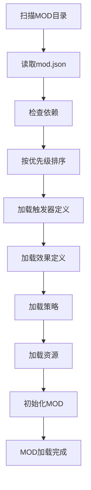

# 扩展性与社区生态

> 配置驱动与MOD开发

---

## 概述

扩展性与社区生态系统通过配置文件驱动、MOD开发接口和社区分享机制，允许用户和开发者扩展游戏内容，打造开放的社区生态。

---

## 配置文件驱动

### 原则

所有机制（触发器/效果/策略）通过JSON/XML定义。

### 优势

| 优势 | 说明 |
|------|------|
| 易于修改 | 无需重新编译 |
| 易于分享 | 配置文件可独立分发 |
| 易于调试 | 配置文件可读性强 |
| 易于版本控制 | 配置文件可纳入版本控制 |

---

### 热更新

**原理**

运行时重载配置，无需重启游戏。

**实现**

```csharp
class ConfigManager {
    private static Dictionary<string, object> _configs = new();
    private static FileSystemWatcher _watcher;

    public static void Init() {
        LoadConfigs();
        SetupWatcher();
    }

    private static void LoadConfigs() {
        var files = Directory.GetFiles("configs", "*.json");
        foreach (var file in files) {
            var config = JsonUtility.FromJson<Dictionary<string, object>>(File.ReadAllText(file));
            foreach (var pair in config) {
                _configs[pair.Key] = pair.Value;
            }
        }
    }

    private static void SetupWatcher() {
        _watcher = new FileSystemWatcher("configs");
        _watcher.Filter = "*.json";
        _watcher.Changed += OnConfigChanged;
        _watcher.EnableRaisingEvents = true;
    }

    private static void OnConfigChanged(object sender, FileSystemEventArgs e) {
        Debug.Log($"Config changed: {e.Name}");
        LoadConfigs();
        ReloadStrategies();
    }

    private static void ReloadStrategies() {
        // 重新加载策略
        TriggerStrategyRegistry.Reload();
        EffectStrategyRegistry.Reload();
    }

    public static T Get<T>(string key) {
        return (T)_configs[key];
    }
}
```

**使用**

```csharp
// 初始化
ConfigManager.Init();

// 获取配置
var damage = ConfigManager.Get<int>("shoot.damage");
```

---

## 社区分享机制

### 植物存档

**格式**

```json
{
  "name": "§kQ3.9xFα",
  "traversal_string": "shoot(params:speed=13.7,children:on_hit=explode(params:radius=3,children:on_explosion=null))",
  "timestamp": 1234567890
}
```

**生成**

```csharp
class PlantSaver {
    public static string Save(Plant plant) {
        var saveData = new {
            name = plant.name,
            traversal_string = EffectTreeSerializer.Serialize(plant.effectTree),
            timestamp = DateTimeOffset.UtcNow.ToUnixTimeSeconds()
        };
        return JsonUtility.ToJson(saveData);
    }
}
```

---

### 分享码

> **详细实现请参考** [命名与可视化](09-命名与可视化.md) - 分享码生成

### 导入与导出

**导出**

```csharp
class PlantExporter {
    public static void ExportToFile(Plant plant, string path) {
        var shareCode = ShareCodeGenerator.Generate(plant);
        File.WriteAllText(path, shareCode);
    }

    public static void ExportToClipboard(Plant plant) {
        var shareCode = ShareCodeGenerator.Generate(plant);
        GUIUtility.systemCopyBuffer = shareCode;
    }
}
```

**导入**

```csharp
class PlantImporter {
    public static Plant ImportFromFile(string path) {
        var shareCode = File.ReadAllText(path);
        return ShareCodeParser.Parse(shareCode);
    }

    public static Plant ImportFromClipboard() {
        var shareCode = GUIUtility.systemCopyBuffer;
        return ShareCodeParser.Parse(shareCode);
    }
}
```

---

## MOD开发流程

### 新增触发器

**步骤**

1. 在核心层PR添加事件广播
2. 配置TriggerDef
3. 注册TriggerStrategy

**步骤1：添加事件广播**

```csharp
class CoreLayer {
    public void OnPlantHealed(Entity plant, int amount) {
        var eventData = new EventData {
            core = new Dictionary<string, object> {
                ["plant"] = plant.id,
                ["amount"] = amount
            },
            runtime = new Dictionary<string, object> {
                ["event_id"] = Guid.NewGuid().ToString(),
                ["depth"] = 1,
                ["timestamp"] = Time.time
            }
        };

        EventManager.Broadcast("plant.healed", eventData);
    }
}
```

**步骤2：配置TriggerDef**

```json
{
  "trigger_id": "when_healed",
  "event_name": "plant.healed",
  "max_bound_effects": 1,
  "condition_params": [
    {"name": "heal_threshold", "type": "int", "min": 0, "max": 999},
    {"name": "probability", "type": "float", "min": 0.0, "max": 1.0}
  ],
  "tags": []
}
```

**步骤3：注册TriggerStrategy**

```csharp
class MyMod {
    public void Init() {
        TriggerStrategyRegistry.Register("when_healed", (eventData, params, state) => {
            int amount = (int)eventData.core["amount"];
            int threshold = (int)params["heal_threshold"];
            float probability = (float)params["probability"];

            if (amount < threshold) return false;
            if (Random.value > probability) return false;
            return true;
        });
    }
}
```

---

### 新增效果

**步骤**

1. 配置EffectDef
2. 注册EffectStrategy
3. 可在其他效果的allowed_types中引用

**步骤1：配置EffectDef**

```json
{
  "effect_id": "poison",
  "slots": [
    {
      "name": "damage_per_tick",
      "type": "value",
      "value_type": "int",
      "min": 1,
      "max": 10
    },
    {
      "name": "duration",
      "type": "value",
      "value_type": "float",
      "min": 1.0,
      "max": 10.0
    }
  ]
}
```

**步骤2：注册EffectStrategy**

```csharp
class MyMod {
    public void Init() {
        EffectStrategyRegistry.Register("poison", (context, params) => {
            int damagePerTick = (int)params["damage_per_tick"];
            float duration = (float)params["duration"];

            var target = context.target;
            target.AddEffect(new PoisonEffect {
                damagePerTick = damagePerTick,
                duration = duration
            });

            return new EffectResult { success = true };
        });
    }
}
```

**步骤3：在其他效果中引用**

```json
{
  "effect_id": "shoot",
  "slots": [
    {
      "name": "speed",
      "type": "value",
      "value_type": "float",
      "min": 5.0,
      "max": 20.0
    },
    {
      "name": "on_hit",
      "type": "effect",
      "allowed_types": ["damage", "explode", "summon", "poison", "null"]
    }
  ]
}
```

---

### 新增分类

**调用**

```csharp
TypeRegistry.RegisterCategory("death_vfx", "value");
```

**使用**

```json
{
  "effect_id": "summon",
  "slots": [
    {
      "name": "death_vfx",
      "type": "value",
      "value_type": "string",
      "allowed_values": ["explosion", "implosion", "fade_out"]
    }
  ]
}
```

---

## MOD结构

### 推荐目录结构

```
MyMod/
├── mod.json              # MOD元数据
├── triggers/             # 触发器定义
│   └── when_healed.json
├── effects/              # 效果定义
│   └── poison.json
├── strategies/           # 策略实现
│   ├── TriggerStrategies.cs
│   └── EffectStrategies.cs
├── assets/               # 资源文件
│   ├── textures/
│   ├── models/
│   └── sounds/
└── README.md             # MOD说明
```

### mod.json

```json
{
  "id": "mymod",
  "name": "My Mod",
  "version": "1.0.0",
  "author": "Your Name",
  "description": "A sample mod",
  "dependencies": [],
  "load_priority": 100
}
```

---

## MOD加载器

### 加载流程



### 实现

```csharp
class ModLoader {
    public static void LoadMods() {
        var modDirs = Directory.GetDirectories("mods");

        var mods = new List<ModInfo>();
        foreach (var dir in modDirs) {
            var modInfo = LoadModInfo(dir);
            mods.Add(modInfo);
        }

        // 按优先级排序
        mods = mods.OrderByDescending(m => m.loadPriority).ToList();

        // 加载MOD
        foreach (var mod in mods) {
            LoadMod(mod);
        }
    }

    private static ModInfo LoadModInfo(string dir) {
        var json = File.ReadAllText(Path.Combine(dir, "mod.json"));
        return JsonUtility.FromJson<ModInfo>(json);
    }

    private static void LoadMod(ModInfo mod) {
        Debug.Log($"Loading mod: {mod.name}");

        // 加载触发器定义
        LoadTriggerDefs(mod.dir);

        // 加载效果定义
        LoadEffectDefs(mod.dir);

        // 加载策略
        LoadStrategies(mod.dir);

        // 加载资源
        LoadAssets(mod.dir);

        // 初始化MOD
        var assembly = LoadAssembly(mod.dir);
        var initMethod = assembly.GetType($"{mod.id}.ModInit")?.GetMethod("Init");
        initMethod?.Invoke(null, null);

        Debug.Log($"Mod loaded: {mod.name}");
    }
}
```

---

## 版本兼容性

### 向前兼容

**原则**

导入时反序列化，重新生成名称和图标（确保版本兼容）。

**实现**

```csharp
class VersionCompatibility {
    public static Plant ImportFromLegacy(string legacyData) {
        // 解析旧版本数据
        var legacy = JsonUtility.FromJson<LegacyPlantData>(legacyData);

        // 转换为新版本格式
        var effectTree = ConvertEffectTree(legacy.effectTree);
        var timestamp = DateTimeOffset.UtcNow.ToUnixTimeSeconds();

        // 重新生成名称
        var name = NameGenerator.Generate(effectTree, timestamp);

        return new Plant {
            effectTree = effectTree,
            name = name,
            timestamp = timestamp
        };
    }
}
```

### 版本检查

```csharp
class VersionChecker {
    public static bool IsCompatible(string requiredVersion, string currentVersion) {
        var required = new Version(requiredVersion);
        var current = new Version(currentVersion);
        return current >= required;
    }
}
```

---

## 社区功能

### 工坊集成

**上传**

```csharp
class WorkshopUploader {
    public static async void UploadPlant(Plant plant) {
        var shareCode = ShareCodeGenerator.Generate(plant);
        var metadata = new {
            name = plant.name,
            description = TooltipGenerator.Generate(plant),
            shareCode = shareCode,
            author = PlayerManager.LocalPlayer.name
        };

        await WorkshopAPI.Upload(metadata);
    }
}
```

**下载**

```csharp
class WorkshopDownloader {
    public static async void DownloadPlant(string plantId) {
        var metadata = await WorkshopAPI.GetMetadata(plantId);
        var plant = ShareCodeParser.Parse(metadata.shareCode);
        PlantManager.AddPlant(plant);
    }
}
```

---

### 排行榜

```csharp
class Leaderboard {
    public static async void SubmitScore(string plantId, int score) {
        await LeaderboardAPI.SubmitScore(plantId, score);
    }

    public static async void GetTopPlants(int count) {
        var plants = await LeaderboardAPI.GetTopPlants(count);
        DisplayLeaderboard(plants);
    }
}
```

---

## 相关链接

- [触发器系统](03-触发器系统.md) - 触发器开发
- [效果系统](04-效果系统.md) - 效果开发
- [命名与可视化](09-命名与可视化.md) - 分享码生成
- [三层生成器](05-三层生成器.md) - 植物生成
