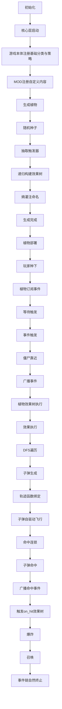

# 完整工作流

> 从初始化到事件链终止的全流程

---

## 概述

完整工作流描述了系统从初始化到事件链终止的完整流程，包括植物生成、部署、触发和执行等所有环节。

---

## 完整工作流图



---

## 阶段1：初始化

### 流程

```plaintext
1. 核心层启动
2. 游戏本体注册基础分类与策略
3. MOD注册自定义内容
```

### 代码示例

```csharp
class GameInitializer {
    public static void Init() {
        // 核心层启动
        CoreLayer.Init();

        // 游戏本体注册基础分类与策略
        RegisterBaseCategories();
        RegisterBaseStrategies();

        // MOD注册自定义内容
        ModLoader.LoadMods();

        Debug.Log("Game initialized");
    }

    private static void RegisterBaseCategories() {
        TypeRegistry.RegisterCategory("trajectory", "value");
        TypeRegistry.RegisterCategory("target_selector", "effect");
        TypeRegistry.RegisterCategory("damage_formula", "value");
        TypeRegistry.RegisterCategory("visual_vfx", "value");
        TypeRegistry.RegisterCategory("death_vfx", "effect");
        TypeRegistry.RegisterCategory("sound_fx", "value");
    }

    private static void RegisterBaseStrategies() {
        // 注册触发策略
        TriggerStrategyRegistry.Register("periodically", PeriodicallyStrategy);
        TriggerStrategyRegistry.Register("when_damaged", WhenDamagedStrategy);
        TriggerStrategyRegistry.Register("on_death", OnDeathStrategy);

        // 注册效果策略
        EffectStrategyRegistry.Register("shoot", ShootStrategy);
        EffectStrategyRegistry.Register("damage", DamageStrategy);
        EffectStrategyRegistry.Register("explode", ExplodeStrategy);
        EffectStrategyRegistry.Register("summon", SummonStrategy);
    }
}
```

---

## 阶段2：生成植物

### 流程

```plaintext
1. 随机种子
2. 抽取触发器
3. 递归构建效果树
4. 熵灌注命名
5. 生成完成
```

### 代码示例

```csharp
class PlantGenerator {
    public static Plant Generate(PlantConfig config) {
        // 随机种子
        var seed = Random.Range(0, int.MaxValue);
        Random.InitState(seed);

        // 抽取触发器
        var triggers = ExtractTriggers(config);

        // 递归构建效果树
        BindEffectTrees(triggers);

        // 创建植物实例
        var plant = new Plant {
            position = config.position,
            health = config.health,
            maxHealth = config.health,
            triggerComponent = new TriggerComponent {
                triggers = triggers
            }
        };

        // 熵灌注命名
        plant.name = NameGenerator.Generate(plant.effectTree, seed);

        // 生成完成
        Debug.Log($"Plant generated: {plant.name}");

        return plant;
    }
}
```

---

## 阶段3：植物部署

### 流程

```plaintext
1. 玩家种下
2. 植物订阅事件
3. 等待触发
```

### 代码示例

```csharp
class PlantDeployer {
    public static void Deploy(Plant plant) {
        // 玩家种下
        plant.position = GetGridPosition();
        plant.isDeployed = true;

        // 植物订阅事件
        SubscribeEvents(plant);

        // 等待触发
        Debug.Log($"Plant deployed: {plant.name} at {plant.position}");
    }

    private static void SubscribeEvents(Plant plant) {
        foreach (var trigger in plant.triggerComponent.triggers) {
            trigger.Subscribe();
        }
    }
}
```

---

## 阶段4：事件触发

### 流程

```plaintext
1. 僵尸靠近
2. 广播事件
3. 植物效果树执行
```

### 代码示例

```csharp
class CoreLayer {
    public void OnZombieNearby(Entity zombie, Entity plant) {
        // 僵尸靠近
        var eventData = new EventData {
            core = new Dictionary<string, object> {
                ["zombie"] = zombie.id,
                ["plant"] = plant.id,
                ["distance"] = Vector3.Distance(zombie.position, plant.position)
            },
            runtime = new Dictionary<string, object> {
                ["event_id"] = Guid.NewGuid().ToString(),
                ["depth"] = 1,
                ["timestamp"] = Time.time
            }
        };

        // 广播事件
        EventManager.Broadcast("zombie.nearby", eventData);
    }
}
```

---

## 阶段5：效果执行

### 流程

```plaintext
1. DFS遍历
2. 子弹生成
3. 轨迹函数绑定
4. 子弹自驱动飞行
```

### 代码示例

```csharp
class ShootStrategy : EffectStrategy {
    public EffectResult Execute(Context context, Dictionary<string, object> params) {
        float speed = (float)params["speed"];
        EffectNode onHit = params.ContainsKey("on_hit")
            ? params["on_hit"] as EffectNode
            : null;

        // 子弹生成
        var projectile = new Projectile {
            position = context.position,
            direction = GetDirection(context.target),
            speed = speed,
            onHitEffect = onHit
        };

        // 轨迹函数绑定
        projectile.trajectory = TrajectoryFactory.CreateFromConfig(params["trajectory"] as JSONObject);

        // 子弹自驱动飞行
        projectile.Spawn();

        return new EffectResult { success = true };
    }
}
```

---

## 阶段6：命中连锁

### 流程

```plaintext
1. 子弹命中
2. 广播命中事件
3. 触发on_hit效果树
4. 爆炸
5. 召唤
6. 事件链自然终止
```

### 代码示例

```csharp
class Projectile {
    public void OnHit(Entity target) {
        // 子弹命中
        var eventData = new EventData {
            core = new Dictionary<string, object> {
                ["projectile"] = this.id,
                ["target"] = target.id,
                ["damage"] = damage
            },
            runtime = new Dictionary<string, object> {
                ["event_id"] = Guid.NewGuid().ToString(),
                ["depth"] = 2,
                ["timestamp"] = Time.time
            }
        };

        // 广播命中事件
        EventManager.Broadcast("projectile.hit", eventData);

        // 触发on_hit效果树
        if (onHitEffect != null && onHitEffect.effect_id != "null") {
            var result = EffectExecutor.Execute(onHitEffect, new Context {
                position = target.position,
                target = target,
                source = this
            });

            // 检查是否终止
            if (result.terminated) {
                Debug.Log("Event chain terminated");
            }
        }

        // 销毁子弹
        Destroy();
    }
}
```

---

## 事件链示例

### 示例1：周期性射击

```
game.tick (时钟更新)
  ↓
periodically触发器检查条件
  ↓
条件满足，执行效果树
  ↓
shoot效果执行
  ↓
子弹生成
  ↓
子弹飞行
  ↓
projectile.hit (子弹命中)
  ↓
damage效果执行
  ↓
僵尸受伤
  ↓
事件链终止（深度=2）
```

---

### 示例2：受伤爆炸

```
plant.damaged (植物受伤)
  ↓
when_damaged触发器检查条件
  ↓
条件满足，执行效果树
  ↓
explode效果执行
  ↓
爆炸伤害
  ↓
zombie.damaged (僵尸受伤)
  ↓
zombie.died (僵尸死亡)
  ↓
summon效果执行
  ↓
召唤新僵尸
  ↓
事件链终止（深度=3）
```

---

### 示例3：死亡连锁

```
plant.died (植物死亡)
  ↓
on_death触发器检查条件
  ↓
条件满足，执行效果树
  ↓
summon效果执行
  ↓
召唤炸弹
  ↓
bomb.died (炸弹死亡)
  ↓
explode效果执行
  ↓
爆炸伤害
  ↓
zombie.died (僵尸死亡)
  ↓
summon效果执行
  ↓
召唤幽灵
  ↓
事件链终止（深度=5）
```

---

## 错误处理

> **详细实现请参考** [执行机制](06-执行机制.md) - 错误处理

### 错误处理概览

- 触发器错误：捕获异常，禁用触发器
- 效果错误：捕获异常，返回失败结果
- 深度超限：自动终止，返回终止标志

---

## 相关链接

- [三层生成器](05-三层生成器.md) - 植物生成流程
- [执行机制](06-执行机制.md) - 效果执行流程
- [事件模型](07-事件模型.md) - 事件系统
- [触发器系统](03-触发器系统.md) - 触发器执行
- [效果系统](04-效果系统.md) - 效果树执行
