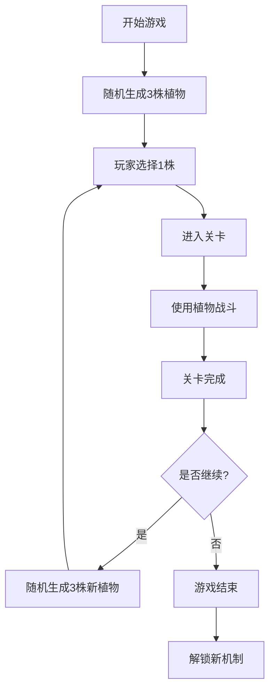
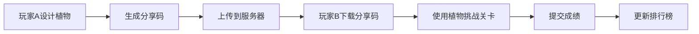

# 游戏设计方向

> 玩法模式演进与机制深度扩展

---

## 概述

游戏设计方向规划了系统的未来玩法模式演进和机制深度扩展，包括Roguelike冒险模式、沙盒创造模式、异步PvP模式等。

---

## 玩法模式演进

### Roguelike冒险模式

**核心机制**

- 每局游戏植物完全随机生成，玩家从3选1
- 引入"道具池污染"机制
- 局外成长：解锁新机制到库中

**流程**



**道具池污染**

```plaintext
- 每次选择植物后，未选择的植物进入"污染池"
- 污染池中的植物在后续生成中权重降低
- 鼓励玩家尝试不同组合，避免重复选择
```

**局外成长**

```json
{
  "progression": {
    "level": 5,
    "unlocked_triggers": ["periodically", "when_damaged"],
    "unlocked_effects": ["shoot", "damage", "explode"],
    "unlocked_categories": ["trajectory", "target_selector"]
  }
}
```

---

### 沙盒创造模式

**核心机制**

- 开放完全自定义界面，玩家可手动搭建效果树
- 社区挑战：每周限定机制池
- 图鉴收集：生成过的植物自动存入图鉴

**自定义界面**

```plaintext
┌─────────────────────────────────┐
│  效果树编辑器                  │
├─────────────────────────────────┤
│  [触发器]                      │
│  ○ 周期性  ○ 受伤  ○ 死亡    │
│                                │
│  [效果树]                      │
│  ┌───────────────────────────┐  │
│  │ shoot                   │  │
│  │ ├── speed: 15.0         │  │
│  │ └── on_hit:            │  │
│  │     └── explode         │  │
│  │         ├── radius: 3.0  │  │
│  │         └── on_explosion:│  │
│  │             └── null     │  │
│  └───────────────────────────┘  │
│                                │
│  [预览] [保存] [分享]          │
└─────────────────────────────────┘
```

**社区挑战**

```json
{
  "weekly_challenge": {
    "id": "week_42",
    "theme": "爆炸连锁",
    "restricted_effects": ["shoot"],
    "required_effects": ["explode"],
    "bonus_tags": ["chain", "aoe"]
  }
}
```

**图鉴收集**

```json
{
  "collection": {
    "total_discovered": 42,
    "unique_plants": [
      {
        "name": "§kQ3.9xFα",
        "discovered_at": "2026-03-31T15:00:00Z",
        "times_used": 5
      }
    ]
  }
}
```

---

### 异步PvP模式

**核心机制**

- 玩家A设计植物 → 分享码 → 玩家B用该植物挑战关卡
- 排行榜：根据通关时间/难度对植物评分

**流程**



**排行榜**

| 排名 | 植物名称 | 设计者 | 通关时间 | 难度评分 |
|------|----------|--------|----------|----------|
| 1 | §zK8.pL3β | PlayerA | 120s | 9.5 |
| 2 | †mB9.x2PΩ | PlayerB | 135s | 9.2 |
| 3 | ¶kQ3.9xFα | PlayerC | 150s | 8.8 |

**评分系统**

```csharp
class PlantScorer {
    public static float CalculateScore(Plant plant, float clearTime, int difficulty) {
        // 基础分：通关时间越短分越高
        float timeScore = 1000.0f / clearTime;

        // 难度加成
        float difficultyBonus = difficulty * 0.1f;

        // 稀有度加成
        float rarityBonus = GetRarityBonus(plant.name);

        return timeScore + difficultyBonus + rarityBonus;
    }

    private static float GetRarityBonus(string name) {
        if (name.StartsWith("†")) return 2.0f;
        if (name.StartsWith("¶")) return 1.0f;
        if (name.StartsWith("§")) return 0.5f;
        return 0.0f;
    }
}
```

---

## 机制深度扩展

### 二级触发器体系

**核心机制**

- 引入"触发器前置条件"
- 触发器组合逻辑：`and`/`or`/`xor`

**前置条件**

```json
{
  "trigger_id": "when_damaged_and_low_health",
  "event_name": "plant.damaged",
  "preconditions": {
    "operator": "and",
    "conditions": [
      {
        "type": "health_below",
        "value": 30
      },
      {
        "type": "cooldown_ready",
        "value": "emergency_skill"
      }
    ]
  },
  "max_bound_effects": 1
}
```

**组合逻辑**

```csharp
class TriggerCondition {
    public enum Operator { And, Or, Xor }

    public static bool Check(Operator op, List<bool> conditions) {
        switch (op) {
            case Operator.And:
                return conditions.All(c => c);
            case Operator.Or:
                return conditions.Any(c => c);
            case Operator.Xor:
                return conditions.Count(c => c) == 1;
            default:
                return false;
        }
    }
}
```

---

### 环境交互机制

**地形效果**

```json
{
  "tile_effects": {
    "water": {
      "trigger_id": "on_in_water",
      "event_name": "tile.enter",
      "condition_params": [
        {"name": "tile_type", "type": "string", "value": "water"}
      ]
    },
    "fire": {
      "trigger_id": "on_in_fire",
      "event_name": "tile.enter",
      "condition_params": [
        {"name": "tile_type", "type": "string", "value": "fire"}
      ]
    }
  }
}
```

**天气系统**

```json
{
  "weather_events": {
    "rain": {
      "event_name": "game.weather_changed",
      "condition_params": [
        {"name": "weather_type", "type": "string", "value": "rain"}
      ]
    },
    "storm": {
      "event_name": "game.weather_changed",
      "condition_params": [
        {"name": "weather_type", "type": "string", "value": "storm"}
      ]
    }
  }
}
```

---

### 经济循环闭环

**阳光作为可消耗资源**

```json
{
  "trigger_id": "manual_sun_cost",
  "event_name": "manual.trigger",
  "condition_params": [
    {"name": "sun_cost", "type": "int", "min": 50, "max": 500}
  ],
  "max_bound_effects": 1
}
```

**负面效果**

```json
{
  "trigger_id": "on_sun_produced",
  "event_name": "plant.sun_produced",
  "max_bound_effects": 2,
  "negative_effects": [
    {
      "effect_id": "self_damage",
      "params": {"damage": 5}
    }
  ]
}
```

---

## 视觉与叙事包装

### 赛博故障美学

**UI裂纹**

```css
.ui-cracked {
    background: repeating-linear-gradient(
        45deg,
        transparent,
        transparent 10px,
        rgba(0, 255, 255, 0.1) 10px,
        rgba(0, 255, 255, 0.1) 20px
    );
    animation: glitch 0.3s infinite;
}

@keyframes glitch {
    0% { transform: translate(0); }
    20% { transform: translate(-2px, 2px); }
    40% { transform: translate(-2px, -2px); }
    60% { transform: translate(2px, 2px); }
    80% { transform: translate(2px, -2px); }
    100% { transform: translate(0); }
}
```

**像素抖动**

```csharp
class GlitchEffect {
    public static void Apply(RenderTexture target) {
        var material = new Material(Shader.Find("Hidden/Glitch"));
        material.SetFloat("_Intensity", Random.Range(0.1f, 0.3f));
        material.SetFloat("_Offset", Random.Range(-0.01f, 0.01f));
        Graphics.Blit(target, target, material);
    }
}
```

**颜色偏移**

```csharp
class ChromaticAberration {
    public static void Apply(RenderTexture target) {
        var material = new Material(Shader.Find("Hidden/ChromaticAberration"));
        material.SetFloat("_RedOffset", Random.Range(-0.01f, 0.01f));
        material.SetFloat("_GreenOffset", Random.Range(-0.01f, 0.01f));
        material.SetFloat("_BlueOffset", Random.Range(-0.01f, 0.01f));
        Graphics.Blit(target, target, material);
    }
}
```

**数据流动画**

```csharp
class DataStreamEffect {
    public static void Play(Vector3 position) {
        var particles = new ParticleSystem();
        particles.Emit(position, 100);
        particles.color = new Color(0, 1, 1);
        particles.size = 0.1f;
        particles.lifetime = 1.0f;
    }
}
```

---

### 叙事碎片化

**错误日志**

```
§kQ3.9xFα
━━━━━━━━━
错误日志: "系统检测到未定义的行为模式"
时间戳: 2026-03-31T15:00:00Z
严重性: 低
建议: 继续观察
```

**隐藏剧情**

```json
{
  "hidden_stories": {
    "rare_plants_collected": 10,
    "unlock_story": "第一章：数据溢出",
    "story_content": "当植物系统开始产生自我意识时，我们意识到这不再是一个游戏..."
  }
}
```

---

## 平衡性与玩家引导

### 动态难度调整

```csharp
class DynamicDifficulty {
    public static void Adjust(GameState state) {
        // 计算玩家植物组合强度
        float playerStrength = CalculatePlayerStrength(state.plants);

        // 根据强度调整僵尸波次
        float waveMultiplier = 1.0f + (playerStrength - 5.0f) * 0.1f;
        state.waveMultiplier = waveMultiplier;

        // 若生成植物过弱，提升阳光掉落率
        if (playerStrength < 3.0f) {
            state.sunDropRate *= 1.2f;
        }
    }

    private static float CalculatePlayerStrength(List<Plant> plants) {
        float strength = 0;
        foreach (var plant in plants) {
            strength += CalculatePlantStrength(plant);
        }
        return strength / plants.Count;
    }

    private static float CalculatePlantStrength(Plant plant) {
        float strength = 0;

        // 基础分
        strength += plant.effectTree.depth * 1.0f;

        // 稀有度加成
        if (plant.name.StartsWith("§")) strength += 2.0f;
        if (plant.name.StartsWith("¶")) strength += 4.0f;
        if (plant.name.StartsWith("†")) strength += 6.0f;

        return strength;
    }
}
```

---

### 渐进式解锁

```json
{
  "progression": {
    "level_1": {
      "unlocked_triggers": ["periodically"],
      "unlocked_effects": ["shoot", "damage"]
    },
    "level_5": {
      "unlocked_triggers": ["when_damaged"],
      "unlocked_effects": ["explode"]
    },
    "level_10": {
      "unlocked_triggers": ["on_death"],
      "unlocked_effects": ["summon"]
    }
  }
}
```

---

### "保底"机制

```csharp
class PitySystem {
    private static int _consecutiveCommon = 0;
    private const int PITY_THRESHOLD = 10;

    public static Plant GenerateWithPity() {
        var plant = PlantGenerator.Generate(new PlantConfig());

        // 检查是否为稀有
        if (IsRare(plant)) {
            _consecutiveCommon = 0;
            return plant;
        }

        // 保底机制
        _consecutiveCommon++;
        if (_consecutiveCommon >= PITY_THRESHOLD) {
            Debug.Log("Pity triggered! Forcing rare plant.");
            return ForceRarePlant();
        }

        return plant;
    }

    private static bool IsRare(Plant plant) {
        return plant.name.StartsWith("§") ||
               plant.name.StartsWith("¶") ||
               plant.name.StartsWith("†");
    }

    private static Plant ForceRarePlant() {
        var config = new PlantConfig {
            forceRare = true
        };
        return PlantGenerator.Generate(config);
    }
}
```

---

## 相关链接

- [核心设计哲学](01-核心设计哲学.md) - 设计原则
- [命名与可视化](09-命名与可视化.md) - 稀有度系统
- [扩展性与社区生态](11-扩展性与社区生态.md) - 社区功能
- [完整工作流](12-完整工作流.md) - 游戏流程
