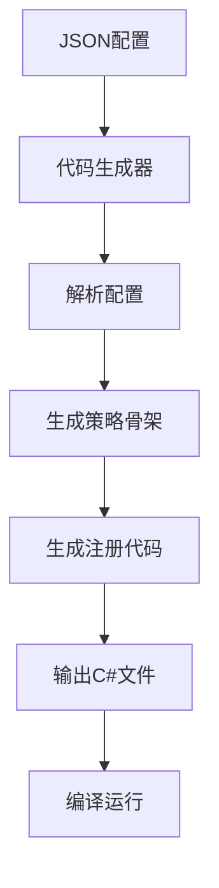

# 技术优化方向

> 代码生成器与可视化工具

---

## 概述

技术优化方向规划了系统的未来技术改进方向，包括代码生成器、可视化编辑器和性能分析器等工具。

---

## 代码生成器

### 目标

根据JSON配置自动生成C#策略骨架，减少手写样板代码。

### 工作流程



### 配置示例

**TriggerDef**

```json
{
  "trigger_id": "when_damaged",
  "event_name": "plant.damaged",
  "max_bound_effects": 1,
  "condition_params": [
    {"name": "damage_threshold", "type": "int", "min": 0, "max": 999},
    {"name": "probability", "type": "float", "min": 0.0, "max": 1.0}
  ]
}
```

**生成的C#代码**

```csharp
// Auto-generated by CodeGenerator
// DO NOT EDIT MANUALLY

namespace Game.Triggers {
    public partial class WhenDamagedTrigger : TriggerStrategy {
        public override bool CheckCondition(
            EventData eventData,
            Dictionary<string, object> params,
            PlantState state
        ) {
            // TODO: Implement condition check
            throw new NotImplementedException();
        }

        // Auto-generated parameter accessors
        private int DamageThreshold => (int)params["damage_threshold"];
        private float Probability => (float)params["probability"];
    }
}
```

**生成的注册代码**

```csharp
// Auto-generated by CodeGenerator
// DO NOT EDIT MANUALLY

namespace Game.Triggers {
    public static partial class TriggerRegistry {
        public static void RegisterAutoGenerated() {
            TriggerStrategyRegistry.Register("when_damaged", new WhenDamagedTrigger());
        }
    }
}
```

---

### EffectDef生成

**配置示例**

```json
{
  "effect_id": "shoot",
  "slots": [
    {
      "name": "speed",
      "type": "value",
      "value_type": "float",
      "min": 5.0,
      "max": 20.0
    },
    {
      "name": "on_hit",
      "type": "effect",
      "allowed_types": ["damage", "explode", "summon", "null"]
    }
  ]
}
```

**生成的C#代码**

```csharp
// Auto-generated by CodeGenerator
// DO NOT EDIT MANUALLY

namespace Game.Effects {
    public partial class ShootEffect : EffectStrategy {
        public override EffectResult Execute(
            Context context,
            Dictionary<string, object> params
        ) {
            // TODO: Implement effect execution
            throw new NotImplementedException();
        }

        // Auto-generated parameter accessors
        private float Speed => (float)params["speed"];
        private EffectNode OnHit => params.ContainsKey("on_hit")
            ? params["on_hit"] as EffectNode
            : null;
    }
}
```

---

### 代码生成器实现

```csharp
class CodeGenerator {
    public static void GenerateTriggerStrategy(TriggerDef def) {
        var sb = new StringBuilder();

        // 文件头
        sb.AppendLine("// Auto-generated by CodeGenerator");
        sb.AppendLine("// DO NOT EDIT MANUALLY");
        sb.AppendLine();

        // 命名空间
        sb.AppendLine("namespace Game.Triggers {");

        // 类定义
        string className = ToPascalCase(def.trigger_id);
        sb.AppendLine($"    public partial class {className} : TriggerStrategy {{");

        // CheckCondition方法
        sb.AppendLine("        public override bool CheckCondition(");
        sb.AppendLine("            EventData eventData,");
        sb.AppendLine("            Dictionary<string, object> params,");
        sb.AppendLine("            PlantState state");
        sb.AppendLine("        ) {");
        sb.AppendLine("            // TODO: Implement condition check");
        sb.AppendLine("            throw new NotImplementedException();");
        sb.AppendLine("        }");
        sb.AppendLine();

        // 参数访问器
        sb.AppendLine("        // Auto-generated parameter accessors");
        foreach (var param in def.condition_params) {
            string paramName = ToPascalCase(param.name);
            string paramType = param.type switch {
                "int" => "int",
                "float" => "float",
                "bool" => "bool",
                "string" => "string",
                _ => "object"
            };
            sb.AppendLine($"        private {paramType} {paramName} => ({paramType})params[\"{param.name}\"];");
        }

        // 类结束
        sb.AppendLine("    }");
        sb.AppendLine("}");

        // 写入文件
        string path = $"Generated/Triggers/{className}.cs";
        File.WriteAllText(path, sb.ToString());
    }

    private static string ToPascalCase(string str) {
        return CultureInfo.CurrentCulture.TextInfo.ToTitleCase(str.Replace("_", " ")).Replace(" ", "");
    }
}
```

---

## 可视化编辑器

### 目标

节点式UI拖拽构建效果树，实时预览遍历串与名称。

### 界面设计

```
┌─────────────────────────────────────────────────────────┐
│  效果树编辑器                    [保存] [导出] [分享] │
├─────────────────────────────────────────────────────────┤
│                                                         │
│  ┌─────────┐    ┌─────────┐    ┌─────────┐              │
│  │ shoot   │───▶│ explode │───▶│ summon  │              │
│  │         │    │         │    │         │              │
│  │ speed:  │    │ radius: │    │ count:  │              │
│  │ [15.0]  │    │ [3.0]   │    │ [3]     │              │
│  └─────────┘    └─────────┘    └─────────┘              │
│                                                         │
│  [添加节点] [删除节点] [复制] [粘贴]                     │
├─────────────────────────────────────────────────────────┤
│  预览                                                   │
│  名称: §kQ3.9xFα                                        │
│  深度: 3层                                              │
│  稀有度: 稀有                                            │
└─────────────────────────────────────────────────────────┘
```

### 节点类型

| 节点类型 | 颜色 | 说明 |
|----------|------|------|
| 触发器 | 绿色 | 事件触发器 |
| 效果 | 蓝色 | 效果节点 |
| 值 | 黄色 | 值槽位 |
| null | 灰色 | 终止节点 |

### 节点连接

```csharp
class NodeEditor {
    private List<Node> _nodes = new();
    private List<Connection> _connections = new();

    public void AddNode(Node node) {
        _nodes.Add(node);
    }

    public void ConnectNodes(Node source, Node target, string slot) {
        _connections.Add(new Connection {
            source = source,
            target = target,
            slot = slot
        });
    }

    public EffectNode BuildEffectTree() {
        // 从编辑器构建效果树
        var root = FindRootNode();
        return BuildNodeRecursive(root);
    }

    private EffectNode BuildNodeRecursive(Node node) {
        var effectNode = new EffectNode {
            effect_id = node.effectId,
            params = new Dictionary<string, object>(),
            children = new Dictionary<string, EffectNode>()
        };

        // 填充值槽位
        foreach (var valueSlot in node.valueSlots) {
            effectNode.params[valueSlot.name] = valueSlot.value;
        }

        // 递归构建子节点
        foreach (var connection in _connections.Where(c => c.source == node)) {
            effectNode.children[connection.slot] = BuildNodeRecursive(connection.target);
        }

        return effectNode;
    }
}
```

### 实时预览

```csharp
class LivePreview {
    public static void UpdatePreview(NodeEditor editor) {
        var effectTree = editor.BuildEffectTree();
        var name = NameGenerator.Generate(effectTree, Time.time);

        // 更新UI
        UI.SetPreviewName(name);
        UI.SetPreviewDepth(GetTreeDepth(effectTree));
        UI.SetPreviewRarity(GetRarity(effectTree));
    }
}
```

---

## 性能分析器

### 目标

统计每个机制组合的触发频率与耗时，识别性能热点。

> **详细实现请参考** [性能与安全防护](10-性能与安全防护.md) - 性能监控

### 界面设计

```
┌─────────────────────────────────────────────────────────┐
│  性能分析器                              [导出报告] │
├─────────────────────────────────────────────────────────┤
│                                                         │
│  触发器统计                                             │
│  ┌───────────────────────────────────────────────────┐    │
│  │ 触发器          | 触发次数 | 平均耗时 | 总耗时   │    │
│  │───────────────────────────────────────────────────│    │
│  │ periodically     | 1,234    | 0.1ms    | 123.4ms │    │
│  │ when_damaged    | 567      | 0.2ms    | 113.4ms │    │
│  │ on_death        | 89       | 0.5ms    | 44.5ms  │    │
│  └───────────────────────────────────────────────────┘    │
│                                                         │
│  效果统计                                               │
│  ┌───────────────────────────────────────────────────┐    │
│  │ 效果            | 执行次数 | 平均耗时 | 总耗时   │    │
│  │───────────────────────────────────────────────────│    │
│  │ shoot           | 1,234    | 0.3ms    | 370.2ms │    │
│  │ damage          | 1,200    | 0.1ms    | 120.0ms │    │
│  │ explode         | 34       | 1.2ms    | 40.8ms  │    │
│  └───────────────────────────────────────────────────┘    │
│                                                         │
│  性能热点                                               │
│  ┌───────────────────────────────────────────────────┐    │
│  │ 1. explode.Execute() - 40.8ms (10.5%)          │    │
│  │ 2. shoot.Execute() - 370.2ms (95.2%)           │    │
│  │ 3. periodically.CheckCondition() - 123.4ms (31.7%)│    │
│  └───────────────────────────────────────────────────┘    │
└─────────────────────────────────────────────────────────┘
```

---

## 其他优化方向

### 内存优化

> **详细实现请参考** [性能与安全防护](10-性能与安全防护.md) - 内存管理

### 并发优化

**任务并行**

```csharp
class ParallelExecutor {
    public static void ExecuteParallel(List<Action> actions) {
        Parallel.ForEach(actions, action => action());
    }
}
```

**异步加载**

```csharp
class AsyncLoader {
    public static async Task<EffectNode> LoadEffectTreeAsync(string path) {
        var json = await File.ReadAllTextAsync(path);
        return JsonConvert.DeserializeObject<EffectNode>(json);
    }
}
```

---

## 相关链接

- [系统架构](02-系统架构.md) - 架构设计
- [性能与安全防护](10-性能与安全防护.md) - 性能优化
- [扩展性与社区生态](11-扩展性与社区生态.md) - MOD开发
