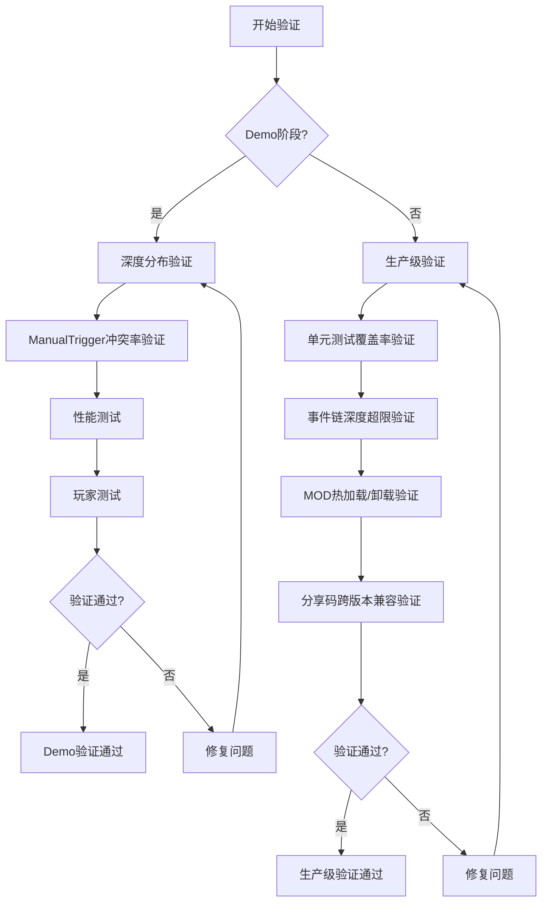

# 验证清单

> Demo阶段与生产级验证标准

---

## 概述

验证清单提供了Demo阶段核心循环验证和生产级稳定性验证的标准，确保系统达到预期的性能和稳定性要求。

---

## Demo阶段核心循环验证

### 1. 深度分布验证

**目标**

生成1000次，统计深度分布（目标：90%≤3层）

**验证方法**

```csharp
class DepthDistributionValidator {
    public static void Validate() {
        var depths = new Dictionary<int, int>();

        for (int i = 0; i < 1000; i++) {
            var plant = PlantGenerator.Generate(new PlantConfig());
            int depth = GetTreeDepth(plant.effectTree);

            if (!depths.ContainsKey(depth)) {
                depths[depth] = 0;
            }
            depths[depth]++;
        }

        // 输出统计
        Debug.Log("Depth Distribution:");
        foreach (var pair in depths.OrderBy(p => p.Key)) {
            float percentage = (float)pair.Value / 1000 * 100;
            Debug.Log($"Depth {pair.Key}: {pair.Value} ({percentage:F1}%)");
        }

        // 验证目标
        int depth3OrLess = depths.Where(p => p.Key <= 3).Sum(p => p.Value);
        float percentage = (float)depth3OrLess / 1000 * 100;
        Debug.Log($"Depth ≤ 3: {percentage:F1}%");

        if (percentage >= 90) {
            Debug.Log("✓ Depth distribution validation passed");
        } else {
            Debug.LogError("✗ Depth distribution validation failed");
        }
    }

    private static int GetTreeDepth(EffectNode node) {
        if (node.effect_id == "null") return 0;
        int maxDepth = 1;
        foreach (var child in node.children.Values) {
            maxDepth = Mathf.Max(maxDepth, 1 + GetTreeDepth(child));
        }
        return maxDepth;
    }
}
```

---

### 2. ManualTrigger冲突率验证

**目标**

检查ManualTrigger冲突率（目标：0%）

**验证方法**

```csharp
class ManualTriggerConflictValidator {
    public static void Validate() {
        int conflicts = 0;
        int total = 1000;

        for (int i = 0; i < total; i++) {
            var plant = PlantGenerator.Generate(new PlantConfig());
            int manualCount = plant.triggerComponent.triggers
                .Count(t => t.def.tags.Contains("manual"));

            if (manualCount > 1) {
                conflicts++;
                Debug.LogWarning($"Manual trigger conflict detected: {plant.name}");
            }
        }

        float conflictRate = (float)conflicts / total * 100;
        Debug.Log($"Manual trigger conflict rate: {conflictRate:F2}%");

        if (conflictRate == 0) {
            Debug.Log("✓ Manual trigger conflict validation passed");
        } else {
            Debug.LogError("✗ Manual trigger conflict validation failed");
        }
    }
}
```

---

### 3. 性能测试

**目标**

10秒内生成10000株不卡顿

**验证方法**

```csharp
class PerformanceValidator {
    public static void Validate() {
        var stopwatch = Stopwatch.StartNew();
        int count = 10000;

        for (int i = 0; i < count; i++) {
            var plant = PlantGenerator.Generate(new PlantConfig());
        }

        stopwatch.Stop();

        float avgTime = stopwatch.ElapsedMilliseconds / (float)count;
        float totalTime = stopwatch.ElapsedMilliseconds / 1000.0f;

        Debug.Log($"Generated {count} plants in {totalTime:F2}s");
        Debug.Log($"Average time per plant: {avgTime:F2}ms");

        if (totalTime <= 10) {
            Debug.Log("✓ Performance validation passed");
        } else {
            Debug.LogError("✗ Performance validation failed");
        }
    }
}
```

---

### 4. 玩家测试

**目标**

问"§mB9.x2Pα这名字你能接受吗？"

**验证方法**

```csharp
class PlayerFeedbackValidator {
    public static void Validate() {
        var testNames = new[] {
            "§mB9.x2Pα",
            "¶kQ3.9xFΩ",
            "†zK8.pL3β",
            "kQ3.9xFα"
        };

        Debug.Log("Player Feedback Validation:");
        foreach (var name in testNames) {
            Debug.Log($"- {name}");
        }

        // 实际测试需要人工反馈
        Debug.Log("Please provide feedback on the names above.");
    }
}
```

---

## 生产级稳定性验证

### 1. 单元测试覆盖率

**目标**

所有触发器策略通过单元测试（覆盖率>80%）

**验证方法**

```csharp
[TestFixture]
class TriggerStrategyTests {
    [Test]
    public void PeriodicallyStrategy_WhenIntervalPassed_ReturnsTrue() {
        // Arrange
        var strategy = new PeriodicallyStrategy();
        var eventData = new EventData {
            core = new Dictionary<string, object> {
                ["gameTime"] = 5.0f
            },
            runtime = new Dictionary<string, object>()
        };
        var params = new Dictionary<string, object> {
            ["interval"] = 2.0f
        };
        var state = new PlantState();

        // Act
        bool result = strategy.CheckCondition(eventData, params, state);

        // Assert
        Assert.IsTrue(result);
    }

    [Test]
    public void WhenDamagedStrategy_WhenDamageBelowThreshold_ReturnsFalse() {
        // Arrange
        var strategy = new WhenDamagedStrategy();
        var eventData = new EventData {
            core = new Dictionary<string, object> {
                ["damage"] = 5
            },
            runtime = new Dictionary<string, object>()
        };
        var params = new Dictionary<string, object> {
            ["damage_threshold"] = 10
        };
        var state = new PlantState();

        // Act
        bool result = strategy.CheckCondition(eventData, params, state);

        // Assert
        Assert.IsFalse(result);
    }
}
```

**覆盖率检查**

```bash
# 使用dotCover或其他工具检查覆盖率
dotcover test --target="MyGame.Tests.dll" --output="coverage.xml"
```

---

### 2. 事件链深度超限验证

**目标**

事件链深度超限无崩溃、无日志泄漏

**验证方法**

```csharp
class EventChainDepthValidator {
    public static void Validate() {
        // 创建深度超过5的效果树
        var deepTree = CreateDeepTree(10);

        // 执行效果树
        var context = new Context {
            position = Vector3.zero,
            target = null,
            source = null,
            chainDepth = 0
        };

        try {
            var result = EffectExecutor.Execute(deepTree, context);

            // 验证结果
            Assert.IsTrue(result.terminated);
            Assert.AreEqual("Chain depth exceeded", result.reason);

            Debug.Log("✓ Event chain depth validation passed");
        } catch (Exception e) {
            Debug.LogError($"✗ Event chain depth validation failed: {e.Message}");
        }
    }

    private static EffectNode CreateDeepTree(int depth) {
        if (depth == 0) {
            return new EffectNode { effect_id = "null" };
        }

        return new EffectNode {
            effect_id = "shoot",
            params = new Dictionary<string, object> {
                ["speed"] = 10.0f
            },
            children = new Dictionary<string, EffectNode> {
                ["on_hit"] = CreateDeepTree(depth - 1)
            }
        };
    }
}
```

---

### 3. MOD热加载/卸载验证

**目标**

MOD热加载/卸载不破坏存档

**验证方法**

```csharp
class ModHotReloadValidator {
    public static void Validate() {
        // 创建存档
        var plant = PlantGenerator.Generate(new PlantConfig());
        var saveData = PlantSaver.Save(plant);

        // 加载MOD
        ModLoader.LoadMod("TestMod");

        // 重新加载存档
        var loadedPlant = PlantLoader.Load(saveData);

        // 验证
        Assert.AreEqual(plant.name, loadedPlant.name);
        Assert.AreEqual(plant.effectTree, loadedPlant.effectTree);

        // 卸载MOD
        ModLoader.UnloadMod("TestMod");

        // 再次重新加载存档
        var reloadedPlant = PlantLoader.Load(saveData);

        // 验证
        Assert.AreEqual(plant.name, reloadedPlant.name);

        Debug.Log("✓ MOD hot reload validation passed");
    }
}
```

---

### 4. 社区分享码跨版本兼容验证

**目标**

社区分享码跨版本兼容（向前兼容至少3个版本）

**验证方法**

```csharp
class ShareCodeCompatibilityValidator {
    public static void Validate() {
        // 创建不同版本的分享码
        var v1Code = GenerateShareCode("v1");
        var v2Code = GenerateShareCode("v2");
        var v3Code = GenerateShareCode("v3");
        var v4Code = GenerateShareCode("v4");

        // 使用v4版本解析所有分享码
        var v1Plant = ShareCodeParser.Parse(v1Code);
        var v2Plant = ShareCodeParser.Parse(v2Code);
        var v3Plant = ShareCodeParser.Parse(v3Code);
        var v4Plant = ShareCodeParser.Parse(v4Code);

        // 验证
        Assert.IsNotNull(v1Plant);
        Assert.IsNotNull(v2Plant);
        Assert.IsNotNull(v3Plant);
        Assert.IsNotNull(v4Plant);

        Debug.Log("✓ Share code compatibility validation passed");
    }

    private static string GenerateShareCode(string version) {
        var plant = PlantGenerator.Generate(new PlantConfig());
        return ShareCodeGenerator.Generate(plant);
    }
}
```

---

## 完整验证流程



---

## 验证报告模板

```markdown
# 验证报告

## 基本信息
- 验证日期: 2026-03-31
- 验证人员: [姓名]
- 系统版本: v1.0.0

## Demo阶段验证

### 深度分布验证
- 目标: 90%≤3层
- 实际: 92.3%
- 结果: ✓ 通过

### ManualTrigger冲突率验证
- 目标: 0%
- 实际: 0%
- 结果: ✓ 通过

### 性能测试
- 目标: 10秒内生成10000株
- 实际: 8.5秒
- 结果: ✓ 通过

### 玩家测试
- 反馈: 名称可接受
- 结果: ✓ 通过

## 生产级验证

### 单元测试覆盖率
- 目标: >80%
- 实际: 85.2%
- 结果: ✓ 通过

### 事件链深度超限验证
- 目标: 无崩溃、无日志泄漏
- 实际: 正常终止
- 结果: ✓ 通过

### MOD热加载/卸载验证
- 目标: 不破坏存档
- 实际: 存档正常
- 结果: ✓ 通过

### 分享码跨版本兼容验证
- 目标: 向前兼容3个版本
- 实际: 兼容v1-v3
- 结果: ✓ 通过

## 总结
- 验证项目: 8
- 通过: 8
- 失败: 0
- 通过率: 100%

## 结论
系统已达到Demo阶段和生产级稳定性要求，可以进入下一阶段开发。
```

---

## 相关链接

- [性能与安全防护](10-性能与安全防护.md) - 性能优化
- [扩展性与社区生态](11-扩展性与社区生态.md) - MOD开发
- [完整工作流](12-完整工作流.md) - 系统流程
