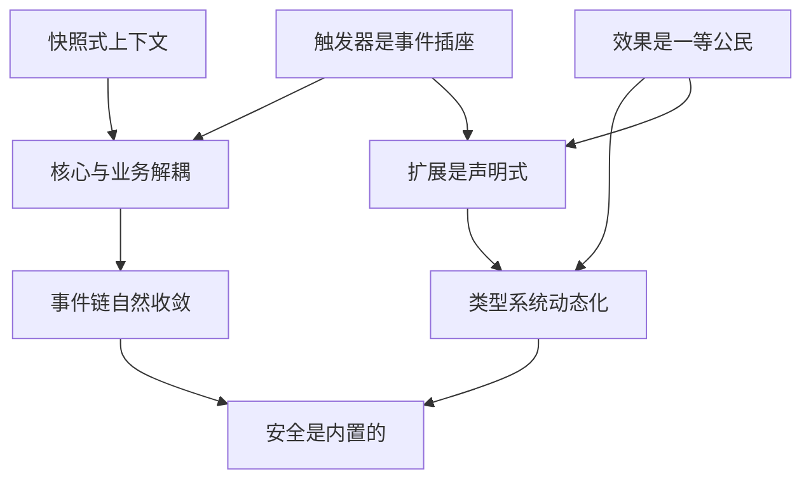

# 设计哲学总结

> 完整设计原则汇总

---

## 概述

设计哲学总结汇总了错误技系统的八大核心设计原则，这些原则贯穿整个系统的设计与实现。

---

## 八大设计原则

### 1. 效果是一等公民

**核心思想**

效果可递归嵌套，策略可热插拔，扩展无需继承。

**实现要点**

- 效果不是带参数的函数，而是可递归配置的节点
- 通过"槽位"机制实现无限嵌套组合
- 叶子节点为`null`
- 策略通过注册表动态绑定，无需继承

**代码示例**

```json
{
  "effect_id": "shoot",
  "params": {"speed": 13.7},
  "children": {
    "on_hit": {
      "effect_id": "explode",
      "params": {"radius": 3},
      "children": {"on_explosion": {"effect_id": "null"}}
    }
  }
}
```

**相关文档**
- [效果系统](04-效果系统.md)
- [核心设计哲学](01-核心设计哲学.md)

---

### 2. 触发器是事件插座

**核心思想**

硬编码事件名，插件化业务逻辑。

**实现要点**

- 触发器只回答"何时触发"，不回答"触发后做什么"
- 事件名由核心层硬编码，确保稳定性
- 业务逻辑通过插件注册，可热插拔
- 一个触发器可绑定多个效果树

**代码示例**

```csharp
// 触发器订阅事件
TriggerInstance.Subscribe("plant.damaged", (eventData) => {
    if (CheckCondition(eventData)) {
        ExecuteEffectTree(bound_effects, eventData);
    }
});
```

**相关文档**
- [触发器系统](03-触发器系统.md)
- [事件模型](07-事件模型.md)

---

### 3. 核心与业务解耦

**核心思想**

核心层只广播客观事件，业务逻辑全由外部订阅。

**实现要点**

- 核心层只负责广播客观事件（如`plant.damaged`）
- 业务逻辑（如触发器、效果）完全由外部模块实现
- 核心层不依赖任何业务逻辑
- 业务逻辑可以独立开发、测试、部署

**代码示例**

```csharp
// 核心层：只广播事件
class CoreLayer {
    public void DamageEntity(Entity target, int damage) {
        target.health -= damage;
        EventManager.Broadcast("entity.damaged", new EventData {
            core = new Dictionary<string, object> {
                ["target"] = target.id,
                ["damage"] = damage
            }
        });
    }
}

// 业务层：订阅事件
TriggerStrategyRegistry.Register("when_damaged", (eventData, params, state) => {
    int damage = (int)eventData.core["damage"];
    return damage > (int)params["threshold"];
});
```

**相关文档**
- [系统架构](02-系统架构.md)
- [执行机制](06-执行机制.md)

---

### 4. 类型系统动态化

**核心思想**

分类、标签、策略全部动态注册，核心层保持无知。

**实现要点**

- 分类（Category）动态注册
- 标签（Tag）动态注册
- 策略（Strategy）动态注册
- 核心层不预定义任何类型

**代码示例**

```csharp
// 动态注册分类
TypeRegistry.RegisterCategory("trajectory", "value");
TypeRegistry.RegisterCategory("target_selector", "effect");

// 动态注册标签
TagRegistry.RegisterTag("trajectory", "linear", 100);
TagRegistry.RegisterTag("trajectory", "sine", 60);

// 动态注册策略
EffectStrategyRegistry.Register("shoot", ShootStrategy);
```

**相关文档**
- [效果系统](04-效果系统.md)
- [扩展性与社区生态](11-扩展性与社区生态.md)

---

### 5. 事件链自然收敛

**核心思想**

深度限制防性能爆炸，玩家感知为"能量耗尽"。

**实现要点**

- 效果树深度限制为3层
- 事件连锁深度限制为5层
- 超过限制时自动终止
- 玩家感知为"能量耗尽"而非系统错误

**代码示例**

```csharp
class EffectExecutor {
    private const int MAX_CHAIN_DEPTH = 5;

    public static EffectResult Execute(EffectNode node, Context context, int depth = 0) {
        // 深度检查
        if (depth > MAX_CHAIN_DEPTH) {
            return new EffectResult {
                success = false,
                terminated = true,
                reason = "Chain depth exceeded"
            };
        }

        // 执行效果
        // ...
    }
}
```

**相关文档**
- [执行机制](06-执行机制.md)
- [性能与安全防护](10-性能与安全防护.md)

---

### 6. 快照式上下文

**核心思想**

每帧新快照，策略无状态，状态由实体持有。

**实现要点**

- 上下文（Context）是只读快照
- 策略不能修改上下文
- 状态（State）由实体持有，可写
- 每次执行创建新的上下文

**代码示例**

```csharp
// 上下文：只读快照
class Context {
    public Vector3 position;
    public Entity target;
    public int chainDepth;
    // ... 其他只读数据
}

// 状态：可写字典
class PlantState {
    public Dictionary<string, object> values;
    public Dictionary<string, float> cooldowns;

    public void SetValue(string key, object value) {
        values[key] = value;
    }
}
```

**相关文档**
- [执行机制](06-执行机制.md)
- [事件模型](07-事件模型.md)

---

### 7. 扩展是声明式

**核心思想**

新增触发器 = JSON + 策略实现，零侵入核心。

**实现要点**

- 所有机制通过JSON配置定义
- 新增机制只需添加JSON + 注册策略
- 支持热更新
- MOD开发者无需修改核心代码

**代码示例**

```json
// 触发器定义
{
  "trigger_id": "when_healed",
  "event_name": "plant.healed",
  "max_bound_effects": 1,
  "condition_params": [
    {"name": "heal_threshold", "type": "int", "min": 0, "max": 999}
  ]
}
```

```csharp
// 策略实现
TriggerStrategyRegistry.Register("when_healed", (eventData, params, state) => {
    int amount = (int)eventData.core["amount"];
    int threshold = (int)params["heal_threshold"];
    return amount >= threshold;
});
```

**相关文档**
- [扩展性与社区生态](11-扩展性与社区生态.md)
- [核心设计哲学](01-核心设计哲学.md)

---

### 8. 安全是内置的

**核心思想**

冷却、深度、循环、参数白名单，多重防护。

**实现要点**

- 深度上限：效果树深度>3自动终止
- 事件链深度>5静默丢弃
- 参数白名单：槽位定义限制参数范围
- 事件白名单：事件名由核心层广播
- 沙盒执行：策略接口无文件/网络权限

**代码示例**

```csharp
// 参数白名单验证
class ParameterValidator {
    public static bool Validate(string slotName, object value, SlotDef slotDef) {
        if (slotDef.type != "value") {
            return true;
        }

        switch (slotDef.value_type) {
            case "int":
                int intValue = (int)value;
                return intValue >= slotDef.min && intValue <= slotDef.max;
            case "float":
                float floatValue = (float)value;
                return floatValue >= (float)slotDef.min && floatValue <= (float)slotDef.max;
            default:
                return false;
        }
    }
}

// 事件白名单验证
class EventManager {
    private static HashSet<string> _allowedEvents = new HashSet<string> {
        "plant.planted",
        "plant.died",
        "plant.damaged",
        // ...
    };

    public static void Broadcast(string eventName, EventData eventData) {
        if (!_allowedEvents.Contains(eventName)) {
            Debug.LogError($"Event not allowed: {eventName}");
            return;
        }
        // ...
    }
}
```

**相关文档**
- [性能与安全防护](10-性能与安全防护.md)
- [触发器系统](03-触发器系统.md)

---

## 设计原则关系图



---

## 设计原则应用场景

### 场景1：新增一个触发器

**应用原则**

1. **扩展是声明式**：添加JSON配置
2. **触发器是事件插座**：注册策略
3. **核心与业务解耦**：核心层广播事件
4. **安全是内置的**：参数白名单验证

**步骤**

```plaintext
1. 在核心层添加事件广播
2. 创建TriggerDef JSON配置
3. 实现TriggerStrategy
4. 注册策略
```

---

### 场景2：新增一个效果

**应用原则**

1. **扩展是声明式**：添加JSON配置
2. **效果是一等公民**：可递归嵌套
3. **类型系统动态化**：动态注册分类和标签
4. **安全是内置的**：参数白名单验证

**步骤**

```plaintext
1. 创建EffectDef JSON配置
2. 实现EffectStrategy
3. 注册策略
4. 在其他效果的allowed_types中引用
```

---

### 场景3：MOD开发

**应用原则**

1. **扩展是声明式**：JSON配置驱动
2. **类型系统动态化**：动态注册
3. **核心与业务解耦**：零侵入核心
4. **安全是内置的**：沙盒执行

**步骤**

```plaintext
1. 创建mod.json元数据
2. 添加触发器/效果定义
3. 实现策略
4. 打包MOD
```

---

## 设计原则总结表

| 原则 | 核心思想 | 关键实现 | 相关文档 |
|------|----------|----------|----------|
| 效果是一等公民 | 可递归嵌套，热插拔 | 槽位机制，策略注册 | [效果系统](04-效果系统.md) |
| 触发器是事件插座 | 硬编码事件名，插件化业务 | 事件订阅，条件检查 | [触发器系统](03-触发器系统.md) |
| 核心与业务解耦 | 核心广播事件，业务订阅 | 事件驱动，零依赖 | [系统架构](02-系统架构.md) |
| 类型系统动态化 | 动态注册，核心无知 | 注册表，热插拔 | [效果系统](04-效果系统.md) |
| 事件链自然收敛 | 深度限制，能量耗尽 | 深度检查，自动终止 | [执行机制](06-执行机制.md) |
| 快照式上下文 | 只读快照，无状态策略 | 上下文分离，状态实体化 | [执行机制](06-执行机制.md) |
| 扩展是声明式 | JSON + 策略，零侵入 | 配置驱动，热更新 | [扩展性与社区生态](11-扩展性与社区生态.md) |
| 安全是内置的 | 多重防护，沙盒执行 | 白名单，深度限制 | [性能与安全防护](10-性能与安全防护.md) |

---

## 相关链接

- [核心设计哲学](01-核心设计哲学.md) - 三大核心原则
- [系统架构](02-系统架构.md) - 四层架构
- [完整工作流](12-完整工作流.md) - 系统流程
