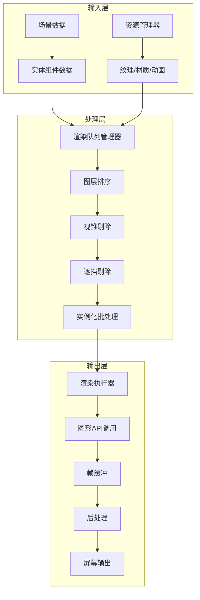
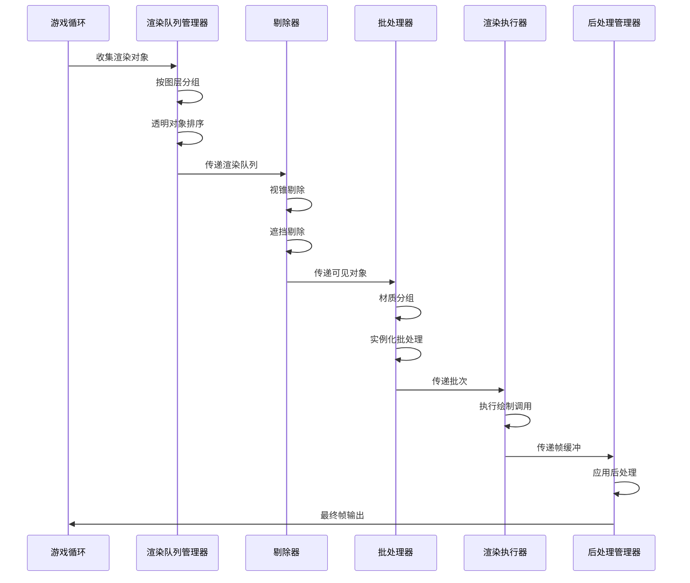
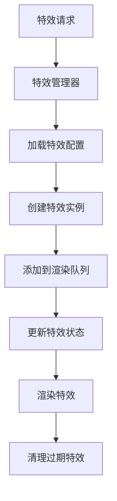

# 渲染管线

> 开放式 PVZ-like 引擎渲染系统架构详解

---

## 概述

渲染管线负责将游戏世界的视觉表现呈现给用户。本引擎采用分层渲染架构，支持动态图层管理、粒子系统、特效合成和视觉调试。

---

## 渲染管线架构

### 整体架构



---

## 核心模块职责划分

### 1. 渲染队列管理器（RenderQueueManager）

**职责**

- 管理所有渲染对象的队列
- 按图层和材质类型分组
- 处理透明度排序

**数据结构**

```csharp
class RenderQueueManager {
    // 图层定义
    enum RenderLayer {
        Background = 0,      // 背景层
        Ground = 1,          // 地面层
        Plant = 2,           // 植物层
        Zombie = 3,          // 僵尸层
        Projectile = 4,       // 投射物层
        Effect = 5,          // 特效层
        UI = 6               // UI层
    }

    // 渲染队列
    private Dictionary<RenderLayer, List<RenderItem>> _queues;

    // 透明队列（需要从后往前排序）
    private List<RenderItem> _transparentQueue;
}
```

**渲染项结构**

```csharp
struct RenderItem {
    Entity entity;              // 关联实体
    Mesh mesh;                   // 网格数据
    Material material;          // 材质
    Matrix4x4 transform;        // 变换矩阵
    float distanceToCamera;      // 距离摄像机的距离
    bool isTransparent;          // 是否透明
    RenderLayer layer;           // 图层
}
```

---

### 2. 图层管理器（LayerManager）

**职责**

- 定义渲染图层
- 管理图层可见性
- 处理图层间遮挡关系

**图层配置**

```json
{
  "layers": [
    {
      "name": "Background",
      "id": 0,
      "visible": true,
      "z_order": 0,
      "transparent": false
    },
    {
      "name": "Ground",
      "id": 1,
      "visible": true,
      "z_order": 1,
      "transparent": false
    },
    {
      "name": "Plant",
      "id": 2,
      "visible": true,
      "z_order": 2,
      "transparent": true
    },
    {
      "name": "Zombie",
      "id": 3,
      "visible": true,
      "z_order": 3,
      "transparent": true
    },
    {
      "name": "Projectile",
      "id": 4,
      "visible": true,
      "z_order": 4,
      "transparent": true
    },
    {
      "name": "Effect",
      "id": 5,
      "visible": true,
      "z_order": 5,
      "transparent": true
    },
    {
      "name": "UI",
      "id": 6,
      "visible": true,
      "z_order": 100,
      "transparent": true
    }
  ]
}
```

---

### 3. 视锥剔除器（FrustumCuller）

**职责**

- 计算摄像机视锥体
- 剔除视锥外的物体
- 减少渲染负载

**实现**

```csharp
class FrustumCuller {
    private Frustum _frustum;

    public void UpdateFrustum(Camera camera) {
        _frustum = new Frustum(camera);
    }

    public bool IsVisible(Bounds bounds) {
        return _frustum.Intersects(bounds);
    }

    public List<RenderItem> Cull(List<RenderItem> items) {
        return items.Where(item =>
            IsVisible(item.mesh.bounds)
        ).ToList();
    }
}
```

---

### 4. 遮挡剔除器（OcclusionCuller）

**职责**

- 检测物体是否被遮挡
- 剔除完全遮挡的物体
- 优化渲染性能

**算法**

```csharp
class OcclusionCuller {
    private HierarchicalZBuffer _hzBuffer;

    public List<RenderItem> Cull(List<RenderItem> items, Camera camera) {
        var visible = new List<RenderItem>();

        // 按距离从近到远排序
        var sorted = items.OrderBy(i => i.distanceToCamera);

        foreach (var item in sorted) {
            if (!_hzBuffer.IsOccluded(item.mesh.bounds, camera)) {
                visible.Add(item);
                _hzBuffer.Update(item.mesh.bounds);
            }
        }

        return visible;
    }
}
```

---

### 5. 实例化批处理器（InstancingBatcher）

**职责**

- 合并相同材质的物体
- 使用 GPU 实例化渲染
- 减少绘制调用

**批处理逻辑**

```csharp
class InstancingBatcher {
    private Dictionary<Material, List<RenderItem>> _batches;

    public void BuildBatches(List<RenderItem> items) {
        _batches.Clear();

        foreach (var item in items) {
            if (!_batches.ContainsKey(item.material)) {
                _batches[item.material] = new List<RenderItem>();
            }
            _batches[item.material].Add(item);
        }
    }

    public void RenderBatches() {
        foreach (var batch in _batches) {
            if (batch.Value.Count > 1) {
                RenderInstanced(batch.Key, batch.Value);
            } else {
                RenderSingle(batch.Key, batch.Value[0]);
            }
        }
    }

    private void RenderInstanced(Material material, List<RenderItem> items) {
        // 收集变换矩阵
        var matrices = items.Select(i => i.transform).ToArray();

        // GPU 实例化绘制
        material.SetMatrixArray("_Matrices", matrices);
        Graphics.DrawMeshInstanced(
            items[0].mesh,
            0,
            material,
            matrices
        );
    }
}
```

---

### 6. 后处理管理器（PostProcessManager）

**职责**

- 管理后处理效果
- 应用屏幕空间特效
- 处理色调映射和抗锯齿

**后处理链**


**实现**

```csharp
class PostProcessManager {
    private List<PostProcessEffect> _effects;

    public void Render(RenderTexture source, RenderTexture destination) {
        var current = source;

        foreach (var effect in _effects) {
            if (effect.enabled) {
                var temp = RenderTexture.GetTemporary(
                    source.width,
                    source.height
                );
                effect.Render(current, temp);
                RenderTexture.ReleaseTemporary(current);
                current = temp;
            }
        }

        Graphics.Blit(current, destination);
        RenderTexture.ReleaseTemporary(current);
    }
}
```

---

## 渲染流程

### 主渲染循环



---

### 伪代码实现

```csharp
class RenderPipeline {
    private RenderQueueManager _queueManager;
    private FrustumCuller _frustumCuller;
    private OcclusionCuller _occlusionCuller;
    private InstancingBatcher _batcher;
    private PostProcessManager _postProcess;

    public void RenderFrame() {
        // 1. 收集渲染对象
        var renderItems = CollectRenderItems();

        // 2. 按图层分组
        _queueManager.GroupByLayer(renderItems);

        // 3. 视锥剔除
        _frustumCuller.UpdateFrustum(Camera.main);
        var visibleItems = _frustumCuller.Cull(renderItems);

        // 4. 遮挡剔除
        var culledItems = _occlusionCuller.Cull(visibleItems, Camera.main);

        // 5. 批处理
        _batcher.BuildBatches(culledItems);

        // 6. 渲染不透明对象
        RenderOpaque(_batcher);

        // 7. 渲染透明对象
        RenderTransparent(_batcher);

        // 8. 后处理
        ApplyPostProcessing();
    }

    private List<RenderItem> CollectRenderItems() {
        var items = new List<RenderItem>();

        // 从 ECS 系统收集渲染组件
        foreach (var entity in EntityManager.GetEntitiesWith<RenderComponent>()) {
            var render = entity.GetComponent<RenderComponent>();
            var transform = entity.GetComponent<TransformComponent>();

            items.Add(new RenderItem {
                entity = entity,
                mesh = render.mesh,
                material = render.material,
                transform = transform.localToWorldMatrix,
                distanceToCamera = Vector3.Distance(
                    transform.position,
                    Camera.main.transform.position
                ),
                isTransparent = render.material.isTransparent,
                layer = render.layer
            });
        }

        return items;
    }

    private void RenderOpaque(InstancingBatcher batcher) {
        // 不透明对象不需要排序
        batcher.RenderOpaqueBatches();
    }

    private void RenderTransparent(InstancingBatcher batcher) {
        // 透明对象需要从后往前排序
        batcher.SortTransparentByDistance();
        batcher.RenderTransparentBatches();
    }

    private void ApplyPostProcessing() {
        var source = Camera.main.targetTexture;
        var destination = RenderTexture.GetTemporary(
            source.width,
            source.height
        );

        _postProcess.Render(source, destination);

        Graphics.Blit(destination, source);
        RenderTexture.ReleaseTemporary(destination);
    }
}
```

---

## 特效系统

### 粒子系统

**职责**

- 管理粒子发射器
- 更新粒子生命周期
- 渲染粒子效果

**粒子结构**

```csharp
struct Particle {
    Vector3 position;
    Vector3 velocity;
    Color color;
    float size;
    float lifetime;
    float age;
}
```

**粒子发射器**

```csharp
class ParticleEmitter {
    public int maxParticles = 1000;
    public float emissionRate = 10;
    public float particleLifetime = 2.0f;
    public Vector3 initialVelocity = Vector3.up * 5;
    public Color startColor = Color.white;
    public Color endColor = Color.clear;

    private List<Particle> _particles;
    private float _timeSinceLastEmission;

    public void Update(float dt) {
        Emit(dt);
        UpdateParticles(dt);
    }

    private void Emit(float dt) {
        _timeSinceLastEmission += dt;

        while (_timeSinceLastEmission >= 1.0f / emissionRate) {
            if (_particles.Count < maxParticles) {
                _particles.Add(new Particle {
                    position = transform.position,
                    velocity = initialVelocity + Random.insideUnitSphere,
                    color = startColor,
                    size = 1.0f,
                    lifetime = particleLifetime,
                    age = 0
                });
            }
            _timeSinceLastEmission -= 1.0f / emissionRate;
        }
    }

    private void UpdateParticles(float dt) {
        for (int i = _particles.Count - 1; i >= 0; i--) {
            var p = _particles[i];
            p.age += dt;

            if (p.age >= p.lifetime) {
                _particles.RemoveAt(i);
                continue;
            }

            // 更新位置
            p.position += p.velocity * dt;

            // 更新颜色
            float t = p.age / p.lifetime;
            p.color = Color.Lerp(startColor, endColor, t);

            _particles[i] = p;
        }
    }
}
```

---

### 特效合成

**职责**

- 合成多个特效
- 处理特效间交互
- 优化特效性能

**合成流程**



---

## 视觉调试

### 调试视图

| 视图类型 | 说明 | 快捷键 |
|---------|------|--------|
| 线框模式 | 显示物体线框 | F1 |
| 深度视图 | 显示深度信息 | F2 |
| 法线视图 | 显示法线方向 | F3 |
| UV 视图 | 显示 UV 坐标 | F4 |
| 光照视图 | 显示光照信息 | F5 |
| 阴影视图 | 显示阴影信息 | F6 |

### 性能分析

```csharp
class RenderProfiler {
    private Dictionary<string, float> _timings;

    public void BeginSample(string name) {
        _timings[name] = Time.realtimeSinceStartup;
    }

    public void EndSample(string name) {
        if (_timings.ContainsKey(name)) {
            _timings[name] = Time.realtimeSinceStartup - _timings[name];
        }
    }

    public void PrintReport() {
        Debug.Log("=== Render Profiler ===");
        foreach (var pair in _timings.OrderByDescending(p => p.Value)) {
            Debug.Log($"{pair.Key}: {pair.Value * 1000:F2}ms");
        }
    }
}
```

---

## 资源管理

### 纹理管理器

```csharp
class TextureManager {
    private static Dictionary<string, Texture2D> _cache = new();

    public static Texture2D Load(string path) {
        if (_cache.ContainsKey(path)) {
            return _cache[path];
        }

        var texture = Resources.Load<Texture2D>(path);
        _cache[path] = texture;
        return texture;
    }

    public static void Unload(string path) {
        if (_cache.ContainsKey(path)) {
            Resources.UnloadAsset(_cache[path]);
            _cache.Remove(path);
        }
    }

    public static void UnloadAll() {
        foreach (var texture in _cache.Values) {
            Resources.UnloadAsset(texture);
        }
        _cache.Clear();
    }
}
```

---

### 材质管理器

```csharp
class MaterialManager {
    private static Dictionary<string, Material> _cache = new();

    public static Material Load(string path) {
        if (_cache.ContainsKey(path)) {
            return _cache[path];
        }

        var material = Resources.Load<Material>(path);
        _cache[path] = material;
        return material;
    }

    public static Material Create(string shaderName) {
        var shader = Shader.Find(shaderName);
        return new Material(shader);
    }
}
```

---

## 性能优化

### 优化策略

| 策略 | 说明 | 预期提升 |
|------|------|----------|
| 视锥剔除 | 剔除视锥外物体 | 30-50% |
| 遮挡剔除 | 剔除被遮挡物体 | 20-40% |
| 实例化渲染 | 合并相同材质物体 | 50-70% |
| LOD 系统 | 距离自适应细节 | 30-50% |
| 纹理图集 | 合并小纹理 | 20-30% |

---

### LOD 系统

```csharp
class LODGroup {
    public struct LODLevel {
        public float screenRelativeTransitionHeight;
        public Mesh[] renderers;
    }

    public LODLevel[] lodLevels;

    public void Update() {
        float screenHeight = CalculateScreenHeight();

        for (int i = 0; i < lodLevels.Length; i++) {
            if (screenHeight >= lodLevels[i].screenRelativeTransitionHeight) {
                SetLOD(i);
                break;
            }
        }
    }

    private float CalculateScreenHeight() {
        var bounds = GetComponent<Renderer>().bounds;
        var camera = Camera.main;
        float distance = Vector3.Distance(camera.transform.position, bounds.center);
        float size = bounds.size.magnitude;
        return size / (distance * camera.fieldOfView);
    }

    private void SetLOD(int level) {
        // 启用指定 LOD 的渲染器
    }
}
```

---

## 相关链接

- [ECS 架构设计](18-ECS架构设计.md) - 实体组件系统
- [游戏循环机制](19-游戏循环机制.md) - 渲染循环集成
- [子系统通信协议](20-子系统通信协议.md) - 渲染系统通信
- [Mod 开发指南](21-Mod开发指南.md) - 自定义渲染效果
