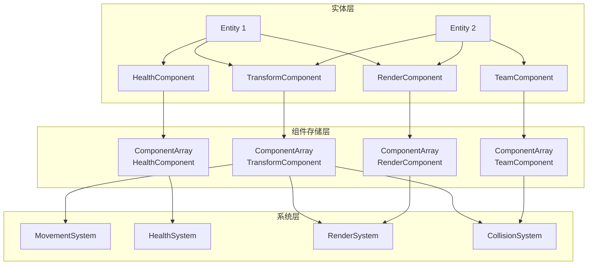

# ECS 架构设计

> 实体组件系统（Entity-Component-System）架构详解

---

## 概述

ECS（Entity-Component-System）是一种数据导向的设计模式，将游戏对象分解为实体、组件和系统三部分。本引擎采用混合 ECS 架构，结合传统面向对象和 ECS 的优势，实现高性能的游戏逻辑处理。

---

## ECS 核心概念

### 实体（Entity）

**定义**

实体是游戏世界中的唯一标识符，本身不包含任何数据或行为，仅作为组件的容器。

**实现**

```csharp
struct Entity {
    public int id;              // 唯一 ID
    public int generation;      // 世代号（用于回收 ID）
    public int version;         // 版本号（用于检测失效实体）

    public static readonly Entity Invalid = new Entity {
        id = -1,
        generation = -1,
        version = -1
    };

    public bool IsValid => id >= 0;
}
```

---

### 组件（Component）

**定义**

组件是纯数据结构，存储实体的属性。组件不包含逻辑，只负责数据存储。

**设计原则**

- 组件只包含数据，不包含方法
- 组件应该是 POD（Plain Old Data）类型
- 组件应该尽可能小而专注

**核心组件类型**

| 组件 | 说明 | 字段 |
|------|------|------|
| `TransformComponent` | 位置、旋转、缩放 | `position`, `rotation`, `scale` |
| `HealthComponent` | 生命值 | `currentHealth`, `maxHealth` |
| `TeamComponent` | 队伍归属 | `teamId` |
| `CooldownComponent` | 冷却状态 | `cooldowns` |
| `RenderComponent` | 渲染数据 | `mesh`, `material`, `layer` |
| `AnimationComponent` | 动画状态 | `currentAnimation`, `animationTime` |
| `TrajectoryComponent` | 轨迹数据 | `velocity`, `components` |
| `EffectComponent` | 效果数据 | `effectTree` |
| `TriggerComponent` | 触发器数据 | `triggers` |

**组件示例**

```csharp
// 变换组件
struct TransformComponent {
    public Vector3 position;
    public Quaternion rotation;
    public Vector3 scale;

    public Matrix4x4 localToWorldMatrix {
        get {
            return Matrix4x4.TRS(position, rotation, scale);
        }
    }
}

// 生命组件
struct HealthComponent {
    public float currentHealth;
    public float maxHealth;
    public bool isInvulnerable;

    public float healthPercent => currentHealth / maxHealth;
}

// 队伍组件
struct TeamComponent {
    public int teamId;
    public bool isEnemy => teamId != 0;
}

// 冷却组件
struct CooldownComponent {
    public Dictionary<string, float> cooldowns;
    public Dictionary<string, float> lastTriggerTimes;

    public bool IsReady(string key, float cooldownDuration) {
        if (!lastTriggerTimes.ContainsKey(key)) {
            return true;
        }
        return Time.time - lastTriggerTimes[key] >= cooldownDuration;
    }

    public void Trigger(string key) {
        lastTriggerTimes[key] = Time.time;
    }
}

// 渲染组件
struct RenderComponent {
    public Mesh mesh;
    public Material material;
    public int layer;
    public bool isVisible;
    public bool castShadows;
    public bool receiveShadows;
}

// 动画组件
struct AnimationComponent {
    public string currentAnimation;
    public float animationTime;
    public float animationSpeed;
    public bool isLooping;
    public bool isPlaying;
}

// 轨迹组件
struct TrajectoryComponent {
    public Vector3 velocity;
    public List<TrajectoryComponentBase> components;

    public void Update(float dt) {
        Vector3 totalDelta = Vector3.zero;
        foreach (var component in components) {
            totalDelta += component.GetVelocityDelta(dt);
        }
        velocity += totalDelta;
    }
}

// 效果组件
struct EffectComponent {
    public EffectNode effectTree;
    public Dictionary<string, object> effectState;
}

// 触发器组件
struct TriggerComponent {
    public List<TriggerInstance> triggers;

    public void OnEvent(string eventName, EventData eventData) {
        foreach (var trigger in triggers) {
            trigger.OnEvent(eventName, eventData);
        }
    }
}
```

---

### 系统（System）

**定义**

系统是处理组件的逻辑单元，负责查询具有特定组件的实体并执行操作。

**设计原则**

- 系统只包含逻辑，不包含数据
- 系统应该独立运行，不依赖其他系统
- 系统应该可并行执行（无共享状态）

**核心系统类型**

| 系统 | 说明 | 处理组件 |
|------|------|----------|
| `MovementSystem` | 运动更新 | `TransformComponent`, `TrajectoryComponent` |
| `HealthSystem` | 生命值管理 | `HealthComponent` |
| `RenderSystem` | 渲染处理 | `RenderComponent`, `TransformComponent` |
| `AnimationSystem` | 动画更新 | `AnimationComponent` |
| `CooldownSystem` | 冷却管理 | `CooldownComponent` |
| `EffectSystem` | 效果执行 | `EffectComponent`, `TriggerComponent` |
| `CollisionSystem` | 碰撞检测 | `TransformComponent`, `ColliderComponent` |
| `CleanupSystem` | 实体清理 | 所有组件 |

**系统示例**

```csharp
// 运动系统
class MovementSystem : ISystem {
    public void Update(float dt) {
        var entities = EntityManager.GetEntitiesWith<TransformComponent, TrajectoryComponent>();

        foreach (var entity in entities) {
            var transform = entity.GetComponent<TransformComponent>();
            var trajectory = entity.GetComponent<TrajectoryComponent>();

            // 更新轨迹
            trajectory.Update(dt);

            // 更新位置
            transform.position += trajectory.velocity * dt;
        }
    }
}

// 生命系统
class HealthSystem : ISystem {
    public void Update(float dt) {
        var entities = EntityManager.GetEntitiesWith<HealthComponent>();

        foreach (var entity in entities) {
            var health = entity.GetComponent<HealthComponent>();

            // 检查死亡
            if (health.currentHealth <= 0) {
                EventManager.Broadcast("entity.died", new EventData {
                    core = new Dictionary<string, object> {
                        ["entity"] = entity
                    }
                });
            }
        }
    }
}

// 渲染系统
class RenderSystem : ISystem {
    public void Update(float dt) {
        var entities = EntityManager.GetEntitiesWith<RenderComponent, TransformComponent>();

        foreach (var entity in entities) {
            var render = entity.GetComponent<RenderComponent>();
            var transform = entity.GetComponent<TransformComponent>();

            if (render.isVisible) {
                RenderQueueManager.AddItem(new RenderItem {
                    entity = entity,
                    mesh = render.mesh,
                    material = render.material,
                    transform = transform.localToWorldMatrix,
                    layer = render.layer
                });
            }
        }
    }
}

// 动画系统
class AnimationSystem : ISystem {
    public void Update(float dt) {
        var entities = EntityManager.GetEntitiesWith<AnimationComponent>();

        foreach (var entity in entities) {
            var animation = entity.GetComponent<AnimationComponent>();

            if (animation.isPlaying) {
                animation.animationTime += dt * animation.animationSpeed;

                if (!animation.isLooping && animation.animationTime >= 1.0f) {
                    animation.isPlaying = false;
                }
            }
        }
    }
}

// 冷却系统
class CooldownSystem : ISystem {
    public void Update(float dt) {
        var entities = EntityManager.GetEntitiesWith<CooldownComponent>();

        foreach (var entity in entities) {
            var cooldown = entity.GetComponent<CooldownComponent>();

            // 清理过期的冷却记录
            var now = Time.time;
            var expired = cooldown.lastTriggerTimes
                .Where(kvp => now - kvp.Value >= cooldown.cooldowns[kvp.Key])
                .Select(kvp => kvp.Key)
                .ToList();

            foreach (var key in expired) {
                cooldown.lastTriggerTimes.Remove(key);
            }
        }
    }
}

// 碰撞系统
class CollisionSystem : ISystem {
    public void Update(float dt) {
        var entities = EntityManager.GetEntitiesWith<TransformComponent, ColliderComponent>();

        // 简单的 O(n²) 碰撞检测
        for (int i = 0; i < entities.Count; i++) {
            for (int j = i + 1; j < entities.Count; j++) {
                var entityA = entities[i];
                var entityB = entities[j];

                var transformA = entityA.GetComponent<TransformComponent>();
                var colliderA = entityA.GetComponent<ColliderComponent>();

                var transformB = entityB.GetComponent<TransformComponent>();
                var colliderB = entityB.GetComponent<ColliderComponent>();

                if (CheckCollision(transformA, colliderA, transformB, colliderB)) {
                    EventManager.Broadcast("collision", new EventData {
                        core = new Dictionary<string, object> {
                            ["entityA"] = entityA,
                            ["entityB"] = entityB
                        }
                    });
                }
            }
        }
    }

    private bool CheckCollision(TransformComponent a, ColliderComponent ca,
                                  TransformComponent b, ColliderComponent cb) {
        // 简化：假设所有碰撞器都是圆形
        float distance = Vector3.Distance(a.position, b.position);
        return distance < ca.radius + cb.radius;
    }
}

// 清理系统
class CleanupSystem : ISystem {
    public void Update(float dt) {
        var deadEntities = EntityManager.GetEntitiesWith<HealthComponent>()
            .Where(e => e.GetComponent<HealthComponent>().currentHealth <= 0)
            .ToList();

        foreach (var entity in deadEntities) {
            EntityManager.Destroy(entity);
        }
    }
}
```

---

## ECS 架构总览

### 系统架构图



---

## 实体管理器（EntityManager）

**职责**

- 创建和销毁实体
- 管理实体 ID 分配
- 组件的添加、移除和查询

**实现**

```csharp
class EntityManager {
    private static int _nextId = 0;
    private static List<Entity> _entities = new();
    private static Dictionary<Type, Dictionary<int, IComponent>> _components = new();
    private static Queue<int> _freeIds = new();

    public static Entity Create() {
        int id;
        if (_freeIds.Count > 0) {
            id = _freeIds.Dequeue();
        } else {
            id = _nextId++;
        }

        var entity = new Entity {
            id = id,
            generation = 1,
            version = 1
        };

        _entities.Add(entity);
        return entity;
    }

    public static void Destroy(Entity entity) {
        if (!entity.IsValid) return;

        // 移除所有组件
        foreach (var componentDict in _components.Values) {
            if (componentDict.ContainsKey(entity.id)) {
                componentDict.Remove(entity.id);
            }
        }

        // 回收 ID
        _freeIds.Enqueue(entity.id);

        // 标记为无效
        _entities[entity.id] = Entity.Invalid;
    }

    public static void AddComponent<T>(Entity entity, T component) where T : IComponent {
        var type = typeof(T);
        if (!_components.ContainsKey(type)) {
            _components[type] = new Dictionary<int, IComponent>();
        }
        _components[type][entity.id] = component;
    }

    public static T GetComponent<T>(Entity entity) where T : IComponent {
        var type = typeof(T);
        if (!_components.ContainsKey(type) || !_components[type].ContainsKey(entity.id)) {
            return default(T);
        }
        return (T)_components[type][entity.id];
    }

    public static bool HasComponent<T>(Entity entity) where T : IComponent {
        var type = typeof(T);
        return _components.ContainsKey(type) && _components[type].ContainsKey(entity.id);
    }

    public static List<Entity> GetEntitiesWith<T>() where T : IComponent {
        var type = typeof(T);
        if (!_components.ContainsKey(type)) {
            return new List<Entity>();
        }

        return _components[type].Keys
            .Where(id => _entities[id].IsValid)
            .Select(id => _entities[id])
            .ToList();
    }

    public static List<Entity> GetEntitiesWith<T1, T2>()
        where T1 : IComponent
        where T2 : IComponent {
        var entities1 = GetEntitiesWith<T1>();
        var entities2 = GetEntitiesWith<T2>();

        return entities1.Intersect(entities2).ToList();
    }

    public static List<Entity> GetEntitiesWith<T1, T2, T3>()
        where T1 : IComponent
        where T2 : IComponent
        where T3 : IComponent {
        var entities1 = GetEntitiesWith<T1>();
        var entities2 = GetEntitiesWith<T2>();
        var entities3 = GetEntitiesWith<T3>();

        return entities1.Intersect(entities2).Intersect(entities3).ToList();
    }
}
```

---

## 系统管理器（SystemManager）

**职责**

- 管理所有系统
- 控制系统更新顺序
- 处理系统依赖关系

**实现**

```csharp
class SystemManager {
    private static List<ISystem> _systems = new();
    private static Dictionary<ISystem, List<ISystem>> _dependencies = new();

    public static void Register(ISystem system) {
        _systems.Add(system);
    }

    public static void AddDependency(ISystem system, ISystem dependsOn) {
        if (!_dependencies.ContainsKey(system)) {
            _dependencies[system] = new List<ISystem>();
        }
        _dependencies[system].Add(dependsOn);
    }

    public static void Update(float dt) {
        // 拓扑排序
        var sorted = TopologicalSort(_systems, _dependencies);

        // 按顺序更新
        foreach (var system in sorted) {
            system.Update(dt);
        }
    }

    private static List<ISystem> TopologicalSort(
        List<ISystem> systems,
        Dictionary<ISystem, List<ISystem>> dependencies) {
        var result = new List<ISystem>();
        var visited = new HashSet<ISystem>();
        var tempVisited = new HashSet<ISystem>();

        foreach (var system in systems) {
            if (!visited.Contains(system)) {
                Visit(system, dependencies, visited, tempVisited, result);
            }
        }

        return result;
    }

    private static void Visit(
        ISystem system,
        Dictionary<ISystem, List<ISystem>> dependencies,
        HashSet<ISystem> visited,
        HashSet<ISystem> tempVisited,
        List<ISystem> result) {
        if (tempVisited.Contains(system)) {
            throw new InvalidOperationException("Circular dependency detected");
        }

        if (visited.Contains(system)) {
            return;
        }

        tempVisited.Add(system);

        if (dependencies.ContainsKey(system)) {
            foreach (var dep in dependencies[system]) {
                Visit(dep, dependencies, visited, tempVisited, result);
            }
        }

        tempVisited.Remove(system);
        visited.Add(system);
        result.Add(system);
    }
}
```

---

## 组件查询优化

### Archetype 查询

**概念**

Archetype 是组件类型的组合，相同 Archetype 的实体存储在一起，提高查询效率。

**实现**

```csharp
class Archetype {
    public HashSet<Type> componentTypes;
    public List<Entity> entities;

    public bool Matches<T>() where T : IComponent {
        return componentTypes.Contains(typeof(T));
    }

    public bool Matches<T1, T2>()
        where T1 : IComponent
        where T2 : IComponent {
        return componentTypes.Contains(typeof(T1)) &&
               componentTypes.Contains(typeof(T2));
    }
}

class ArchetypeManager {
    private static Dictionary<string, Archetype> _archetypes = new();

    public static string GetArchetypeKey(Type[] types) {
        return string.Join(",", types.OrderBy(t => t.Name).Select(t => t.Name));
    }

    public static Archetype GetOrCreateArchetype(Type[] types) {
        var key = GetArchetypeKey(types);

        if (!_archetypes.ContainsKey(key)) {
            _archetypes[key] = new Archetype {
                componentTypes = new HashSet<Type>(types),
                entities = new List<Entity>()
            };
        }

        return _archetypes[key];
    }

    public static void AddEntity(Entity entity, Type[] types) {
        var archetype = GetOrCreateArchetype(types);
        archetype.entities.Add(entity);
    }

    public static List<Entity> GetEntities<T>() where T : IComponent {
        return _archetypes.Values
            .Where(a => a.Matches<T>())
            .SelectMany(a => a.entities)
            .ToList();
    }
}
```

---

## ECS 与事件系统集成

### 事件触发

```csharp
class EventTriggerSystem : ISystem {
    public void Update(float dt) {
        // 监听事件并创建实体
        EventManager.Subscribe("projectile.spawned", OnProjectileSpawned);
    }

    private void OnProjectileSpawned(EventData eventData) {
        var entity = EntityManager.Create();

        var transform = new TransformComponent {
            position = (Vector3)eventData.core["position"],
            rotation = Quaternion.identity,
            scale = Vector3.one
        };
        EntityManager.AddComponent(entity, transform);

        var trajectory = new TrajectoryComponent {
            velocity = (Vector3)eventData.core["velocity"],
            components = new List<TrajectoryComponentBase>()
        };
        EntityManager.AddComponent(entity, trajectory);

        var render = new RenderComponent {
            mesh = Resources.Load<Mesh>("projectile"),
            material = Resources.Load<Material>("projectile_material"),
            layer = 4
        };
        EntityManager.AddComponent(entity, render);
    }
}
```

---

## 性能优化

### 内存布局优化

**使用数组存储组件**

```csharp
class ComponentArray<T> where T : IComponent {
    private T[] _components;
    private int[] _entityToIndex;
    private int[] _indexToEntity;
    private int _count;

    public ComponentArray(int capacity) {
        _components = new T[capacity];
        _entityToIndex = new int[capacity];
        _indexToEntity = new int[capacity];
        for (int i = 0; i < capacity; i++) {
            _entityToIndex[i] = -1;
            _indexToEntity[i] = -1;
        }
    }

    public void Add(Entity entity, T component) {
        _components[_count] = component;
        _entityToIndex[entity.id] = _count;
        _indexToEntity[_count] = entity.id;
        _count++;
    }

    public void Remove(Entity entity) {
        int index = _entityToIndex[entity.id];
        if (index == -1) return;

        int lastIndex = _count - 1;
        Entity lastEntity = _indexToEntity[lastIndex];

        _components[index] = _components[lastIndex];
        _entityToIndex[lastEntity.id] = index;
        _indexToEntity[index] = lastEntity.id;

        _entityToIndex[entity.id] = -1;
        _indexToEntity[lastIndex] = -1;
        _count--;
    }

    public T Get(Entity entity) {
        int index = _entityToIndex[entity.id];
        if (index == -1) return default(T);
        return _components[index];
    }

    public T[] GetAll() {
        return _components;
    }
}
```

---

### 并行系统执行

```csharp
class ParallelSystemManager {
    private static List<ISystem> _parallelSystems = new();
    private static List<ISystem> _sequentialSystems = new();

    public static void RegisterParallel(ISystem system) {
        _parallelSystems.Add(system);
    }

    public static void RegisterSequential(ISystem system) {
        _sequentialSystems.Add(system);
    }

    public static void Update(float dt) {
        // 并行执行
        Parallel.ForEach(_parallelSystems, system => {
            system.Update(dt);
        });

        // 顺序执行
        foreach (var system in _sequentialSystems) {
            system.Update(dt);
        }
    }
}
```

---

## 调试工具

### 实体检查器

```csharp
class EntityInspector {
    public static void Inspect(Entity entity) {
        Debug.Log($"=== Entity {entity.id} ===");

        var transform = EntityManager.GetComponent<TransformComponent>(entity);
        if (transform != null) {
            Debug.Log($"Position: {transform.position}");
            Debug.Log($"Rotation: {transform.rotation}");
            Debug.Log($"Scale: {transform.scale}");
        }

        var health = EntityManager.GetComponent<HealthComponent>(entity);
        if (health != null) {
            Debug.Log($"Health: {health.currentHealth}/{health.maxHealth}");
        }

        var team = EntityManager.GetComponent<TeamComponent>(entity);
        if (team != null) {
            Debug.Log($"Team: {team.teamId}");
        }
    }
}
```

---

### 系统性能分析

```csharp
class SystemProfiler {
    private static Dictionary<ISystem, float> _executionTimes = new();

    public static void Profile(ISystem system, Action action) {
        var stopwatch = Stopwatch.StartNew();
        action();
        stopwatch.Stop();

        if (!_executionTimes.ContainsKey(system)) {
            _executionTimes[system] = 0;
        }
        _executionTimes[system] += stopwatch.ElapsedMilliseconds;
    }

    public static void PrintReport() {
        Debug.Log("=== System Profiler ===");
        foreach (var pair in _executionTimes.OrderByDescending(p => p.Value)) {
            Debug.Log($"{pair.system.GetType().Name}: {pair.Value}ms");
        }
    }
}
```

---

## 相关链接

- [渲染管线](17-渲染管线.md) - 渲染系统与 ECS 集成
- [游戏循环机制](19-游戏循环机制.md) - 系统更新循环
- [子系统通信协议](20-子系统通信协议.md) - ECS 系统间通信
- [Mod 开发指南](21-Mod开发指南.md) - 自定义组件和系统
