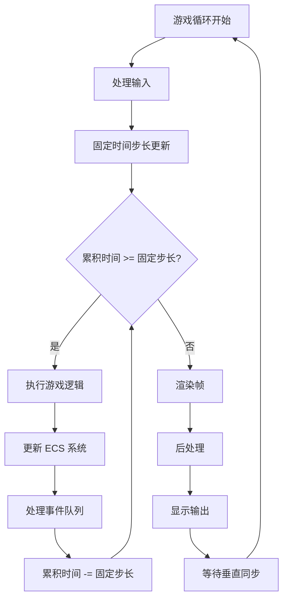
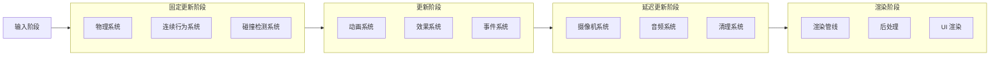

# 游戏循环机制

> 游戏主循环架构与时间管理详解

---

## 概述

游戏循环是游戏引擎的核心驱动机制，负责协调各个子系统的更新、渲染和事件处理。本引擎采用固定时间步长与可变帧率相结合的循环架构，确保游戏逻辑的稳定性和渲染的流畅性。

---

## 游戏循环架构

### 整体架构



---

## 时间管理

### 时间概念

| 概念 | 说明 | 单位 |
|------|------|------|
| `RealTime` | 真实时间（系统时间） | 秒 |
| `GameTime` | 游戏时间（可暂停/变速） | 秒 |
| `DeltaTime` | 帧间隔时间 | 秒 |
| `FixedDeltaTime` | 固定时间步长 | 秒 |
| `TimeScale` | 时间缩放因子 | 倍率 |

### 时间管理器

```csharp
class TimeManager {
    private static float _realTime = 0f;
    private static float _gameTime = 0f;
    private static float _deltaTime = 0f;
    private static float _fixedDeltaTime = 0.02f;  // 50 FPS
    private static float _timeScale = 1.0f;
    private static float _accumulatedTime = 0f;
    private static bool _isPaused = false;

    public static float RealTime => _realTime;
    public static float GameTime => _gameTime;
    public static float DeltaTime => _deltaTime;
    public static float FixedDeltaTime => _fixedDeltaTime;
    public static float TimeScale => _timeScale;
    public static bool IsPaused => _isPaused;

    public static void Update(float realDeltaTime) {
        _realTime += realDeltaTime;
        _deltaTime = realDeltaTime;

        if (!_isPaused) {
            _accumulatedTime += realDeltaTime * _timeScale;
        }
    }

    public static bool ShouldUpdateFixed() {
        return _accumulatedTime >= _fixedDeltaTime;
    }

    public static void UpdateFixed() {
        _gameTime += _fixedDeltaTime;
        _accumulatedTime -= _fixedDeltaTime;
    }

    public static void SetTimeScale(float scale) {
        _timeScale = Mathf.Clamp(scale, 0.1f, 10.0f);
    }

    public static void Pause() {
        _isPaused = true;
    }

    public static void Resume() {
        _isPaused = false;
    }

    public static void TogglePause() {
        _isPaused = !_isPaused;
    }
}
```

---

## 主循环实现

### 游戏循环类

```csharp
class GameLoop {
    private static bool _isRunning = false;
    private static float _targetFrameRate = 60f;
    private static float _maxFrameTime = 0.25f;  // 防止螺旋死亡

    private static List<ISystem> _fixedUpdateSystems = new();
    private static List<ISystem> _updateSystems = new();
    private static List<ISystem> _lateUpdateSystems = new();

    public static void Start() {
        _isRunning = true;

        var stopwatch = Stopwatch.StartNew();
        float lastTime = stopwatch.Elapsed.TotalSeconds;

        while (_isRunning) {
            float currentTime = stopwatch.Elapsed.TotalSeconds;
            float deltaTime = currentTime - lastTime;
            lastTime = currentTime;

            // 限制最大帧时间
            deltaTime = Mathf.Min(deltaTime, _maxFrameTime);

            // 更新时间管理器
            TimeManager.Update(deltaTime);

            // 处理输入
            InputManager.Update();

            // 固定更新循环
            while (TimeManager.ShouldUpdateFixed()) {
                TimeManager.UpdateFixed();
                FixedUpdate();
            }

            // 可变更新
            Update();

            // 延迟更新
            LateUpdate();

            // 渲染
            Render();

            // 垂直同步
            WaitForVSync();
        }
    }

    public static void Stop() {
        _isRunning = false;
    }

    private static void FixedUpdate() {
        // 更新固定时间步长系统
        foreach (var system in _fixedUpdateSystems) {
            system.Update(TimeManager.FixedDeltaTime);
        }

        // 处理物理
        PhysicsManager.Update(TimeManager.FixedDeltaTime);

        // 处理连续行为
        ContinuousBehaviorManager.Update(TimeManager.FixedDeltaTime);
    }

    private static void Update() {
        // 更新可变时间步长系统
        foreach (var system in _updateSystems) {
            system.Update(TimeManager.DeltaTime);
        }

        // 处理动画
        AnimationManager.Update(TimeManager.DeltaTime);

        // 处理事件队列
        EventManager.Flush();
    }

    private static void LateUpdate() {
        // 更新延迟系统
        foreach (var system in _lateUpdateSystems) {
            system.Update(TimeManager.DeltaTime);
        }

        // 清理死亡实体
        CleanupSystem.Update(TimeManager.DeltaTime);
    }

    private static void Render() {
        // 收集渲染对象
        RenderQueueManager.CollectRenderItems();

        // 渲染场景
        RenderPipeline.RenderFrame();

        // 渲染 UI
        UIManager.Render();
    }

    private static void WaitForVSync() {
        // 等待垂直同步
        float frameTime = 1.0f / _targetFrameRate;
        float elapsed = Stopwatch.Elapsed.TotalSeconds % frameTime;
        float waitTime = frameTime - elapsed;

        if (waitTime > 0) {
            Thread.Sleep((int)(waitTime * 1000));
        }
    }

    public static void RegisterFixedUpdateSystem(ISystem system) {
        _fixedUpdateSystems.Add(system);
    }

    public static void RegisterUpdateSystem(ISystem system) {
        _updateSystems.Add(system);
    }

    public static void RegisterLateUpdateSystem(ISystem system) {
        _lateUpdateSystems.Add(system);
    }

    public static void SetTargetFrameRate(float fps) {
        _targetFrameRate = fps;
    }
}
```

---

## 系统更新顺序

### 更新阶段划分



---

### 系统注册示例

```csharp
class GameInitialization {
    public static void Initialize() {
        // 注册固定更新系统
        GameLoop.RegisterFixedUpdateSystem(new PhysicsSystem());
        GameLoop.RegisterFixedUpdateSystem(new ContinuousBehaviorSystem());
        GameLoop.RegisterFixedUpdateSystem(new CollisionSystem());

        // 注册更新系统
        GameLoop.RegisterUpdateSystem(new AnimationSystem());
        GameLoop.RegisterUpdateSystem(new EffectSystem());
        GameLoop.RegisterUpdateSystem(new EventSystem());

        // 注册延迟更新系统
        GameLoop.RegisterLateUpdateSystem(new CameraSystem());
        GameLoop.RegisterLateUpdateSystem(new AudioSystem());
        GameLoop.RegisterLateUpdateSystem(new CleanupSystem());
    }
}
```

---

## 输入处理

### 输入管理器

```csharp
class InputManager {
    private static Dictionary<string, bool> _keyStates = new();
    private static Dictionary<string, bool> _previousKeyStates = new();
    private static Vector3 _mousePosition;
    private static bool _mouseButtonDown;
    private static bool _previousMouseButtonDown;

    public static void Update() {
        // 保存上一帧状态
        _previousKeyStates = new Dictionary<string, bool>(_keyStates);
        _previousMouseButtonDown = _mouseButtonDown;

        // 更新键盘状态
        _keyStates["space"] = Input.GetKey(KeyCode.Space);
        _keyStates["enter"] = Input.GetKey(KeyCode.Return);
        _keyStates["escape"] = Input.GetKey(KeyCode.Escape);
        // ... 其他按键

        // 更新鼠标状态
        _mousePosition = Input.mousePosition;
        _mouseButtonDown = Input.GetMouseButton(0);
    }

    public static bool GetKey(string key) {
        return _keyStates.ContainsKey(key) && _keyStates[key];
    }

    public static bool GetKeyDown(string key) {
        return GetKey(key) &&
               (!_previousKeyStates.ContainsKey(key) || !_previousKeyStates[key]);
    }

    public static bool GetKeyUp(string key) {
        return !GetKey(key) &&
               _previousKeyStates.ContainsKey(key) && _previousKeyStates[key];
    }

    public static Vector3 GetMousePosition() {
        return _mousePosition;
    }

    public static bool GetMouseButtonDown() {
        return _mouseButtonDown && !_previousMouseButtonDown;
    }

    public static bool GetMouseButtonUp() {
        return !_mouseButtonDown && _previousMouseButtonDown;
    }
}
```

---

## 物理更新

### 物理管理器

```csharp
class PhysicsManager {
    private static float _gravity = -9.81f;

    public static void Update(float dt) {
        var entities = EntityManager.GetEntitiesWith<TransformComponent, RigidbodyComponent>();

        foreach (var entity in entities) {
            var transform = entity.GetComponent<TransformComponent>();
            var rigidbody = entity.GetComponent<RigidbodyComponent>();

            // 应用重力
            if (rigidbody.useGravity) {
                rigidbody.velocity.y += _gravity * dt;
            }

            // 更新位置
            transform.position += rigidbody.velocity * dt;

            // 更新旋转
            transform.rotation *= Quaternion.Euler(rigidbody.angularVelocity * dt);

            // 应用阻力
            rigidbody.velocity *= Mathf.Pow(1.0f - rigidbody.drag, dt);
            rigidbody.angularVelocity *= Mathf.Pow(1.0f - rigidbody.angularDrag, dt);
        }
    }
}
```

---

## 连续行为更新

### 连续行为管理器

```csharp
class ContinuousBehaviorManager {
    public static void Update(float dt) {
        var entities = EntityManager.GetEntitiesWith<TransformComponent, TrajectoryComponent>();

        foreach (var entity in entities) {
            var transform = entity.GetComponent<TransformComponent>();
            var trajectory = entity.GetComponent<TrajectoryComponent>();

            // 更新轨迹
            trajectory.Update(dt);

            // 更新位置
            transform.position += trajectory.velocity * dt;
        }
    }
}
```

---

## 动画更新

### 动画管理器

```csharp
class AnimationManager {
    public static void Update(float dt) {
        var entities = EntityManager.GetEntitiesWith<AnimationComponent>();

        foreach (var entity in entities) {
            var animation = entity.GetComponent<AnimationComponent>();

            if (animation.isPlaying) {
                animation.animationTime += dt * animation.animationSpeed;

                if (!animation.isLooping && animation.animationTime >= 1.0f) {
                    animation.isPlaying = false;
                    animation.animationTime = 1.0f;
                }
            }
        }
    }
}
```

---

## 事件队列处理

### 事件队列

```csharp
class EventManager {
    private static Dictionary<string, List<EventData>> _pendingEvents = new();

    public static void Broadcast(string eventName, EventData eventData) {
        if (!_pendingEvents.ContainsKey(eventName)) {
            _pendingEvents[eventName] = new List<EventData>();
        }
        _pendingEvents[eventName].Add(eventData);
    }

    public static void Flush() {
        foreach (var pair in _pendingEvents) {
            // 合并同类事件
            var merged = MergeEvents(pair.Value);

            // 广播给订阅者
            if (_subscribers.ContainsKey(pair.Key)) {
                foreach (var handler in _subscribers[pair.Key]) {
                    handler(merged);
                }
            }
        }

        _pendingEvents.Clear();
    }

    private static EventData MergeEvents(List<EventData> events) {
        var merged = new EventData();
        merged.core = new Dictionary<string, object>();
        merged.runtime = new Dictionary<string, object>();

        // 合并核心数据
        foreach (var event_ in events) {
            foreach (var pair in event_.core) {
                if (!merged.core.ContainsKey(pair.Key)) {
                    merged.core[pair.Key] = pair.Value;
                } else if (pair.Key == "damage") {
                    // 伤害累加
                    merged.core[pair.Key] = (int)merged.core[pair.Key] + (int)pair.Value;
                }
            }
        }

        return merged;
    }
}
```

---

## 摄像机更新

### 摄像机系统

```csharp
class CameraSystem : ISystem {
    public void Update(float dt) {
        var cameraEntities = EntityManager.GetEntitiesWith<CameraComponent, TransformComponent>();

        foreach (var entity in cameraEntities) {
            var camera = entity.GetComponent<CameraComponent>();
            var transform = entity.GetComponent<TransformComponent>();

            // 平滑跟随目标
            if (camera.target != null) {
                var targetTransform = camera.target.GetComponent<TransformComponent>();
                var targetPosition = targetTransform.position;

                Vector3 desiredPosition = targetPosition + camera.offset;
                Vector3 smoothedPosition = Vector3.Lerp(
                    transform.position,
                    desiredPosition,
                    camera.smoothSpeed * dt
                );

                transform.position = smoothedPosition;
            }
        }
    }
}
```

---

## 清理系统

### 清理系统实现

```csharp
class CleanupSystem : ISystem {
    public void Update(float dt) {
        // 清理死亡实体
        var deadEntities = EntityManager.GetEntitiesWith<HealthComponent>()
            .Where(e => e.GetComponent<HealthComponent>().currentHealth <= 0)
            .ToList();

        foreach (var entity in deadEntities) {
            EntityManager.Destroy(entity);
        }

        // 清理过期粒子
        ParticleManager.CleanupExpiredParticles();

        // 清理过期事件
        EventManager.CleanupExpiredEvents();
    }
}
```

---

## 性能监控

### 帧率监控

```csharp
class FPSMonitor {
    private static float _fps;
    private static float _deltaTime;
    private static float _accumulatedTime;
    private static int _frameCount;

    public static void Update(float deltaTime) {
        _deltaTime = deltaTime;
        _accumulatedTime += deltaTime;
        _frameCount++;

        if (_accumulatedTime >= 1.0f) {
            _fps = _frameCount / _accumulatedTime;
            _accumulatedTime = 0;
            _frameCount = 0;

            Debug.Log($"FPS: {_fps:F2}");
        }
    }

    public static float GetFPS() {
        return _fps;
    }
}
```

---

### 性能分析器

```csharp
class PerformanceProfiler {
    private static Dictionary<string, float> _timings = new();
    private static Stack<string> _stack = new();

    public static void BeginSample(string name) {
        _stack.Push(name);
        _timings[name] = Time.realtimeSinceStartup;
    }

    public static void EndSample() {
        if (_stack.Count == 0) return;

        string name = _stack.Pop();
        if (_timings.ContainsKey(name)) {
            _timings[name] = Time.realtimeSinceStartup - _timings[name];
        }
    }

    public static void PrintReport() {
        Debug.Log("=== Performance Profiler ===");
        foreach (var pair in _timings.OrderByDescending(p => p.Value)) {
            Debug.Log($"{pair.Key}: {pair.Value * 1000:F2}ms");
        }
    }
}
```

---

## 暂停与恢复

### 暂停管理

```csharp
class PauseManager {
    private static bool _isPaused = false;
    private static Action _onPause;
    private static Action _onResume;

    public static bool IsPaused => _isPaused;

    public static void Pause() {
        if (_isPaused) return;

        _isPaused = true;
        TimeManager.Pause();
        _onPause?.Invoke();
    }

    public static void Resume() {
        if (!_isPaused) return;

        _isPaused = false;
        TimeManager.Resume();
        _onResume?.Invoke();
    }

    public static void TogglePause() {
        if (_isPaused) {
            Resume();
        } else {
            Pause();
        }
    }

    public static void RegisterOnPause(Action callback) {
        _onPause += callback;
    }

    public static void RegisterOnResume(Action callback) {
        _onResume += callback;
    }
}
```

---

## 相关链接

- [ECS 架构设计](18-ECS架构设计.md) - ECS 系统更新
- [渲染管线](17-渲染管线.md) - 渲染循环集成
- [子系统通信协议](20-子系统通信协议.md) - 系统间通信
- [事件模型](07-事件模型.md) - 事件队列处理
