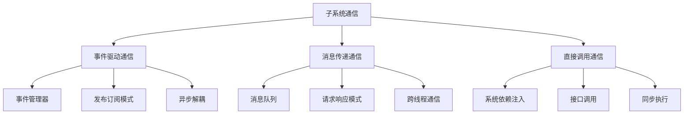
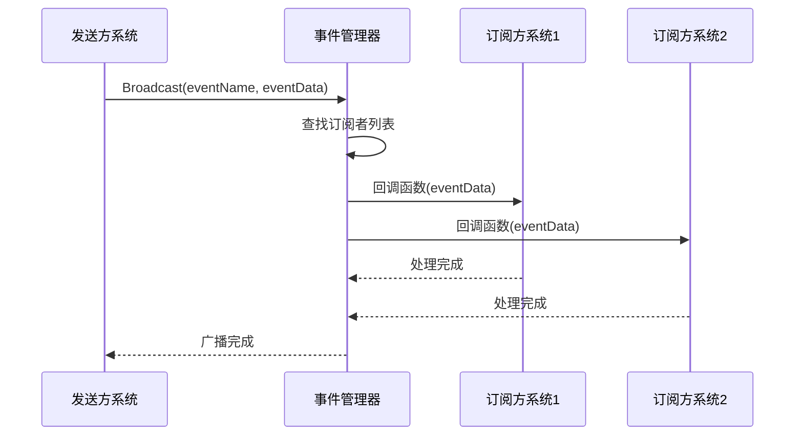
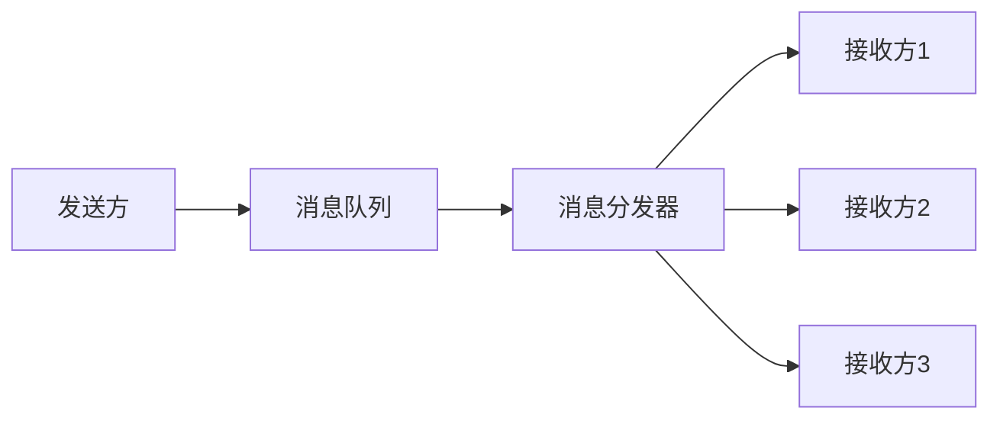
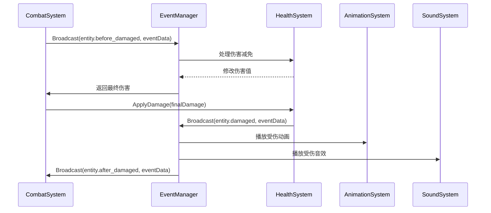
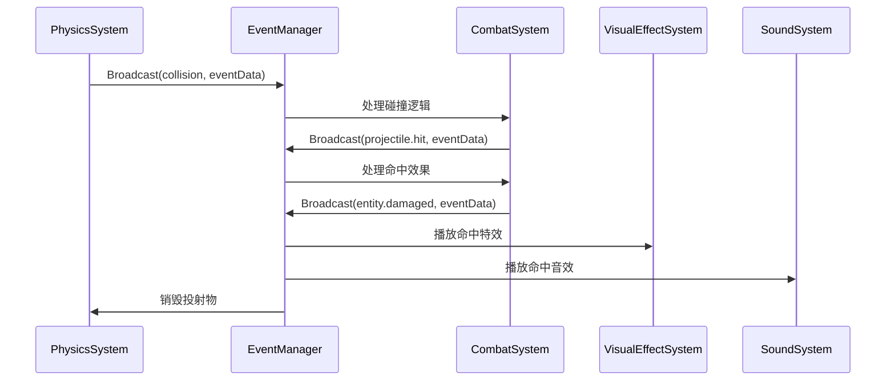
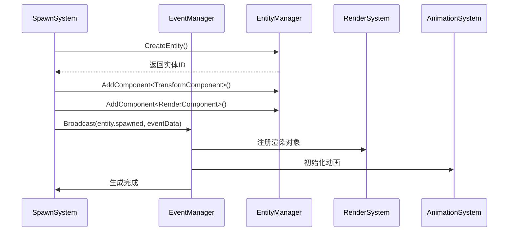

# 子系统通信协议

> 引擎各子系统间的通信机制与数据流转规范

---

## 概述

子系统通信协议定义了引擎各个独立模块之间如何安全、高效地交换数据和触发行为。本引擎采用事件驱动、消息传递和直接调用相结合的混合通信模式，确保系统的解耦与性能平衡。

---

## 通信架构总览

### 通信模式分类



---

## 事件驱动通信

### 事件管理器架构



---

### 事件管理器实现

```csharp
class EventManager {
    // 订阅者字典：事件名 -> 处理器列表
    private static Dictionary<string, List<EventHandler>> _subscribers = new();

    // 待处理事件队列
    private static Dictionary<string, List<EventData>> _pendingEvents = new();

    // 事件优先级
    private static Dictionary<string, List<(EventHandler handler, int priority)>> _prioritizedSubscribers = new();

    // 订阅事件
    public static void Subscribe(string eventName, EventHandler handler, int priority = 2) {
        if (!_subscribers.ContainsKey(eventName)) {
            _subscribers[eventName] = new List<EventHandler>();
        }
        _subscribers[eventName].Add(handler);

        // 优先级订阅
        if (!_prioritizedSubscribers.ContainsKey(eventName)) {
            _prioritizedSubscribers[eventName] = new List<(EventHandler, int)>();
        }
        _prioritizedSubscribers[eventName].Add((handler, priority));

        // 按优先级排序
        _prioritizedSubscribers[eventName].Sort((a, b) => a.priority.CompareTo(b.priority));
    }

    // 取消订阅
    public static void Unsubscribe(string eventName, EventHandler handler) {
        if (_subscribers.ContainsKey(eventName)) {
            _subscribers[eventName].Remove(handler);
        }
    }

    // 广播事件（立即执行）
    public static void Broadcast(string eventName, EventData eventData) {
        if (!_subscribers.ContainsKey(eventName)) {
            return;
        }

        foreach (var handler in _subscribers[eventName]) {
            try {
                handler(eventData);
            } catch (Exception e) {
                Debug.LogError($"Event handler error: {eventName}, {e.Message}");
            }
        }
    }

    // 广播事件（加入队列）
    public static void Queue(string eventName, EventData eventData) {
        if (!_pendingEvents.ContainsKey(eventName)) {
            _pendingEvents[eventName] = new List<EventData>();
        }
        _pendingEvents[eventName].Add(eventData);
    }

    // 刷新事件队列
    public static void Flush() {
        foreach (var pair in _pendingEvents) {
            // 合并同类事件
            var merged = MergeEvents(pair.Value);

            // 按优先级执行
            if (_prioritizedSubscribers.ContainsKey(pair.Key)) {
                foreach (var (handler, _) in _prioritizedSubscribers[pair.Key]) {
                    try {
                        handler(merged);
                    } catch (Exception e) {
                        Debug.LogError($"Event handler error: {pair.Key}, {e.Message}");
                    }
                }
            }
        }

        _pendingEvents.Clear();
    }

    // 合并事件
    private static EventData MergeEvents(List<EventData> events) {
        var merged = new EventData();
        merged.core = new Dictionary<string, object>();
        merged.runtime = new Dictionary<string, object>();

        foreach (var event_ in events) {
            foreach (var pair in event_.core) {
                if (!merged.core.ContainsKey(pair.Key)) {
                    merged.core[pair.Key] = pair.Value;
                } else if (pair.Key == "damage") {
                    // 伤害累加
                    merged.core[pair.Key] = (int)merged.core[pair.Key] + (int)pair.Value;
                }
            }
        }

        return merged;
    }
}
```

---

### 事件数据结构

```csharp
class EventData {
    // 核心数据：引擎语义字段
    public Dictionary<string, object> core = new();

    // 运行时数据：调试、追踪
    public Dictionary<string, object> runtime = new();

    // MOD 数据：命名空间隔离
    public Dictionary<string, object> mods = new();

    public EventData Clone() {
        var clone = new EventData();
        clone.core = new Dictionary<string, object>(core);
        clone.runtime = new Dictionary<string, object>(runtime);
        clone.mods = new Dictionary<string, object>(mods);
        return clone;
    }
}
```

---

### 标准事件列表

#### 实体事件

| 事件名 | 阶段 | 说明 | 核心字段 |
|--------|------|------|----------|
| `entity.spawned` | On | 实体生成 | `entity`, `position` |
| `entity.died` | On | 实体死亡 | `entity`, `killer` |
| `entity.damaged` | On | 实体受伤 | `entity`, `damage`, `source` |
| `entity.healed` | On | 实体治疗 | `entity`, `healAmount`, `source` |

#### 投射物事件

| 事件名 | 阶段 | 说明 | 核心字段 |
|--------|------|------|----------|
| `projectile.spawned` | On | 投射物生成 | `projectile`, `position`, `velocity` |
| `projectile.hit` | On | 投射物命中 | `projectile`, `target`, `position` |
| `projectile.missed` | On | 投射物未命中 | `projectile`, `position` |

#### 游戏事件

| 事件名 | 阶段 | 说明 | 核心字段 |
|--------|------|------|----------|
| `game.tick` | On | 游戏帧更新 | `deltaTime`, `gameTime` |
| `game.started` | On | 游戏开始 | - |
| `game.ended` | On | 游戏结束 | `result` |
| `game.wave_started` | On | 波次开始 | `waveNumber` |
| `game.wave_ended` | On | 波次结束 | `waveNumber`, `result` |

---

## 消息传递通信

### 消息队列架构



---

### 消息队列实现

```csharp
class MessageQueue {
    private static Queue<Message> _queue = new();
    private static Dictionary<string, List<MessageHandler>> _handlers = new();
    private static object _lock = new object();

    // 消息结构
    public struct Message {
        public string type;
        public object payload;
        public string sender;
        public DateTime timestamp;
    }

    // 发送消息
    public static void Send(string type, object payload, string sender = null) {
        var message = new Message {
            type = type,
            payload = payload,
            sender = sender,
            timestamp = DateTime.Now
        };

        lock (_lock) {
            _queue.Enqueue(message);
        }
    }

    // 注册处理器
    public static void RegisterHandler(string type, MessageHandler handler) {
        if (!_handlers.ContainsKey(type)) {
            _handlers[type] = new List<MessageHandler>();
        }
        _handlers[type].Add(handler);
    }

    // 处理消息
    public static void Process() {
        lock (_lock) {
            while (_queue.Count > 0) {
                var message = _queue.Dequeue();

                if (_handlers.ContainsKey(message.type)) {
                    foreach (var handler in _handlers[message.type]) {
                        try {
                            handler(message);
                        } catch (Exception e) {
                            Debug.LogError($"Message handler error: {message.type}, {e.Message}");
                        }
                    }
                }
            }
        }
    }
}
```

---

### 请求响应模式

```csharp
class RequestResponse {
    private static Dictionary<string, TaskCompletionSource<object>> _pendingRequests = new();
    private static object _lock = new object();

    // 发送请求
    public static async Task<T> SendRequest<T>(string type, object payload, string sender = null) {
        var requestId = Guid.NewGuid().ToString();
        var tcs = new TaskCompletionSource<object>();

        lock (_lock) {
            _pendingRequests[requestId] = tcs;
        }

        var message = new MessageQueue.Message {
            type = type,
            payload = new RequestPayload {
                requestId = requestId,
                payload = payload
            },
            sender = sender,
            timestamp = DateTime.Now
        };

        MessageQueue.Send(type, message.payload, sender);

        var result = await tcs.Task;
        return (T)result;
    }

    // 发送响应
    public static void SendResponse(string requestId, object response) {
        TaskCompletionSource<object> tcs;

        lock (_lock) {
            if (!_pendingRequests.TryGetValue(requestId, out tcs)) {
                return;
            }
            _pendingRequests.Remove(requestId);
        }

        tcs.SetResult(response);
    }

    // 请求载荷
    private struct RequestPayload {
        public string requestId;
        public object payload;
    }
}
```

---

## 直接调用通信

### 系统接口定义

```csharp
// 系统基接口
interface ISystem {
    void Update(float dt);
}

// 可查询系统接口
interface IQuerySystem : ISystem {
    T Query<T>(string query, object parameters);
}

// 可命令系统接口
interface ICommandSystem : ISystem {
    void Execute(string command, object parameters);
}
```

---

### 系统依赖注入

```csharp
class SystemContainer {
    private static Dictionary<Type, ISystem> _systems = new();

    // 注册系统
    public static void Register<T>(T system) where T : ISystem {
        _systems[typeof(T)] = system;
    }

    // 获取系统
    public static T Get<T>() where T : ISystem {
        if (_systems.TryGetValue(typeof(T), out var system)) {
            return (T)system;
        }
        throw new InvalidOperationException($"System not found: {typeof(T).Name}");
    }

    // 检查系统是否存在
    public static bool Has<T>() where T : ISystem {
        return _systems.ContainsKey(typeof(T));
    }
}
```

---

### 系统间调用示例

```csharp
// 查询系统示例
class QueryExample {
    public void FindNearestEnemy(Vector3 position, float range) {
        var combatSystem = SystemContainer.Get<CombatSystem>();
        var enemies = combatSystem.Query<List<Entity>>(
            "find_enemies_in_range",
            new { position, range }
        );

        foreach (var enemy in enemies) {
            Debug.Log($"Found enemy at {enemy.GetComponent<TransformComponent>().position}");
        }
    }
}

// 命令系统示例
class CommandExample {
    public void DealDamage(Entity target, int damage, Entity source) {
        var combatSystem = SystemContainer.Get<CombatSystem>();
        combatSystem.Execute("deal_damage", new {
            target,
            damage,
            source
        });
    }
}
```

---

## 通信协议规范

### 命名规范

| 类型 | 规范 | 示例 |
|------|------|------|
| 事件名 | `领域.动作` | `entity.damaged` |
| 消息类型 | `大驼峰` | `SpawnEntity` |
| 命令名 | `小写_下划线` | `deal_damage` |
| 查询名 | `小写_下划线` | `find_enemies_in_range` |

---

### 数据格式规范

#### 核心数据字段

```json
{
  "core": {
    "entity": "entity_id",
    "source": "entity_id",
    "target": "entity_id",
    "damage": 10,
    "position": {"x": 0, "y": 0, "z": 0},
    "canceled": false,
    "tags": ["projectile", "magic"]
  }
}
```

#### 运行时数据字段

```json
{
  "runtime": {
    "event_id": "uuid",
    "depth": 1,
    "timestamp": 1234567890,
    "stack_trace": []
  }
}
```

#### MOD 数据字段

```json
{
  "mods": {
    "mod_id": {
      "private_data": "value",
      "stack_count": 3
    }
  }
}
```

---

### 优先级规范

| 优先级 | 说明 | 使用场景 |
|--------|------|----------|
| 0 | 最高优先级 | 系统核心逻辑、安全检查 |
| 1 | 高优先级 | 关键游戏逻辑、状态变更 |
| 2 | 中优先级 | 普通游戏逻辑、效果触发 |
| 3 | 低优先级 | 视觉效果、音效、日志 |

---

## 跨子系统通信场景

### 场景1：伤害处理流程



---

### 场景2：投射物命中流程



---

### 场景3：实体生成流程



---

## 线程安全通信

### 线程安全事件管理器

```csharp
class ThreadSafeEventManager {
    private static Dictionary<string, List<EventHandler>> _subscribers = new();
    private static ConcurrentQueue<EventData> _eventQueue = new();
    private static object _lock = new object();

    public static void Subscribe(string eventName, EventHandler handler) {
        lock (_lock) {
            if (!_subscribers.ContainsKey(eventName)) {
                _subscribers[eventName] = new List<EventHandler>();
            }
            _subscribers[eventName].Add(handler);
        }
    }

    public static void Broadcast(string eventName, EventData eventData) {
        _eventQueue.Enqueue((eventName, eventData));
    }

    public static void ProcessQueue() {
        while (_eventQueue.TryDequeue(out var item)) {
            var (eventName, eventData) = item;

            List<EventHandler> handlers;
            lock (_lock) {
                if (!_subscribers.TryGetValue(eventName, out handlers)) {
                    continue;
                }
                handlers = new List<EventHandler>(handlers);
            }

            foreach (var handler in handlers) {
                try {
                    handler(eventData);
                } catch (Exception e) {
                    Debug.LogError($"Event handler error: {eventName}, {e.Message}");
                }
            }
        }
    }
}
```

---

## 调试与监控

### 事件追踪器

```csharp
class EventTracer {
    private static bool _enabled = false;
    private static List<EventRecord> _records = new();

    public static void Enable() {
        _enabled = true;
    }

    public static void Disable() {
        _enabled = false;
    }

    public static void Record(string eventName, EventData eventData) {
        if (!_enabled) return;

        _records.Add(new EventRecord {
            eventName = eventName,
            eventData = eventData.Clone(),
            timestamp = DateTime.Now,
            stackTrace = Environment.StackTrace
        });
    }

    public static List<EventRecord> GetRecords() {
        return new List<EventRecord>(_records);
    }

    public static void Clear() {
        _records.Clear();
    }

    public static void PrintRecords() {
        foreach (var record in _records) {
            Debug.Log($"Event: {record.eventName}, Time: {record.timestamp}");
        }
    }

    public struct EventRecord {
        public string eventName;
        public EventData eventData;
        public DateTime timestamp;
        public string stackTrace;
    }
}
```

---

### 消息监控器

```csharp
class MessageMonitor {
    private static Dictionary<string, int> _messageCounts = new();
    private static Dictionary<string, float> _messageTimes = new();

    public static void RecordMessage(string type, float duration) {
        if (!_messageCounts.ContainsKey(type)) {
            _messageCounts[type] = 0;
            _messageTimes[type] = 0;
        }

        _messageCounts[type]++;
        _messageTimes[type] += duration;
    }

    public static void PrintReport() {
        Debug.Log("=== Message Monitor ===");
        foreach (var pair in _messageCounts.OrderByDescending(p => p.Value)) {
            float avgTime = _messageTimes[pair.Key] / pair.Value;
            Debug.Log($"{pair.Key}: {pair.Value} messages, {avgTime * 1000:F2}ms avg");
        }
    }
}
```

---

## 性能优化

### 事件合并策略

```csharp
class EventMerger {
    private static Dictionary<string, List<EventData>> _mergeBuffer = new();
    private static float _mergeInterval = 0.1f;
    private static float _lastMergeTime;

    public static void QueueForMerge(string eventName, EventData eventData) {
        if (!_mergeBuffer.ContainsKey(eventName)) {
            _mergeBuffer[eventName] = new List<EventData>();
        }
        _mergeBuffer[eventName].Add(eventData);
    }

    public static void TryMerge() {
        if (Time.time - _lastMergeTime < _mergeInterval) {
            return;
        }

        foreach (var pair in _mergeBuffer) {
            if (pair.Value.Count > 1) {
                var merged = EventManager.MergeEvents(pair.Value);
                EventManager.Broadcast(pair.Key, merged);
            } else if (pair.Value.Count == 1) {
                EventManager.Broadcast(pair.Key, pair.Value[0]);
            }
        }

        _mergeBuffer.Clear();
        _lastMergeTime = Time.time;
    }
}
```

---

## 相关链接

- [事件模型](07-事件模型.md) - 事件系统详解
- [ECS 架构设计](18-ECS架构设计.md) - ECS 系统通信
- [游戏循环机制](19-游戏循环机制.md) - 事件队列处理
- [Mod 开发指南](21-Mod开发指南.md) - 自定义事件处理
