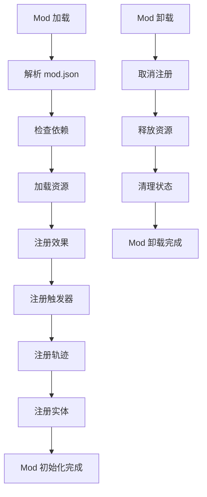

# Mod 开发指南

> 模组开发完整指南与最佳实践

---

## 概述

Mod（Module）系统是引擎的核心扩展机制，允许开发者通过配置和脚本扩展游戏内容。本指南详细介绍如何创建、打包和发布 Mod。

---

## Mod 架构

### Mod 目录结构

```
mod_name/
├── mod.json              # Mod 配置文件
├── effects/              # 效果定义
│   ├── shoot.json
│   ├── damage.json
│   └── explode.json
├── entities/            # 实体模板
│   ├── peashooter.json
│   └── zombie.json
├── triggers/             # 触发器定义
│   └── when_damaged.json
├── trajectories/         # 轨迹组件
│   ├── straight.json
│   └── sine.json
├── resources/           # 资源文件
│   ├── textures/
│   ├── meshes/
│   └── sounds/
└── scripts/              # 脚本文件（可选）
    └── custom_effect.cs
```

---

## Mod 配置文件

### mod.json 结构

```json
{
  "mod_id": "example_mod",
  "mod_name": "示例 Mod",
  "version": "1.0.0",
  "author": "开发者名称",
  "description": "这是一个示例 Mod",
  "engine_version": "1.0.0",
  "dependencies": [],
  "load_priority": 100,
  "enabled": true
}
```

### 字段说明

| 字段 | 类型 | 说明 |
|------|------|------|
| `mod_id` | string | Mod 唯一标识符（小写、下划线） |
| `mod_name` | string | Mod 显示名称 |
| `version` | string | 版本号（语义化版本） |
| `author` | string | 作者名称 |
| `description` | string | Mod 描述 |
| `engine_version` | string | 兼容的引擎版本 |
| `dependencies` | array | 依赖的其他 Mod |
| `load_priority` | int | 加载优先级（数值越大越晚加载） |
| `enabled` | bool | 是否启用 |

---

## 效果定义

### 效果定义结构

```json
{
  "effect_id": "fireball",
  "mod_id": "example_mod",
  "display_name": "火球",
  "description": "发射一个火球，命中后造成爆炸伤害",
  "slots": [
    {
      "name": "damage",
      "type": "value",
      "value_type": "int",
      "min": 10,
      "max": 100,
      "default": 30
    },
    {
      "name": "radius",
      "type": "value",
      "value_type": "float",
      "min": 1.0,
      "max": 10.0,
      "default": 3.0
    },
    {
      "name": "on_hit",
      "type": "effect",
      "allowed_types": ["damage", "explode", "null"]
    }
  ],
  "tags": ["fire", "projectile", "aoe"]
}
```

### 效果策略注册

```csharp
// 在 Mod 初始化时注册效果策略
public class ExampleMod : IMod {
    public string ModId => "example_mod";

    public void Initialize() {
        // 注册火球效果
        EffectStrategyRegistry.Register("example_mod.fireball", (context, params, children) => {
            int damage = (int)params["damage"];
            float radius = (float)params["radius"];

            // 创建火球投射物
            var projectile = new Projectile(context.position, context.direction) {
                damage = damage,
                radius = radius,
                onHitEffect = children.FirstOrDefault(c => c.effect_id != "null")
            };

            projectile.Spawn();

            return new EffectResult { success = true };
        });
    }
}
```

---

## 实体模板

### 实体定义结构

```json
{
  "entity_id": "fire_peashooter",
  "mod_id": "example_mod",
  "display_name": "火焰豌豆射手",
  "description": "发射火焰豌豆，命中后造成范围伤害",
  "base_entity": "peashooter",
  "components": [
    {
      "type": "health",
      "data": {
        "max_health": 100,
        "current_health": 100
      }
    },
    {
      "type": "cooldown",
      "data": {
        "shoot_cooldown": 1.5
      }
    },
    {
      "type": "team",
      "data": {
        "team_id": 0
      }
    }
  ],
  "phases": {
    "BeforeAttack": [
      {
        "effect_id": "check_cooldown",
        "order": 10
      },
      {
        "effect_id": "select_target",
        "order": 20
      }
    ],
    "OnAttack": [
      {
        "effect_id": "example_mod.fireball",
        "order": 10,
        "params": {
          "damage": 30,
          "radius": 3.0
        },
        "children": {
          "on_hit": {
            "effect_id": "explode",
            "params": {
              "radius": 3.0
            }
          }
        }
      }
    ],
    "AfterAttack": [
      {
        "effect_id": "play_sound",
        "order": 10,
        "params": {
          "sound_id": "fireball_shoot"
        }
      }
    ]
  },
  "render": {
    "mesh": "fire_peashooter",
    "material": "fire_peashooter_material",
    "layer": 2
  }
}
```

---

## 触发器定义

### 触发器定义结构

```json
{
  "trigger_id": "when_burning",
  "mod_id": "example_mod",
  "display_name": "燃烧时",
  "description": "当实体处于燃烧状态时触发",
  "event_name": "entity.tick",
  "condition_params": [
    {
      "name": "burn_duration",
      "type": "float",
      "min": 0.1,
      "max": 10.0,
      "default": 3.0
    }
  ],
  "max_bound_effects": 1,
  "tags": ["fire", "status"]
}
```

### 触发器策略注册

```csharp
// 注册触发器策略
TriggerStrategyRegistry.Register("example_mod.when_burning", (eventData, params, state) => {
    float burnDuration = (float)params["burn_duration"];

    // 检查是否处于燃烧状态
    if (!state.ContainsKey("burn_start_time")) {
        return false;
    }

    float burnTime = Time.time - (float)state["burn_start_time"];
    return burnTime < burnDuration;
});
```

---

## 轨迹组件

### 轨迹定义结构

```json
{
  "trajectory_id": "spiral",
  "mod_id": "example_mod",
  "display_name": "螺旋轨迹",
  "description": "投射物沿螺旋路径移动",
  "parameters": [
    {
      "name": "radius",
      "type": "float",
      "min": 0.1,
      "max": 5.0,
      "default": 1.0
    },
    {
      "name": "angular_velocity",
      "type": "float",
      "min": 1.0,
      "max": 20.0,
      "default": 5.0
    }
  ]
}
```

### 轨迹组件实现

```csharp
// 注册轨迹组件
TrajectoryRegistry.Register("example_mod.spiral", (config) => {
    return new SpiralTrajectory {
        radius = config["radius"].AsFloat,
        angularVelocity = config["angular_velocity"].AsFloat
    };
});

// 轨迹组件类
class SpiralTrajectory : TrajectoryComponent {
    public float radius;
    public float angularVelocity;
    private float _angle;

    public Vector3 GetVelocityDelta(Projectile projectile, float dt) {
        _angle += angularVelocity * dt;

        Vector3 perpendicular = Vector3.Cross(projectile.direction, Vector3.up);
        Vector3 offset = perpendicular * Mathf.Sin(_angle) * radius;

        return offset * dt;
    }
}
```

---

## Mod 生命周期

### 生命周期流程



---

### Mod 接口

```csharp
public interface IMod {
    string ModId { get; }
    void Initialize();
    void Shutdown();
}

public abstract class ModBase : IMod {
    public abstract string ModId { get; }

    public virtual void Initialize() {
        // 子类可重写
    }

    public virtual void Shutdown() {
        // 子类可重写
    }
}
```

---

### Mod 示例

```csharp
public class ExampleMod : ModBase {
    public override string ModId => "example_mod";

    public override void Initialize() {
        // 注册效果
        RegisterEffects();

        // 注册触发器
        RegisterTriggers();

        // 注册轨迹
        RegisterTrajectories();

        // 注册实体
        RegisterEntities();

        Debug.Log($"ExampleMod initialized!");
    }

    public override void Shutdown() {
        // 清理资源
        Debug.Log($"ExampleMod shutdown!");
    }

    private void RegisterEffects() {
        EffectStrategyRegistry.Register("example_mod.fireball", FireballEffect);
    }

    private void RegisterTriggers() {
        TriggerStrategyRegistry.Register("example_mod.when_burning", BurningTrigger);
    }

    private void RegisterTrajectories() {
        TrajectoryRegistry.Register("example_mod.spiral", SpiralTrajectoryCreator);
    }

    private void RegisterEntities() {
        EntityManager.RegisterEntityTemplate("example_mod.fire_peashooter");
    }

    private EffectResult FireballEffect(Context context, Dictionary<string, object> params, EffectNode[] children) {
        // 效果实现
        return new EffectResult { success = true };
    }

    private bool BurningTrigger(EventData eventData, Dictionary<string, object> params, Dictionary<string, object> state) {
        // 触发器实现
        return true;
    }

    private TrajectoryComponent SpiralTrajectoryCreator(JSONObject config) {
        // 轨迹创建器实现
        return new SpiralTrajectory();
    }
}
```

---

## Mod 命名空间

### 命名空间规则

所有 Mod 必须使用命名空间隔离，避免冲突。

```csharp
namespace ExampleMod {
    // 所有 Mod 内容都在此命名空间下
    public class ExampleMod : ModBase {
        // ...
    }

    public class FireballEffect {
        // ...
    }
}
```

### 访问 Mod 数据

```csharp
// 在事件数据中访问 Mod 私有数据
class ExampleMod : ModBase {
    public override void Initialize() {
        EventManager.Subscribe("entity.damaged", OnEntityDamaged);
    }

    private void OnEntityDamaged(EventData eventData) {
        // 访问 Mod 私有数据
        if (eventData.mods.ContainsKey(ModId)) {
            var modData = eventData.mods[ModId] as Dictionary<string, object>;
            var burnStack = (int)modData["burn_stack"];
            // ...
        }
    }
}
```

---

## Mod 依赖管理

### 依赖声明

```json
{
  "mod_id": "expansion_pack",
  "dependencies": [
    {
      "mod_id": "base_mod",
      "version": ">=1.0.0"
    },
    {
      "mod_id": "optional_mod",
      "version": ">=2.0.0",
      "optional": true
    }
  ]
}
```

### 依赖检查

```csharp
class ModDependencyChecker {
    public static bool CheckDependencies(ModConfig config) {
        foreach (var dep in config.dependencies) {
            var loadedMod = ModManager.GetMod(dep.mod_id);

            if (loadedMod == null) {
                if (!dep.optional) {
                    Debug.LogError($"Missing required dependency: {dep.mod_id}");
                    return false;
                }
                continue;
            }

            if (!CheckVersion(loadedMod.version, dep.version)) {
                Debug.LogError($"Version mismatch for {dep.mod_id}: required {dep.version}, found {loadedMod.version}");
                return false;
            }
        }

        return true;
    }

    private static bool CheckVersion(string version, string requirement) {
        // 简化版本检查
        var loadedVersion = new Version(version);
        var requiredVersion = new Version(requirement.Replace(">=", "").Replace("<=", "").Replace(">", "").Replace("<=", ""));

        if (requirement.StartsWith(">=")) {
            return loadedVersion >= requiredVersion;
        } else if (requirement.StartsWith("<=")) {
            return loadedVersion <= requiredVersion;
        } else if (requirement.StartsWith(">")) {
            return loadedVersion > requiredVersion;
        } else if (requirement.StartsWith("<")) {
            return loadedVersion < requiredVersion;
        } else {
            return loadedVersion == requiredVersion;
        }
    }
}
```

---

## Mod 打包与发布

### 打包结构

```
example_mod_v1.0.0.zip
├── mod.json
├── effects/
├── entities/
├── triggers/
├── trajectories/
├── resources/
└── scripts/
```

### 打包脚本

```csharp
class ModPackager {
    public static void PackageMod(string modPath, string outputPath) {
        var config = LoadModConfig(modPath);

        using (var archive = ZipFile.Open(outputPath, ZipArchiveMode.Create)) {
            // 添加 mod.json
            AddFileToArchive(archive, Path.Combine(modPath, "mod.json"), "mod.json");

            // 添加效果定义
            AddDirectoryToArchive(archive, Path.Combine(modPath, "effects"), "effects");

            // 添加实体模板
            AddDirectoryToArchive(archive, Path.Combine(modPath, "entities"), "entities");

            // 添加触发器定义
            AddDirectoryToArchive(archive, Path.Combine(modPath, "triggers"), "triggers");

            // 添加轨迹定义
            AddDirectoryToArchive(archive, Path.Combine(modPath, "trajectories"), "trajectories");

            // 添加资源
            AddDirectoryToArchive(archive, Path.Combine(modPath, "resources"), "resources");

            // 添加脚本
            AddDirectoryToArchive(archive, Path.Combine(modPath, "scripts"), "scripts");
        }

        Debug.Log($"Mod packaged: {outputPath}");
    }

    private static void AddFileToArchive(ZipArchive archive, string sourcePath, string entryName) {
        archive.CreateEntryFromFile(sourcePath, entryName);
    }

    private static void AddDirectoryToArchive(ZipArchive archive, string sourcePath, string entryPrefix) {
        if (!Directory.Exists(sourcePath)) return;

        foreach (var file in Directory.GetFiles(sourcePath, "*", SearchOption.AllDirectories)) {
            var relativePath = file.Substring(sourcePath.Length + 1);
            var entryName = Path.Combine(entryPrefix, relativePath);
            archive.CreateEntryFromFile(file, entryName);
        }
    }
}
```

---

## Mod 调试

### Mod 加载日志

```csharp
class ModLogger {
    private static Dictionary<string, List<string>> _logs = new();

    public static void Log(string modId, string message) {
        if (!_logs.ContainsKey(modId)) {
            _logs[modId] = new List<string>();
        }
        _logs[modId].Add($"[{DateTime.Now}] {message}");
        Debug.Log($"[{modId}] {message}");
    }

    public static void LogError(string modId, string message) {
        Log(modId, $"ERROR: {message}");
    }

    public static void LogWarning(string modId, string message) {
        Log(modId, $"WARNING: {message}");
    }

    public static void PrintLogs(string modId) {
        if (_logs.ContainsKey(modId)) {
            Debug.Log($"=== {modId} Logs ===");
            foreach (var log in _logs[modId]) {
                Debug.Log(log);
            }
        }
    }
}
```

---

### Mod 性能分析

```csharp
class ModProfiler {
    private static Dictionary<string, float> _executionTimes = new();

    public static void BeginProfile(string modId) {
        _executionTimes[modId] = Time.realtimeSinceStartup;
    }

    public static void EndProfile(string modId) {
        if (_executionTimes.ContainsKey(modId)) {
            _executionTimes[modId] = Time.realtimeSinceStartup - _executionTimes[modId];
        }
    }

    public static void PrintReport() {
        Debug.Log("=== Mod Performance Report ===");
        foreach (var pair in _executionTimes.OrderByDescending(p => p.Value)) {
            Debug.Log($"{pair.Key}: {pair.Value * 1000:F2}ms");
        }
    }
}
```

---

## 最佳实践

### 1. 命名规范

- Mod ID 使用小写字母和下划线：`example_mod`
- 效果 ID 使用 `mod_id.effect_name` 格式：`example_mod.fireball`
- 实体 ID 使用 `mod_id.entity_name` 格式：`example_mod.fire_peashooter`

### 2. 版本管理

- 使用语义化版本：`MAJOR.MINOR.PATCH`
- 破坏性更改增加主版本号
- 新增功能增加次版本号
- 错误修复增加修订号

### 3. 资源管理

- 使用相对路径引用资源
- 避免硬编码路径
- 提供默认资源

### 4. 错误处理

- 捕获并记录所有异常
- 提供有意义的错误信息
- 优雅地处理缺失依赖

### 5. 性能优化

- 避免频繁的内存分配
- 使用对象池
- 延迟加载资源

---

## 相关链接

- [效果系统](04-效果系统.md) - 效果定义详解
- [触发器系统](03-触发器系统.md) - 触发器定义详解
- [连续行为模型](08-连续行为模型.md) - 轨迹组件详解
- [ECS 架构设计](18-ECS架构设计.md) - 实体组件系统
- [扩展性与社区生态](11-扩展性与社区生态.md) - Mod 生态
