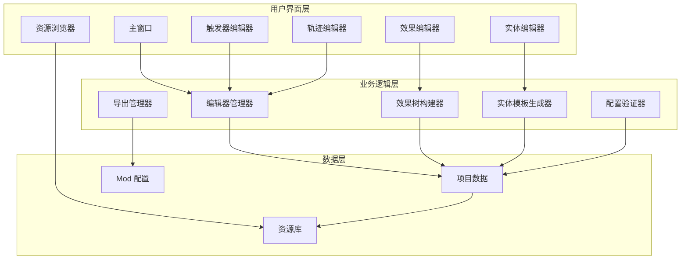
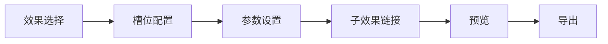
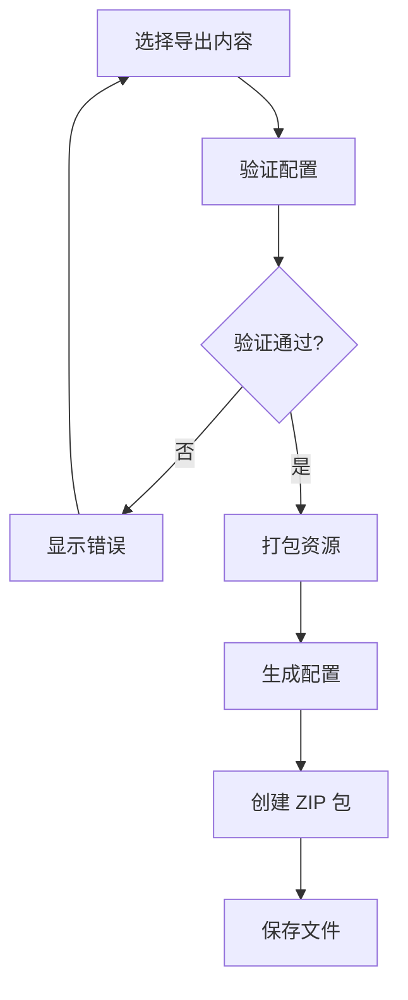

# 编辑器设计

> 实体组合与效果编辑器设计详解

---

## 概述

编辑器是引擎的核心工具，允许用户通过可视化界面组合效果、调整顺序、配置实体，并导出为 Mod 包。编辑器支持普通模式和高级模式，满足不同用户的需求。

---

## 编辑器架构

### 整体架构



---

## 主窗口设计

### 主窗口布局

```
┌─────────────────────────────────────────────────────────────┐
│ 菜单栏: 文件 | 编辑 | 视图 | 工具 | 帮助                    │
├─────────────────────────────────────────────────────────────┤
│ 工具栏: 新建 | 打开 | 保存 | 导出 | 运行 | 调试              │
├─────────────────────────────────────────────────────────────┤
│ ┌──────────┐ ┌──────────────────────────────────────────┐  │
│ │          │ │                                          │  │
│ │ 资源     │ │         编辑区域                        │  │
│ │ 浏览器   │ │                                          │  │
│ │          │ │                                          │  │
│ ├──────────┤ │                                          │  │
│ │ 效果     │ │                                          │  │
│ │ 库       │ │                                          │  │
│ │          │ │                                          │  │
│ ├──────────┤ │                                          │  │
│ │ 实体     │ │                                          │  │
│ │ 库       │ │                                          │  │
│ │          │ │                                          │  │
│ ├──────────┤ │                                          │  │
│ │ 触发器   │ │                                          │  │
│ │ 库       │ │                                          │  │
│ │          │ │                                          │  │
│ └──────────┘ └──────────────────────────────────────────┘  │
├─────────────────────────────────────────────────────────────┤
│ 属性面板                                                │
├─────────────────────────────────────────────────────────────┤
│ 状态栏: 就绪 | FPS: 60 | 实体数: 100                    │
└─────────────────────────────────────────────────────────────┘
```

---

## 效果编辑器

### 效果编辑器界面



---

### 效果树可视化

```
┌─────────────────────────────────────────────────────────────┐
│ 效果树编辑器                                              │
├─────────────────────────────────────────────────────────────┤
│                                                            │
│   [shoot] ──┐                                             │
│             │                                             │
│   speed: 15 │                                             │
│             │                                             │
│             └─> [explode] ──┐                             │
│                              │                             │
│               radius: 3.0     │                             │
│                              │                             │
│                              └─> [null]                   │
│                                                            │
├─────────────────────────────────────────────────────────────┤
│ 操作: 添加子效果 | 删除 | 复制 | 粘贴 | 验证             │
└─────────────────────────────────────────────────────────────┘
```

---

### 效果编辑器实现

```csharp
class EffectEditor : EditorWindow {
    private EffectNode _rootNode;
    private EffectNode _selectedNode;
    private Vector2 _scrollPosition;
    private bool _isDragging;
    private Vector2 _dragOffset;

    public void OnGUI() {
        DrawToolbar();
        DrawEffectTree();
        DrawProperties();
        DrawPreview();
    }

    private void DrawToolbar() {
        GUILayout.BeginHorizontal(EditorStyles.toolbar);
        if (GUILayout.Button("添加根效果", EditorStyles.toolbarButton)) {
            ShowEffectSelector();
        }
        if (GUILayout.Button("验证", EditorStyles.toolbarButton)) {
            ValidateEffectTree();
        }
        if (GUILayout.Button("导出", EditorStyles.toolbarButton)) {
            ExportEffect();
        }
        GUILayout.EndHorizontal();
    }

    private void DrawEffectTree() {
        _scrollPosition = GUILayout.BeginScrollView(_scrollPosition);
        DrawNode(_rootNode, 0);
        GUILayout.EndScrollView();
    }

    private void DrawNode(EffectNode node, int depth) {
        if (node == null) return;

        GUILayout.BeginHorizontal();
        GUILayout.Space(depth * 20);

        var rect = GUILayoutUtility.GetRect(200, 30);
        GUI.Box(rect, node.effect_id, EditorStyles.nodeStyle);

        // 处理拖拽
        HandleDrag(node, rect);

        // 处理选择
        if (Event.current.type == EventType.MouseDown && rect.Contains(Event.current.mousePosition)) {
            _selectedNode = node;
            Event.current.Use();
        }

        GUILayout.EndHorizontal();

        // 绘制子效果
        foreach (var child in node.children.Values) {
            DrawNode(child, depth + 1);
        }
    }

    private void HandleDrag(EffectNode node, Rect rect) {
        if (Event.current.type == EventType.MouseDown && rect.Contains(Event.current.mousePosition)) {
            _isDragging = true;
            _dragOffset = Event.current.mousePosition - rect.position;
            Event.current.Use();
        }

        if (_isDragging && Event.current.type == EventType.MouseDrag) {
            // 处理拖拽逻辑
            Event.current.Use();
        }

        if (_isDragging && Event.current.type == EventType.MouseUp) {
            _isDragging = false;
            Event.current.Use();
        }
    }

    private void DrawProperties() {
        if (_selectedNode == null) return;

        GUILayout.Label("属性", EditorStyles.boldLabel);

        // 绘制参数
        foreach (var param in _selectedNode.params) {
            GUILayout.Label(param.Key);
            if (param.Value is int intValue) {
                _selectedNode.params[param.Key] = EditorGUILayout.IntField(intValue);
            } else if (param.Value is float floatValue) {
                _selectedNode.params[param.Key] = EditorGUILayout.FloatField(floatValue);
            } else if (param.Value is string stringValue) {
                _selectedNode.params[param.Key] = EditorGUILayout.TextField(stringValue);
            }
        }
    }

    private void DrawPreview() {
        GUILayout.Label("预览", EditorStyles.boldLabel);

        // 显示效果树结构
        var treeString = EffectTreeSerializer.Serialize(_rootNode);
        EditorGUILayout.TextArea(treeString, GUILayout.Height(200));
    }

    private void ShowEffectSelector() {
        var selector = new EffectSelectorWindow();
        selector.OnEffectSelected = (effectId) => {
            _rootNode = new EffectNode {
                effect_id = effectId,
                params = new Dictionary<string, object>(),
                children = new Dictionary<string, EffectNode>()
            };
        };
        selector.Show();
    }

    private void ValidateEffectTree() {
        var validator = new EffectTreeValidator();
        var result = validator.Validate(_rootNode);

        if (result.IsValid) {
            Debug.Log("效果树验证通过");
        } else {
            Debug.LogError($"效果树验证失败: {result.ErrorMessage}");
        }
    }

    private void ExportEffect() {
        var json = EffectTreeSerializer.Serialize(_rootNode);
        var path = EditorUtility.SaveFilePanel("保存效果", "", "effect", "json");
        if (!string.IsNullOrEmpty(path)) {
            File.WriteAllText(path, json);
        }
    }
}
```

---

## 实体编辑器

### 实体编辑器界面

```
┌─────────────────────────────────────────────────────────────┐
│ 实体编辑器                                                │
├─────────────────────────────────────────────────────────────┤
│ 基本信息                                                  │
│ ┌─────────────────────────────────────────────────────────┐  │
│ │ 实体ID: fire_peashooter                             │  │
│ │ 显示名称: 火焰豌豆射手                               │  │
│ │ 描述: 发射火焰豌豆，命中后造成范围伤害               │  │
│ │ 基础实体: peashooter                                │  │
│ └─────────────────────────────────────────────────────────┘  │
│                                                            │
│ 组件配置                                                  │
│ ┌─────────────────────────────────────────────────────────┐  │
│ │ [+] 添加组件                                          │  │
│ │                                                        │  │
│ │ HealthComponent                                        │  │
│ │   max_health: 100                                    │  │
│ │   current_health: 100                                 │  │
│ │                                                        │  │
│ │ CooldownComponent                                      │  │
│ │   shoot_cooldown: 1.5                                 │  │
│ │                                                        │  │
│ │ TeamComponent                                         │  │
│ │   team_id: 0                                         │  │
│ └─────────────────────────────────────────────────────────┘  │
│                                                            │
│ 阶段配置                                                  │
│ ┌─────────────────────────────────────────────────────────┐  │
│ │ BeforeAttack                                          │  │
│ │   [check_cooldown] (10)                               │  │
│ │   [select_target] (20)                               │  │
│ │                                                        │  │
│ │ OnAttack                                              │  │
│ │   [fireball] (10)                                    │  │
│ │                                                        │  │
│ │ AfterAttack                                           │  │
│ │   [play_sound] (10)                                   │  │
│ └─────────────────────────────────────────────────────────┘  │
│                                                            │
│ 渲染配置                                                  │
│ ┌─────────────────────────────────────────────────────────┐  │
│ │ Mesh: fire_peashooter                                │  │
│ │ Material: fire_peashooter_material                    │  │
│ │ Layer: Plant                                         │  │
│ └─────────────────────────────────────────────────────────┘  │
└─────────────────────────────────────────────────────────────┘
```

---

### 实体编辑器实现

```csharp
class EntityEditor : EditorWindow {
    private EntityTemplate _template;
    private List<ComponentConfig> _components;
    private Dictionary<string, List<PhaseEffect>> _phases;

    public void OnGUI() {
        DrawBasicInfo();
        DrawComponents();
        DrawPhases();
        DrawRenderConfig();
        DrawToolbar();
    }

    private void DrawBasicInfo() {
        GUILayout.Label("基本信息", EditorStyles.boldLabel);

        _template.entity_id = EditorGUILayout.TextField("实体ID", _template.entity_id);
        _template.display_name = EditorGUILayout.TextField("显示名称", _template.display_name);
        _template.description = EditorGUILayout.TextField("描述", _template.description);
        _template.base_entity = EditorGUILayout.TextField("基础实体", _template.base_entity);
    }

    private void DrawComponents() {
        GUILayout.Label("组件配置", EditorStyles.boldLabel);

        if (GUILayout.Button("添加组件")) {
            ShowComponentSelector();
        }

        foreach (var component in _components) {
            GUILayout.BeginHorizontal();
            GUILayout.Label(component.type);
            if (GUILayout.Button("删除", GUILayout.Width(60))) {
                _components.Remove(component);
            }
            GUILayout.EndHorizontal();

            // 绘制组件参数
            EditorGUI.indentLevel++;
            foreach (var param in component.data) {
                DrawParameter(param.Key, param.Value);
            }
            EditorGUI.indentLevel--;
        }
    }

    private void DrawPhases() {
        GUILayout.Label("阶段配置", EditorStyles.boldLabel);

        foreach (var phase in _phases) {
            GUILayout.Label(phase.Key, EditorStyles.boldLabel);

            foreach (var effect in phase.Value) {
                GUILayout.BeginHorizontal();
                GUILayout.Space(20);
                GUILayout.Label($"[{effect.effect_id}] ({effect.order})");
                if (GUILayout.Button("编辑", GUILayout.Width(60))) {
                    EditEffect(effect);
                }
                if (GUILayout.Button("删除", GUILayout.Width(60))) {
                    phase.Value.Remove(effect);
                }
                GUILayout.EndHorizontal();
            }

            if (GUILayout.Button("添加效果")) {
                ShowEffectSelector(phase.Key);
            }
        }
    }

    private void DrawRenderConfig() {
        GUILayout.Label("渲染配置", EditorStyles.boldLabel);

        _template.render.mesh = EditorGUILayout.TextField("Mesh", _template.render.mesh);
        _template.render.material = EditorGUILayout.TextField("Material", _template.render.material);
        _template.render.layer = EditorGUILayout.IntField("Layer", _template.render.layer);
    }

    private void DrawToolbar() {
        GUILayout.BeginHorizontal(EditorStyles.toolbar);
        if (GUILayout.Button("验证", EditorStyles.toolbarButton)) {
            ValidateEntity();
        }
        if (GUILayout.Button("导出", EditorStyles.toolbarButton)) {
            ExportEntity();
        }
        GUILayout.EndHorizontal();
    }

    private void DrawParameter(string key, object value) {
        GUILayout.Label(key);
        if (value is int intValue) {
            value = EditorGUILayout.IntField(intValue);
        } else if (value is float floatValue) {
            value = EditorGUILayout.FloatField(floatValue);
        } else if (value is string stringValue) {
            value = EditorGUILayout.TextField(stringValue);
        }
    }

    private void ShowComponentSelector() {
        var selector = new ComponentSelectorWindow();
        selector.OnComponentSelected = (componentType) => {
            _components.Add(new ComponentConfig {
                type = componentType,
                data = new Dictionary<string, object>()
            });
        };
        selector.Show();
    }

    private void ShowEffectSelector(string phase) {
        var selector = new EffectSelectorWindow();
        selector.OnEffectSelected = (effectId) => {
            _phases[phase].Add(new PhaseEffect {
                effect_id = effectId,
                order = _phases[phase].Count * 10,
                params = new Dictionary<string, object>(),
                children = new Dictionary<string, EffectNode>()
            });
        };
        selector.Show();
    }

    private void EditEffect(PhaseEffect effect) {
        var editor = new EffectEditor();
        editor.SetEffectNode(effect);
        editor.Show();
    }

    private void ValidateEntity() {
        var validator = new EntityTemplateValidator();
        var result = validator.Validate(_template);

        if (result.IsValid) {
            Debug.Log("实体模板验证通过");
        } else {
            Debug.LogError($"实体模板验证失败: {result.ErrorMessage}");
        }
    }

    private void ExportEntity() {
        var json = EntityTemplateSerializer.Serialize(_template);
        var path = EditorUtility.SaveFilePanel("保存实体", "", "entity", "json");
        if (!string.IsNullOrEmpty(path)) {
            File.WriteAllText(path, json);
        }
    }
}
```

---

## 触发器编辑器

### 触发器编辑器界面

```
┌─────────────────────────────────────────────────────────────┐
│ 触发器编辑器                                              │
├─────────────────────────────────────────────────────────────┤
│ 基本信息                                                  │
│ ┌─────────────────────────────────────────────────────────┐  │
│ │ 触发器ID: when_burning                               │  │
│ │ 显示名称: 燃烧时                                      │  │
│ │ 描述: 当实体处于燃烧状态时触发                        │  │
│ │ 事件名: entity.tick                                   │  │
│ └─────────────────────────────────────────────────────────┘  │
│                                                            │
│ 条件参数                                                  │
│ ┌─────────────────────────────────────────────────────────┐  │
│ │ [+] 添加参数                                          │  │
│ │                                                        │  │
│ │ burn_duration                                         │  │
│ │   类型: float                                         │  │
│ │   最小值: 0.1                                         │  │
│ │   最大值: 10.0                                        │  │
│ │   默认值: 3.0                                         │  │
│ └─────────────────────────────────────────────────────────┘  │
│                                                            │
│ 绑定效果                                                  │
│ ┌─────────────────────────────────────────────────────────┐  │
│ │ [+] 添加效果                                          │  │
│ │                                                        │  │
│ │ [damage]                                              │  │
│ │   damage: 5                                           │  │
│ │                                                        │  │
│ │ [play_sound]                                          │  │
│ │   sound_id: burn_sound                                │  │
│ └─────────────────────────────────────────────────────────┘  │
└─────────────────────────────────────────────────────────────┘
```

---

## 轨迹编辑器

### 轨迹编辑器界面

```
┌─────────────────────────────────────────────────────────────┐
│ 轨迹编辑器                                                │
├─────────────────────────────────────────────────────────────┤
│ 轨迹预览                                                  │
│ ┌─────────────────────────────────────────────────────────┐  │
│ │                                                       │  │
│ │                    轨迹可视化                          │  │
│ │                                                       │  │
│ │                  ┌─────┐                              │  │
│ │                  │  ●  │                              │  │
│ │                  └─────┘                              │  │
│ │                                                       │  │
│ └─────────────────────────────────────────────────────────┘  │
│                                                            │
│ 轨迹组件                                                  │
│ ┌─────────────────────────────────────────────────────────┐  │
│ │ [+] 添加组件                                          │  │
│ │                                                        │  │
│ │ StraightTrajectory                                     │  │
│ │   speed: 10.0                                         │  │
│ │                                                        │  │
│ │ SineTrajectory                                        │  │
│ │   amplitude: 0.5                                       │  │
│ │   frequency: 5.0                                       │  │
│ │                                                        │  │
│ │ SpiralTrajectory                                      │  │
│ │   radius: 1.0                                         │  │
│ │   angular_velocity: 5.0                                │  │
│ └─────────────────────────────────────────────────────────┘  │
│                                                            │
│ 参数调整                                                  │
│ ┌─────────────────────────────────────────────────────────┐  │
│ │ 速度: 10.0 ━━━━━━━━━━━━━━━━━━━━━━━━━━━━━━━━━━━━●    │  │
│ │ 振幅: 0.5  ━━━━━━━━━━━━━━━━━━━━━━━━━━━━━━━━━━━━●    │  │
│ │ 频率: 5.0  ━━━━━━━━━━━━━━━━━━━━━━━━━━━━━━━━━━━━●    │  │
│ └─────────────────────────────────────────────────────────┘  │
└─────────────────────────────────────────────────────────────┘
```

---

## 资源浏览器

### 资源浏览器界面

```
┌─────────────────────────────────────────────────────────────┐
│ 资源浏览器                                                │
├─────────────────────────────────────────────────────────────┤
│ 搜索: [___________________] [搜索]                        │
├─────────────────────────────────────────────────────────────┤
│ 过滤: [全部] [纹理] [网格] [材质] [音效] [动画]          │
├─────────────────────────────────────────────────────────────┤
│ ┌──────────┐ ┌──────────────────────────────────────────┐  │
│ │          │ │                                          │  │
│ │ 文件树   │ │         资源列表                        │  │
│ │          │ │                                          │  │
│ │ ├ textures│ │  [peashooter.png]                        │  │
│ │ │  ├ ... │ │  [zombie.png]                            │  │
│ │ │        │ │  [fire_peashooter.png]                    │  │
│ │ ├ meshes │ │                                          │  │
│ │ │  ├ ... │ │  [peashooter.fbx]                        │  │
│ │ │        │ │  [zombie.fbx]                             │  │
│ │ ├ materials│ │  [fire_peashooter.fbx]                   │  │
│ │ │  ├ ... │ │                                          │  │
│ │ │        │ │  [peashooter_material.mat]                 │  │
│ │ ├ sounds │ │  [zombie_material.mat]                    │  │
│ │ │  ├ ... │ │  [fire_peashooter_material.mat]            │  │
│ │ │        │ │                                          │  │
│ │ └ animations│ │  [shoot.wav]                            │  │
│ │    ├ ... │ │  [hit.wav]                               │  │
│ │          │ │  [fire_shoot.wav]                         │  │
│ └──────────┘ └──────────────────────────────────────────┘  │
└─────────────────────────────────────────────────────────────┘
```

---

## 导出管理器

### 导出流程



---

### 导出管理器实现

```csharp
class ExportManager {
    public static void ExportMod(string modPath, string outputPath) {
        var config = LoadModConfig(modPath);

        // 验证配置
        if (!ValidateMod(config)) {
            EditorUtility.DisplayDialog("导出失败", "Mod 配置验证失败", "确定");
            return;
        }

        // 选择导出内容
        var exportOptions = ShowExportDialog();
        if (!exportOptions.confirmed) {
            return;
        }

        // 打包资源
        var packagePath = PackageMod(modPath, outputPath, exportOptions);

        EditorUtility.DisplayDialog("导出成功", $"Mod 已导出到: {packagePath}", "确定");
    }

    private static ModConfig LoadModConfig(string modPath) {
        var configPath = Path.Combine(modPath, "mod.json");
        var json = File.ReadAllText(configPath);
        return JsonUtility.FromJson<ModConfig>(json);
    }

    private static bool ValidateMod(ModConfig config) {
        var validator = new ModConfigValidator();
        var result = validator.Validate(config);

        if (!result.IsValid) {
            Debug.LogError($"Mod 验证失败: {result.ErrorMessage}");
            return false;
        }

        return true;
    }

    private static ExportOptions ShowExportDialog() {
        var options = new ExportOptions();

        var window = new ExportOptionsWindow();
        window.OnConfirmed = (opts) => {
            options = opts;
        };
        window.ShowModal();

        return options;
    }

    private static string PackageMod(string modPath, string outputPath, ExportOptions options) {
        var packageName = $"{Path.GetFileName(modPath)}_v{options.version}.zip";
        var packagePath = Path.Combine(outputPath, packageName);

        using (var archive = ZipFile.Open(packagePath, ZipArchiveMode.Create)) {
            // 添加 mod.json
            AddFileToArchive(archive, Path.Combine(modPath, "mod.json"), "mod.json");

            // 添加效果定义
            if (options.includeEffects) {
                AddDirectoryToArchive(archive, Path.Combine(modPath, "effects"), "effects");
            }

            // 添加实体模板
            if (options.includeEntities) {
                AddDirectoryToArchive(archive, Path.Combine(modPath, "entities"), "entities");
            }

            // 添加触发器定义
            if (options.includeTriggers) {
                AddDirectoryToArchive(archive, Path.Combine(modPath, "triggers"), "triggers");
            }

            // 添加轨迹定义
            if (options.includeTrajectories) {
                AddDirectoryToArchive(archive, Path.Combine(modPath, "trajectories"), "trajectories");
            }

            // 添加资源
            if (options.includeResources) {
                AddDirectoryToArchive(archive, Path.Combine(modPath, "resources"), "resources");
            }
        }

        return packagePath;
    }

    private static void AddFileToArchive(ZipArchive archive, string sourcePath, string entryName) {
        archive.CreateEntryFromFile(sourcePath, entryName);
    }

    private static void AddDirectoryToArchive(ZipArchive archive, string sourcePath, string entryPrefix) {
        if (!Directory.Exists(sourcePath)) return;

        foreach (var file in Directory.GetFiles(sourcePath, "*", SearchOption.AllDirectories)) {
            var relativePath = file.Substring(sourcePath.Length + 1);
            var entryName = Path.Combine(entryPrefix, relativePath);
            archive.CreateEntryFromFile(file, entryName);
        }
    }
}

class ExportOptions {
    public bool confirmed;
    public string version;
    public bool includeEffects = true;
    public bool includeEntities = true;
    public bool includeTriggers = true;
    public bool includeTrajectories = true;
    public bool includeResources = true;
}
```

---

## 编辑器模式

### 普通模式

**特点**

- 提供默认组合
- 简化界面
- 隐藏高级选项

**适用场景**

- 新手用户
- 快速原型开发

---

### 高级模式

**特点**

- 允许显式顺序
- 显示所有参数
- 支持自定义配置

**适用场景**

- 高级用户
- 精确控制需求

---

## 调试工具

### 实时预览

```csharp
class LivePreview {
    private static GameObject _previewObject;

    public static void ShowPreview(EntityTemplate template) {
        if (_previewObject != null) {
            Destroy(_previewObject);
        }

        _previewObject = new GameObject("Preview");
        var entity = EntityManager.CreateFromTemplate(template);
        _previewObject.AddComponent<EntityPreview>().SetEntity(entity);
    }

    public static void UpdatePreview() {
        if (_previewObject != null) {
            _previewObject.GetComponent<EntityPreview>().Update();
        }
    }
}
```

---

### Context 流转查看器

```csharp
class ContextViewer : EditorWindow {
    private List<ContextRecord> _records = new();

    public void OnGUI() {
        GUILayout.Label("Context 流转记录", EditorStyles.boldLabel);

        foreach (var record in _records) {
            GUILayout.Label($"事件: {record.eventName}");
            GUILayout.Label($"深度: {record.depth}");
            GUILayout.Label($"时间: {record.timestamp}");

            EditorGUILayout.TextArea(JsonUtility.ToJson(record.context), GUILayout.Height(100));

            GUILayout.Space(10);
        }
    }

    public void RecordContext(string eventName, Context context) {
        _records.Add(new ContextRecord {
            eventName = eventName,
            context = context.Clone(),
            depth = context.chainDepth,
            timestamp = Time.time
        });
    }

    private class ContextRecord {
        public string eventName;
        public Context context;
        public int depth;
        public float timestamp;
    }
}
```

---

## 相关链接

- [Mod 开发指南](21-Mod开发指南.md) - Mod 结构与打包
- [效果系统](04-效果系统.md) - 效果定义详解
- [触发器系统](03-触发器系统.md) - 触发器定义详解
- [连续行为模型](08-连续行为模型.md) - 轨迹组件详解
- [ECS 架构设计](18-ECS架构设计.md) - 实体组件系统
