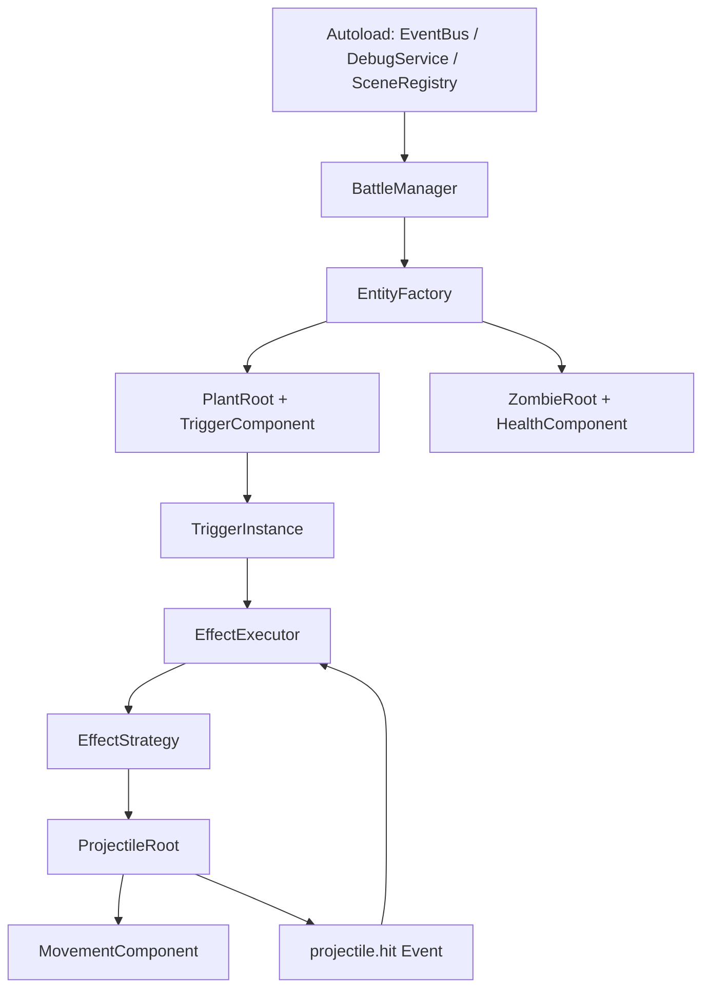

# 参考实现后的设计修正

## 目的

在引入 [PVZ-Godot-Dream](24-外部项目调研-PVZ-Godot-Dream.md) 作为参考实现后，需要把原先偏“理论引擎化”的设计，调整成更适合 Godot 原型落地的版本。

这页不讨论愿景，只讨论当前设计需要修正的地方。

---

## 修正 1：从“ECS 优先”改为“Godot 节点 + 组件优先”

原先文档里对 ECS、渲染管线、系统层拆分写得过重，容易让实现顺序失真。

当前更合理的落地方式应是：

- 战斗实体使用 Godot 场景和节点
- 实体根节点承载强耦合状态
- 可拆分行为由组件节点承载
- 全局服务放在 `Autoload`

推荐组织：

```text
PlantRoot
├── TriggerComponent
├── HealthComponent
├── AttackEmitterComponent
└── DebugViewComponent

ProjectileRoot
├── HitboxComponent
├── MovementComponent
└── OnHitEffectComponent
```

这样做的原因：

- 更符合 Godot 编辑器和场景工作流
- 更容易先做最小演示
- 更适合快速调试节点关系和碰撞
- 可以在后续明确性能瓶颈后，再判断是否需要 ECS 化

---

## 修正 2：事件系统采用 Autoload 总线，而不是把所有逻辑塞进实体间直连

参考实现里的 `EventBus` 说明了一件事：

> 在 Godot 里，全局事件总线是低成本且高收益的。

所以当前项目应明确采用：

- `EventBus` 作为 `Autoload`
- 负责订阅、退订、广播、调试记录
- 事件仍然使用语义化命名

但要和参考实现保持一个关键差异：

- 当前项目的事件系统不仅服务场景切换和游戏流程
- 它还要作为 `TriggerInstance` 的核心触发入口

因此当前建议的事件总线能力为：

- 事件订阅 / 退订
- 基本优先级
- 调试历史记录
- 链深追踪字段
- 事件源实体与目标实体字段

第一阶段不必一开始就做复杂过滤器体系，但日志和链深必须先有。

---

## 修正 3：`Def / Instance / Strategy` 保留，但定义层先改为 Godot Resource 驱动

原设计里大量使用 JSON 示例，这是因为 JSON 便于说明结构，但对当前 Godot 原型来说并不是最优入口。

当前更适合的方式：

- `TriggerDef` 使用 `Resource`
- `EffectDef` 使用 `Resource`
- `TriggerStrategy` / `EffectStrategy` 使用脚本注册

推荐原因：

- 可以直接在 Godot Inspector 中编辑
- 可以利用 Godot 资源系统进行引用和序列化
- 少一层外部解析与错误来源

这并不否定后续外部化配置，而是把顺序改成：

1. 先在 Godot 内部跑通定义与实例化
2. 再考虑导入导出、JSON、Mod 包格式

---

## 修正 4：触发器和效果树继续保留为核心抽象，不向“具体植物攻击组件”退化

参考实现里大量行为是：

- 某个具体植物对应一个具体攻击组件
- 某个具体子弹类型对应一个具体注册项

这对复刻原版非常有效，但对当前项目不够通用。

所以当前项目不应该照搬成：

- `PeaShooterAttackComponent`
- `ThreePeaAttackComponent`
- `CornAttackComponent`

而应该保留统一抽象：

- `TriggerInstance` 决定何时触发
- `EffectNode` 决定做什么
- `EffectStrategy` 决定如何执行

也就是说，参考实现可以影响“组织方式”，但不应替代“规则表达方式”。

---

## 修正 5：投射物系统直接借鉴“根节点 + MovementComponent”思路

这是参考实现里最值得直接吸收的部分之一。

当前项目建议明确：

- 投射物本体负责生命周期、命中回调、所属阵营、绑定效果
- `MovementComponent` 负责每帧移动计算
- 命中后的后续效果仍然交回效果系统处理

建议的最小结构：

```text
Projectile
├── ProjectileBody
├── Hitbox
├── MovementComponent
└── ProjectileRuntime
```

第一阶段只做：

- `LinearMovementComponent`

第二阶段再扩：

- `TrackMovementComponent`
- `SineOffsetMovementComponent`
- 其他叠加贡献型轨迹

这样能把“连续行为”问题从一开始就放到正确位置，而不是后面返工。

---

## 修正 6：管理器数量要克制

参考实现中存在大量 manager，这对完整复刻项目是合理的，但对当前项目第一阶段偏重。

当前建议只保留最小几类：

- `BattleManager`
- `EventBus`
- `DebugService`
- `EntityFactory`

如果某个 manager 只管理一个很小的局部能力，就先不要拆。

判断标准很简单：

- 它是否能明显减少主场景复杂度
- 它是否能被至少两个系统复用

否则优先先放在当前模块内部。

---

## 修正 7：调试能力上升为架构级需求

参考实现的文档和总线设计都说明，PVZ 这类系统一旦行为复杂，就必须把调试能力内建。

因此当前项目要把以下内容视为第一阶段正式需求，而不是临时打印：

- 事件历史
- 当前触发链
- 当前效果树执行路径
- 实体状态快照
- 投射物命中记录

如果这些信息不可见，后续“错误技”组合一旦出问题，几乎无法高效定位。

---

## 修正 8：原版复刻逻辑与错误技逻辑要明确隔离

参考实现可以帮助我们理解：

- 原版攻击节奏
- 投射物命中链
- 行、列、碰撞、目标筛选

但当前项目不应默认继承这些前提：

- 每个植物有固定攻击模式
- 每个子弹类型有固定技能含义
- 玩法规则以原版单位特性为中心

当前项目真正要固定下来的，是更底层的运行时协议：

- 事件名
- `Context` 结构
- `State` 结构
- 触发器订阅机制
- 效果树执行协议
- 投射物回调协议

上层植物表现只是这些协议的组合结果。

---

## 当前建议的实际落地图



这个图表达的是当前版本真正该先实现的骨架，而不是未来最大化后的架构。

---

## 最终结果

结合参考实现之后，当前设计应收敛成下面几条：

1. 保留“触发器 + 效果树”作为规则核心，不改
2. 放弃“当前就做完整 ECS 化”的叙述，改为 Godot 节点 + 组件优先
3. 事件系统采用 `Autoload` 总线，作为运行时主干
4. 定义层第一阶段先采用 Godot `Resource`
5. 投射物系统直接吸收“根节点 + MovementComponent”做法
6. 调试能力进入第一阶段正式需求

这才是当前最适合项目推进的设计版本。
